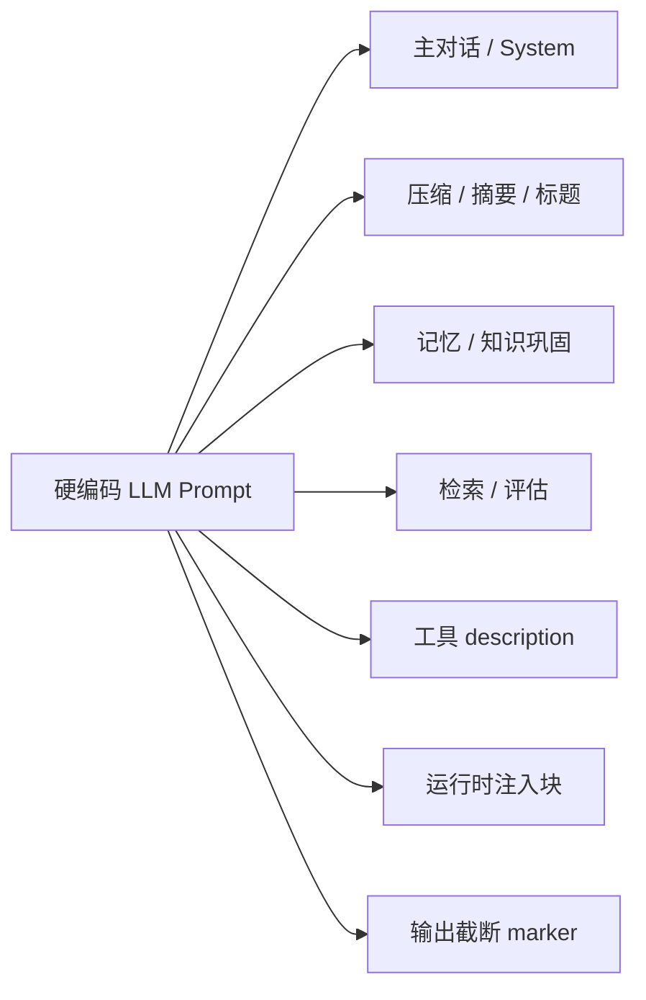

# Runtime 内硬编码 LLM 提示词清单

> **范围**：`core/acowork-runtime/` 及其直接依赖 `core/acowork-memory/`、`core/acowork-grafeo/` 中所有硬编码（即非来自 `.agent` 包 `prompts/*.md`）的 LLM 提示词与指令性文本。
> **目的**：便于排查"为什么模型看到了这段话"、"做 i18n/版本替换时哪里要改"、"做安全审计时哪里有遗留 PII 风险"。
> **不在范围**：`.agent` 包的 `prompts/*.md` 模板（运行时由 `package/prompt_builder.rs` 加载）；测试 fixture（如 `mock_provider` 中的 `"You are a helpful..."`）；LLM 看不到的日志/错误信息字符串。

## 总览

## 1. 集中定义：`core/acowork-runtime/src/prompt.rs`

唯一被显式标记为"所有生产 prompt 都该集中到这里"的入口（文件顶部 `//!` 注释）。

| 常量 | 用途 | 调用方 |
| --- | --- | --- |
| `PROMPT_BUILDER_FALLBACK` | 包无 `prompts/*.md` 时的回退 system prompt | `package/prompt_builder.rs` |
| `COMPACTION_SYSTEM_PROMPT` | 上下文压缩 / episode 蒸馏的 system prompt，强制 `
` + `<user_intent>` 两块格式（ADR-061 §8.1） | `episode_distill.rs` |
| `SEARCH_SYSTEM_PROMPT` | Perplexity Sonar 搜索的系统提示 | `tools/builtin/search_backends/perplexity.rs` |
| `COMPACT_PROMPT` | 把对话文本包进 `<conversation>...</conversation>` 的 user prompt 模板（`{messages_text}` 占位符） | `episode_distill.rs` |
| `TITLE_PROMPT` | 生成 ≤60 字符会话标题的 prompt（`{language}` / `{user_message}` 占位符） | `episode_distill.rs::compact_session_title_with_llm` |
| `build_compaction_system_prompt()` | 把 identity 上下文拼接到压缩 system prompt 后的辅助函数（含"Language field"指示语） | `episode_distill.rs` |

## 2. 上下文压缩 & 标题（运行时调用）

| 文件 | 形态 | 说明 |
| --- | --- | --- |
| `episode_distill.rs` | 间接引用 `COMPACTION_SYSTEM_PROMPT` / `COMPACT_PROMPT` / `TITLE_PROMPT` | 蒸馏 + 标题 LLM 调用，见 `compact_full_context`、`compact_messages`、`distill_on_session_end`、`compact_session_title_with_llm` |
| `episode_distill.rs::format_messages` | 运行时 `format!()` 拼装 | 输出 `[System]: ... / [User]: ... / [Tool(name=…): ... / [CompactionSummary]: ...` 行模板，半硬编码的"对话可读化"格式 |

## 3. 记忆 / 知识巩固（`acowork-grafeo` + `acowork-memory`）

| 文件 | 标识 | 内容概要 |
| --- | --- | --- |
| `core/acowork-grafeo/src/consolidation/triple_extraction.rs` | `EXTRACTION_SYSTEM_PROMPT` | "You are a knowledge extraction assistant..." 三元组抽取（subject/predicate/object + confidence + sub_type），JSON 输出 |
| `core/acowork-grafeo/src/consolidation/conflict_llm.rs` | `CONFLICT_CLASSIFICATION_PROMPT` | "You are a knowledge conflict resolver..." 冲突三分类（Evolution / Correction / Ambiguous），JSON 输出 |
| `core/acowork-grafeo/src/consolidation/generalization.rs` | `GENERALIZATION_PROMPT` | "You are a behavior pattern discovery assistant..." 行为模式抽取，JSON 输出 |
| `core/acowork-grafeo/src/abstention.rs` | `AbstentionConfig::default().abstention_prompt` | `"When you are not confident about the information from memory, respond with 'I'm not sure about this'..."` |
| `core/acowork-memory/src/manager.rs` | `DEFAULT_ABSTENTION_PROMPT` | 同上 grafeo 值的镜像拷贝，作为 single-source-of-truth 的备援（注释明确指向 grafeo） |
| `core/acowork-grafeo/src/consolidation/ambiguous.rs` | `generate_confirmation_hint()` 运行时 `format!()` | `"There are N ambiguous memory conflicts that need your confirmation:\n- \"x\" vs \"y\""` |
| `core/acowork-memory/src/judge.rs` | `JudgeConfig::default()`（绑定 judge prompt） | 默认判定模型 `"qwen3:1.7b"`、`sample_rate=0.1`、`top_k=3` |
| `core/acowork-runtime/src/memory/judge_llm.rs` | `format!()` 内联 | "You are a retrieval quality judge. Rate how relevant the following search results..." 1–5 打分 |

> `ProviderLlmAdapter`（`memory/llm_adapter.rs`）中的 `"You are a knowledge extractor."` 是**测试 fixture**，非生产路径。

## 4. 工具 `ToolSpec.description`（LLM 看到的"系统级"指令）

每次 LLM 调用的 tool schema 都带 description，与 system prompt 一起被模型看到。下表所有 `description` 都直接拼到该工具的 `ToolSpec.description` 字段，路径前缀 `core/acowork-runtime/src/tools/builtin/`。

| 工具 | 文件 | description 要点 |
| --- | --- | --- |
| `shell` | `shell.rs` | "Execute a shell command..." |
| `file_read` | `file_read.rs` | 强调先 `content_search` 定位行号、≤400 行/次 |
| `file_write` | `file_write.rs` | `overwrite` / `append` 模式说明 |
| `file_edit` | `file_edit.rs` | 强调"exact match / CRLF / byte-by-byte" |
| `content_search` | `content_search.rs` | 强调 "use `include` glob + focused regex"，限制 1000 条 |
| `glob_search` | `glob_search.rs` | 单行 glob 模式说明 |
| `http_request` | `http_request.rs` | GET/POST/PUT/DELETE + 自动 JSON 解析 + 需 network 权限 |
| `web_search` | `web_search.rs` | Tavily / Brave / Firecrawl / SearXNG + 自动 fallback |
| `web_fetch` | `web_fetch.rs` | URL 抓取 + 剥标签 |
| `doc_reader` | `doc_reader/mod.rs` | PDF / DOCX / PPTX / XLSX + 纯文本 |
| `rag_query` | `rag_query.rs` | 企业知识库 RAG 深度查询 |
| `memory_recall` | `memory_recall.rs` | 长期记忆检索（keyword / time-only / 两者） |
| `memory_store` | `memory_store.rs` | 5 类 category + 6 种 autobiographical aspect 使用指引 |
| `context_retrieve` / `context_abandon` | `context_*.rs` | 上下文主动召回 / 主动放弃 |
| `todo_write` | `todo_write.rs` | "Only one todo list per session — replace or merge" |
| `mcp_install` / `mcp_uninstall` | `mcp_*.rs` | 安装流程 / 仅本地可卸载 |
| `intent_send` | `intent_send.rs` | 跨 Agent Intent 路由 + permission 要求 |
| `ask_user_question` | `ask_user_question.rs` | "Do NOT use for simple yes/no" |
| `codebase` | `codebase.rs` | LSP 5 类操作说明 |

> `tools/builtin/search_backends/mod.rs` 中的 8 个 search backend（Tavily / Brave / Serper / Perplexity / Exa / Google CSE / Firecrawl / SearXNG）也���有一行 `description`，更接近"配置项说明"而非指令性 prompt，未单独列项。

## 5. 运行时构造的 system-prompt 块

`core/acowork-runtime/src/agent/context.rs` 中 `ContextBuilder::build()` 按 ADR-060 的 Block A 结构顺序注入，模板字符串本身是硬编码：

| 注入位置 | 模板片段 |
| --- | --- |
| Identity 段 | `\n\n## User Identity\n{identity}\n\nReply in the language specified by the Language field above.` |
| Memory 段 | `\n\n## Relevant Memories\n{memory}` |
| Abstention 段 | `\n\n## Memory Abstention Guidance\n{prompt}` |
| Skill 段 | `\n\n## Skill Instructions\n{skills}` |
| Workspace prompt file 段 | `\n\n## Workspace Prompt File\n{prompt_file}` |
| Environment 段（默认） | `## Environment\n- Operating System: {os}\n- Architecture: {arch}\n- Shell: {shell}\n- Available Shell Tools: {tools}`（`detect_environment_text()`，memoized in `OnceLock`） |
| Block C（Todo 快照，User role） | `## Todo Task List\nThis is your todo task list. If any task status needs updating, use the \`todo_write\` tool to update it. If nothing needs updating, do nothing.\n\n{todos}` |

## 6. 输出截断 marker

`core/acowork-runtime/src/tools/output.rs`，属于"LLM 看到的说明文字"，但归类在输出层：

| 常量 | 用途 |
| --- | --- |
| `TRUNCATED_LINE_MARKER` | `"...[truncated]"` 单行超 10 KB 时追加 |
| `TRUNCATED_OUTPUT_MARKER` | 整段超 128 KB 时追加，带"re-run with more targeted parameters"建议 |

## 小结

- **真正的 system / user prompt 常量**：集中在 `prompt.rs`（5 个） + 4 处下游 grafeo / memory 的 `const PROMPT: &str`。
- **运行时拼装的指令片段**：`context.rs` 7 个 `## Section` 注入块模板 + `episode_distill.rs` 的 `[Role]: ...` 行模板。
- **LLM 视角的"指令文本"**：22 个内置工具的 `ToolSpec.description`。
- **不归 prompt 管但 LLM 看得到**：`output.rs` 的两个截断 marker。

## 维护说明

- 任何新增硬编码 prompt **必须**先在 `prompt.rs`（或所在 crate 内的同等集中位置）声明 `const`，再在调用处引用。
- 工具 description 改动视同 prompt 改动：会改变模型调用行为，需走与 system prompt 同等的评审。
- 模板占位符（`{messages_text}` / `{language}` / `{user_message}` / `{identity}` / `{memory}` 等）改动必须验证所有调用点；新增占位符需要在该文件 `prompt.rs` 的注释里登记。