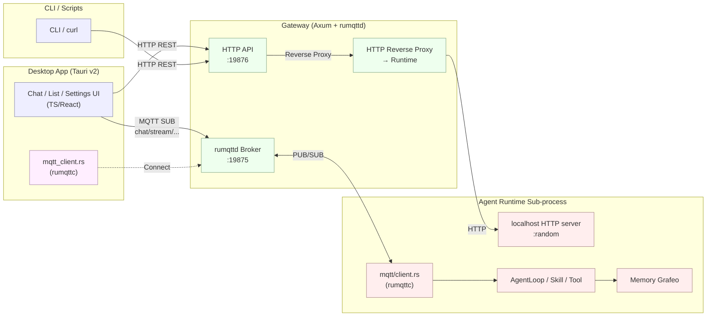
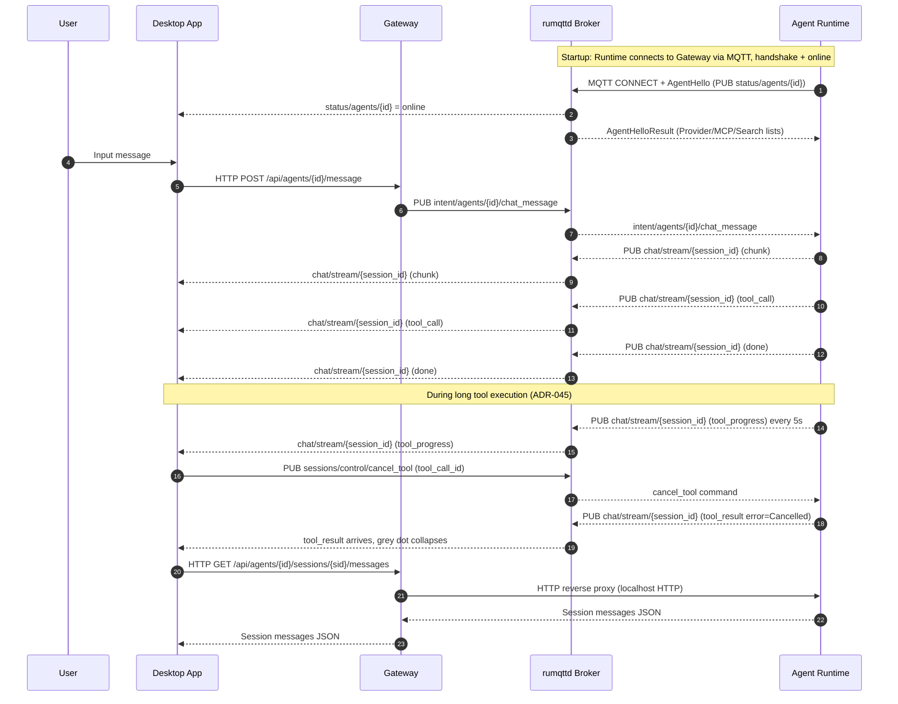

# ACowork.AI Protocol Documentation (Outline)

> This directory is the API reference for the ACowork.AI Gateway. The current architecture uses **two protocols**:
>
> - [HTTP](./http.md) — REST API (non-streaming CRUD, configuration, session queries, global resource management)
> - [MQTT](./mqtt.md) — Real-time event bus + lightweight state synchronization (replaces deprecated gRPC + WebSocket)
>
> Audience: Desktop App frontend, CLI tools, second-party integrators, debugging scripts.
>
> **Evolution History**: Earlier Gateway ↔ Agent Runtime used gRPC, and chat streaming events were pushed via WebSocket; starting from [ADR-033](../../adr/zh/ADR-033-mqtt-replace-grpc-websocket.md), converged to a dual-protocol architecture of MQTT pub/sub + HTTP reverse proxy. gRPC / WebSocket protocol documentation has been retired, and the code has been removed.

---

## 1. Two Protocols Overview (Current Architecture)

| Protocol | Transport | Server Framework | Default Port | Main Callers | Main Use |
|----------|-----------|------------------|--------------|--------------|----------|
| HTTP/1.1 | TCP | Axum (Rust) | `19876` | Desktop App, CLI, ops scripts, Gateway → Runtime (reverse proxy) | Resource CRUD, configuration, session queries, global resource full management, large data query reverse proxy |
| MQTT 3.1.1 | TCP | rumqttd (embedded broker) + rumqttc (client) | `19875` | Gateway, Runtime sub-processes, Desktop Tauri backend | Real-time event bus, state synchronization, device lifecycle management |

> **Ports and Binding**: All bound to `127.0.0.1` by default (localhost only). Runtime's localhost HTTP server uses random port (`--http-port=0`), only reachable via Gateway reverse proxy. Port and `auth_enabled` can be adjusted in `gateway.toml`'s `[http]` section; MQTT port see [`core/acowork-gateway/configs/rumqttd.toml`](../../../core/acowork-gateway/configs/rumqttd.toml).
> **CORS**: Always permissive (any origin / method / header; without `allow_credentials` — `*` wildcard is mutually exclusive with `Access-Control-Allow-Credentials: true`, tower-http will panic at build time; frontend fetch's default `credentials: 'same-origin'` doesn't need this header either). Dev (Vite `:5173`) and Prod (Tauri `tauri://localhost`) are both cross-origin access to Gateway `:19876`, hardcoded allowlist is unreliable; local default binds to loopback, no attack surface. Remote deployment security model relies on `auth_enabled` + Bearer Token.

---

## 2. Overall Architecture



**One-liner responsibility boundaries**:

- **HTTP** carries "**CRUD + full queries + reverse proxy**": all non-streaming scenarios, configuration pulls, large volume message history, large data queries between Gateway ↔ Runtime.
- **MQTT** carries "**event push + state synchronization**": chunk / tool_call / done and other streaming events, device online/offline (Will + Retained), Provider/MCP/Search availability broadcast.
- **Runtime side = MQTT client + localhost HTTP server**: Gateway reverse proxies Runtime's HTTP for large data queries; Runtime itself does not expose external ports.

---

## 3. End-to-End Typical Conversation



Key Points:

- **HTTP only used for "trigger + query + reverse proxy"**: User message send, large data message history pulls all go through HTTP.
- **MQTT only used for "event push + state synchronization"**: chunk / tool_call / done and other streaming events through MQTT pub/sub, Desktop App subscribes `chat/stream/{session_id}` by session.
- **MQTT does not carry req/res**: Any scenario needing "wait for reply" (large data query, config writeback, Intent triggered ACK etc.) goes through HTTP, which Gateway internally converts to reverse proxy call to Runtime localhost HTTP.

---

## 4. Common Conventions

### 4.1 Content Type and Character Encoding

- HTTP request/response: `application/json; charset=utf-8`
- MQTT Payload: binary protobuf, separate file [`core/acowork-core/proto/mqtt_payload.proto`](../../../core/acowork-core/proto/mqtt_payload.proto) (independent namespace, doesn't share definition with other protos)

### 4.2 HTTP Error Format

```json
{ "error": "human readable message" }
```

HTTP Status Code Semantics:

| Code | Meaning |
|------|---------|
| 200 / 204 | Success |
| 400 | Request parameter error |
| 401 | Unauthorized (when auth enabled) |
| 404 | Agent / resource not found |
| 409 | State conflict (e.g. Agent not running) |
| 500 / 502 / 503 | Server error, Runtime not connected |
| 504 | Gateway → Runtime reverse proxy timeout |

### 4.3 Authentication

- When `http.auth_enabled = true`, Gateway generates 256-bit random token at startup, writes to `<data_dir>/http_token`.
- HTTP requests must carry `Authorization: Bearer <token>` header.
- MQTT currently bound to `127.0.0.1`, relies on local loopback protection, **does not perform authentication at protocol layer**; multi-user phase enables rumqttd built-in ACL (see [ADR-033](../../adr/zh/ADR-033-mqtt-replace-grpc-websocket.md)).

### 4.4 Data Discovery Files

Gateway writes the following to `<data_dir>/` after startup:

| File | Purpose |
|------|---------|
| `gateway.pid` | PID + HTTP port (for Desktop App discovery) |
| `http_token` | Bearer token (only when auth enabled) |

---

## 5. Documentation Navigation

| What you want to do | Reference |
|---------------------|-----------|
| List/Install/Start Agent | [http.md §Agent Management](./http.md#2-agent-management) |
| Initiate chat (HTTP) | [http.md §Chat and Sessions](./http.md#3-chat-and-sessions) |
| Subscribe to streaming events (MQTT) | [mqtt.md §Topic Tree and Event Types](./mqtt.md) |
| Understand Runtime ↔ Gateway communication (MQTT topics, reverse proxy) | [mqtt.md](./mqtt.md) |
| Cancel single long tool / view tool execution progress (ADR-045) | [mqtt.md §9.4](./mqtt.md#94-single-tool-cancellation-adr-045) + [ADR-045](../../adr/zh/ADR-045-tool-progress-and-cancel.md) |
| Manage Provider/MCP/Search | [http.md §LLM Provider and Models](./http.md#5-llm-provider-and-models) / [http.md §MCP Catalog](./http.md#6-mcp-catalog) |
| Operate Memory | [http.md §Memory](./http.md#7-memory) |
| Debug/Restart Agent / LSP | [http.md §Debug and Development Tools](./http.md#13-debug-and-development-tools) |
| Understand MQTT evolution history (why gRPC/WebSocket retired) | [ADR-033](../../adr/zh/ADR-033-mqtt-replace-grpc-websocket.md) |

---

## 6. Related Source Code Index

- Route aggregation: `core/acowork-gateway/src/http/routes.rs`
- Each domain handler: `core/acowork-gateway/src/http/*.rs`
- HTTP reverse proxy (Gateway → Runtime localhost): `core/acowork-gateway/src/http/proxy.rs`
- MQTT Broker (Gateway embedded): `core/acowork-gateway/src/mqtt/broker.rs`
- MQTT global resources publisher: `core/acowork-gateway/src/mqtt/global_resources_publisher.rs`
- Runtime MQTT client: `core/acowork-runtime/src/mqtt/client.rs`
- Runtime localhost HTTP server: `core/acowork-runtime/src/http/server.rs`
- Desktop (Tauri Rust) MQTT client: `apps/acowork-desktop/src-tauri/src/mqtt_client.rs`
- MQTT Protobuf definition: `core/acowork-core/proto/mqtt_payload.proto`
- Default ports: `core/acowork-core/src/defaults.rs`
- ADR-033 (gRPC/WebSocket → MQTT evolution): [`docs/adr/zh/ADR-033-mqtt-replace-grpc-websocket.md`](../../adr/zh/ADR-033-mqtt-replace-grpc-websocket.md)