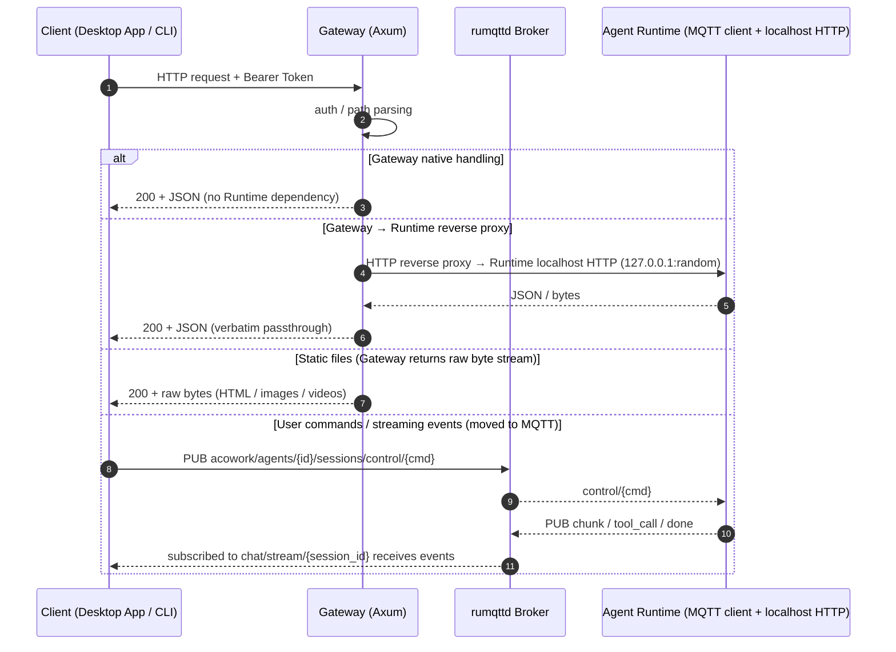

# HTTP Protocol

> Gateway exposes a REST API at `127.0.0.1:19876` (default). Built on Axum.
> For detailed route aggregation see source: [`core/acowork-gateway/src/http/routes.rs`](../../../core/acowork-gateway/src/http/routes.rs)
>
> **After ADR-033 + ADR-034**: Gateway is the **single entry point** for all HTTP requests; Runtime no longer directly serves clients.
> Data requests are **reverse-proxied** by Gateway to Runtime over localhost HTTP; event triggering, command push, and real-time streaming all go over [MQTT](./mqtt.md).

---

## Table of Contents

- [1. Basic Conventions](#1-basic-conventions)
- [2. Communication Flow](#2-communication-flow)
- [3. API Category Overview](#3-api-category-overview)
- [4. Gateway Native Endpoints (do not require Runtime online)](#4-gateway-native-endpoints-do-not-require-runtime-online)
  - [4.1 System & Health](#41-system--health)
  - [4.2 Agent Package Management](#42-agent-package-management)
  - [4.3 Agent Lifecycle Control](#43-agent-lifecycle-control)
  - [4.4 Avatar / Manifest Resources](#44-avatar--manifest-resources)
  - [4.5 LLM Providers & Models](#45-llm-providers--models)
  - [4.6 MCP Catalog](#46-mcp-catalog)
  - [4.7 Embedding Models](#47-embedding-models)
  - [4.8 Users & User-level Avatars](#48-users--user-level-avatars)
  - [4.9 Cron Scheduled Tasks](#49-cron-scheduled-tasks)
  - [4.10 Skills](#410-skills)
  - [4.11 Debug & Developer Tools](#411-debug--developer-tools)
  - [4.12 Remote File System Browsing](#412-remote-file-system-browsing)
  - [4.13 Global Resource Snapshot (Runtime active pull entry)](#413-global-resource-snapshot-runtime-active-pull-entry)
- [5. Gateway → Runtime Reverse Proxy (requires Runtime online)](#5-gateway--runtime-reverse-proxy-requires-runtime-online)
  - [5.1 Agent Runtime Configuration](#51-agent-runtime-configuration)
  - [5.2 Session Read-Only Queries](#52-session-read-only-queries)
  - [5.3 Attachments](#53-attachments)
    - [5.3.1 `POST /sessions/{sid}/files`](#531-post-sessionssidfiles)
    - [5.3.2 `GET /files/{document_id}`](#532-get-filesdocument_id)
    - [5.3.3 `attached_items` in message entries](#533-attached_items-in-message-entries)
  - [5.4 Memory](#54-memory)
  - [5.5 Workspace](#55-workspace)
- [6. Static File Service (direct streaming of raw bytes)](#6-static-file-service-direct-streaming-of-raw-bytes)
- [7. Migrated to MQTT (HTTP endpoints removed)](#7-migrated-to-mqtt-http-endpoints-removed)
- [8. Common Error Codes](#8-common-error-codes)
- [9. Typical Request Examples](#9-typical-request-examples)
- [10. Notes](#10-notes)

---

## 1. Basic Conventions

- **Base URL**: `http://127.0.0.1:19876` (adjustable via `[http]` section in `gateway.toml`)
- **Content-Type**: `application/json; charset=utf-8`
- **Authentication**: when `[http].auth_enabled = true`, all `/api/*` requests must carry `Authorization: Bearer <token>`, token file located at `<data_dir>/http_token`.
- **Error format**: `{ "error": "..." }` + corresponding HTTP status code
- **Streaming event channel (MQTT)**: chat event streaming no longer uses WebSocket; clients subscribe to MQTT topic `chat/stream/{session_id}` (Desktop App subscribes via its Tauri backend MQTT client).
- **Command / write channel (MQTT)**: user-initiated session control (send message, activate, rename, delete, close, continue) and human‑in‑the‑loop approvals / Q&A also go over MQTT topics `acowork/agents/{id}/sessions/control/{cmd}`, no longer over HTTP (see [§7](#7-migrated-to-mqtt-http-endpoints-removed)).
- **Global resource active pull (HTTP)**: Runtime, after mqtt client + available_cache are ready (phase_a), actively `GET /api/global-resources` and performs a **503 retry loop** (30s total budget) as a **fallback to avoid retained-delivery race** alongside MQTT retained push. Shares the same `AvailableResourceCache::update_from_mqtt` processing path; 503 semantics detailed in [§4.13](#413-global-resource-snapshot-runtime-active-pull-entry).

---

## 2. Communication Flow



**Architecture highlights**:

| Category | Handler | Runtime online required? |
|---|---|---|
| Gateway native | Gateway single‑point processing | **No** |
| Gateway → Runtime reverse proxy | Gateway passthrough to Runtime localhost HTTP | **Yes** (503 if offline) |
| Static files | Gateway reads disk and returns byte stream | **No** (only file existence required) |
| MQTT commands / streaming | rumqttd Broker relay | Yes (Runtime responds via MQTT subscription) |
| Global resource active pull (`GET /api/global-resources`) | Gateway single‑point responds to Runtime active pull | **No** (see [§4.13](#413-global-resource-snapshot-runtime-active-pull-entry)) |

Gateway **does not persist business data**: Memory, Skill, Agent runtime config, Session state, etc. are stored in Runtime local files / Grafeo; Gateway pulls snapshots or passthrough requests via HTTP reverse proxy, while commands / writes go through MQTT control topics.

---

## 3. API Category Overview

| Category | Count | Handler | Runtime dependency |
|---|---|---|---|
| **A. Gateway native** | ~50 | Gateway local storage / Vault / process management | No |
| **B. Gateway → Runtime reverse proxy** | ~25 | Passthrough to Runtime localhost HTTP | **Yes** |
| **C. Static files** | 2 path patterns | Gateway directly `fs::read` streaming return | No |
| **D. MQTT commands / streaming** (HTTP endpoints removed) | — | rumqttd Broker | Yes |

Source mapping:

| Category | Gateway implementation modules |
|---|---|
| A | [`agents.rs`](../../../core/acowork-gateway/src/http/agents.rs), [`provider_api.rs`](../../../core/acowork-gateway/src/http/provider_api.rs), [`models_api.rs`](../../../core/acowork-gateway/src/http/models_api.rs), [`mcp_catalog_api.rs`](../../../core/acowork-gateway/src/http/mcp_catalog_api.rs), [`embedding_api.rs`](../../../core/acowork-gateway/src/http/embedding_api.rs), [`users_api.rs`](../../../core/acowork-gateway/src/http/users_api.rs), [`cron_api.rs`](../../../core/acowork-gateway/src/http/cron_api.rs), [`skills_api.rs`](../../../core/acowork-gateway/src/http/skills_api.rs), [`config_api.rs`](../../../core/acowork-gateway/src/http/config_api.rs), [`fs_browse.rs`](../../../core/acowork-gateway/src/http/fs_browse.rs), [`debug_mqtt.rs`](../../../core/acowork-gateway/src/http/debug_mqtt.rs), [`publish_api.rs`](../../../core/acowork-gateway/src/http/publish_api.rs), [`global_resources_api.rs`](../../../core/acowork-gateway/src/http/global_resources_api.rs) |
| B | [`proxy.rs`](../../../core/acowork-gateway/src/http/proxy.rs) (ADR-033 Phase 2 + ADR-034 Phase 3) |
| C | [`workspaces.rs`](../../../core/acowork-gateway/src/http/workspaces.rs) (static resource part only) |

---

## 4. Gateway Native Endpoints (do not require Runtime online)

Gateway handles these directly, without needing the Runtime subprocess online. Covers: system health, Agent package management, LLM Provider / Models global resources, MCP catalog, embedding models, user profiles, Cron, Skills, debug tools.

### 4.1 System & Health

| Method | Path | Purpose |
|---|---|---|
| GET | `/health` | Health check (no auth), includes IPC (MQTT) / CronStore / disk space |
| GET | `/api/status` | System status: version, running Agent count, memory usage; if `mqtt.auth_enabled` is enabled, additionally returns `mqtt_username` / `mqtt_password` (Desktop MQTT credential delivery, ADR-055 Phase 5a) |
| GET | `/api/config` | Read Gateway configuration |
| PUT | `/api/config` | Update log level, log rotation, idle_timeout, default provider/model, HF mirror, etc. |
| DELETE | `/api/logs` | Clear logs |
| GET | `/api/agents/{id}/lsp-endpoint` | LSP Relay endpoint (node-local, ADR-055 §6.7): resolves the relay base URL (`endpoint`/`ready` fields) for the hosting Node per agent, for Desktop / Runtime to connect directly |

### 4.2 Agent Package Management

Package-level CRUD and publishing. Packages are installed to `<packages_dir>`, and Gateway maintains a manifest in `installed_agents`.

| Method | Path | Purpose |
|---|---|---|
| GET | `/api/agents` | List all installed Agents (including status, avatar, mqtt_online, etc.) |
| GET | `/api/agents/{id}` | Agent details (manifest, installed/connected/dev_mode, etc.) |
| DELETE | `/api/agents/{id}` | Uninstall Agent |
| POST | `/api/agents/install` | Install `.agent` package (multipart) |
| POST | `/api/agents/{id}/clone` | Clone Agent (skeleton or full) |
| POST | `/api/agents/{id}/publish/prepare` | Prepare packaging (validation, cleanup) |
| POST | `/api/agents/{id}/publish/build` | Build `.agent` package |
| POST | `/api/agents/{id}/publish/export` | Export package to target path |
| POST | `/api/agents/{id}/publish/install-locally` | Install build artifact locally |
| GET | `/api/packages/{agent_id}/download` | Download `.agent` package (Node install pull path); when auth enabled, validates `X-ACowork-Node-Token` (ADR-055 Phase 5a): missing/mismatch → 401/403 |

### 4.3 Agent Lifecycle Control

Subprocess-level control: start / stop / restart-debug / model & search provider probing.
**Model/provider switching** is done via MQTT `sessions/control/model_switch`, not HTTP.

| Method | Path | Purpose |
|---|---|---|
| POST | `/api/agents/{id}/start` | Start Agent Runtime subprocess |
| POST | `/api/agents/{id}/stop` | Stop Agent |
| POST | `/api/agents/{id}/restart-debug` | Restart in debug mode (enables Debug channel) |
| GET | `/api/agents/{id}/model` | Currently used model / provider (Gateway derives from manifest) |
| GET | `/api/agents/{id}/search-providers` | List search providers available to the Agent |

### 4.4 Avatar / Manifest Resources

Gateway caches avatar resources (readable even when Agent is stopped); synchronized via MQTT `AgentHello`.

| Method | Path | Purpose |
|---|---|---|
| GET | `/api/agents/{id}/avatar` | Retrieve built‑in avatar image from Agent package |
| POST | `/api/agents/{id}/manifest/avatar` | Upload/update manifest avatar |
| POST | `/api/agents/{id}/manifest/file` | Upload manifest resource file |
| GET | `/api/agents/{id}/manifest/avatar-assets` | List manifest avatar resources |
| GET | `/api/agents/{id}/avatar-file` | Retrieve avatar resource file |
| DELETE | `/api/agents/{id}/avatar-file` | Delete avatar resource |
| GET | `/api/agents/{id}/avatar-config` | Retrieve avatar runtime config (Gateway cache) |
| PUT | `/api/agents/{id}/avatar-config` | Update avatar config (takes effect only when Agent is stopped) |

### 4.5 LLM Providers & Models

Global LLM resources. API keys are encrypted and stored in Gateway Vault; configuration (base_url / models / compact_model) stored in `provider_list.json`.

| Method | Path | Purpose |
|---|---|---|
| GET | `/api/providers` | List Providers (API key masked) |
| POST | `/api/providers` | Add new Provider (key + config) |
| DELETE | `/api/providers/{provider}` | Delete Provider |
| PUT | `/api/providers/{provider}` | Update Provider (key / config) |
| GET | `/api/models` | Models from all Providers (including local ollama / lmstudio) |
| GET | `/api/models/{provider}` | Models from a single Provider |
| POST | `/api/models/discover` | Discover models from custom base URL (OpenAI-compatible) |
| GET | `/api/search/keys` | List search provider keys |
| POST | `/api/search/keys` | Add search provider key |
| PUT | `/api/search/keys/{provider}` | Update search provider key |
| DELETE | `/api/search/keys/{provider}` | Delete search provider key |

### 4.6 MCP Catalog

Global MCP server catalog (shared registry similar to Providers, including credentials).

| Method | Path | Purpose |
|---|---|---|
| GET | `/api/mcp-catalog` | List all MCP catalog entries (env fields masked) |
| PUT | `/api/mcp-catalog` | Replace catalog entirely |
| POST | `/api/mcp-catalog` | Add one entry |
| DELETE | `/api/mcp-catalog/{name}` | Delete entry |
| POST | `/api/mcp-catalog/probe` | Health probe (probe new config) |
| POST | `/api/mcp-catalog/{name}/probe` | Health probe (probe existing entry) |

### 4.7 Embedding Models

Embedding sidecar managed by Gateway (ONNX Runtime).

| Method | Path | Purpose |
|---|---|---|
| GET | `/api/embedding-models` | List available embedding models and status |
| POST | `/api/embedding-models/test` | Probe model connectivity |
| POST | `/api/embedding-models/{id}/download` | Trigger model download |
| POST | `/api/embedding-models/{id}/select` | Switch current model |
| GET | `/api/embedding-models/{id}/status` | Download / load status |
| DELETE | `/api/embedding-models/{id}` | Delete downloaded model |
| GET | `/api/embedding-models/migration-progress` | Overall progress of embedding dimension migration |
| POST | `/api/embedding-models/{id}/start-migration` | Start migration |

### 4.8 Users & User-level Avatars

Global user profiles (independent of Agents).

| Method | Path | Purpose |
|---|---|---|
| GET | `/api/users` | List user profiles |
| POST | `/api/users` | Create user profile |
| PUT | `/api/users/{user_id}` | Update user profile |
| POST | `/api/users/{user_id}/activate` | Activate user |
| GET | `/api/user/avatar-config` | Avatar config for currently active user |
| PUT | `/api/user/avatar-config` | Update avatar config |
| GET | `/api/user/avatar-assets` | List available avatar assets |
| GET | `/api/user/avatar-file` | Retrieve avatar file |
| POST | `/api/user/avatar-file` | Upload avatar file |
| DELETE | `/api/user/avatar-file` | Delete avatar file |

### 4.9 Cron Scheduled Tasks

Cron is managed by Gateway itself (persisted in SQLite).

| Method | Path | Purpose |
|---|---|---|
| GET | `/api/agents/{id}/cron` | List Agent's scheduled tasks |
| POST | `/api/agents/{id}/cron` | Register new scheduled task (schedule + action + params) |
| DELETE | `/api/agents/{id}/cron/{cron_id}` | Delete scheduled task |

### 4.10 Skills

Skills are read from the `skills/` directory of an installed package.

| Method | Path | Purpose |
|---|---|---|
| GET | `/api/agents/{id}/skills` | List skills |
| GET | `/api/agents/{id}/skills/{name}` | Skill details (SKILL.md parsing) |
| GET | `/api/agents/{id}/skills/{name}/history` | Skill execution history |
| POST | `/api/agents/{id}/skills/import` | Import skill ZIP (multipart) |

### 4.11 Debug & Developer Tools

Only exposed on localhost; must not be exposed to the network.

| Method | Path | Purpose |
|---|---|---|
| POST | `/api/debug/mqtt/shutdown` | Request broker thread exit (manual debugging only) |
| POST | `/api/debug/mqtt/start` | Restart broker thread |

### 4.12 Remote File System Browsing

Used only when a remote Desktop connects to a remote Gateway (not needed for local Tauri scenarios).

| Method | Path | Purpose |
|---|---|---|
| GET | `/api/fs/browse` | Remotely browse server file system (directory listing only, no content reading) |

### 4.13 Global Resource Snapshot (Runtime active pull entry)

> **Implementation**: [`core/acowork-gateway/src/http/global_resources_api.rs`](../../../core/acowork-gateway/src/http/global_resources_api.rs)
> **Builders**: [`core/acowork-gateway/src/mqtt/global_resources_builders.rs`](../../../core/acowork-gateway/src/mqtt/global_resources_builders.rs)
> (HTTP and MQTT retained share the same set of `build_available_*` functions, zero field‑mapping boilerplate)
> **Runtime consumption**: [`core/acowork-runtime/src/startup/global_resources_pull.rs`](../../../core/acowork-runtime/src/startup/global_resources_pull.rs)

| Method | Path | Purpose |
|---|---|---|
| GET | `/api/global-resources` | One‑shot pull of the latest snapshot of 6 global resource topics; Runtime calls once during phase_a |

**Why this endpoint is needed (fix for Bug B)**

Bug B: after clearing `.acowork` and going through onboarding again, the first chat with the system agent reported "unexpected error", while subsequent chats worked. Root cause:

1. Gateway immediately published an empty `AvailableProviders` (`provider_count=0, api_key_lengths=[]`) right after vault unlock but before any provider was added.
2. system agent started ~150 ms later, subscribed to `acowork/global/providers`, received retained → cached empty snapshot.
3. Desktop took ~19s to complete onboarding and add a provider; Gateway republished the new snapshot with keys.
4. But rumqttd's retained delivery **only delivers new values to subscribers that have not seen the old value** — Runtime that already cached the empty snapshot would not receive the update, and the session's provider=empty became permanently fixed, requiring manual `model_switch` to recover.

**Fix**: Runtime, after mqtt client + available_cache are ready (phase_a), **actively** `GET /api/global-resources` once, decodes each topic's base64 bytes and feeds them directly to [`AvailableResourceCache::update_from_mqtt`](../../../core/acowork-runtime/src/mqtt/available_cache.rs) — **exactly the same processing path** as MQTT retained push. Version validation, stale retained rejection, and ADR-059 §5.3 generation switch logic are all reused; Gateway does not need to maintain a second update pipeline for HTTP.

**Why it does not require Runtime online**

Gateway itself is the authoritative owner of global resources (Vault + resource_cache + embed_process + BootstrapOrchestrator); this endpoint does not depend on Runtime being online. However, Gateway's own bootstrap phase (Vault unlocking / provider onboarding incomplete) means global resources are **not yet finalized** — in that case it returns `503 + Retry-After` (see error codes below), **not** `200 + empty data`: "resources not ready" and "zero resources" are two completely different semantics. An empty snapshot would cause Runtime to cache "nothing" as "there is nothing", and subsequent sessions would always start with an empty provider list. See also `GET /api/bootstrap` for the overall Gateway bootstrap state.

**Two‑channel protocol分工**

| Channel | Role | Notes |
|---|---|---|
| **MQTT retained** (`acowork/global/*`) | **primary** — real‑time incremental pushes | Connected Runtimes receive automatically; `Notify` triggers republish |
| **`GET /api/global-resources`** (this endpoint) | **active pull** — startup fallback against retained‑delivery race | Called once per startup; does not rely on retained push timing |

Both channels share the same `update_from_mqtt` processing path ([`AvailableResourceCache::update_from_mqtt`](../../../core/acowork-runtime/src/mqtt/available_cache.rs)), with zero special handling on the Runtime side.

**Response**

```json
{
  "instance_id": "instance-abc-123",
  "topics": {
    "acowork/global/providers":        "CgcKBXNrLXYx...",
    "acowork/global/mcps":             "CggKBmFkbWlu...",
    "acowork/global/searches":         "CggK...",
    "acowork/global/embedding_models": "CggK...",
    "acowork/global/user_profile":     "CggK...",
    "acowork/global/bootstrap":        "CggK..."
  }
}
```

| Field | Type | Description |
|---|---|---|
| `instance_id` | `string` | ADR-059 §5.3 Gateway generation id, same source as `acowork/global/bootstrap` retained and `GET /api/bootstrap` |
| `topics` | `BTreeMap<string, string>` | sorted map (ensures deterministic response, easy diff testing); value is base64‑encoded `DataEnvelope` protobuf bytes, **semantically identical** to the MQTT retained topic payload of the same name |

`topics` covers 6 global resource topics:

| JSON key | MQTT topic | protobuf payload |
|---|---|---|
| `acowork/global/providers` | `acowork/global/providers` | `AvailableProviders` |
| `acowork/global/mcps` | `acowork/global/mcps` | `AvailableMcps` |
| `acowork/global/searches` | `acowork/global/searches` | `AvailableSearches` |
| `acowork/global/embedding_models` | `acowork/global/embedding_models` | `AvailableEmbeddingModels` |
| `acowork/global/user_profile` | `acowork/global/user_profile` | `AvailableUsers` (ADR-042) |
| `acowork/global/bootstrap` | `acowork/global/bootstrap` | `BootstrapState` (ADR-059) |

**Runtime consumption**

1. base64‑decode each `topics[k]` → bytes.
2. Call `cache.update_from_mqtt(topic, &bytes)` (the key `k` already includes the full topic name, so it goes through the same deserialization + version validation + generation switch logic as MQTT retained).
3. Compare `instance_id` with local `cache.bootstrap_instance_id()`:
   - Equal → no action.
   - Not equal → first clear all old snapshots (providers / mcps / searches / embedding_models / lsps / user_profile / bootstrap), then apply new snapshots. `bootstrap_state`'s `update_from_mqtt` also triggers its own generation switch logic (double safeguard).

**Retry loop (Bug B fix v3)**

Runtime performs a retry loop on `503` ([`pull_global_resources_from_gateway`](../../../core/acowork-runtime/src/startup/global_resources_pull.rs)):

| Gateway phase | HTTP | `Retry-After` | Runtime behaviour |
|---|---|---|---|
| `Booting` / `Unspecified` | `503` | `2`s | sleep 2s and retry |
| `Failed` | `503` | `10`s | sleep 10s and retry |
| `ShuttingDown` | `503` | `-1` (sentinel) | **abort pull**, rely only on MQTT retained |
| `Ready` / `Degraded` | `200` | N/A | apply snapshot, loop ends |

Loop boundaries ([`global_resources_pull.rs`](../../../core/acowork-runtime/src/startup/global_resources_pull.rs)):

- Total budget `PULL_MAX_DURATION = 30s`: on timeout, abandon and Phase A does not block (still uses whatever MQTT retained delivered).
- **`503` never writes to cache** (never‑poison): existing snapshot (e.g., from MQTT retained just delivered) will not be overwritten by "not ready" data — this is a key correctness invariant.
- No hint / connection errors / 5xx (non‑503) → linear backoff (500ms initial, capped at 5s).
- 4xx (non‑503) / JSON parse failure → Fatal, abandon immediately (retry won't help).

**Why not expand the 6 protobuf structures as embedded JSON**

The types generated by prost do **not** have `serde::Serialize/Deserialize` derives by default. Expanding them as embedded JSON would require:

1. Adding `#[derive(serde::Serialize, Deserialize)]` to all messages in `mqtt_payload.proto`;
2. Resolving the subtle serde handling of `oneof payload { ... }` with `#[serde(flatten)]` / tagging;
3. Writing a bunch of conversion code like `AvailableProviders → ProviderEntry` on the Gateway side.

This is costly, error‑prone, and would make the two channels (HTTP/MQTT) wire formats **inconsistent**: future protobuf field additions would break the HTTP contract, and the Runtime would need two separate parsing paths.

Encoding protobuf bytes as base64 keeps the two channels **wire‑format identical**, with zero special handling on the Runtime side. Typical snapshot total < 5 KB, base64 overhead is negligible.

**Error codes**

| Status | Condition | `Retry-After` | Description |
|---|---|---|---|
| `200` | `BootstrapPhase::Ready` / `Degraded` | N/A | Full `GlobalResourcesView`; `topics` may be empty map (**zero resources is a valid state**) |
| `503` | `Booting` / `Unspecified` (orchestrator not attached) | `2`s | Resources not yet finalised, retry later |
| `503` | `Failed` | `10`s | Bootstrap failed, long backoff retry |
| `503` | `ShuttingDown` | `-1` (sentinel) | **Do not retry**, abandon pull |
| `401` | Bearer token missing or invalid | N/A | when `[http].auth_enabled = true` |

`503` body is uniformly `NotReadyView`: `{instance_id, phase, phase_detail, retry_after_seconds, error}` (`retry_after_seconds` same value as header, dual‑channel redundancy; client may use either).

Runtime consumption rule: `503` **does not update local cache**, backs off per `Retry-After`; `200` is always authoritative snapshot (empty `instance_id` / empty `topics` are treated as normal snapshots — empty resources are valid, not unready).

---

## 5. Gateway → Runtime Reverse Proxy (requires Runtime online)

> **Implementation**: `core/acowork-gateway/src/http/proxy.rs`
> **Protocol**: Gateway looks up the Runtime's random port from `RuntimeHttpRegistry` (populated by MQTT retained payload `acowork/agents/{id}/http_port`), then HTTP reverse‑proxies. If Runtime is not registered / has exited, Gateway returns **503**.
>
> **Runtime‑side** actual interfaces see [`core/acowork-runtime/src/http/server.rs`](../../../core/acowork-runtime/src/http/server.rs) for the 25‑route inventory (ADR-034 §11.2).
>
> **Node reverse‑proxy authentication (ADR-055 Phase 5a)**: when `mqtt.auth_enabled` is enabled, Gateway, on outbound reverse‑proxy, resolves the agent's hosting Node via `installed_agents.node_id` → node registry, and automatically injects `X-ACowork-Node-Token: <node_token>` header; Node inbound validates this header (an enrolled Node must match `identity.node_token`; mismatch → 403 + `X-Error-Origin: node`). When auth is disabled, no header is sent, behaviour identical to pre‑Phase 4.

Gateway does not parse the Runtime response body; all reads and writes are verbatim passthrough. This means Runtime is the **authoritative owner of workspace config / memory / session state**, and Gateway acts purely as a reverse proxy.

### 5.1 Agent Runtime Configuration

| Method | Path | Purpose | Runtime path |
|---|---|---|---|
| GET | `/api/agents/{id}/config` | Read merged Agent configuration | `/agents/{id}/config` |
| PUT | `/api/agents/{id}/config` | Update Agent config (max_output_tokens, temperature, prompt, avatar…) | `/agents/{id}/config` |
| GET | `/api/agents/{id}/tools` | Read enabled built‑in tools list | `/agents/{id}/tools` |
| GET | `/api/agents/{id}/builtin-tools` | Read builtin‑tools enabled list | `/agents/{id}/builtin-tools` |
| PUT | `/api/agents/{id}/builtin-tools` | Write builtin‑tools enabled list | `/agents/{id}/builtin-tools` |
| GET | `/api/agents/{id}/status` | Runtime‑perspective status (cumulative tokens, loop state, etc.) | `/agents/{id}/status` |
| GET | `/api/agents/{id}/mcp-servers` | Read Agent's MCP service config | `/agents/{id}/mcp-servers` |
| PUT | `/api/agents/{id}/mcp-servers` | Write MCP service config | `/agents/{id}/mcp-servers` |
| GET | `/api/agents/{id}/search-config` | Read search configuration | `/agents/{id}/search-config` |
| PUT | `/api/agents/{id}/search-config` | Write search configuration | `/agents/{id}/search-config` |
| GET | `/api/agents/{id}/providers` | Read Runtime‑side Provider list (actual data after MQTT sync) | `/agents/{id}/providers` |

> **ADR-040 Win11-MCP-ToolsBugFix (2026-07)**: the above `mcp-servers` / `search-config` / `providers` were previously stubbed by Gateway returning 200 without persistence, causing user selections in the Tools Tab MCP server to be lost. They are now uniformly reverse‑proxied to Runtime endpoints `get_agent_mcp_servers` / `put_agent_mcp_servers` etc.

### 5.2 Session Read-Only Queries

> **Session write operations (create / activate / rename / delete / close / continue) have all moved to MQTT**
> `acowork/agents/{id}/sessions/control/{cmd}`, see [§7](#7-migrated-to-mqtt-http-endpoints-removed).
> Only **read‑only** reverse proxy remains here.

| Method | Path | Purpose | Runtime path |
|---|---|---|---|
| GET | `/api/agents/{id}/sessions` | Session list (Runtime perspective, token stats merged) | `/sessions` |
| GET | `/api/agents/{id}/latest-session` | Latest session (quick startup lookup) | `/sessions/latest` |
| GET | `/api/agents/{id}/conversations/latest` | Latest session messages (the only conversations endpoint retained per ADR-034) | `/sessions/latest` |
| GET | `/api/agents/{id}/sessions/{sid}` | Single session full state (meta + state merged) | `/sessions/{sid}` |
| GET | `/api/agents/{id}/sessions/{sid}/state` | **legacy alias**: forwards to `/sessions/{sid}` (kept for backward compatibility with old callers) | `/sessions/{sid}` |
| GET | `/api/agents/{id}/sessions/{sid}/messages` | Fetch message history (cursor pagination) | `/sessions/{sid}/messages` |

### 5.3 Attachments

Attachment blobs are stored on disk under Runtime `<work_dir>/files/<document_id>` (no extension); metadata is passed via MQTT PUB `acowork/agents/{id}/sessions/control/chat_message` `attached_items` field to Runtime for writing JSONL message entries (see [mqtt.md §Session write operations](./mqtt.md) and [ADR-046](../../adr/en/ADR-046-unified-attachment-entries.md)).

| Method | Path | Purpose | Runtime path |
|---|---|---|---|
| POST | `/api/agents/{id}/sessions/{sid}/files` | Upload file (multipart) | `/sessions/{sid}/files` |
| GET | `/api/agents/{id}/files/{doc_id}` | Read blob raw bytes | `/files/{document_id}` |

#### 5.3.1 `POST /sessions/{sid}/files`

Accepts `multipart/form-data`, fields:

| Field | Required | Description |
|---|---|---|
| `file` | ✅ | Binary file content; `name` field derived from part header `filename` |
| `format` | ⬜ | Lowercase extension (no dot, e.g. `pdf` / `png`); defaults to extension from `filename` |
| `width` | ⬜ | Image pixel width (only for images); client measures via `new Image()` |
| `height` | ⬜ | Image pixel height (only for images) |

Unknown fields are ignored (forward‑compatible with future client field extensions).

**Response** `200 OK`:

```json
{
  "documentId": "a1b2c3d4…_8f7e",
  "filename": "Q3-report.pdf",
  "format": "pdf",
  "sizeBytes": 482301,
  "width": null,
  "height": null
}
```

`documentId` is content hash + random suffix (legacy algorithm), used to locate the blob under `<work_dir>/files/`. The actual blob file on disk is `<documentId>.<safe_ext>` (see above).
**Same content uploaded twice returns the same `documentId`** (deduplication semantics — only one blob on disk, and message JSONL references point to the same ID).

Error codes:

- `400`: multipart parsing failure / missing `file` field
- `503`: AttachmentService not injected (startup or service unavailable)

#### 5.3.2 `GET /files/{document_id}`

Returns blob raw bytes. `Content-Type` derivation rule: client provides lowercase extension via query param `format` (if omitted, server takes from response header `X-Format`, **fallback to `application/octet-stream`**).

#### 5.3.3 `attached_items` in message entries

Runtime receives the **typed** attachment item array pushed from the frontend via MQTT `attached_items` field. The **wire shape** corresponds to Rust's [`AttachedItem`](../../../core/acowork-core/src/protocol.rs): serde tag `type` uses snake_case (`file_upload`, `attached_selection`, etc.), **variant fields use camelCase** (`documentId`, `sizeBytes`, `absPath`, `startLine`, `endLine`). Runtime maps it to JSONL‑persisted [`AttachmentMeta`](../../../core/acowork-runtime/src/conversation.rs) in `loop_memory.rs::write_attached_items` (variant fields converted back to snake_case: `document_id`, `size_bytes`, `abs_path`, `start_line`, `end_line`).

| wire `type` | wire fields (camelCase) | JSONL fields (snake_case) | Scenario |
|---|---|---|---|
| `file_upload` | `documentId`, `filename`, `format`, `sizeBytes` | `document_id`, `filename`, `format`, `size_bytes` | User‑uploaded document (PDF/DOCX/PPTX/XLSX), blob already stored |
| `image_upload` | same + optional `width` / `height` | same + optional `width` / `height` | User‑uploaded image (PNG/JPG), blob already stored |
| `attached_file` | `absPath`, `name` | `abs_path`, `name` | "Add to Chat" workspace file (**not copied**, reference by path) |
| `attached_selection` | `absPath`, `name`, `startLine`, `endLine` | `abs_path`, `name`, `start_line`, `end_line` | "Add to Chat" with line selection |
| `attached_folder` | `absPath`, `name` | `abs_path`, `name` | "Add to Chat" entire folder (**not copied**, LLM uses its own tools to traverse) |

> **Contract lock**:
> - Desktop side sender: `apps/acowork-desktop/src/lib/types.ts::toWireAttachedItems`
> - Rust fixture regression test: `core/acowork-core/tests/attached_items_wire.rs`
>   (reads `tests/fixtures/desktop_attached_items.json`, asserts deserialization success + camelCase field names per item)
> - Desktop fixture generator: `apps/acowork-desktop/scripts/dump-attached-wire.mts`
>   (any field name change must rerun this script and update the fixture)
>
> **Important**: camelCase is a hard constraint of the Rust deserializer. snake_case field names will **not** raise any error — runtime in `gateway_loop.rs:813-820` uses `serde_json::from_value::<AttachedItem>(...).ok()` and silently discards — the result is that users see "attachments disappeared" but no error in logs. This fixture test is to prevent such regressions from reaching production.

> The latter three (`attached_*`) are constructed directly by the frontend and do not need a prior HTTP upload; only the first two (`*_upload`) require calling `POST /sessions/{sid}/files` to obtain a `documentId`.

### 5.4 Memory

> **Runtime holds the actual Grafeo storage**. HTTP reverse proxy detailed in [mqtt.md §7.5](./mqtt.md).
> Gateway `memory_api.rs` itself is an **empty router** (ADR-033): registering its paths would conflict with `proxy_routes`, causing `Router::merge()` to panic at startup.

| Method | Path | Purpose | Runtime path |
|---|---|---|---|
| GET | `/api/agents/{id}/memory/nodes` | List nodes (pagination + filters: `type` / `keyword` / `time_range`) | `/memory/nodes` |
| GET | `/api/agents/{id}/memory/nodes/{nid}` | Read single node | `/memory/nodes/{nid}` |
| POST | `/api/agents/{id}/memory/nodes` | Create node | `/memory/nodes` |
| PUT | `/api/agents/{id}/memory/nodes/{nid}` | Update node | `/memory/nodes/{nid}` |
| DELETE | `/api/agents/{id}/memory/nodes/{nid}` | Delete node | `/memory/nodes/{nid}` |
| GET | `/api/agents/{id}/memory/stats` | Statistics: totals, storage bytes, distribution by type/status, embedding dimensions, etc. | `/memory/stats` |
| POST | `/api/agents/{id}/memory/consolidate` | Trigger memory consolidation (`force`, `retention_days`) | `/memory/consolidate` |
| GET | `/api/agents/{id}/memory/graph` | Full graph pull (frontend graph view) | `/memory/graph` |
| GET | `/api/agents/{id}/memory/consolidation/status` | Consolidation timer status (idle duration, pending count, scheduling config) | `/memory/consolidation/status` |
| GET | `/api/agents/{id}/rag/status` | RAG configuration status (whether configured, provider name) | `/agents/{id}/rag/status` |
| POST | `/api/agents/{id}/rag/query` | Direct RAG query (bypasses LLM, for debugging/connectivity verification) | `/agents/{id}/rag/query` |

### 5.5 Workspace

> **Workspace config is owned by Runtime** (`<work_dir>/config/agent_workspaces.json`).
> Gateway acts as a thin reverse proxy, concentrating `workspace_id` resolution and path‑traversal guards in Runtime (ADR-040). **Only static file serving (see §6) remains with Gateway direct return**, because HTML preview iframes need raw bytes — the Runtime JSON envelope cannot be used.

| Method | Path | Purpose | Runtime path |
|---|---|---|---|
| GET | `/api/agents/{id}/workspaces` | List workspaces | `/workspaces` |
| POST | `/api/agents/{id}/workspaces` | Add workspace directory | `/workspaces` |
| GET | `/api/agents/{id}/workspaces/tree` | Directory tree | `/workspaces/tree` |
| GET | `/api/agents/{id}/workspaces/find` | Find file by name | `/workspaces/find` |
| GET | `/api/agents/{id}/workspaces/search` | Content search (`include`, `max_results`, `case_sensitive`, `whole_word`) | `/workspaces/search` |
| PUT | `/api/agents/{id}/workspaces/{ws_id}` | Update workspace (alias, access, etc.) | `/workspaces/{ws_id}` |
| DELETE | `/api/agents/{id}/workspaces/{ws_id}` | Delete workspace | `/workspaces/{ws_id}` |
| PUT | `/api/agents/{id}/workspaces/{ws_id}/prompt-file` | Set injection prompt file | `/workspaces/{ws_id}/prompt-file` |
| GET | `/api/agents/{id}/workspaces/file` | Read file (with metadata) | `/workspaces/file` |
| POST | `/api/agents/{id}/workspaces/file` | Create file | `/workspaces/file` |
| PUT | `/api/agents/{id}/workspaces/file` | Write file | `/workspaces/file` |
| DELETE | `/api/agents/{id}/workspaces/file` | Delete file | `/workspaces/file` |
| POST | `/api/agents/{id}/workspaces/dir` | Create directory | `/workspaces/dir` |
| DELETE | `/api/agents/{id}/workspaces/dir` | Delete directory | `/workspaces/dir` |
| POST | `/api/agents/{id}/workspaces/copy` | Copy file/directory | `/workspaces/copy` |
| POST | `/api/agents/{id}/workspaces/rename` | Atomic rename file/dir | `/workspaces/rename` |

---

## 6. Static File Service (direct streaming of raw bytes)

> **Implementation**: `core/acowork-gateway/src/http/workspaces.rs::resolve_tree_path`
> **Reason to remain in Gateway**: HTML preview iframes require raw bytes (HTML / CSS / binary images) — the Runtime JSON envelope (base64 content + metadata) would break `` / `<link>` / `<script>` tags. Path‑traversal guards (canonicalize + `..` checks) are performed locally by Gateway.

| Method | Path | Purpose |
|---|---|---|
| GET | `/workspace-files/{agent_id}/{workspace_id}/{*path}` | Direct link to any workspace file, resolves absolute path via `workspace_id` |
| GET | `/ws-files/{agent_id}/{*path}` | Direct link to Agent home (no workspace_id) |

> The two path names are historical and remain unchanged.

---

## 7. Migrated to MQTT (HTTP endpoints removed)

> **ADR-033 + ADR-034**: the following interactions now use MQTT; **HTTP no longer provides corresponding endpoints**.
> Registering these paths at the Gateway HTTP layer would conflict with `proxy_routes` / `chat_routes` and panic at startup.
> Callers should subscribe / publish to the corresponding MQTT topics. Full protocol details in [mqtt.md](./mqtt.md).

| Removed HTTP endpoint | Replacement MQTT channel | Notes |
|---|---|---|
| `POST /api/agents/{id}/message` | `PUB acowork/agents/{id}/sessions/control/chat_message` | Send message (includes message_id, content, session_id, command, attached_items, content_parts) — ADR-046 removed `document_ids` / `attached_context`; unified via `attached_items` (wire fields camelCase, see §5.3.3) |
| `GET /api/agents/{id}/stream` | `SUB acowork/agents/{id}/sessions/{sid}/messages/#` (or `chat/stream/{session_id}`) | Streaming chat events: chunk / tool_call / done / approval_needed / question_pending |
| `POST /api/agents/{id}/sessions/{sid}/activate` | `PUB sessions/control/open_session` | ADR-038: Closed / NotFound → Active |
| `PUT /api/agents/{id}/sessions/{sid}/title` | `PUB sessions/control/update_title` | |
| `DELETE /api/agents/{id}/sessions/{sid}` | `PUB sessions/control/delete_session` | |
| `POST /api/agents/{id}/sessions/{sid}/close` | `PUB sessions/control/close_session` | Triggers distillation, retains JSONL |
| `POST /api/agents/{id}/continue` | `PUB sessions/control/continue_execution` | Resume after pause (e.g., iteration_limit) |
| `POST /api/agents/{id}/approval` | `PUB inbound` ApprovalDecision | User allow/deny for tool calls |
| `POST /api/agents/{id}/question` | `PUB inbound` QuestionAnswer | User answers to `ask_user_question` prompts |
| `POST /api/agents/{id}/model-switch` (if any) | `PUB sessions/control/model_switch` | Switch model + optional provider |

**Runtime‑side handling entry**: all the above commands are deserialised and dispatched via the `ControlAction` enum in [`core/acowork-runtime/src/mqtt/control_handler.rs`](../../../core/acowork-runtime/src/mqtt/control_handler.rs).

---

## 8. Common Error Codes

| Status | Scenario |
|---|---|
| 400 | Parameter validation failure, content too long, invalid id format |
| 401 | Bearer token missing or invalid |
| 404 | Agent / resource not found |
| 409 | State conflict: Agent not running, not installed |
| 500 | Gateway internal error |
| 502 / 503 | MQTT / reverse proxy channel unavailable, Runtime disconnected (**proxy‑endpoint specific**) |
| 504 | Gateway → Runtime request timeout |

---

## 9. Typical Request Examples

### 9.1 Install Agent (Gateway native)

```http
POST /api/agents/install HTTP/1.1
Authorization: Bearer <token>
Content-Type: multipart/form-data; boundary=----abc

------abc
Content-Disposition: form-data; name="package"; filename="hello.agent"
Content-Type: application/octet-stream

<binary>
------abc--
```

### 9.2 Start Agent and send message (MQTT)

```http
POST /api/agents/{id}/start HTTP/1.1
Authorization: Bearer <token>
```

```text
# Legacy HTTP POST /api/agents/{id}/message removed, use MQTT:
PUB acowork/agents/{id}/sessions/control/chat_message
{
  "session_id": "sess-active",
  "message_id": "msg-11111111",
  "content": "Hello",
  "params_json": "{\"document_ids\":[]}"
}
```

Response (on SUB side `chat/stream/{session_id}`):

```json
{ "message_id": "msg-11111111", "type": "chunk", "text": "..." }
{ "type": "done" }
```

### 9.3 Upload attachment + reference in message (HTTP → MQTT)

```http
POST /api/agents/com.acowork.senior-engineer/sessions/sess-active/files HTTP/1.1
Authorization: Bearer <token>
Content-Type: multipart/form-data; boundary=----abc

------abc
Content-Disposition: form-data; name="file"; filename="Q3-report.pdf"
Content-Type: application/pdf

<binary>
------abc
Content-Disposition: form-data; name="format"

pdf
------abc--
```

Response:

```json
{
  "documentId": "a1b2c3d4…_8f7e",
  "filename": "Q3-report.pdf",
  "format": "pdf",
  "sizeBytes": 482301
}
```

Then reference it via `params_json.attached_items` (the **5 types** see §5.3.3) when sending MQTT message:

```text
PUB acowork/agents/com.acowork.senior-engineer/sessions/control/chat_message
{
  "session_id": "sess-active",
  "message_id": "msg-22222222",
  "content": "Summarise this Q3 report",
  "params_json": "{\"attached_items\":[{\"type\":\"file_upload\",\"documentId\":\"a1b2c3d4…_8f7e\",\"filename\":\"Q3-report.pdf\",\"format\":\"pdf\",\"sizeBytes\":482301}]}"
}
```

> `attached_items` array wire field names are **camelCase** (`documentId`, `sizeBytes`, `absPath`, `startLine`, `endLine`), matching the Rust `AttachedItem` deserialiser. Full field details in [§5.3.3](#533-attached_items-in-message-entries).

### 9.4 Query Memory (reverse proxy)

```http
GET /api/agents/{id}/memory/nodes?page=1&size=20&type=Episodic&time_range=7d HTTP/1.1
Authorization: Bearer <token>
```

Gateway receives → looks up `RuntimeHttpRegistry` for Runtime HTTP port → reverse‑proxies to `127.0.0.1:{port}/memory/nodes?...` → verbatim returns.

### 9.5 Query consolidation status (reverse proxy)

```http
GET /api/agents/{id}/memory/consolidation/status HTTP/1.1
Authorization: Bearer <token>
```

Response:

```json
{
  "idle_secs": 42,
  "pending_count": 3,
  "idle_timeout_secs": 1800,
  "accumulation_threshold": 50,
  "bg_task_running": true
}
```

Returns `503 Service Unavailable` if Runtime has not started the consolidation pipeline.

### 9.5.1 Trigger memory consolidation (reverse proxy)

```http
POST /api/agents/{id}/memory/consolidate HTTP/1.1
Authorization: Bearer <token>
Content-Type: application/json

{
  "force": false,
  "retention_days": 7
}
```

Response:

```json
{
  "started": true,
  "duration_ms": 142,
  "episodes_consolidated": 12,
  "knowledge_nodes_generated": 3,
  "message": "Consolidated 12 episodes (8 upgraded, 2 dormant), generated 3 knowledge nodes, cleaned 1 episodic"
}
```

Field description:

| Field | Type | Description |
|-------|------|-------------|
| `started` | `bool` | Whether consolidation was actually executed (`false` if store unavailable) |
| `duration_ms` | `u64` | Consolidation duration (milliseconds) |
| `episodes_consolidated` | `u64` | Total pending nodes processed (upgraded + kept_pending + marked_dormant) |
| `knowledge_nodes_generated` | `u64` | New knowledge nodes generated (triples_extracted + procedural_created) |
| `message` | `string` | Human‑readable summary |

> **Note**: HTTP manual trigger only executes Phase 2 basic policy (confidence‑based upgrade/downgrade), does **not** include LLM triple extraction / conflict resolution / generalisation. Full Phase 3 pipeline is scheduled by the background `ConsolidationTimer` (idle 30min or pending ≥ 50).

### 9.6 Query RAG status (reverse proxy)

```http
GET /api/agents/{id}/rag/status HTTP/1.1
Authorization: Bearer <token>
```

Response (RAG configured):

```json
{
  "configured": true,
  "provider_name": "enterprise_knowledge",
  "agent_id": "com.example.sales"
}
```

Response (RAG not configured):

```json
{
  "configured": false,
  "provider_name": null,
  "agent_id": "com.example.sales"
}
```

### 9.7 Direct RAG query (reverse proxy)

Bypasses the LLM tool‑call path and directly queries the RAG service. Used for debugging RAG connectivity and query quality.

```http
POST /api/agents/{id}/rag/query HTTP/1.1
Authorization: Bearer <token>
Content-Type: application/json

{
  "query": "Product Q3 roadmap",
  "top_k": 5,
  "score_threshold": 0.7
}
```

Response:

```json
{
  "query": "Product Q3 roadmap",
  "results": [
    {
      "content": "Q3 roadmap includes three milestones...",
      "source_url": "https://wiki.corp.example.com/q3-roadmap",
      "chunk_id": "chunk-abc123",
      "score": 0.92,
      "source_label": "[RAG:enterprise_knowledge]"
    }
  ],
  "result_count": 1,
  "provider_name": "enterprise_knowledge"
}
```

Returns `503` if RAG is not configured; `400` for empty query.

### 9.8 Fetch message history (reverse proxy)

```http
GET /api/agents/{id}/sessions/sess-active/messages?cursor=...&limit=50 HTTP/1.1
Authorization: Bearer <token>
```

### 9.9 Static file direct link (iframe / img)

```html
<!-- Workspace arbitrary file, resolved by workspace_id -->


<!-- Agent home direct link -->

```

### 9.10 Pull global resource snapshot (Runtime startup active pull)

```http
GET /api/global-resources HTTP/1.1
Authorization: Bearer <token>
```

Response (example, structure shown, not actual length):

```json
{
  "instance_id": "instance-7f3a9b2e-1c4d-4e8f-9a5b-2d6f8e0c1234",
  "topics": {
    "acowork/global/providers":        "CgcKBXNrLXYxGgIIUg==",
    "acowork/global/mcps":             "CggKBmFkbWluGgIIUg==",
    "acowork/global/searches":         "CggK...",
    "acowork/global/embedding_models": "CggK...",
    "acowork/global/user_profile":     "CggK...",
    "acowork/global/bootstrap":        "CggK..."
  }
}
```

Each `topics[k]` value is base64‑encoded `DataEnvelope` protobuf bytes, **semantically identical** to the MQTT retained topic payload of the same name. Runtime processing:

```rust
// pseudo‑code (actual in core/acowork-runtime/src/startup/global_resources_pull.rs)
for (topic, b64) in &body["topics"].as_object().unwrap() {
    let bytes = base64::decode(b64.as_str().unwrap()).unwrap();
    cache.update_from_mqtt(topic, &bytes);   // same entry as MQTT retained
}
if body["instance_id"] != cache.bootstrap_instance_id().unwrap_or("") {
    cache.providers = None;   // ADR-059 §5.3 generation switch
    cache.mcps = None;
    // ... apply new snapshots
}
```

---

## 10. Notes

1. **Gateway does not persist business data**: Memory, Skill, Agent runtime config, Session state, etc. are stored in Runtime local files / Grafeo; Gateway pulls snapshots or passthrough via HTTP reverse proxy.
2. **Proxy endpoints require Runtime online**: if Runtime is not registered / has exited, returns 503; the MQTT channel `acowork/agents/{id}/http_port` is the **sole source** for Gateway to discover the Runtime port — **retained publish** is critical (after Gateway restart, broker replays the last port).
3. **Most writes trigger hot pushes**: for example, after modifying Provider / MCP / Search config, Gateway synchronises the latest available list to all connected Runtimes via MQTT **retained publish**; see [mqtt.md §Global resource availability broadcast](./mqtt.md).
4. **CORS**: always enabled as `CorsLayer::permissive()` (any origin, any method, any header; **without** `allow_credentials(true)` — `*` wildcard conflicts with `Access-Control-Allow-Credentials: true`, tower-http panics at build; also frontend `fetch` defaults to `credentials: 'same-origin'`, so this header is unnecessary). Dev mode Vite (`:5173`) and production Tauri custom protocol (`tauri://localhost` / `http(s)://tauri.localhost`) both cross‑origin access Gateway (`:19876`); any hardcoded allowlist would be broken when browsers resolve `localhost` to different IP literals. Local bind defaults to `127.0.0.1` — an attacker would already need access to the loopback to exploit permissive CORS, so it's zero‑risk on loopback. For remote deployments, CSRF protection relies on `Authorization: Bearer <token>` (`[http].auth_enabled = true`); Gateway does not send Set‑Cookie, and browsers by default do not send cookies with `credentials: 'same-origin'`.
5. **Static file service**: `/workspace-files` and `/ws-files` paths are served directly by the Axum router as file streams, for frontend `` / video direct references (historical names remain unchanged).
6. **Session write operations have all moved to MQTT** (see §7): do not attempt HTTP `POST /message` / `/activate` / `/continue` etc. — these paths **do not exist** at the Gateway HTTP layer; calls will return 404.
7. **Runtime active pull of global resources on startup**: every Runtime startup, after phase_a (mqtt client + available_cache ready), actively `GET /api/global-resources` once. This is a **fallback against retained‑delivery race**, in addition to MQTT retained push, to fix Bug B (first chat after clearing `.acowork` gave "unexpected error"). The HTTP endpoint does not depend on Runtime being online and belongs to §4 Gateway native endpoints; Runtime consumption reuses the same `update_from_mqtt` entry as MQTT retained pushes, with version validation and ADR-059 §5.3 generation switch logic zero‑divergence. See [§4.13](#413-global-resource-snapshot-runtime-active-pull-entry).