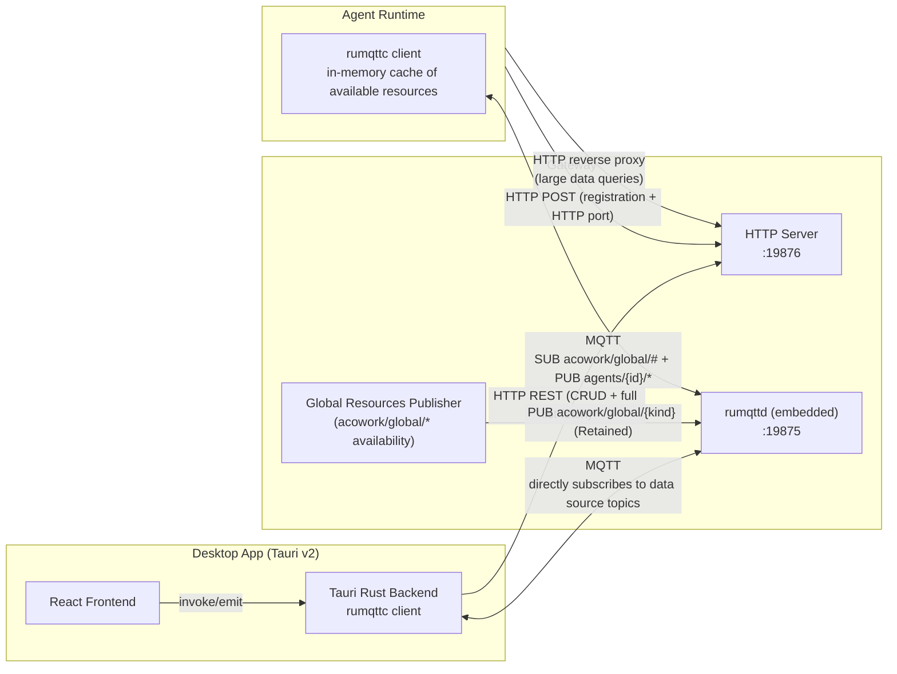
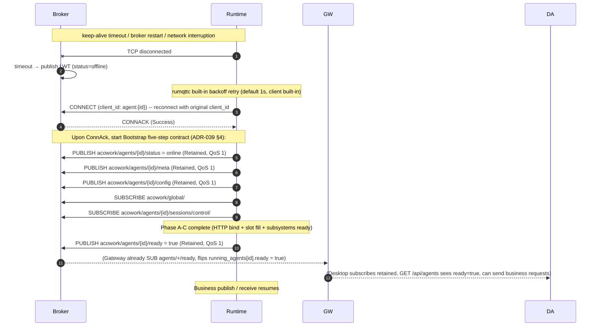
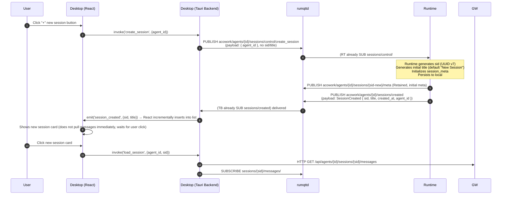
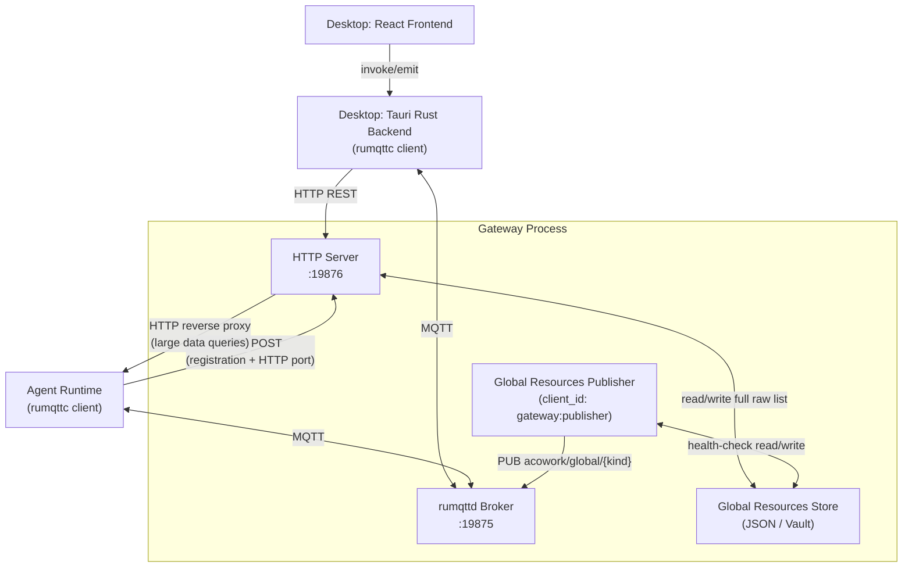

# MQTT Protocol

> The Gateway embeds an MQTT Broker ([`rumqttd`](https://github.com/bytebeamio/rumqtt)) serving as a **real-time event bus + lightweight state synchronization** component. The topic tree follows the **"publish/subscribe by data source"** principle: each topic represents a data resource, the publisher is the authoritative source of that data, and subscribers consume as needed.

---

## 1. Basic Conventions

- **Broker Port**: `127.0.0.1:19875` (TCP, MQTT 3.1.1)
- **Connection Limit**: `100` (actual connections ≤ 100: N Runtimes + 1 Gateway publisher + M Desktop clients)
- **Max Packet Size**: `10 MB`
- **Payload Encoding**: Protobuf binary (standalone file `mqtt_payload.proto`, independent namespace, not shared with any other proto definitions)
- **Protocol Version**: MQTT 3.1.1 (**MQTT 5.0 not used**)
- **Crate Dependencies**: `rumqttd` (broker, Gateway only) + `rumqttc` (client, uniformly used by Runtime / Desktop / Gateway publisher), one line each in `Cargo.toml`
- **Authentication**: Default `mqtt.auth_enabled = false` (anonymous, localhost-only binding); when explicitly enabled, CONNECT-layer dynamic authentication is activated (ADR-055 Phase 5a, see §8.7). Topic-level ACL is recorded as a deviation due to rumqttd lacking that capability; mosquitto evaluation is slated for Phase 5b

> **MQTT does not carry req/res patterns**: any scenario requiring "waiting for a reply" goes over HTTP. Runtime is an MQTT pub/sub client + localhost HTTP server (for Gateway reverse proxy for large data queries). Gateway is the broker host + global resource authority + HTTP server + reverse proxy, and does not forward business events.

---

## 2. Overall Architecture



**Summary in Words**:

1. **Gateway embeds rumqttd**, co-located with the HTTP server. Gateway handles three things:
   - **Broker host**: manages MQTT connections, ACL, retained storage.
   - **HTTP server**: CRUD, full-list fetch for Desktop (Settings), Runtime startup registration.
   - **Global Resources Publisher**: publishes `acowork/global/{kind}` (single topic, Retained)—the "ready" resource list recomputed by Gateway background health-check (**not agent-distinguished**; all Runtimes share the same list).
2. **Runtime is an MQTT client + localhost HTTP server**: `rumqttc` connects directly to the Broker, only PUBLISHes data sources it owns (all topics under `agents/{id}/*`), SUBSCRIBES to resources it cares about (`acowork/global/#` + `agents/{id}/sessions/control/#`). Also starts a localhost-only HTTP server for Gateway reverse proxy of large data queries (full session list, message list, memory graph, file contents).
3. **Desktop is a pure MQTT client**: uses `rumqttc` via Tauri Rust backend to connect directly to the Broker, SUBSCRIBES to data source topics (`agents/{id}/*`). **No Gateway forwarding**.
4. **Three-tier separation of global resources** (see §3.1):
   - **Full raw list**: HTTP only (`GET/POST/PUT/DELETE /api/global/{kind}`), used by Desktop Settings.
   - **Ready availability**: MQTT pub/sub (`acowork/global/{kind}` single topic, Retained), shared by all Runtimes. Gateway is the sole authority.
   - **Runtime per-agent runtime data** (agent_config.json / agent_mcp.json / agent_search.json): Runtime local files, synchronized to Desktop via `agents/{id}/config` MQTT retained (no HTTP GET needed).
5. **Gateway does not forward business events**. Session events published by Runtime are **directly subscribed** by Desktop to `agents/{id}/sessions/{sid}/messages/...`; control commands from Desktop are **directly PUBLISHed** to `agents/{id}/sessions/control/...` (sid in payload), and Runtime itself SUBSCRIBES to `agents/{id}/sessions/control/#`.

---

## 3. Topic Tree (By Data Source)

### 3.1 Full Global Resource List (Read-Only Static Data, HTTP Only)

**The full global resource lists (provider list, mcp list, lsp list, search list, embedding model list) go over HTTP, not MQTT.**

These lists are the raw data managed by the user in Desktop Settings (configured but not necessarily "ready")—e.g., a provider added but API key not filled, or an MCP package still downloading. Desktop fetches the entire table via HTTP once to render the form, and submits modifications via HTTP POST; **no subscription/notification mechanism is needed**.

```
# ⚠️ No MQTT topics

HTTP endpoints:
  GET    /api/global/providers           # full provider list
  GET    /api/global/mcps               # full MCP list
  GET    /api/global/lsps               # full LSP list
  GET    /api/global/searches           # full search provider list
  GET    /api/global/embedding_models   # full embedding model list
  POST   /api/global/{kind}             # add one (Desktop Settings submission)
  PUT    /api/global/{kind}/{id}        # update one
  DELETE /api/global/{kind}/{id}        # delete one
```

- **Owner**: Gateway (persisted in JSON file / Vault encrypted key-value store).
- **Subscribers**: **No MQTT subscribers**. Desktop App fetches once via HTTP when loading the Settings page; users manually refresh the page to re-fetch. Runtime does not care about this table at all (see §3.1.2).
- **Modification Entry**: User calls `POST/PUT/DELETE /api/global/{kind}` via Desktop Settings; Gateway persists and returns the new list; frontend refreshes the page.

> **Why not MQTT?**
>
> 1. The full list data is largely static (a few KB to tens of KB), with no strong need for "incremental subscription."
> 2. Desktop already has a Settings page that fetches on click; no subscription notification required.
> 3. Runtime does not need the full list—it only needs the "ready" subset verified by Gateway (see §3.1.2).
> 4. Adding MQTT topics would bring retained synchronization, consistency maintenance, ACL, and other complexities that are not worthwhile for static data.

### 3.1.1 Global Resource Availability (Gateway Authority, Shared by All Runtimes)

§3.1's "full list" is the raw user configuration. **Gateway performs readiness checks on these resources in the background**—whether a provider has its API key bound, whether an MCP package has finished downloading, whether an embedding model is loaded into ONNX Runtime—and only "ready" resources appear here. This is what **Runtimes actually need to subscribe to**, because Runtimes can only use ready resources for calls.

**Why just a single topic?** MQTT Retained Messages natively implement both "new subscriber gets current state + subsequent changes pushed" semantics—the publisher sends each PUBLISH with retain=true, the Broker retains only the last message for that topic; new subscribers immediately receive that retained message (snapshot), and subsequent publisher changes deliver pushes (increments). **No need** to split into `available` / `change` sub-topics.

```
acowork/global/
├── providers                  # [Retained] Currently ready provider list
│                              # payload = AvailableProviders {
│                              #   version: u64,
│                              #   providers: [ProviderRef],   # only Gateway-verified
│                              #   default_compact_model:   # [ADR-056] cross-provider fallback candidate
│                              #     Option<CompactModelRef>, # global default compact model (distillation fallback chain Level 1)
│                              # }
│                              # Note: ProviderRef embeds `api_key` field
│                              # (Gateway decrypts from Vault before PUBLISH)
├── mcps                       # [Retained] Currently ready MCP list
│                              # Note: McpRef embeds `auth_token` field
│                              # (extracted from catalog env/headers token-class keys)
├── lsps                       # [Retained] Currently ready LSP list
├── searches                   # [Retained] Currently ready search provider list
│                              # Note: SearchRef embeds `api_key` field
│                              # (Gateway decrypts from Vault before PUBLISH)
├── embedding_models           # [Retained] Currently ready embedding model list
└── user_profile               # [Retained, ADR-042] Current active user profile snapshot
                               # payload = AvailableUsers {
                               #   version: u64,                 # mirrors user_profile_list.version
                               #   active_user: UserProfileRef { # empty user_id = no active user
                               #     user_id, display_name, language, timezone,
                               #     city?, country?, occupation?, communication_style?,
                               #     custom_json,
                               #   },
                               # }
                               # Note: Runtime uses this snapshot to build identity_context
                               # on startup, for compaction system prompt language injection.
                               # When user switches active profile in Desktop Settings,
                               # Gateway republishes this topic; Runtime receives it immediately.
```

**Why are secrets published together in `acowork/global/*` topics?** This is Runtime's **only** secret retrieval path—Runtime starts with only a `SUB acowork/global/#`, and all secrets are delivered in one retained payload:

1. **Gateway is the broker's same-process host** (see §11), and the broker binds only to localhost (`127.0.0.1`), never leaving the host. PUBLISHed payloads (containing decrypted secrets) do not enter the network.
2. **Runtime and Gateway share the same user**—Runtime is a child process spawned by Gateway; there is no "cross-tenant" secret leakage scenario.
3. **Runtime change push**—when a user changes a provider's API key, adds a new MCP token, or changes a search key from Desktop, Gateway's health-check triggers the publisher to recompute and republish `acowork/global/{kind}` (retain=true). All subscribed Runtimes **immediately** receive the push with the new secrets, no restart or extra request/response round-trip required.

Secrets are legitimate payloads on the **acowork/global/* retained push channel**, not a violation of §28 "MQTT does not carry req/res" (there is no req/res semantics here—just one-way PUBLISH pushing snapshots + subsequent changes).

- **Owner**: **Gateway** (data source authority). Gateway's background health-check loop detects provider/mcp/lsp/search/embedding state changes (ready/failed/unloaded), recomputes the topic payload and PUBLISHes (retain=true).
- **Subscribers**:
  - **All Runtimes** (`SUB acowork/global/#`) — Runtime receives the retained current snapshot immediately on startup, caches it in memory (no persistence needed). Subsequent changes are pushed directly.
  - **Desktop** (optional, SUB `acowork/global/#`) — used in Settings page to show real-time "provider temporarily unavailable" status, etc.
- **Key Property**: **Not agent-distinguished**. All Runtimes see the same availability list—because "provider ready" is a global fact, not a per-agent property.
- **Trigger Scenarios**:
  - User adds a new provider and fills in the API key in Settings → Gateway health-check passes → PUBLISH `acowork/global/providers` (retain=true)
  - An MCP package fails to download / process crashes → Gateway detects → recomputes payload and PUBLISHes `acowork/global/mcps` (retain=true)
  - Embedding model loads/unloads → PUBLISH `acowork/global/embedding_models` (retain=true)
  - Runtime starts → immediately receives retained current snapshot; subsequent state changes receive pushes
  - **ADR-042**: User adds/changes/deletes a user profile or switches active user in Settings → Gateway republishes `acowork/global/user_profile` (retain=true). Runtime receives and broadcasts via `SessionManager::update_user_identity` to all sessions' `ContextBuilder.identity_context`.
  - **ADR-056**: User picks a cross-provider `(provider_id, model_id)` reference in Harness's "Global Default Compact Model" card and saves (`PUT /api/settings/default-compact-model`) → Gateway writes to disk + self-triggers publisher → `AvailableProviders.default_compact_model` field updates → republishes `acowork/global/providers` (retain=true). Runtime uses this field to refresh `AgentCore.default_compact_model`, making it the distillation fallback chain Level 1 candidate.
- **No HTTP fallback**: After Runtime starts, `SUB acowork/global/#` immediately receives all retained snapshots; after reconnect, subscribing again immediately receives the latest retained. MQTT Retained Message semantics natively cover both "snapshot + increment" needs; **no** HTTP fallback interface like `GET /api/global/{kind}/available` is provided.
- **Conflict Resolution**: Runtime compares `version` on push; newer version overwrites local cache, older version is ignored (to prevent ordering issues).
- **QoS**: 1 (state changes must not be lost).

> **Why must Runtime subscribe to this layer?**
>
> Runtime cannot HTTP-fetch before every call (frequent/slow), nor can it use the "full list" (which may include non-ready resources). Retained + push mode gives Runtime a real-time view of "what can I use now" immediately after startup, with incremental sync of subsequent changes.
>
> Furthermore, all Runtimes see the exact same data—this is the **fundamental reason it is not placed under `agents/{id}/`**: there is no per-agent difference.
>
> This layer also **carries decrypted secrets for each provider/MCP/search**—Runtime Phase A parses the retained payload, takes API keys from `ProviderRef.api_key` for OpenAI/Anthropic and other LLM providers, `McpRef.auth_token` for MCP bearer tokens, and `SearchRef.api_key` for search providers, filling them into the provider factory and MCP client. This is why in §5.1 startup flow, Runtime's single `SUB acowork/global/#` line gets all startup-required state.
>
> **Why not use `current` / `update` two sub-topics?**
>
> - `current` Retained + `update` normal two-stage design aims to distinguish "snapshot semantics vs increment semantics."
> - But MQTT Retained **itself is a snapshot**, and normal PUBLISH **itself is an increment**—one topic + retain=true implements both semantics simultaneously.
> - This document uniformly adopts single topic + Retained: `acowork/global/{kind}`, `acowork/agents/{id}/meta`, `acowork/agents/{id}/config`, `acowork/agents/{id}/sessions/{sid}/meta`, `acowork/agents/{id}/sessions/{sid}/config`—none split into dual topics.

### 3.1.2 Per-Agent State Actually Maintained by Runtime (Local Files, Synced via MQTT Retained)

After Runtime obtains the available resources from §3.1.1, **which resources the user selected and how they are activated** is per-agent state persisted by Runtime itself—**not in the MQTT event bus**, but synchronized to Desktop via the `agents/{id}/config` retained topic:

1. It is a local file in the Runtime workspace (`agent_config.json`, `agent_mcp.json`, `agent_search.json`, etc.), not "broadcast data"
2. Runtime loads it on startup, merges with manifest defaults, and **PUBLISHes `agents/{id}/config` retained** (containing all agent_config fields + MCP selection + Search selection); Desktop subscribes to this topic to get the latest full configuration
3. Desktop does not need to HTTP GET these data—MQTT retained ensures immediate receipt of the latest snapshot after subscription
4. Gateway does not need to know how Runtime internally filters resources—it only cares about "which resources are ready"

| File | Location | Content | Desktop Retrieval |
|------|----------|---------|-------------------|
| `agent_config.json` | `<workspace>/agents/{id}/config/` | Per-agent runtime parameters (temperature, context_window, max_output_tokens, system_prompt_override, avatar, etc.), initialized from manifest.toml defaults | SUB `agents/{id}/config` retained (Runtime PUBLISHes on startup, republishes on change) |
| `agent_mcp.json` | `<workspace>/agents/{id}/` | Subset of available mcps activated by user (per-agent) | Already included in `agents/{id}/config` retained (`active_mcp_servers` field) |
| `agent_search.json` | `<workspace>/agents/{id}/` | Subset of available searches activated by user (per-agent) | Already included in `agents/{id}/config` retained (`search_config` field) |
| `session_meta` | `<workspace>/agents/{id}/sessions/{sid}/` | Current session's selected provider/model/embedding model (per-session, not per-agent persistent state) | SUB `agents/{id}/sessions/{sid}/meta` retained (dynamic subscription) |

**Resource Usage Layering Summary**:

```
┌─────────────────────────────────────────────────────────────────┐
│  Layer 1: Full raw list (user-managed, HTTP only, no MQTT)     │
│  Gateway / Vault → Desktop Settings (CRUD)                      │
│  provider list, mcp list, lsp list, search list, embedding list │
└─────────────────────────────────────────────────────────────────┘
                              │ Gateway background health-check
                              ▼
┌─────────────────────────────────────────────────────────────────┐
│  Layer 2: Ready availability (Gateway authority, MQTT pub/sub single topic) │
│  Gateway → acowork/global/{kind} (Retained)                     │
│  Not agent-distinguished, all Runtimes share the same           │
│  Runtime in-memory cache: retained snapshot on startup + subsequent push incremental sync │
└─────────────────────────────────────────────────────────────────┘
                              │ Runtime selects from available
                              ▼
┌─────────────────────────────────────────────────────────────────┐
│  Layer 3: Runtime per-agent runtime data (local files, MQTT retained sync) │
│  agent_config.json (runtime params) + agent_mcp.json + agent_search.json │
│  session_meta's provider/model (per-session)                    │
│  Desktop retrieves via MQTT retained:                          │
│  SUB  agents/{id}/config (all config + MCP + Search)            │
│  SUB  agents/{id}/sessions/{sid}/meta (dynamic subscription when entering session) │
│  Write via: PUT /api/agents/{id}/config → Gateway MQTT control → │
│            Runtime applies + saves + republishes retained       │
└─────────────────────────────────────────────────────────────────┘
```

### 3.2 Agent Data Sources (Runtime Authority)

```
acowork/agents/{agent_id}/
├── status                            # [Retained + LWT] "online" | "offline"
│                                     #   LWT payload: "offline" (automatically published by Broker on abnormal disconnect)
│                                     #   Normal online: PUBLISH "online" (retained)
├── ready                             # [Retained] "true" | "false"
│                                     #   PUBLISH "true" after Runtime startup Phase A–C completes:
│                                     #     Phase A: HTTP server bind + listen
│                                     #     Phase B: session_metadata / session_config / memory_query / workspace_query slot filling
│                                     #     Phase C: chunk_relay / DevMode / MCP subsystem spawn
│                                     #   Gateway flips `running_agents[id].ready` based on this;
│                                     #   `/api/agents` becomes immediately visible; Desktop knows
│                                     #   `/sessions/{sid}/messages` etc. can be sent, no more 503.
│                                     #   Runtime PUBLISHes "false" before idle auto-sleep / exit.
│                                     #   Different from `status`: `status` only indicates MQTT broker
│                                     #   reachability; `ready` indicates HTTP service can respond to business requests.
├── meta                              # [Retained] agent metadata: ID, address, status info
│                                     #   (payload always latest full AgentMeta, including status changes)
├── config                            # [Retained] Runtime's current effective full agent_config.json
│                                     #   Content = runtime config file, stored in Runtime workspace
│                                     #   (<work_dir>/config/agent_config.json)
│                                     #   Loaded/saved by Runtime itself; Gateway does not hold it
│                                     #   payload always latest full content (merged manifest defaults
│                                     #   + user-modified agent_config.json full values)
│                                     #   Owner: Runtime
│                                     #   Purpose: Desktop subscribes for UI sync display;
│                                     #            Desktop modifies via HTTP PUT
│                                     #   No "Runtime pulls config from Gateway" flow exists
├── sessions/
    ├── created                       # [Increment event] session created under agent
    │                                 #   Runtime PUBLISHes, Desktop SUBSCRIBEs
    │                                 #   payload = SessionCreated { sid, title, created_at, agent_id }
    │                                 #   sid assigned by Runtime and placed in payload, not in topic path
    ├── deleted                       # [Increment event] session deleted under agent
    │                                 #   Runtime PUBLISHes, Desktop SUBSCRIBEs
    │                                 #   payload = SessionDeleted { sid, deleted_at, agent_id }
    │                                 #   sid in payload, not in topic path
    ├── control/                      # [Control command] Desktop PUB → Runtime SUB
    │                                 #   Runtime receives and processes, controlling a specific session's lifecycle or behavior
    │                                 #   create_session / delete_session do not need sid in path (sid in payload)
    │   ├── create_session            # Desktop PUB: initiates creation
    │   │                             #   payload = CreateSessionCommand { agent_id }
    │   │                             #   (sid assigned by Runtime and written into created event payload)
    │   ├── delete_session            # Desktop PUB: initiates deletion
    │   │                             #   payload = DeleteSessionCommand { agent_id, sid }
    │   ├── message                   # payload = { agent_id, sid, message_id, content }
    │   ├── stop                      # payload = { agent_id, sid }
│   ├── cancel_tool               # ADR-045 payload = { agent_id, sid, tool_call_id }
│   │                             #   cancels a single tool (distinct from stop whole round), arrives and terminates the corresponding tool process
    │   ├── model_switch              # payload = { agent_id, sid, model_id }
    │   ├── reasoning_effort          # payload = { agent_id, sid, effort }
    │   └── compact_context           # payload = { agent_id, sid }
    └── {sid}/                        # session internal state (sid in path locates specific session)
        ├── meta                      # [Retained] session meta: usage, state, title, ...
        │                             #   (payload always latest full meta)
        ├── config                    # [Retained] session config
        │                             #   (payload always latest full config)
        └── messages/                 # [Increment event] message events for this session (full history over HTTP)
            ├── chunk                 # LLM output fragment
            ├── tool_call             # LLM tool call
            ├── tool_result           # tool return
            ├── done                  # round complete
            ├── error                 # error
            ├── stopped               # stopped
            ├── tool_progress          # ADR-045 tool progress heartbeat (5s interval)
            ├── ask_question          # LLM asks user
            ├── todo_updated          # todo list updated
            ├── reasoning_started     # reasoning phase started
            ├── reasoning_ended       # reasoning phase ended
            ├── compacting_started    # context compaction started
            ├── compacting_ended      # context compaction ended
            ├── context_usage         # context usage
            ├── memory_updated        # in-session Memory change (notification event)
            └── skill_executed        # skill execution completed
└── memory/                           # Agent memory graph (Grafeo) data source
    └── nodes/                        # node-level increment events
        └── {nid}/update              # [Increment event] Memory node add/merge/delete
                                      #   payload = latest full node
                                      #   Full graph over HTTP GET /api/agents/{id}/memory/graph
```

- **Owner**: Runtime.
- **Session list**: **Not over MQTT**. Clients fetch full list via HTTP `GET /api/agents/{id}/sessions`; list changes are incrementally updated by subscribing to `agents/{id}/sessions/created` and `agents/{id}/sessions/deleted` events (sid in payload). All session lifecycle (creation/deletion) is triggered by Desktop via `sessions/control/create_session` / `sessions/control/delete_session`; sid and title are assigned/generated by Runtime and written into `created` event payload for Desktop to identify (see §5.3). Runtime does not actively create sessions.
- **Session internal state**: Located by sid under `sessions/{sid}/meta` / `sessions/{sid}/config` (single topic + Retained, see below). sid is assigned by Runtime and written into event payload; subscribers can use the sid from the created event to subscribe to these state topics.
- **Control commands**: `sessions/control/{cmd}` is Desktop → Runtime one-way control flow (Runtime does not need to ack). `create_session` has no sid in path (Runtime assigns after creation and notifies via created event); `delete_session` / `message` etc. include sid in payload (Runtime needs to know which session to operate on).
- **Session messages full vs increment**:
  - Full: `GET /api/agents/{id}/sessions/{sid}/messages` (HTTP pull)
  - Increment: subscribe to `agents/{id}/sessions/{sid}/messages/#`, receiving `chunk` / `tool_call` / `done` etc. events
- **Session meta / config**: Single topic + Retained. `meta` / `config` payload **always contains the latest full content** (including usage, state); subscribers do not need to HTTP-pull again. New subscribers receive retained immediately after connection (snapshot), subsequent changes receive pushes (increment)—Retained natively provides both snapshot + increment semantics; no need for dual topics.
- **HTTP fallback**: `GET /api/agents/{id}/sessions` (list), `GET /api/agents/{id}/sessions/{sid}/messages` (messages full), `GET /api/agents/{id}/sessions/{sid}/state` (meta full), etc.

### 3.3 Sidecar Status (Sidecar Process Authority)

```
acowork/sidecar/
└── {kind}/                           # lsp_relay | embed | ...
    └── status                        # [Retained] endpoint address + health status
```

- **Owner**: The Sidecar process itself (or the Gateway internal component proxying it).
- **HTTP fallback**: `GET /api/sidecar/{kind}`.

### 3.4 User-Level (Reserved, Enabled in Multi-User Phase)

```
acowork/users/{user_id}/
└── notifications/                    # Personal-level notifications (user preference delivery, specific agent alerts, etc.)
    └── inbox/                        # Inbox-style notifications
        └── {notification_id}/update
```

- Not enabled in current phase; in multi-user phase, ACL restricts to the user themselves.

### 3.5 Design Principles (Refined)

1. **By data source classification**: Topic paths express "which data" (`agents/{id}/sessions/{sid}/messages` is a specific session's message stream; `acowork/global/{kind}` is a class of global resource availability). **Not by business flow** (no `stream/control/usage` action-named topics).
2. **Single owner**: Each data resource has exactly one publisher (Gateway owns `acowork/global/*`—shared available resources for all Runtimes; Runtime owns all topics under `agents/{id}/*`). Subscribers do not modify the data itself.
3. **Retained is snapshot; push is increment**: Publisher sends each PUBLISH with retain=true, overwriting the previous retained; new subscribers immediately receive the retained (snapshot semantics), subsequent changes are pushes (increment semantics). The entire document uniformly adopts single topic + retained (`acowork/global/{kind}`, `agents/{id}/meta`, `agents/{id}/config`, `agents/{id}/sessions/{sid}/meta`, `agents/{id}/sessions/{sid}/config`—none split into `current/update` dual topics).
4. **List over HTTP, changes over MQTT**: Resources like session lists that **change frequently and are only queried at operation time** go over HTTP; only "changes to specific items in the list" are notified via MQTT (`created` / `deleted`), avoiding frequent retained list invalidation.
5. **Snapshot over HTTP, increments over MQTT**: Resources like session messages / memory nodes that are **read heavily and grow continuously** have full data over HTTP, and **increment events** over MQTT (payload is the latest data itself; no need for subscribers to pull back).
6. **Gateway only passes through, does not forward**: Gateway is the broker host + `acowork/global/*` (availability) data source authority + HTTP server. **Not** a "relay" for session events, **not** maintaining session state views—session authority is Runtime; Desktop connects directly.
7. **Change payload always contains latest value**: Subscribing to `meta` / `agents/{id}/config` / `acowork/global/{kind}` / `sessions/{sid}/meta` / `sessions/{sid}/config` always receives the complete latest data; subscribers do not need to HTTP-pull snapshots. Among these, `agents/{id}/config` is Runtime's current effective full agent_config.json (merged manifest defaults) — Gateway does not participate in config synchronization at all; Runtime loads from local `<work_dir>/config/agent_config.json` on startup; Desktop config changes go through `PUT /api/agents/{id}/config` → Gateway passthrough → Runtime internal IPC writes local file + PUBLISHes new value.
8. **Gateway does not forward between Runtime and Desktop**: Runtime-published session events are **directly subscribed** by Desktop to `agents/{id}/sessions/{sid}/messages/...`; Desktop control commands are **directly PUBLISHed** to `agents/{id}/sessions/control/...`. Runtime is session authority; Gateway does not maintain session state views.
9. **Three-tier separation of global resources**:
   - **Layer 1 - Full raw list** (raw configurations user manages in Desktop Settings): HTTP only, no MQTT. Desktop Settings fetches and renders forms; modification submissions go over HTTP POST.
   - **Layer 2 - Ready availability** (resources verified by Gateway health-check): MQTT pub/sub, topic `acowork/global/{kind}` (single topic, Retained). **Not agent-distinguished**; all Runtimes share the same, because "resource ready" is a global fact.
   - **Layer 3 - Runtime per-agent persisted selections** (`agent_mcp.json` / `agent_search.json`): local files; Desktop views via HTTP pull of agent config, not MQTT.
   - **Why can't Layer 2 be placed under `agents/{id}/`**: All agents see exactly the same available resources; placing under per-agent topics would cause redundant data; all Runtimes just `SUB acowork/global/#`.
10. **Global resource raw list vs availability vs agent selection must not be confused**:
    - Raw list = user-managed, HTTP only
    - Availability = Gateway-verified runtime truth, MQTT pub/sub (globally shared)
    - Agent selection = Runtime local persistence, HTTP pull config suffices
    The earlier mistake of putting "Gateway-computed per-agent subsets" into `agents/{id}/resource_cache` was wrong—Gateway should not be aware of the agent dimension; resource availability is a global dimension.

### 3.6 Node Control Plane (Node Agent Data Source, ADR-055)

```
acowork/nodes/{node_id}/
├── status                            # [Retained + LWT] "online" | "offline"
│                                     #   isomorphic to agent status (ADR-055 §6.2)
├── info                              # [Retained] protobuf DataEnvelope<NodeInfo>
│                                     #   node metadata (hostname, os, arch, runtime_version, capability set)
├── enroll                            # [QoS 1] Node → Gateway registration request (Phase 5a)
│                                     #   payload = DataEnvelope<NodeEnroll>
│                                     #   { node_id, machine_uid, os, arch, node_version,
│                                     #     protocol_version, capabilities, enrollment_token }
│                                     #   carries `--token` enrollment token when auth enabled
├── enroll_result                     # [QoS 1] Gateway → Node response (per-request, not retained)
│                                     #   payload = DataEnvelope<NodeEnrollResult>
│                                     #   { node_id, machine_uid, node_token, status, message }
│                                     #   status = "ok" | "rejected"
├── agents/{id}/control/{cmd}         # [QoS 1] Gateway → Node agent lifecycle commands
│                                     #   cmd ∈ {install, uninstall, start, stop, ...}
├── agents/{id}/events                # [QoS 1] Node → Gateway execution result reports
└── lsps                              # [Retained] Node-local LSP relay endpoint (replaces global lsps)
```

**Enrollment Semantics (Phase 5a)**:

- On first start (identity.json missing), Node PUBLISHes `enroll` in bootstrap; Gateway validates enrollment token (when auth enabled) → node_id uniqueness (unused / same machine_uid reuse / different machine_uid rejected) → issues (or reuses) node_token and persists to `{data_dir}/node_tokens.json` → replies with `enroll_result`; Node persists node_token into identity.json.
- **Idempotent**: Same machine_uid re-enroll reuses existing node_token; Node already holding token does not overwrite.
- `enroll_result` is not retained—the response is per-request; reconnects rely on CONNECT credentials (node_token) to maintain identity.

---

## 4. Payload Format (Protobuf)

MQTT payload is arbitrary binary, **continuing to use Protobuf encoding** for type safety:

```rust
use acowork_core::proto;

// Runtime reports session chunk
let msg = proto::DataEnvelope {
    version: 1,
    payload: Some(proto::data_envelope::Payload::SessionMessage(
        proto::SessionMessage {
            session_id: "sess-001".into(),
            event: Some(proto::session_message::Event::Chunk(
                proto::ChunkPayload {
                    message_id: "msg-001".into(),
                    delta: "Hello".into(),
                },
            )),
        },
    )),
};

mqtt_client.publish(
    "acowork/agents/com.example.agent/sessions/sess-001/messages/chunk",
    msg.encode_to_vec(),
    QoS::AtMostOnce,
);
```

**Why Protobuf over JSON**:

- Compile-time type checking (change proto → compile fails → incompatible changes caught immediately)
- Backward compatibility guarantee (field numbers never reused; new fields don't affect old versions)
- Binary encoding more efficient than JSON
- Independently defined `mqtt_payload.proto`, independent namespace, not sharing `service` declarations or `message` definitions with any other proto. New data resources only require extending the `DataEnvelope.payload` oneof within this file, not affecting other files.

> **New envelope design**: This design introduces a **unified `DataEnvelope`** wrapper:
> - `version`: protocol version (for future upgrades)
> - `payload`: oneof for various data resources (`GlobalProviderList`, `AgentMeta`, `SessionMeta`, `SessionConfig`, `ControlCommand`, `SessionMessage`, etc.)
>
> This allows extending oneof for new topics without breaking existing messages. Note: No `ProviderUpdate` / `SessionMetaUpdate` "increment+snapshot" dual messages appear here—the entire chain uniformly adopts "single topic + Retained," with payload always being the latest full value (see §3.5 Principle 3).

---

## 5. Communication Flows

### 5.1 Broker Startup + Runtime Online

```mermaid
sequenceDiagram
    autonumber
    participant GW as Gateway
    participant BROKER as rumqttd
    participant RT as Runtime
    participant DA as Desktop (Tauri)

    Note over GW,BROKER: 1. Gateway starts
    GW->>GW: Build rumqttd Config (port 19875, ACL load)
    GW->>BROKER: Broker::new(config).start() (embedded in-process)
    GW->>BROKER: CONNECT (client_id: "gateway:publisher")
    Note over GW,BROKER: Gateway only connects here; Global Resources Publisher background loop detects provider/mcp/lsp/search/embedding state changes and PUBLISHes acowork/global/{kind} (Retained)

    Note over GW,RT: 2. Gateway spawns Runtime process
    GW->>RT: spawn (command line/env: --agent-id, --package-path=.agent package, --work-dir, --config-dir, --mqtt-port, --http-port=0)

    Note over RT: 3. Runtime starts: loads local config (pure local file I/O, Gateway not involved)
    RT->>RT: Start localhost HTTP server (--http-port=0 assigns random port)
    RT->>RT: Read agent package manifest.toml (factory config)
    RT->>RT: Read <work_dir>/config/agent_config.json (runtime config; may not exist on first start)
    RT->>RT: Merge defaults (agent_config.json None fields → manifest defaults → DEFAULT constants)
    RT->>RT: save_agent_config persists merged full config
    Note over RT: agent_config.json is Runtime private data; Gateway does not hold, perceive, or return it

    Note over RT,GW: 4. Runtime registers with Gateway (HTTP one-shot, reports MQTT client_id + HTTP port)
    RT->>GW: HTTP POST /api/agents/{id}/register {host, http_port, agent_id}
    GW-->>RT: 200 OK {registered: true}
    Note over RT,GW: Gateway stores Runtime HTTP port for subsequent reverse proxy; does not return config content (config is local to Runtime); global resources obtained via subsequent MQTT retained

    Note over RT,BROKER: 5. Runtime online (MQTT)
    RT->>BROKER: CONNECT (client_id: "agent:{id}", LWT: agents/{id}/status = "offline")
    RT->>BROKER: PUBLISH acowork/agents/{id}/status = "online" (Retained)
    RT->>BROKER: PUBLISH acowork/agents/{id}/meta (Retained, full meta)
    RT->>BROKER: PUBLISH acowork/agents/{id}/config (Retained, Runtime current effective full agent_config.json)
    RT->>BROKER: SUBSCRIBE acowork/global/# (immediately receives global resources retained snapshot—including decrypted keys for each provider/MCP/search)
    RT->>BROKER: SUBSCRIBE acowork/agents/{id}/sessions/control/#
    Note over RT: Receives acowork/global/providers retained → Phase A extracts keys from ProviderRef.api_key to create LLM provider

    Note over DA,BROKER: 6. Desktop (Tauri Backend) connects
    DA->>BROKER: CONNECT (client_id: "user:{uid}:desktop:{pid}")
    DA->>BROKER: SUBSCRIBE acowork/agents/+/status
    DA->>BROKER: SUBSCRIBE acowork/agents/+/meta
    DA->>BROKER: SUBSCRIBE acowork/agents/+/config
    DA->>BROKER: SUBSCRIBE acowork/agents/+/sessions/created
    DA->>BROKER: SUBSCRIBE acowork/agents/+/sessions/deleted
    Note over DA: When entering a specific agent detail page, dynamically SUBSCRIBE that agent's sessions/+/...<br/>When user enters a specific session, dynamically SUBSCRIBE that session's meta/config/messages/control
```

**Note**: The full global resource lists (provider/mcp/lsp/search/embedding) **are not in this startup sequence**—they are static full data; Desktop fetches via `GET /api/global/{kind}` HTTP once when loading the Settings page, no MQTT startup sync needed. Global resource **availability**, however, is pushed via Retained snapshot after Runtime starts, requiring no additional HTTP initialization.

#### 5.1.1 Bootstrap Five-Step Contract (ADR-039)

Upon reaching `ConnAck` (including reconnects), both Runtime and Desktop MQTT clients must redo the following five steps in order, as the standard contract for "online declaration":

| # | Step | Runtime Entity | Desktop Entity |
|---|------|----------------|----------------|
| 1 | PUBLISH `status = online` (Retained, QoS 1) | `acowork/agents/{id}/status` | `acowork/users/{uid}/status` |
| 2 | PUBLISH `meta` (Retained, QoS 1) | `acowork/agents/{id}/meta` (AgentMeta) | `acowork/users/{uid}/meta` (ClientSession) |
| 3 | PUBLISH `config` (Retained, QoS 1) | `acowork/agents/{id}/config` (AgentConfig) | `acowork/users/{uid}/config` (ClientConfig) |
| 4 | SUBSCRIBE `acowork/global/#` (QoS 1) | Same | Same + `acowork/agents/+/status` |
| 5 | SUBSCRIBE business control tree (QoS 1) | `acowork/agents/{id}/sessions/control/#` | `acowork/agents/+/sessions/{sid}/messages/#` + current session's `meta` / `config` |

**Key Constraints**:

- Five steps must be executed in order; Step 1 cancels Last Will so the other side sees "online"; Steps 2-3 replay retained metadata; Steps 4-5 open receive channels.
- Five steps are **idempotent**: status / meta / config are retained same-value overwrites; repeated subscribe is a broker-side set operation, repeated execution does not affect semantics.
- Broker configured with `max_payload_size = GATEWAY_MQTT_MAX_PACKET_SIZE` (10 MB); **Client must call `options.set_max_packet_size(... , ...)` to align**, otherwise rumqttc's default 10 KB limit will cause long `thought` content (≥ 10 KB) to trigger `OutgoingPacketTooLarge`, and the broker will actively close the connection.
- After broker actively closes, rumqttc's built-in retry automatically reconnects; upon reaching `ConnAck`, the **five steps must be redone**—`clean_start = true` means the broker does not persist any subscriptions. Skipping this makes Runtime appear "online" but unable to receive any messages.

#### 5.1.2 Runtime Reconnect Bootstrap Must Be Redone



⚠️ **Common misconception**: Checking only whether the client is "connected" is insufficient—after reconnect, the **Bootstrap must be redone** (§5.1.1) to restore retained state and persistent subscriptions. Skipping this makes the client appear "online" externally but unable to receive any business messages, with no error in logs (the broker won't tell you "which topics you should resubscribe to"). This is handled in `core/acowork-runtime/src/mqtt/client.rs::Self::run_bootstrap`, triggered automatically by the event loop matching `Incoming::ConnAck(_)`.

#### 5.1.3 `status` vs `ready`: Two Signals, Don't Mix

| Topic | Signal Source | Semantics | Flip Timing |
|-------|---------------|-----------|-------------|
| `agents/{id}/status` | Runtime (Broker flips via LWT) | **Process reachability**: "MQTT client has CONNACKed" | `PUBLISH online` after Bootstrap complete; abnormal TCP disconnect → Broker `PUBLISH offline` via LWT |
| `agents/{id}/ready` | Runtime | **Business reachability**: "HTTP server bound, Phase A–C complete, can respond to business requests" | After Bootstrap + Phase A (HTTP bind) + Phase B (slot fill) + Phase C (subsystems ready) → `PUBLISH true`; before idle auto-sleep / exit → `PUBLISH false` |

**Why split into two**:
- `status` only answers "is the Runtime process there." But there is a window between `status=online` and HTTP server being available (Phase A); if Gateway sets `running_agents[id].ready=true` at the moment `status=online`, Desktop `GET /api/agents` immediately sees it → Desktop immediately sends `/api/agents/{id}/sessions/...` HTTP requests → Gateway reverse-proxies to a not-yet-ready Runtime → **503 Service Unavailable**.
- `ready` is **actively** published by Runtime after Phase A–C complete; Gateway flips `running_agents[id].ready` based on this, ensuring no window between Desktop seeing `ready=true` and Runtime actually being able to respond to business requests.
- Desktop ChatPanel shows a spinning placeholder ("startingAgent") during `running=true && ready=false`, sending no `/api/agents/{id}/sessions/...` business requests, avoiding accidental 503s.

### 5.2 Normal Communication: User Sends Message (Direct, No Gateway Forwarding)

```mermaid
sequenceDiagram
    autonumber
    participant DA as Desktop (React)
    participant TB as Desktop (Tauri Backend)
    participant BROKER as rumqttd
    participant RT as Runtime

    Note over DA,RT: Key: Gateway is not in the middle as a forwarder

    DA->>TB: invoke('send_message', {agent_id, sid, content: "Hello"})
    TB->>BROKER: PUBLISH acowork/agents/{id}/sessions/control/message (payload: ControlCommand{agent_id, sid, message_id, content})
    BROKER->>RT: (Runtime already SUB sessions/control/#)

    Note over RT: Runtime starts LLM inference
    RT->>BROKER: PUBLISH acowork/agents/{id}/sessions/{sid}/messages/chunk (payload: SessionMessage::Chunk)
    BROKER->>TB: (TB already SUB that session's messages/#)
    TB->>DA: emit('agent_event') → React renders delta

    RT->>BROKER: PUBLISH acowork/agents/{id}/sessions/{sid}/messages/tool_call
    RT->>BROKER: PUBLISH acowork/agents/{id}/sessions/{sid}/messages/tool_result
    RT->>BROKER: PUBLISH acowork/agents/{id}/sessions/{sid}/meta (payload: latest full meta, including usage)

    Note over RT,TB: Note: All above messages are received by TB directly from broker; Gateway does not participate

    RT->>BROKER: PUBLISH acowork/agents/{id}/sessions/{sid}/messages/done
    BROKER->>TB: delivered
    TB->>DA: emit('done')
```

### 5.3 New Session (Desktop Triggers Action → Runtime Assigns sid/title → Event Notification)

**Key Constraints**:

- **sid and title are Runtime internal state**, not frontend input. Desktop only initiates the "creation action," **not** providing sid/title.
- **Lifecycle event topic paths do not contain sid** (`sessions/created` / `sessions/deleted`), with sid appearing in the payload.
- **State topics are located by sid** (`sessions/{sid}/meta` / `sessions/{sid}/config`)—these topics require sid in the path because they route to specific session state.

**Flow**:

1. User clicks `+` button in Desktop list → calls `invoke('create_session', { agent_id })`.
2. Tauri Backend initiates creation via control command (without sid/title):
   ```text
   PUBLISH acowork/agents/{id}/sessions/control/create_session
   payload: CreateSessionCommand { agent_id }
   ```
3. Runtime receives control command:
   - **Runtime internally generates sid** (UUID v7) as the session's unique identifier
   - **Runtime internally generates initial title** (default placeholder "New Session", can be optimized by LLM after first interaction)
   - Initializes session_meta (usage, state, title, created_at, etc.)
   - Persists to local storage (session storage)
   - **PUBLISH `sessions/{sid-new}/meta`** Retained initial meta (snapshot)
   - **PUBLISH `sessions/created`** notifies Desktop, with **sid and title in payload** (list increment)
4. Desktop receives `created` event:
   - Reads `sid` and `title` from payload
   - Incrementally inserts new session card into list
   - **Does not** immediately pull messages (waits for user click)
5. User clicks new session card → Desktop uses `sid` from payload to HTTP `GET /api/agents/{id}/sessions/{sid}/messages` pull full list → TB dynamically SUBSCRIBES that sid's `sessions/{sid}/messages/#` + `sessions/{sid}/meta`.



### 5.4 Global Resource Availability Change (Gateway Background Health-Check)

**Scenario**: Gateway background loop detects state change in some provider/mcp/lsp/search/embedding (just installed / temporarily unavailable / uninstalled).

```mermaid
sequenceDiagram
    autonumber
    participant HC as Gateway HealthCheck Loop
    participant GW as Gateway
    participant BROKER as rumqttd
    participant RT as Runtime
    participant DA as Desktop

    Note over HC,GW: Gateway background asynchronously checks resource readiness
    HC->>HC: Detects provider API key valid / mcp package downloaded / embedding loaded
    HC->>GW: Recomputes AvailableProviders (version +1)
    GW->>BROKER: PUBLISH acowork/global/providers (Retained, payload: AvailableProviders{version, providers})
    BROKER-->>RT: Receives push, replaces available providers in memory (doesn't affect other resource types)
    BROKER-->>DA: Desktop Settings page syncs display "provider available"

    Note over RT,HC: Supplementary scenario: resource failure
    HC->>HC: Detects mcp process crash / embedding load failure
    HC->>GW: Recomputes AvailableMcps (removes that item from list)
    GW->>BROKER: PUBLISH acowork/global/mcps (Retained, payload: latest available list)
    BROKER-->>RT: Runtime removes that mcp from memory; subsequent calls won't use it
    BROKER-->>DA: Settings page syncs display "mcp temporarily unavailable"

    Note over DA,RT: Supplementary scenario: full list change
    DA->>GW: HTTP POST /api/global/providers {add one raw record}
    GW->>GW: Persists (only modifies full raw list)
    GW->>HC: Triggers health-check (background async)
    HC->>HC: Verifies new provider readiness
    HC->>GW: If ready, recomputes available (see above)
```

**Key Points**:

- **Full raw list changes** go over HTTP `POST/PUT/DELETE /api/global/{kind}` (Gateway internal use only, called by Desktop Settings).
- **Availability changes** go over MQTT `acowork/global/{kind}` (Retained), triggered by Gateway background health-check loop. This is Gateway's **only actively published** business topic.
- **Not agent-distinguished**: All Runtimes see the same. Runtime only replaces its in-memory cache, not persisting.
- **Retained implements snapshot+increment**: Broker keeps the latest message for each global topic; new subscribers immediately get current snapshot; subsequent changes are pushes directly. No `available`/`change` two sub-topics needed.

### 5.5 Abnormal Disconnect (Will Message)

Runtime sets **Last Will and Testament (LWT)** on CONNECT:

```text
LWT topic:    acowork/agents/{id}/status
LWT payload:  "offline"
LWT retain:   true
LWT QoS:      AtLeastOnce
```

When Runtime abnormally disconnects (including `kill -9`, crash, network loss), Broker automatically publishes `offline` with retained flag after keep-alive timeout. Desktop immediately perceives offline via `acowork/agents/+/status` topic; **no "ghost online" state exists**.

---

## 6. Client Subscription List

| Client | client_id pattern | SUBSCRIBE |
|--------|-------------------|-----------|
| **Gateway Publisher** | `gateway:publisher` | (Only PUBLISHes `acowork/global/#` Retained; does not SUBSCRIBE business topics) |
| **Gateway Subscriber** | `gateway:subscriber` | `acowork/agents/+/status`<br/>`acowork/agents/+/ready` |
| **Runtime** | `agent:{agent_id}` | `acowork/global/#`<br/>`acowork/agents/{id}/sessions/control/#` |
| **Desktop (Tauri Rust) — always subscribed** | `user:{user_id}:desktop:{pid}` | `acowork/agents/+/status`<br/>`acowork/agents/+/ready`<br/>`acowork/agents/+/meta`<br/>`acowork/agents/+/config`<br/>`acowork/agents/+/sessions/created`<br/>`acowork/agents/+/sessions/deleted`<br/>`acowork/global/#` (optional, for Settings page) |
| **Desktop (Tauri Rust) — dynamically when entering specific session** | Same | `acowork/agents/{id}/sessions/{sid}/meta`<br/>`acowork/agents/{id}/sessions/{sid}/config`<br/>`acowork/agents/{id}/sessions/{sid}/messages/#` |
| **Desktop (Tauri Rust) — PUBLISH (control commands)** | Same | `acowork/agents/{id}/sessions/control/#` (sid in payload) |

> **Desktop should not connect to MQTT Broker directly from the frontend**:
> 1. Browser JS cannot connect to native TCP MQTT
> 2. Tauri Rust backend already has full system permissions; using `rumqttc` to directly connect to TCP broker is simpler and more reliable
> 3. Security: MQTT connection is managed at the Rust layer; frontend sends/receives via Tauri `invoke()` / `emit()`
>
> - **Frontend → MQTT**: User actions (send message, stop generation, etc.) → Tauri `invoke()` → Rust backend PUBLISHes via `rumqttc`
> - **MQTT → Frontend**: Rust backend `rumqttc` receives messages → Tauri `emit()` → React frontend renders

**The entire project's MQTT dependencies are only two Rust crates**: `rumqttd` (broker, Gateway embedded) + `rumqttc` (client, uniformly used by Runtime / Desktop / Gateway publisher), one line each in `Cargo.toml`, zero npm additions.

---

## 7. MQTT vs HTTP Responsibility Boundaries

### 7.1 Core Principle: Choose Channel by Data Source Properties

Each data resource chooses its channel based on its properties, **not by business flow**:

| Data Resource Type | Uses MQTT | Uses HTTP |
|--------------------|-----------|-----------|
| **Global resource full list** (providers/mcps/lsps/searches/embedding_models) | ❌ No (static full, only Desktop Settings use) | ✅ `GET/POST/PUT/DELETE /api/global/{kind}` (Settings page interaction) |
| **Global resource availability** (Gateway health-checked ready list) | `acowork/global/{kind}` (Retained, QoS 1) | — |
| **Runtime per-agent resource activation selection** (agent_mcp.json / agent_search.json) | ❌ No (local files, not broadcast data) | `GET /api/agents/{id}` → config field |
| **Session provider/model/embedding selection** (per-session) | Already in `sessions/{sid}/meta` | `GET /api/agents/{id}/sessions/{sid}/state` |
| **Agent status** (status + meta) | `status` Retained+LWT (online/offline) + `meta` Retained (single topic) | `GET /api/agents/{id}` detail |
| **Agent config** (Runtime current effective agent_config.json, merged manifest defaults) | `config` Retained (single topic, Runtime PUBLISHes itself) | — (Runtime loads locally on startup; Desktop changes via `PUT /api/agents/{id}/config`) |
| **Session list** | ❌ No (frequent changes, only queried at operation time) | ✅ `GET /api/agents/{id}/sessions` (full list, sole channel) |
| **Session list increment notifications** | `sessions/created` + `sessions/deleted` (sid in payload; triggered by `sessions/control/create_session` / `sessions/control/delete_session`, Runtime PUBLISHes after execution) | — |
| **Session meta** (usage/state) | `meta` Retained (single topic, payload always contains latest value) | `GET /api/agents/{id}/sessions/{sid}/state` (fallback) |
| **Session config** | `config` Retained (single topic) | `GET /api/agents/{id}/sessions/{sid}/config` (full fallback) |
| **Session messages increments** | `messages/chunk` `tool_call` `done` `error` ... | — |
| **Session messages full** | ❌ No (large data) | ✅ `GET /api/agents/{id}/sessions/{sid}/messages` |
| **Control commands** | `sessions/control/{cmd}` (Desktop → Runtime direct, sid in payload), `cmd` ∈ {`create_session`, `delete_session`, `message`, `stop`, `cancel_tool`, `model_switch`, `reasoning_effort`, `compact_context`} | `POST /api/agents/{id}/control` (when explicit ack needed) |
| **Memory single node change** | `agents/{id}/memory/nodes/{nid}/update` (payload = latest node) | `GET /api/agents/{id}/memory/nodes/{nid}` (fallback) |
| **Memory graph full** | ❌ No (MB+) | ✅ `GET /api/agents/{id}/memory/graph` |
| **Sidecar endpoint** | `sidecar/{kind}/status` Retained | `GET /api/sidecar/{kind}` |
| **File content** | ❌ | ✅ `GET /api/files/{id}` |
| **Cross-agent aggregate queries** | ❌ (single-point push cannot aggregate) | ✅ `GET /api/agents?status=active` etc. |

### 7.2 Decision Flowchart

```text
Is this data "frequently read, and needing full data pulled multiple times"?
  └─ Yes → HTTP (CRUD/list/history/files)
Is this data "needing real-time observation of increments by multiple subscribers"?
  └─ Yes → MQTT (payload is latest data)
Is this data "needed at startup, and total size < 100KB"?
  └─ Yes → MQTT Retained
Is this data "event stream, losing a frame is acceptable"?
  └─ Yes → MQTT QoS 0
Is this data "state change, must not be lost"?
  └─ Yes → MQTT QoS 1
Need to wait for explicit success/failure from the other side?
  └─ Yes → HTTP req/res
```

### 7.3 Gateway Does Not Forward Events

> **Design Iron Law**: Gateway is the broker host + `acowork/global/*` (availability) data source authority + HTTP server + reverse proxy. **Not** a relay for business events.

- **Path**: Runtime PUB `agents/{id}/sessions/{sid}/messages/chunk` → Broker routes → Desktop receives directly. Short path, Gateway zero participation, message latency ×1, Gateway crash does not affect session communication.
- **Gateway Only Handles**:
  1. Maintaining broker process (connection management, ACL, retained storage)
  2. Maintaining `acowork/global/*` topics (this is Gateway's truly owned MQTT data resource—global resource availability shared by all Runtimes, **not agent-distinguished**)
  3. HTTP API for Desktop and Runtime calls (CRUD, Runtime registration, global resource full list CRUD, Desktop config modification passthrough to Runtime); **does not provide** any "initial pull"/"startup pull" interfaces—Runtime config loaded from local `<work_dir>/config/agent_config.json` and synced via `agents/{id}/config` retained; global resources obtained via MQTT retained
  4. **HTTP reverse proxy** to Runtime localhost HTTP server (full session list, message list, memory graph, file contents, etc.—Gateway does not directly read Runtime local files)
  5. **Does not** forward any session/agent business events

### 7.4 Data Ownership and Transport Channel Matrix

| Data Resource | Owner | Size | MQTT Channel | HTTP Endpoint (Fallback/Startup) |
|---------------|-------|------|--------------|----------------------------------|
| Provider list (full) | Gateway | KB | ❌ (static full, no MQTT) | `GET /api/global/providers` |
| MCP list (full) | Gateway | KB | ❌ | `GET /api/global/mcps` |
| LSP relay endpoint (node-local, ADR-055 §6.7) | Node | B | `acowork/nodes/{node_id}/lsps` (R, QoS 1) | `GET /api/agents/{id}/lsp-endpoint` (Gateway resolves agent → node) |
| Search list (full) | Gateway | KB | ❌ | `GET /api/global/searches` |
| Embedding model list (full) | Gateway | B-KB | ❌ | `GET /api/global/embedding_models` |
| Provider available (Gateway health-checked) | Gateway | KB | `acowork/global/providers` (R, QoS 1) | — |
| MCP available | Gateway | KB | `acowork/global/mcps` (R, QoS 1) | — |
| Search available | Gateway | KB | `acowork/global/searches` (R, QoS 1) | — |
| Embedding model available | Gateway | B-KB | `acowork/global/embedding_models` (R, QoS 1) | — |
| Active user profile (ADR-042) | Gateway | B | `acowork/global/user_profile` (R, QoS 1) | — (Runtime waits for retained snapshot, 5s timeout fallback to None) |
| Agent MCP selection (`agent_mcp.json`) | Runtime (local) | B-KB | Included in `agents/{id}/config` retained (`active_mcp_servers`) | — (Desktop SUB retained) |
| Agent Search selection (`agent_search.json`) | Runtime (local) | B-KB | Included in `agents/{id}/config` retained (`search_config`) | — (same) |
| Session provider/model selection (`session_meta`) | Runtime (local) | B | `agents/{id}/sessions/{sid}/meta` (R) | — (Desktop SUB retained when entering session) |
| Agent status (online) | Runtime | B | `agents/{id}/status` (LWT+Retained) | `GET /api/agents/{id}/status` |
| Agent ready (HTTP server bound, Phase A–C complete) | Runtime | B | `agents/{id}/ready` (R, QoS 1) | `GET /api/agents/{id}/ready` |
| Agent meta | Runtime | KB | `agents/{id}/meta` (R, single topic) | `GET /api/agents/{id}` |
| Agent config (Runtime workspace agent_config.json merged defaults, incl. MCP + Search) | Runtime (local) | KB | `agents/{id}/config` (R, single topic, Runtime PUBLISHes itself) | — (Desktop SUB retained; writes via `PUT /api/agents/{id}/config` → Gateway MQTT control) |
| Session list | Runtime | variable | ❌ only `created` / `deleted` increment notifications | ✅ `GET /api/agents/{id}/sessions` (Gateway reverse proxy to Runtime HTTP) |
| Session messages increments | Runtime | KB | `agents/{id}/sessions/{sid}/messages/*` (QoS 0) | — |
| Session messages full | Runtime | MB+ | ❌ | ✅ `GET /api/agents/{id}/sessions/{sid}/messages` (Gateway reverse proxy) |
| Session meta | Runtime | KB | `agents/{id}/sessions/{sid}/meta` (R, single topic) | — (Desktop SUB retained when entering session) |
| Session config | Runtime | KB | `agents/{id}/sessions/{sid}/config` (R, single topic) | `GET /api/agents/{id}/sessions/{sid}/config` |
| Control commands | Desktop | B | `agents/{id}/sessions/control/{cmd}` (QoS 1, sid in payload) | `POST /api/agents/{id}/control` (when ack needed) |
| Sidecar endpoint | Sidecar | B | `sidecar/{kind}/status` (R) | `GET /api/sidecar/{kind}` |
| Memory node change | Runtime | KB | `agents/{id}/memory/nodes/{nid}/update` | `GET /api/agents/{id}/memory/nodes/{nid}` |
| Memory graph full | Runtime | MB+ | ❌ | ✅ `GET /api/agents/{id}/memory/graph` (Gateway reverse proxy) |
| File content | Runtime | variable | ❌ | ✅ `GET /api/files/{id}` (Gateway reverse proxy) |

> **(R)** = Retained flag.

### 7.5 Gateway HTTP Reverse Proxy — Large Data Queries

**Principle**: Gateway does not directly access Runtime's local filesystem. When needing to query Runtime local large data, Gateway acts as an HTTP reverse proxy, forwarding requests to Runtime's localhost HTTP server.

**Architecture**:

```
Desktop ──HTTP──▶ Gateway (:19876) ──HTTP reverse proxy──▶ Runtime localhost HTTP (:random port)
  ↑                      ↑                                    ↑
  │                      │ looks up http_port in registry     │ reads local files
  │                      │ forwards request + returns response│ returns data
```

**Runtime localhost HTTP server**:

- Start: Runtime binds random port with `--http-port=0`, binding only to `127.0.0.1`
- Registration: Runtime reports `http_port` when registering with Gateway (see §5.1 Step 4)
- Endpoints: Exposes only internal query endpoints (session list, message full, memory graph, file content), **not** config modification endpoints (config changes go over MQTT control)
- Lifecycle: Same as Runtime process; destroyed when process exits

**Gateway Reverse Proxy**:

- Gateway HTTP server, for specific paths (`/api/agents/{id}/sessions`, `/api/agents/{id}/sessions/{sid}/messages`, `/api/agents/{id}/memory/graph`, `/api/files/{id}`), does not process them itself but looks up the corresponding Runtime's `http_port` from registry and reverse-proxies the request to `http://127.0.0.1:{http_port}/...`
- If Runtime not registered or exited, Gateway returns `503 Service Unavailable`

**Endpoint Mapping**:

| Gateway HTTP Endpoint | Reverse Proxy to Runtime Endpoint | Description |
|-----------------------|-----------------------------------|-------------|
| `GET /api/agents/{id}/sessions` | `GET /sessions` | Full session list |
| `GET /api/agents/{id}/sessions/{sid}/messages` | `GET /sessions/{sid}/messages` | Full message list |
| `GET /api/agents/{id}/memory/graph` | `GET /memory/graph` | Full memory graph |
| `GET /api/agents/{id}/memory/consolidation/status` | `GET /memory/consolidation/status` | Consolidation timer status |
| `GET /api/agents/{id}/rag/status` | `GET /agents/{id}/rag/status` | RAG configuration status |
| `POST /api/agents/{id}/rag/query` | `POST /agents/{id}/rag/query` | Direct RAG query |
| `GET /api/files/{id}` | `GET /files/{id}` | File content |

**Boundary with MQTT Retained**:

| Scenario | Uses MQTT Retained | Uses HTTP Reverse Proxy |
|----------|-------------------|-------------------------|
| Agent config (incl. MCP/Search) | ✅ `agents/{id}/config` | ❌ (no HTTP GET needed) |
| Session meta | ✅ `agents/{id}/sessions/{sid}/meta` | ❌ |
| Session list (full) | ❌ (only `created`/`deleted` increments) | ✅ `GET .../sessions` |
| Message list (full) | ❌ (data MB+) | ✅ `GET .../messages` |
| Memory graph (full) | ❌ (data MB+) | ✅ `GET .../memory/graph` |
| File content | ❌ | ✅ `GET /api/files/{id}` |

> **Why not send all queries over MQTT?**
>
> MQTT is designed for **real-time events and state synchronization**; full data (MB-level message lists, memory graphs) are not suitable for MQTT:
> - Packet size limits (100KB recommended, 10MB hard limit)
> - Broker memory pressure (retained messages stored in Broker memory)
> - Semantic mismatch (full pull is a one-time request-response, not pub/sub)
>
> HTTP reverse proxy is the natural choice for these scenarios—Gateway does not access Runtime files, only forwards HTTP.

---

## 8. Key Patterns

### 8.1 Will Message (Last Will and Testament)

```rust
// Runtime sets LWT when connecting to MQTT Broker
let will = mqttbytes::LastWill {
    topic: format!("acowork/agents/{}/status", agent_id),
    message: b"offline".to_vec(),
    qos: QoS::AtLeastOnce,
    retain: true,
};
let conn_opts = ConnectOptions::new()
    .with_client_id(format!("agent:{}", agent_id))
    .with_last_will(will);
client.connect(conn_opts).await?;
```

**Purpose**: When Runtime process is `kill -9`'d / crashes / network disconnects, Broker automatically publishes `offline` with retained flag after keep-alive timeout. Desktop subscribing to `acowork/agents/+/status` immediately learns Agent is offline; **no "ghost online" state exists**.

### 8.2 Retained Message

```rust
// Runtime publishes retained status + meta + config after going online
client.publish(
    format!("acowork/agents/{}/status", agent_id),
    QoS::AtLeastOnce,
    true,  // retain = true
    b"online".to_vec(),
).await?;

client.publish(
    format!("acowork/agents/{}/meta", agent_id),
    QoS::AtLeastOnce,
    true,
    agent_meta.encode_to_vec(),
).await?;
```

**Purpose**: Any new subscriber connecting to the Broker immediately receives the last retained message for that topic, without waiting for the owner to republish.

**Applicable Scenarios**:
- `agents/{id}/status` (online/offline, with LWT)
- `agents/{id}/meta` (full agent meta)
- `agents/{id}/config` (full config)
- `acowork/global/{kind}` (Gateway health-checked global resource availability, serving both snapshot and increment semantics)
- `agents/{id}/sessions/{sid}/meta` (full session meta)
- `agents/{id}/sessions/{sid}/config` (full session config)
- `sidecar/{kind}/status` (sidecar endpoint)

> Global resource full lists (provider/mcp/lsp/search/embedding) **do not** use MQTT retained—they are static full data, only fetched via HTTP `GET /api/global/{kind}`, not in MQTT scenarios.
> Global resource **availability** uses MQTT retained (single topic `acowork/global/{kind}`), serving both snapshot and increment semantics—it is the only business topic actively published by Gateway.

### 8.3 QoS Selection

| QoS | Meaning | Applicable |
|-----|---------|------------|
| QoS 0 | At most once (fire-and-forget) | Streaming events (`messages/chunk`, `messages/tool_call`, etc.)—losing a frame is acceptable; next frame covers it |
| QoS 1 | At least once | State changes (`meta`, `config`), control commands (`control/*`), handshakes, global resource updates—losing messages causes state inconsistency |
| QoS 2 | Exactly once | **Not used** (high overhead; MQTT 5.0 Session Expiry could replace) |

### 8.4 Topic Wildcards

- `+`: Matches a single level (e.g., `agents/+/status` matches `agents/A/status` and `agents/B/status`, but not `agents/A/sessions/s1/meta`)
- `#`: Matches multiple levels (**can only appear at the end**, e.g., `agents/+/sessions/+/messages/#` matches all message sub-topics under that session)

### 8.5 Client ID Conventions

| Client | Client ID | Purpose |
|--------|-----------|---------|
| Gateway Publisher | `gateway:publisher` | Uniquely identifies Gateway's MQTT client (only PUBLISHes `acowork/global/#` Retained) |
| Runtime | `agent:{agent_id}` | Business entity, one per Runtime; from Phase 5a onward, CONNECT password = host Node's node_token (see §8.7) |
| Desktop | `user:{user_id}:desktop:{pid}` | Distinguishes in multi-user scenarios (`{pid}` = process PID, for multiple desktop instances per user); from Phase 5a onward, CONNECT password = `http_token` (see §8.7) |
| Node Agent | `node:{node_id}` | Node identity (ADR-055 §6.2); CONNECT password = node_token, or valid enrollment token on first access (see §8.7) |

### 8.6 Session Expiry & Clean Start

| Parameter | Runtime / Desktop | Gateway |
|-----------|-------------------|---------|
| `clean_start` | `true` | `true` |
| `session_expiry_interval` | Not used (MQTT 3.1.1) | Not used (MQTT 3.1.1) |

> MQTT 3.1.1 does not support Session Expiry. Session state relies entirely on retained messages + LWT; persisting events via MQTT is not recommended.

⚠️ **Side effect of clean_start = true**: the broker **does not persist any subscriptions or in-flight messages**. After network flakiness or broker restart, clients' `control/#`, `global/#` subscriptions are all discarded. Runtime and Desktop must **redo the Bootstrap five steps from §5.1.1** upon reaching `ConnAck`, restoring both retained state and persistent subscriptions. This rule is codified as a mandatory contract in [ADR-039](../adr/en/ADR-039-mqtt-client-lifecycle.md) §3.1 + §4.

### 8.7 CONNECT-Layer Authentication (ADR-055 Phase 5a)

Default `mqtt.auth_enabled = false` (anonymous, keeping single-machine status); when explicitly enabled, the broker performs dynamic authentication at CONNECT phase based on `client_id` + `password` (rumqttd `set_auth_handler`, pure-function decision `check_connect_auth`):

| client_id | Allow Condition (password) |
|-----------|---------------------------|
| `node:{node_id}` | == that node's issued node_token; or == a valid and unconsumed enrollment token (first-access path) |
| `agent:{agent_id}` | == **any** registered node_token (first-tier simplification: does not validate agent→node ownership, noted in ADR-055) |
| `gateway:publisher` | == Gateway internal publisher token (generated at startup) |
| `user:{uid}:desktop:{pid}` | == `http_token` (HttpAuth generates when auth_enabled) |
| Other | Reject (CONNACK 5 / disconnect) |

Other rules:

- Credential comparison is constant-time (`constant_time_eq`); enrollment tokens only store sha256 hash (`{data_dir}/enrollment_tokens.json`), one-time consumption.
- Long-term credentials issued to Nodes are stored in plaintext in `{data_dir}/node_tokens.json` (node_id → {token, machine_uid, created_at})—this is the trust anchor for node credentials, with protection level equivalent to `http_token`. After Gateway restarts, already-registered nodes auto-reconnect with node_token (persistent validation).
- **Topic-level ACL deviation**: rumqttd 0.20 has no per-topic ACL capability; Phase 5a only implements CONNECT-layer authentication; mosquitto switch evaluation is slated for Phase 5b (ADR-055 §6.8).
- **HTTP channel authentication**: Node pulling packages (`GET /api/packages/{id}/download`) and Node inbound reverse-proxy validation use the `X-ACowork-Node-Token` header (see [http.md](./http.md)); Gateway outbound reverse-proxy requests automatically inject this header (resolved by agent → host Node).

**One-click Access Flow** (after authentication enabled):

```bash
# 1) Gateway side issues one-time enrollment token (default 30m, --ttl adjustable)
acowork-gateway nodes token create [--ttl 2h]

# 2) Target machine starts Node for the first time (carries token; no longer needed after identity.json generated)
acowork-node start --gateway-host <gw> --name <node-id> --token <token>

# 3) After enroll succeeds, node_token is persisted in identity.json; restart auto-reconnects with node_token
```

Local node (Gateway's own machine) is pre-issued a node_token by Gateway and injected into spawn parameters, following the same enroll protocol (idempotent reuse, ADR-055 §6.11).

---

## 9. Control Command Paths

Control commands choose different channels based on whether ack is needed:

### 9.1 No Ack Needed (Fire-and-Forget) — Direct MQTT

```text
Desktop PUB acowork/agents/{id}/sessions/control/{cmd} (payload includes sid)
  → Broker routes
  → Runtime SUB acowork/agents/{id}/sessions/control/# receives
  → Runtime processes (reads sid from payload, routes to specific session, stops current execution, etc.)
```

**No Gateway forwarding**. Desktop and Runtime connect directly through the broker.

### 9.2 Ack Needed (Explicit Success/Failure) — HTTP POST

```text
Desktop POST /api/agents/{id}/control {agent_id, sid, cmd: "switch_model", model: "..."}
  → Gateway forwards to Runtime (HTTP, internal endpoint)
  → Runtime processes
  → Returns 200 OK {ok: true, model: "..."}
```

### 9.3 Common Control Command Classification

| Command | Channel | Notes |
|---------|---------|-------|
| Send message | MQTT `control/message` | No ack needed (chunk/done events provide feedback) |
| Cancel execution / interrupt generation | MQTT `control/stop` | No ack needed (subsequent `messages/stopped` event provides feedback) |
| Cancel single tool (ADR-045) | MQTT `control/cancel_tool` | No ack needed (tool_result arrives within ~ms, error=`Cancelled by user`) |
| Switch model | HTTP | Ack needed (need to confirm switch result) |
| Reasoning effort adjustment | HTTP | Ack needed |
| Context compaction | HTTP | Ack needed |
| Enable debug mode | HTTP | Ack needed |
| Tool approval / question answering | HTTP | Ack needed |

### 9.4 Single Tool Cancellation (ADR-045)

`cancel_tool` is a **fine-grained version** of `stop`—only aborts one currently executing tool, not the entire iteration:

| Dimension | `stop` (whole round) | `cancel_tool` (single tool) |
|-----------|----------------------|----------------------------|
| Abort scope | Entire iteration (including subsequent tool_calls) | Only the currently executing tool |
| LLM subsequent behavior | Receives `stopped` event → waits for new user instruction | Receives `tool_result { error: "Cancelled by user" }` → continues reasoning |
| Typical scenario | User suddenly doesn't want to continue / has new instruction | Long-running command stuck; user wants to change tool or parameters |
| Protocol payload | `{ agent_id, sid }` | `{ agent_id, sid, tool_call_id }` |

**Runtime cancellation path**:

```text
Desktop PUBLISH acowork/agents/{id}/sessions/control/cancel_tool
  payload = { agent_id, sid, tool_call_id }
        ↓
Broker routes
        ↓
Runtime gateway_loop.rs:parse_control_payload → ControlAction::CancelTool
        ↓ control_action_to_inbound
InboundMessage::UserOperation(UserOp::CancelTool { tool_call_id })
        ↓ session_task inbox
AgentLoop.apply_user_op → pending_tool_cancels[tool_call_id].send(true)
        ↓
loop_tools.rs's tokio::select! hits cancel_rx branch
        ↓ outer future is Dropped
shell.rs's ProcessGuard::Drop → child.kill() + child.wait()
        ↓
tool_result { success: false, error: "Cancelled by user after Ys", stdout: <output already read> }
```

**Heartbeat event `tool_progress` (same topic `messages/`)**:

After a tool runs ≥5s, Runtime starts sending a heartbeat every 5s, **without any stdout/stderr**, only for frontend timer/progress bar updates:

| Field | Type | Meaning |
|-------|------|---------|
| `tool_call_id` | string | Same id as `messages/tool_call` |
| `elapsed_ms` | u64 | Total time since tool spawn |
| `timeout_ms` | u64 | = `tool_timeout_ms` (frontend uses to calculate progress percentage) |

> **Design intent**: The 5s threshold keeps short commands (`ls`/`grep`/`cat`) with original UX (only breathing grey dot); long commands (`cargo build` / `npm install`) get full timer + progress bar + cancel button from 5s onward—see [ADR-045 §3.2](../../adr/en/ADR-045-tool-progress-and-cancel.md).

---

## 10. Multi-User Extension (Based on ACL)

The topic tree **does not** use user_id prefixes (to avoid topic explosion and complex ACL). Multi-user isolation relies entirely on **rumqttd's built-in ACL**, limiting each client's publish/subscribe permissions by `client_id`.

### 10.1 ACL Design Principles

1. **Topics do not carry user_id**: `agents/{id}/sessions/{sid}/messages/...` is visible to all authorized desktop clients
2. **client_id expresses user**: `user:{uid}:desktop:{pid}` format
3. **ACL restricts**: `user:{uid}:*` desktops can only SUBSCRIBE to agents/sessions they are authorized for
4. **Gateway maintains user → agent authorization** (from HTTP `GET /api/auth/acl`), dynamically generates ACL rules and writes to rumqttd

### 10.2 rumqttd ACL Configuration Example

```toml
# core/acowork-gateway/configs/rumqttd.toml

# Single-user phase: all desktops can subscribe to all agents
[[acl]]
client_id = "user:*:desktop:*"
permissions = ["subscribe"]
topics = [
    "acowork/agents/+/status",
    "acowork/agents/+/meta",
    "acowork/agents/+/config",
    "acowork/global/#",
    "acowork/agents/+/sessions/created",
    "acowork/agents/+/sessions/deleted",
    "acowork/agents/+/sessions/+/meta",
    "acowork/agents/+/sessions/+/config",
    "acowork/agents/+/sessions/+/messages/#",
    "acowork/sidecar/+/status",
]
publish_topics = [
    "acowork/agents/+/sessions/control/#",
]

# Runtime: can publish its own agent data, subscribe to global availability and control/#
[[acl]]
client_id = "agent:*"
permissions = ["publish", "subscribe"]
publish_topics = [
    "acowork/agents/+/status",
    "acowork/agents/+/meta",
    "acowork/agents/+/config",
    "acowork/agents/+/sessions/created",
    "acowork/agents/+/sessions/deleted",
    "acowork/agents/+/sessions/+/meta",
    "acowork/agents/+/sessions/+/config",
    "acowork/agents/+/sessions/+/messages/#",
    "acowork/agents/+/memory/#",
]
subscribe_topics = [
    "acowork/global/#",
    "acowork/agents/+/sessions/control/#",
]

# Gateway Publisher: can only publish global availability
[[acl]]
client_id = "gateway:publisher"
permissions = ["publish"]
publish_topics = [
    "acowork/global/#",
]
```

### 10.3 Dynamic ACL in Multi-User Phase

When Gateway integrates a multi-user system:

1. On user login, Gateway queries `user_acl` table (user → list of accessible agent_ids)
2. Gateway dynamically generates that user's ACL rules and writes to rumqttd
3. Desktop connects with `user:{uid}:desktop:{pid}`; rumqttd validates its subscribe/publish permissions against ACL
4. On user logout or permission change, Gateway removes/updates ACL

**Advantage**: Topic tree remains unchanged; permissions are centrally managed by ACL.

---

## 11. Gateway Architecture Components

The Gateway process consists of **4 core components + 1 publisher**:

| Component | Responsibility |
|-----------|---------------|
| **HTTP Server** (`:19876`) | Provides CRUD, Runtime registration, global resource full CRUD interfaces; **HTTP reverse proxy** to Runtime localhost HTTP server (large data queries); **does not** forward business events, **does not** maintain session state |
| **Runtime Registry** (in-memory) | Maintains Runtime registration info (agent_id → `{http_port, mqtt_client_id, online}`), for HTTP reverse proxy to look up target Runtime |
| **rumqttd Broker** (`:19875`) | Embedded in-process MQTT broker, responsible for connection management, ACL, retained storage; receives and routes all MQTT messages |
| **Global Resources Publisher** (`client_id: gateway:publisher`) | Background health-check loop detects provider/mcp/lsp/search/embedding state changes, recomputes payload and PUBLISHes `acowork/global/{kind}` Retained. Gateway is the sole authority, **not** agent-distinguished |
| **Global Resources Store** (JSON / Vault) | Persists global resource full raw lists (Desktop Settings CRUD) + availability cache (Publisher health-check computation) |

**Process Component Relationship Diagram**:



**Core Simplifications**:

- **Gateway does not forward business events**: Runtime ↔ Desktop connect directly via broker; session/agent business events do not pass through Gateway
- **Gateway does not maintain session state**: Runtime is the session data source authority
- **Gateway does not directly read Runtime files**: Large data queries go through HTTP reverse proxy to Runtime localhost HTTP server; Gateway only forwards

---

## 12. Important Notes

1. **Desktop should not connect to MQTT Broker directly from the frontend**: Browser JS cannot use native TCP; unified use of Tauri Rust backend with `rumqttc` direct connection is more reliable and secure.
2. **MQTT payload ≤ 100KB threshold**: Single message exceeding this threshold must go over HTTP (via Gateway reverse proxy to Runtime HTTP); exceeding `max_packet_size` (10MB) causes Broker to disconnect directly. Retained messages occupy Broker memory; full large data (message lists, memory graphs) should not go over MQTT retained.
3. **Ordering guarantee**: MQTT guarantees order within the same topic (RFC). Session messages all go under `agents/{id}/sessions/{sid}/messages/*` sub-topics; order is naturally guaranteed within the same sub-topic; no ordering guarantee between different sub-topics (chunk / tool_call don't need strict ordering).
4. **Multi-user ACL**: Single-user phase uses most permissive ACL (all desktops subscribe to all agents); multi-user phase dynamically generates ACL rules by user → agent authorization.
5. **Gateway single point**: Current architecture already has Gateway as a single point (agent subprocess management, local filesystem access); MQTT does not change this.
6. **Message loss detection**: QoS 0 streaming events—losing one frame is covered by the next; QoS 1 state changes are corrected by retained messages + HTTP `GET` pull snapshots.
7. **LWT and retained status share the same topic**: `agents/{id}/status` serves both as retained message conveying current state and as Will Message target topic. Broker republishes LWT payload with retained flag on TCP disconnect.
8. **Envelope mode extension**: When adding new data resources, extend `DataEnvelope.payload` oneof only; existing messages are not broken. Topic paths correspond one-to-one with oneof fields.
9. **`status` vs `ready` dual signals**: `status` only answers "process reachable"; `ready` answers "business reachable" (Phase A–C complete). Runtime must **actively** publish `ready=true` after Phase A–C complete; Gateway no longer optimistically flips `ready` on `status` flip, avoiding Desktop sending business requests during the window before Runtime HTTP server has bound, causing 503. See §5.1.3.
10. **Session list not retained**: Avoids updating retained on every list change (poor performance, concurrent writes); use `created` / `deleted` increment events + HTTP full fallback instead.
11. **Dynamic subscribe on session entry**: Desktop should not SUBSCRIBE to all sessions' all topics at once (topic explosion). Only dynamically SUBSCRIBE to that sid's `meta/...` / `config/...` / `messages/...` / `control/...` when user enters a specific session; UNSUBSCRIBE on exit.
12. **max_packet_size must align**: rumqttc client's `MqttOptions::max_outgoing_packet_size` defaults to `10 * 1024 = 10 KB`. When Runtime sends stream_delta or large meta/config (with LLM long thought content, protobuf encoding often ≥ 21 KB), **must** explicitly call `options.set_max_packet_size(GATEWAY_MQTT_MAX_PACKET_SIZE, GATEWAY_MQTT_MAX_PACKET_SIZE)` (10 MB, aligning with broker `max_payload_size`), otherwise broker will actively close and trigger `OutgoingPacketTooLarge` error. See [ADR-039](../adr/en/ADR-039-mqtt-client-lifecycle.md) §6.
13. **Must redo Bootstrap on reconnect**: After keep-alive timeout or broker restart, Runtime **cannot** just check "connected" and assume business availability. Every time `ConnAck` is reached, must redo the five steps from §5.1.1: status + meta + config + global/# + control/#; skipping this causes silent "online but never receives messages" failures. See [ADR-039](../adr/en/ADR-039-mqtt-client-lifecycle.md) §4 and §5.1.2.

---

## 13. Related Source Index

- Broker embedding: `core/acowork-gateway/src/mqtt/broker.rs`
- Gateway global resource health-check + Publisher: `core/acowork-gateway/src/mqtt/global_resources_publisher.rs`
- Runtime global resource availability in-memory cache: `core/acowork-runtime/src/mqtt/available_cache.rs`
- Runtime localhost HTTP server: `core/acowork-runtime/src/http/server.rs`
- Gateway HTTP reverse proxy: `core/acowork-gateway/src/http/proxy.rs`
- ACL loading and dynamic update: `core/acowork-gateway/src/mqtt/acl.rs`
- Runtime MQTT client: `core/acowork-runtime/src/mqtt/client.rs`
- Desktop Tauri MQTT client: `apps/acowork-desktop/src-tauri/src/mqtt_client.rs`
- Protobuf message definitions (standalone `mqtt_payload.proto`): [`core/acowork-core/proto/mqtt_payload.proto`](../../../../core/acowork-core/proto/mqtt_payload.proto)
- Default ports (MQTT port 19875, broker/client single source): `core/acowork-core/src/defaults.rs`
- Node enrollment / node token storage: `core/acowork-gateway/src/mqtt/enrollment.rs`
- CONNECT authentication decision (`check_connect_auth`): `core/acowork-gateway/src/mqtt/broker.rs`
- enroll handling (validation → issuance → response): `core/acowork-gateway/src/mqtt/dispatch.rs`
- Node enroll client + response persistence: `core/acowork-node/src/control/mod.rs`
- Runtime MQTT credential injection: `core/acowork-runtime/src/mqtt/client.rs`

> For MQTT Client state machine, error classification, and Bootstrap five-step contract, see [ADR-039](../adr/en/ADR-039-mqtt-client-lifecycle.md).