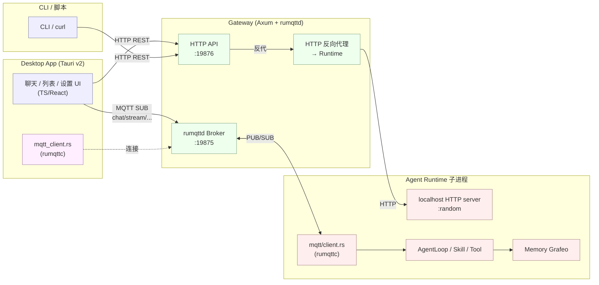
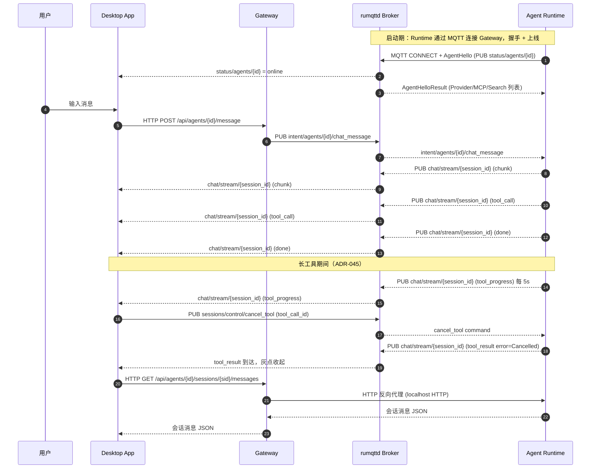

# ACowork.AI 协议文档（纲要）

> 本目录是 ACowork.AI Gateway 的 API 使用参考。当前架构采用 **两种协议**：
>
> - [HTTP](./http.md) — REST API（非流式 CRUD、配置、会话查询、全局资源管理）
> - [MQTT](./mqtt.md) — 实时事件总线 + 轻量级状态同步（替代已弃用的 gRPC + WebSocket）
>
> 适用读者：Desktop App 前端、CLI 工具、二方集成方、调试脚本。
>
> **演进史**：早期 Gateway ↔ Agent Runtime 之间使用 gRPC，聊天流式事件通过 WebSocket 推送；自 [ADR-033](../../adr/zh/ADR-033-mqtt-replace-grpc-websocket.md) 起收敛为 MQTT pub/sub + HTTP 反向代理的二元架构。gRPC / WebSocket 协议文档已下架，代码也已下线。

---

## 1. 两种协议一览（现行架构）

| 协议 | 传输层 | 服务端框架 | 默认端口 | 主要调用方 | 主要用途 |
|------|--------|------------|----------|------------|----------|
| HTTP/1.1 | TCP | Axum (Rust) | `19876` | Desktop App、CLI、运维脚本、Gateway → Runtime（反向代理） | 资源 CRUD、配置、会话查询、全局资源全量管理、大数据查询反向代理 |
| MQTT 3.1.1 | TCP | rumqttd (嵌入 broker) + rumqttc (client) | `19875` | Gateway、Runtime 子进程、Desktop Tauri backend | 实时事件总线、状态同步、设备生命周期管理 |

> **端口与绑定**：默认全部绑定 `127.0.0.1`（localhost only）。Runtime 的 localhost HTTP server 使用随机端口（`--http-port=0`），仅 Gateway 反向代理可达。可在 `gateway.toml` 的 `[http]` 节调整端口与 `auth_enabled`；MQTT 端口见 [`core/acowork-gateway/configs/rumqttd.toml`](../../../core/acowork-gateway/configs/rumqttd.toml)。
> **CORS**：始终 permissive（任意 origin / method / header；不带 `allow_credentials`——`*` 通配与 `Access-Control-Allow-Credentials: true` 互斥，tower-http 会在构建时 panic；前端 fetch 默认 `credentials: 'same-origin'` 也不需要该头）。Dev (Vite `:5173`) 与 Prod (Tauri `tauri://localhost`) 都是跨源访问 Gateway `:19876`，hardcoded allowlist 不可靠；本地默认 bind loopback，没有攻击面。远端部署时安全模型靠 `auth_enabled` + Bearer Token。

---

## 2. 总体架构



**职责边界一句话版**：

- **HTTP** 承担"**CRUD + 全量查询 + 反向代理**"：所有非流式场景、配置拉取、大数据量消息历史、Gateway ↔ Runtime 之间的大数据查询。
- **MQTT** 承担"**事件推送 + 状态同步**"：chunk / tool_call / done 等流式事件、设备上线/离线（Will + Retained）、Provider/MCP/Search 可用性广播。
- **Runtime 端 = MQTT 客户端 + localhost HTTP server**：Gateway 反向代理 Runtime 的 HTTP 用于大数据查询；Runtime 自己不暴露对外端口。

---

## 3. 端到端一次典型对话



要点：

- **HTTP 只用于"触发 + 查询 + 反向代理"**：用户消息发送、大数据消息历史拉取都走 HTTP。
- **MQTT 只用于"事件推送 + 状态同步"**：chunk / tool_call / done 等流式事件通过 MQTT pub/sub，Desktop App 按 session 订阅 `chat/stream/{session_id}`。
- **MQTT 不承载 req/res**：任何需要"等回复"的场景（大数据查询、配置写回、Intent 触发的 ACK 等）走 HTTP，由 Gateway 在内部转换为对 Runtime localhost HTTP 的反向代理调用。

---

## 4. 通用约定

### 4.1 内容类型与字符编码

- HTTP 请求/响应：`application/json; charset=utf-8`
- MQTT Payload：二进制 protobuf，独立文件 [`core/acowork-core/proto/mqtt_payload.proto`](../../../core/acowork-core/proto/mqtt_payload.proto)（独立命名空间，不与其他 proto 共享定义）

### 4.2 HTTP 错误格式

```json
{ "error": "human readable message" }
```

HTTP 状态码语义：

| 码 | 含义 |
|----|------|
| 200 / 204 | 成功 |
| 400 | 请求参数错误 |
| 401 | 未授权（启用 auth 时） |
| 404 | Agent / 资源不存在 |
| 409 | 状态冲突（如 Agent 未运行） |
| 500 / 502 / 503 | 服务端错误、Runtime 未连接 |
| 504 | Gateway → Runtime 反向代理超时 |

### 4.3 认证

- `http.auth_enabled = true` 时，Gateway 启动时生成 256-bit 随机 token，写入 `<data_dir>/http_token`。
- HTTP 请求需带 `Authorization: Bearer <token>` 头。
- MQTT 当前绑定 `127.0.0.1`，依赖本地回路保护，**不在协议层做鉴权**；多用户阶段启用 rumqttd 内置 ACL（见 [ADR-033](../../adr/zh/ADR-033-mqtt-replace-grpc-websocket.md)）。

### 4.4 数据发现文件

Gateway 启动后会在 `<data_dir>/` 下写入：

| 文件 | 用途 |
|------|------|
| `gateway.pid` | PID + HTTP 端口（供 Desktop App 发现） |
| `http_token` | Bearer token（仅当 auth 启用） |

---

## 5. 文档导航

| 想做的事 | 查阅 |
|----------|------|
| 列出/安装/启动 Agent | [http.md §Agent 管理](./http.md#二agent-管理) |
| 发起聊天（HTTP） | [http.md §Chat 与会话](./http.md#三chat-与会话) |
| 订阅流式事件（MQTT） | [mqtt.md §Topic 树与事件类型](./mqtt.md) |
| 了解 Runtime ↔ Gateway 通信（MQTT 主题、反向代理） | [mqtt.md](./mqtt.md) |
| 取消单个长工具 / 查看工具执行进度（ADR-045） | [mqtt.md §9.4](./mqtt.md#94-单工具取消adr-045) + [ADR-045](../../adr/zh/ADR-045-tool-progress-and-cancel.md) |
| 管理 Provider/MCP/Search | [http.md §LLM Provider 与 Models](./http.md#五llm-provider-与-models) / [http.md §MCP 目录](./http.md#六mcp-目录) |
| 操作 Memory | [http.md §记忆](./http.md#七记忆) |
| 调试/重启 Agent / LSP | [http.md §调试与开发工具](./http.md#十三调试与开发工具) |
| 理解 MQTT 演进史（gRPC/WebSocket 为何退役） | [ADR-033](../../adr/zh/ADR-033-mqtt-replace-grpc-websocket.md) |

---

## 6. 相关源码索引

- 路由聚合：`core/acowork-gateway/src/http/routes.rs`
- 各域 handler：`core/acowork-gateway/src/http/*.rs`
- HTTP 反向代理（Gateway → Runtime localhost）：`core/acowork-gateway/src/http/proxy.rs`
- MQTT Broker（Gateway 嵌入）：`core/acowork-gateway/src/mqtt/broker.rs`
- MQTT 全局资源发布器：`core/acowork-gateway/src/mqtt/global_resources_publisher.rs`
- Runtime MQTT 客户端：`core/acowork-runtime/src/mqtt/client.rs`
- Runtime localhost HTTP server：`core/acowork-runtime/src/http/server.rs`
- Desktop（Tauri Rust）MQTT 客户端：`apps/acowork-desktop/src-tauri/src/mqtt_client.rs`
- MQTT Protobuf 定义：`core/acowork-core/proto/mqtt_payload.proto`
- 默认端口：`core/acowork-core/src/defaults.rs`
- ADR-033（gRPC/WebSocket → MQTT 演进史）：[`docs/adr/zh/ADR-033-mqtt-replace-grpc-websocket.md`](../../adr/zh/ADR-033-mqtt-replace-grpc-websocket.md)
