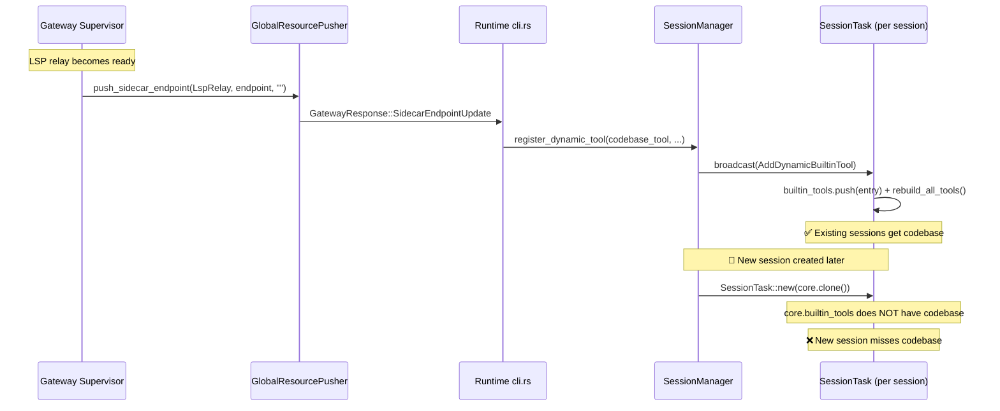

# ADR-030 Code Review Report

**Review 日期**：2026-07-08  
**Reviewer**：Senior Engineer Agent  
**范围**：ADR-030 Sidecar 端点动态推送重构（C1-C4，4 commits）  
**Commits**：`dec3dca` (C1) → `7081e4f` (C2) → `7651dd3` (C3) → `c3ddf12` (C4)

---

## 总体评价

| 维度 | 评分 | 说明 |
|------|------|------|
| 协议设计 | ✅ 优秀 | 独立消息 + enum + spec_json，扩展性好 |
| Gateway 推送层 | ✅ 优秀 | 通用 push 方法，helper 提取合理 |
| Runtime 动态注册 | ⚠️ 有缺陷 | 已有 session 工作正常，但**新 session 存在遗漏** |
| 清理完整性 | ✅ 完整 | 旧字段/variant/函数全部移除 |
| 架构合理性 | ✅ 良好 | 高内聚低耦合，但存在死代码和逻辑重复 |
| 设计目标达成 | ⚠️ 部分达成 | 目标 3/4 有缺陷，目标 4 有遗漏 |

**结论**：C1/C2/C4 质量优秀，C3 存在 **1 个 HIGH 级问题**（新 session 遗漏动态工具）和 **1 个 MEDIUM 级问题**（embed 空端点未处理），需修复后方可标记为完全完成。

---

## C1：协议层 ✅

### 验证项

| 检查点 | 状态 | 文件位置 |
|--------|------|---------|
| `SidecarKind` proto enum（3 变体） | ✅ | `gateway_ipc.proto:284-293` |
| `SidecarEndpointUpdate` proto message | ✅ | `gateway_ipc.proto:302-310` |
| `ServerMessage.payload` tag 44 | ✅ | `gateway_ipc.proto:96` |
| `MigrationStart` 正确避让到 tag 45 | ✅ | `gateway_ipc.proto:101-103` |
| `SidecarKind` domain enum + `as_str()` + `FromStr` | ✅ | `protocol.rs:1177-1214` |
| `GatewayResponse::SidecarEndpointUpdate` variant | ✅ | `protocol.rs:1158-1169` |
| `sidecar_to_proto()` 转换函数 | ✅ | `proto_bridge.rs:445-451` |
| `to_proto()` 中 SidecarEndpointUpdate 序列化 | ✅ | `proto_bridge.rs:823-833` |
| `client.rs` 解码 + 日志 | ✅ | `client.rs:1319-1336` |
| Wire string 稳定性单测 | ✅ | `protocol.rs:1535-1555` |
| JSON roundtrip 单测 | ✅ | `protocol.rs:1559-1607` |

### 评价

C1 设计干净，proto 注释完善（包含添加新 sidecar 的 3 步指南），`as_str()`/`FromStr` 保证 wire 稳定性，空字符串表示"不可用"的约定简洁有效。**无问题**。

---

## C2：Gateway 推送层 ✅

### 验证项

| 检查点 | 状态 | 文件位置 |
|--------|------|---------|
| `push_sidecar_endpoint()` 通用方法 | ✅ | `global_push.rs:366-433` |
| `build_embed_sidecar_payload()` helper | ✅ | `global_push.rs:41-51` |
| embed_supervisor 4 处调用迁移 | ✅ | `embed_supervisor.rs:322,338,601,710` |
| embedding_api 1 处调用迁移 | ✅ | `embedding_api.rs:445-452` |
| LSP relay supervisor C2 期间不动 | ✅ | 确认无 pusher 引用 |

### 评价

`build_embed_sidecar_payload()` 提取为 `pub(crate)` helper 供 embed_supervisor 和 embedding_api 共享，避免了逻辑重复。`push_embed_sidecar_to_agents()` 封装了"读 state + build payload + push"三步，4 个调用点简洁。**无问题**。

---

## C3：Runtime 动态注册 + LSP Relay Supervisor ⚠️

### C3.1 LSP Relay Supervisor 接入 Pusher ✅

ADR 要求的 5 个状态转换点全部覆盖：

| # | 事件 | 文件位置 | 状态 |
|---|------|---------|------|
| 1 | SSE 连接成功，mark ready | `lsp_relay_supervisor.rs:349` | ✅ |
| 2 | 重启前清空 lsp_relay_process | `lsp_relay_supervisor.rs:190` | ✅ |
| 3 | 重启超限放弃 | `lsp_relay_supervisor.rs:201` | ✅ |
| 4 | 重启成功（新 PID） | `lsp_relay_supervisor.rs:226` | ✅ |
| 5 | Reaper 检测到子进程退出 | `lsp_relay_supervisor.rs:241` | ✅ |

`build_lsp_relay_sidecar_payload()` 正确实现了 `ready` 检查和空端点语义。`start_lsp_relay_supervisor` 签名正确增加了 `pusher` 参数，`gateway/mod.rs:803-807` 正确传入。**无问题**。

### C3.2 cli.rs 路由 ✅

`SidecarEndpointUpdate` 分支正确路由三种 `SidecarKind`：

- **LspRelay**：endpoint 非空 → `register_dynamic_tool("codebase", ...)`；endpoint 空 → `unregister_dynamic_tool("codebase")` ✅
- **Embed**：endpoint 非空 → 解析 spec_json → `handle_embedding_config_update(...)` ✅
- **Unspecified**：warn + ignore ✅

### C3.3 SessionManager 动态注册 ⚠️

**实际实现与 ADR 设计有偏差（合理的偏差）**：

| 方面 | ADR 设计 | 实际实现 |
|------|---------|---------|
| 方法位置 | `AgentCore` 或 `SessionManager` | `SessionManager` ✅（ADR 允许） |
| ToolRegistry 改为 `Arc<RwLock<Vec<...>>>` | 是 | **否**，仍为 `Vec<Arc<dyn Tool>>` |
| 调用 `ToolRegistry::register_external()` | 是 | **否**，直接广播到 session |
| 安全装饰器包裹 | 在 `rebuild_all_tools` 中 | 在 `register_dynamic_tool` 中手动包裹 |

**偏差分析**：实际实现选择绕过 `ToolRegistry`，直接通过 `SessionManager::broadcast(SessionMessage::AddDynamicBuiltinTool)` 将已包裹好安全装饰器的 `BuiltinToolEntry` 推送到每个 session。这个偏差本身是**合理的**——因为 `AgentCore` 在 `SessionTask::new` 中被深拷贝（`(*core).clone()`），每个 session 有独立的 `builtin_tools: Vec<BuiltinToolEntry>`，修改共享的 `ToolRegistry` 不会自动传播到已有 session。广播模式是正确的传播方式。

**但是**，这导致 `ToolRegistry::register_external()` / `unregister()` 成为**死代码**（仅测试使用），且安全装饰器包裹逻辑在 `register_dynamic_tool` 和 `ToolRegistry::activate` 中重复。

### 🔴 ISSUE-1（HIGH）：新 session 遗漏动态注册的工具

**描述**：`register_dynamic_tool()` 仅广播到 `self.sessions`（已有 session），不更新共享模板 `self.core: Arc<AgentCore>`。新 session 通过 `SessionTask::new(self.core.clone(), ...)` 深拷贝模板创建（`session_task.rs:463`），模板的 `builtin_tools` 不包含动态注册的工具。

**影响场景**：

```
1. Agent 启动时 LSP relay 未 ready → hello_config.lsp_relay_endpoint = None
2. codebase 未注册到 ToolRegistry → 模板 builtin_tools 无 codebase
3. LSP relay ready → push → register_dynamic_tool → 已有 session 获得 codebase ✅
4. 用户新建 session → 深拷贝模板 → builtin_tools 无 codebase ❌
```

**对比**：`SessionManager` 中已有正确模式——`mcp_tools: Option<Vec<Arc<dyn Tool>>>` 字段在注释中明确说明 "Merged into each new session's tools at creation time"（`session_manager.rs:184-185`），`runtime_overrides` 也是 "re-applied to every newly created session"（`session_manager.rs:180-182`）。动态 builtin tools 应该采用同样的模式。

**修复建议**：

在 `SessionManager` 中增加 `dynamic_builtin_tools: Vec<BuiltinToolEntry>` 字段，`register_dynamic_tool` 同时更新此字段和广播到已有 session；`create_session_with_id_and_conversation` 在 `SessionTask::new` 后将 `dynamic_builtin_tools` 注入新 session。

### 🟡 ISSUE-2（MEDIUM）：Embed 空端点未处理

**描述**：ADR 设计要求 "Embed + endpoint 空 → 清空 ONNX provider，回退到纯远端 fallback"。实际实现（`cli.rs:2134-2139`）仅记录 warn 日志，不做任何操作：

```rust
if endpoint.is_empty() {
    tracing::warn!(
        "SidecarEndpointUpdate(Embed) with empty endpoint; \
         leaving current embed provider in place ..."
    );
}
```

**影响**：当 embed sidecar 崩溃或被关闭时，Runtime 不会清理 ONNX provider，后续 embedding 请求会继续尝试连接已失效的端点，直到超时后才 fallback。

**修复建议**：实现 `handle_embedding_config_update` 的空端点分支，清空或标记 ONNX provider 为不可用。

### 🟡 ISSUE-3（LOW）：ToolRegistry 死代码 + 安全装饰器逻辑重复

**描述**：
1. `ToolRegistry::register_external()` / `unregister()` 仅在单元测试中使用，生产代码路径不调用它们。
2. 安全装饰器（PathGuardedTool + RateLimitedTool）的包裹逻辑在两处重复：
   - `ToolRegistry::activate()`（`registry.rs:98-152`）— 启动期
   - `SessionManager::register_dynamic_tool()`（`session_manager.rs:1266-1275`）— 动态注册

**修复建议**：
- 方案 A：移除 `ToolRegistry::register_external()` / `unregister()` 及其测试（承认实际架构不走这条路）
- 方案 B：提取安全装饰器包裹为独立函数 `wrap_with_security_decorators(tool, resolver, max_rate) -> BuiltinToolEntry`，两处共用

---

## C4：协议清理 ✅

### 验证项

| 检查点 | 状态 | 验证方式 |
|--------|------|---------|
| `RuntimeConfigUpdate.embed_config_json` 字段移除 | ✅ | 全局搜索仅剩 1 条历史注释 |
| `GatewayResponse::EmbeddingConfigUpdate` variant 移除 | ✅ | 全局搜索仅剩 3 条历史注释 |
| `push_embedding_config()` 函数移除 | ✅ | 全局搜索 0 命中 |
| `embed_config_json` 双向转换代码删除 | ✅ | proto_bridge.rs 无相关代码 |
| `client.rs` 解码分支删除 | ✅ | 无 EmbeddingConfigUpdate 分支 |
| `cli.rs` 处理分支删除 | ✅ | 无 EmbeddingConfigUpdate 分支 |

**无问题**。清理彻底，仅保留 ADR 文档和代码注释中的历史叙述引用。

---

## 设计目标达成度评估

| # | 设计目标 | 达成 | 说明 |
|---|---------|------|------|
| 1 | 通用化 sidecar 推送通道 | ✅ | `SidecarEndpointUpdate` 统一通道，embed 和 lsp_relay 共用 |
| 2 | 解耦推送语义 | ✅ | 不再用 `RuntimeConfigUpdate` 内嵌 JSON 字段 |
| 3 | 支持动态注册/卸载 builtin tools | ⚠️ | 已有 session 可动态增删，**新 session 遗漏**（ISSUE-1） |
| 4 | 侧车生命周期全感知 | ⚠️ | 已有 session 全感知，**新 session 不感知**（ISSUE-1）；embed 空端点不处理（ISSUE-2） |
| 5 | 冷启动零延迟 | ✅ | AgentHello 维持现状，pusher 异步补 |
| 6 | 过渡期兼容 | ✅ | C4 清理完成，无残留 |

---

## 架构合理性评估

### 高内聚 ✅

- `SidecarEndpointUpdate` 是单一职责消息，proto 注释包含扩展指南
- `push_sidecar_endpoint()` 是通用推送方法，不关心 sidecar 类型
- 每个 supervisor 有独立的 payload builder helper（`build_embed_sidecar_payload` / `build_lsp_relay_sidecar_payload`）
- cli.rs 路由逻辑清晰，按 `SidecarKind` 分发

### 低耦合 ✅（有改进空间）

- 协议层（C1）与业务逻辑完全解耦 ✅
- Gateway push 层不知道 Runtime 内部结构 ✅
- Supervisor 通过通用 pusher 推送，不直接操作 Runtime ✅
- **改进点**：`ToolRegistry::register_external` / `unregister` 作为死代码存在，模糊了 ToolRegistry 的职责边界（ISSUE-3）

### 数据流完整性



---

## 构建验证

| Crate | 状态 |
|-------|------|
| `acowork-core` | ✅ 编译通过 |
| `acowork-runtime` | ✅ 编译通过 |
| `acowork-gateway` | ✅ 编译通过 |
| `acowork-embed` | ❌ 预存问题（ONNX Runtime 未安装，与 ADR-030 无关） |

---

## 问题汇总与优先级

| # | 级别 | 问题 | 影响 | 修复建议 |
|---|------|------|------|---------|
| ISSUE-1 | 🔴 HIGH | 新 session 遗漏动态注册的工具 | LSP relay 启动后新建的 session 无 codebase 工具 | SessionManager 增加 `dynamic_builtin_tools` 字段，create_session 时注入 |
| ISSUE-2 | 🟡 MEDIUM | Embed 空端点未处理 | Embed sidecar 崩溃后 Runtime 不清理 ONNX provider | 实现 `handle_embedding_config_update` 空端点分支 |
| ISSUE-3 | 🟢 LOW | ToolRegistry 死代码 + 装饰器逻辑重复 | 代码可维护性下降 | 移除死代码或提取共用 helper |

---

## 总结

ADR-030 的协议设计（C1）和 Gateway 推送层（C2）质量优秀，C4 清理彻底。核心问题集中在 C3 的 Runtime 侧：**动态工具注册没有考虑新 session 的 replay 路径**（ISSUE-1），这是一个架构完整性缺陷——`SessionManager` 中已有 `mcp_tools` 和 `runtime_overrides` 两个类似的"新 session 注入"模式，但动态 builtin tools 没有采用同样的模式。

建议修复 ISSUE-1 后将 ADR 状态更新为"已完成"，ISSUE-2 和 ISSUE-3 可作为后续优化。
