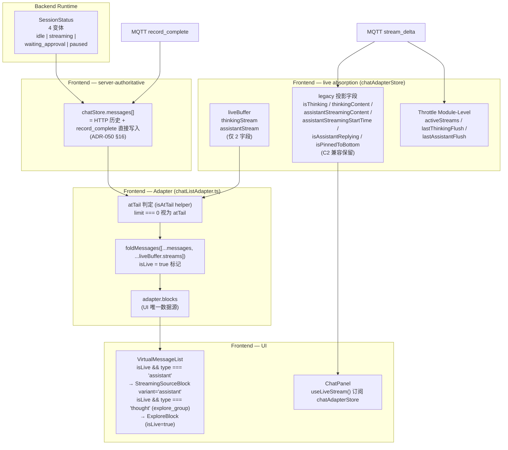
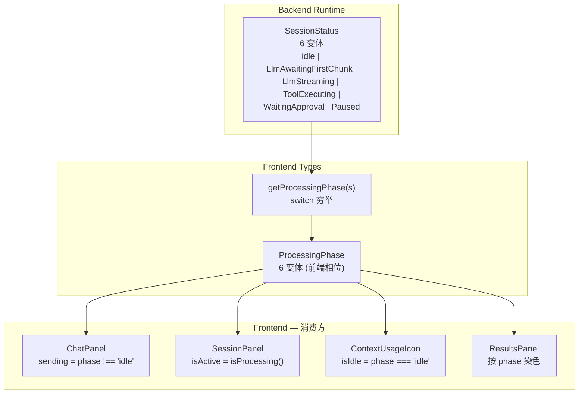

# 29 — ADR-049 vs ADR-050 post-C5 架构一致性分析

**Date**: 2025-01-16
**Reviewer**: Senior Engineer
**Status**: 🟡 需修订（4 个 P0 误导性陈述 + 5 个 P1 缺失章节 + 3 个 P2 术语漂移）
**Scope**: ADR-049 prose ⇄ ADR-050（post-C5，commit `dcc182b2`）落地架构

**参考文档**:
- ADR-049: [`docs/adr/zh/ADR-049-session-status-substates.md`](../../adr/zh/ADR-049-session-status-substates.md)
- ADR-050: [`docs/adr/zh/ADR-050-chat-list-data-driven-refactor.md`](../../adr/zh/ADR-050-chat-list-data-driven-refactor.md)
- ADR-050 C5 + post-C5 commit: `dcc182b2`（785+/166-）
- 关键代码定位:
  - `apps/acowork-desktop/src/components/chat/chatAdapterStore.ts`（liveBuffer + legacy 投影）
  - `apps/acowork-desktop/src/components/chat/chatListAdapter.ts`（atTail + 拼接）
  - `apps/acowork-desktop/src/components/chat/VirtualMessageList.tsx`（isLive 路由）
  - `apps/acowork-desktop/src/components/chat/ExploreBlock.tsx`（isLive prop）
  - `apps/acowork-desktop/src/stores/chatStore.ts`（record_complete → messages[]，sendMessage → messages[]）
  - `apps/acowork-desktop/src/lib/paginationUtils.ts`（`isAtTail` 共享）
  - `apps/acowork-desktop/src/lib/types.ts`（SessionStatus 当前 4 变体）

---

## 一、整体判断

**ADR-049 尚未实现**——`lib/types.ts:865-882` 当前 SessionStatus 仍是 `idle | streaming | waiting_approval | paused` 4 变体。ADR-049 §决策摘要 提出的 6 变体（`LlmAwaitingFirstChunk | LlmStreaming | ToolExecuting`）拆分仅停留在提案层面，没有任何代码落地。

**ADR-050 C1-C5 + post-C5 已全部落地**。Post-C5（commit `dcc182b2`）改变了 **数据流** 的关键路径：

| 维度 | ADR-050 §3.3 原设计 | Post-C5 实际落地 |
|------|------------------|----------------|
| `messages[]` 内容 | 仅 HTTP 历史窗口 | **HTTP 历史 + MQTT record_complete 直接写入** |
| `liveBuffer` 字段 | 4 个（thinkingStream / assistantStream / pendingUserMessage / pendingRecordComplete） | **2 个**（thinkingStream / assistantStream） |
| `pendingUserMessage` | 有 | **删除** |
| `pendingRecordComplete` | 有 | **删除** |
| `atTail` 判定 | `limit > 0 && offset + limit >= total` | **`limit >= 0` 一律视为 atTail**（`isAtTail` helper） |
| `ingestOptimisticUserMessage` | 写入 liveBuffer.pendingUserMessage | **no-op**（sendMessage 直接写入 messages[]） |
| `record_complete` 路径 | liveBuffer → pendingRecordComplete → HTTP refresh → dedup | **chatStore 直接写入 messages[]** |
| `isLive` block 来源 | liveBuffer 的 4 个字段 | **仅 thinkingStream + assistantStream** |
| 辅助渲染 | VirtualMessageList trailing virtual item | **`adapter.blocks` 中 `isLive: true` block** |

**关键矛盾**：ADR-049 写作时假设的"实时数据管线"（chatStore 持有流式字段 → props 传给 VML → StreamingSourceBlock）已被 ADR-050 C2 + post-C5 重新洗牌。**ADR-049 多处 prose 现在与落地代码不符**，按 ADR-049 的描述去实现会引发与 ADR-050 的二次冲突。

---

## 二、核心错位：ADR-049 把流式数据的"家"写错了

ADR-049 全文反复把 `isAssistantReplying / isThinking / thinkingContent / assistantStreamingContent / assistantStreamingStartTime` 描述为 `chatStore` 的字段：

| ADR-049 位置 | 原文摘录 |
|------------|---------|
| 摘要 | "`isAssistantReplying`、`isThinking`、`showInterStepProcessing`，`sending` 从 4 项组合推导简化为 `sessionStatus` 直接映射" |
| 影响范围 | "`apps/acowork-desktop/src/stores/chatStore.ts` — 状态推导逻辑 + `assistantStreamingContent` 节流推送" |
| 影响范围 | "流式相关 props 仍保留，但语义变化" → 列出 5 个字段 |
| §实施步骤 Commit 3 | "删除 `isAssistantReplying` 状态推导（在 `stream_delta` handler 中）" |
| §实施步骤 Commit 5 | "chatStore 新增 `assistantStreamingContent` + `assistantStreamingStartTime` 字段、`lastAssistantFlush` 节流 Map" |
| §A.2 推导路径 | "`stream_delta (MQTT messages/stream_delta)` → `lines` → `lines[0].role === 'assistant' ? 'assistant' : 'thought'` → ... 推到 Zustand (`isAssistantReplying`)" |
| §A.2 节流 | "`lastAssistantFlush: Map<sid, number>` + 500ms 节流，叠加 `isPinnedToBottom` 守卫" |

**但落地后**（ADR-050 C2 已完成）：

```
chatStore.ts              → 仅 messages[], sessionStatus, session 元数据
                            （stream_delta handler 仅调 adapter.ingestStreamDelta）
chatAdapterStore.ts       → liveBuffer (thinkingStream / assistantStream)
                            + legacy projection (isThinking / thinkingContent /
                              assistantStreamingContent / assistantStreamingStartTime /
                              isAssistantReplying / isPinnedToBottom / optimisticEntries)
                            + module-level activeStreams / lastAssistantFlush / lastThinkingFlush
```

> ChatPanel.tsx:374-380 注释明确：
> ```
> ADR-050 C2: live-stream state (optimisticEntries + isThinking +
> thinkingContent + assistantStreamingContent + isPinnedToBottom)
> now lives in chatAdapterStore.  ChatPanel subscribes via
> `useLiveStream(selectedAgentId, currentSessionId)` and the same
> shape is forwarded to the v1 components ...
> ```

**ADR-049 必须把"流式字段归属于 chatStore"全部迁移到"流式字段归属于 chatAdapterStore"**。否则按 ADR-049 现状去实现，会出现重复实现（chatStore 和 chatAdapterStore 各自持有一份相同的 throttle / edge-trigger 逻辑）。

---

## 三、P0 误导性陈述（必须修订）

### P0-1 §A.2 步骤 5：`isAssistantReplying`「仍是 DOM 提示灯」已不成立

ADR-049 §A.2 末尾：

> 注意：行数阈值 `ASSISTANT_REPLYING_LINE_THRESHOLD` (3) 在本次修订后**仅保留**用于：(a) `isAssistantReplying` 边缘翻转的兼容触发（仍驱动 Tab 栏活跃状态 / 一些列外的逻辑）；(b) **`isAssistantReplying` 仍是安全的 DOM 提示灯**——它现在不再用作『`showReplyingItem` 是否亮』的判据...

落地后：

- `ChatPanel.tsx:415-416` 注释：**"isAssistantReplying no longer drives a trailing virtual item; the v2 adapter folds the live assistant stream into blocks."**
- `VirtualMessageList.tsx:533-534` 注释：**"the streaming state is driven solely by `sending` (which reflects isAssistantReplying / session active status)."** —— 但 `isAssistantReplying` 本身也只是参考，**不再驱动任何 DOM 结构**。
- `chatAdapterStore.ts:122-124` 注释说明 `isAssistantReplying` 的纯安全阀角色（detection of `record_complete lost`）。

**修订建议**：

> (b) **`isAssistantReplying` 仅作为安全阀状态**——ADR-050 C5 删除 trailing virtual item 后，前端不再有任何 DOM 元素以其为判据。它的作用是：检测 `record_complete 丢失` 边界（chatAdapterStore.ts:511），并在 activeStream tracker 超过 `ASSISTANT_REPLYING_LINE_THRESHOLD` 时触发内部排查。

### P0-2 §3.5.2 描述 VML 接收流式 props 与实际不符

ADR-049 §3.5.2 把 `assistantStreamingContent` / `assistantStreamingStartTime` 列为 VML props：

> ```typescript
> // BEFORE: 接收 20+ props, 包括流式相关
> interface VirtualMessageListProps {
>   ...
>   assistantStreamingContent: string;       // ← 保留（实时 assistant 流式预览内容）
>   assistantStreamingStartTime: number | null; // ← 保留（流式计时器）
> }
> ```

落地后 `VirtualMessageList.tsx:45-47` 仅 3 个流式 props：

```typescript
isThinking: boolean;
thinkingContent: string;
thinkingStartTime: number | null;
```

`assistantStreamingContent` / `assistantStreamingStartTime` **已不再传给 VML**。assistant 流式预览改为 `VirtualMessageList.tsx:566-580` 的 `isLive` 路由：

```typescript
if (item.isLive && msg.type === "assistant") {
  return (
    <StreamingSourceBlock
      content={msg.content}
      isStreaming={true}
      startTime={msg.timestamp}
      variant="assistant"
    />
  );
}
```

**修订建议**：把 §3.5.2 props 列表改成 3 个流式 props（`isThinking / thinkingContent / thinkingStartTime`），并补充"assistant 流式预览改为 `isLive` block 直路由"作为新设计。

### P0-3 §Frontend assistant live preview 的数据流图 与 §3.5.4 描述的 trailing virtual item 已废弃

ADR-049 §"Frontend assistant live preview" 子节（2026-07-29 后置补遗）：

> 2. `VirtualMessageList` 的 trailing "replying slot" 改为渲染 `<StreamingSourceBlock variant="assistant">`
> 3. ... 数据流图：VML → SSB

落地后 `VirtualMessageList.tsx` **不再有 trailing virtual item**。assistant 流式预览是 `adapter.blocks` 中 `isLive: true` 的 message block，由 VML 在常规渲染循环中分发到 `StreamingSourceBlock`。`virtualCount` 不再 `+1`。

**修订建议**：

- 删除"trailing replying slot"表述
- 数据流图改为：`adapter.blocks (isLive: true) → VML (isLive && msg.type === "assistant") → StreamingSourceBlock variant="assistant"`
- 同步 §实施步骤 Commit 5 第 5 条

### P0-4 §实施步骤 Commit 5 关于 `record_complete` 的清理位置

ADR-049 Commit 5 第 4 条：

> `record_complete` 清空 `assistantStreamingContent` + `assistantStreamingStartTime`

落地后 `chatStore.ts:2329` 的 `record_complete` handler 流程：

```typescript
case "record_complete": {
  ...
  // 1. chatStore 调用 convertRecordCompleteToChatMessage 直接写入 messages[]
  const chatMsg = convertRecordCompleteToChatMessage(data, agentId, lastTs, thoughtTiming);
  set((state) => { ... ss2.messages.push(chatMsg) ... });

  // 2. 然后调 adapter.ingestRecordComplete, 清空对应的 stream
  ingestRecordComplete(agentId, sid, { role, messageId: msgId });
  // （chatAdapterStore.ingestRecordComplete 内部会把 legacy 投影字段也清空）
}
```

**修订建议**：

- 把 Commit 5 第 4 条改为：`chatStore.record_complete` 写 messages[] (主路径) → 调 `chatAdapterStore.ingestRecordComplete` 清空对应 stream (副作用, 间接清空 legacy 投影字段)
- §A.2 同位置同步更新

---

## 四、P1 缺失章节（必须补充）

### P1-1 影响范围：缺少 `chatAdapterStore.ts` 模块

ADR-049 §影响范围列出了 11 个文件，但**完全没有 chatAdapterStore.ts**：

```
- core/acowork-runtime/src/agent/session_state.rs
- core/acowork-runtime/src/agent/ 6 个 loop 模块
- core/acowork-runtime/src/providers/reliable.rs
- core/acowork-core/src/protocol.rs
- apps/acowork-desktop/src/lib/types.ts
- apps/acowork-desktop/src/stores/chatStore.ts          ← 列为 chatStore 持有流式字段
- apps/acowork-desktop/src/components/chat/ChatPanel.tsx
- apps/acowork-desktop/src/components/chat/SessionPanel.tsx
- apps/acowork-desktop/src/components/chat/StreamingSourceBlock.tsx
- apps/acowork-desktop/src/components/chat/ThinkBlock.tsx
- apps/acowork-desktop/src/components/chat/VirtualMessageList.tsx
- apps/acowork-desktop/src/components/chat/blockLayout.ts
```

**修订建议**：增加：

```
- apps/acowork-desktop/src/components/chat/chatAdapterStore.ts
  (liveBuffer 吸收 + 500ms 节流 + legacy 投影字段)
- apps/acowork-desktop/src/components/chat/chatListAdapter.ts
  (atTail 判定 + isLive block 派生)
- apps/acowork-desktop/src/lib/paginationUtils.ts
  (isAtTail 共享 helper)
```

### P1-2 前置引用：缺少 ADR-050 交叉引用

ADR-049 前置列表：

```
- ADR-014, ADR-021, ADR-035, ADR-043
```

**缺失**：

- **ADR-050**（post-C5 在 ADR-049 之后撰写，但实现了关键的 liveBuffer 重构）
- ADR-050 §3.3（liveBuffer 设计的真源）
- ADR-050 §16（post-C5 修订记录）

**修订建议**：

```
- ADR-014, ADR-021, ADR-035, ADR-043
- ADR-050 §3.3 + §16（liveBuffer 2 字段 + record_complete 直接写入 messages[]）
```

### P1-3 §Throttling 段落：500ms 节流位置未提及迁移

ADR-049 §Throttling 策略：

> 与 `thinkingContent` 完全对称——`lastAssistantFlush: Map<sid, number>` + 500ms 节流，叠加 `isPinnedToBottom` 守卫（**用户滚到上方时不推送，避免无谓的 Zustand 写入和重渲染**）。

落地后：

- `lastAssistantFlush` 在 `chatAdapterStore.ts:188`（模块级 Map，**不是 zustand state**）
- `isPinnedToBottom` 在 `chatAdapterStore.ts` 的 `AdapterSessionState` 中（"legacy 投影字段"，chatAdapterStore.ts:106-119 注释明确指出这一组字段是 C2 兼容保留，C5 后会逐步退役）
- 节流守卫现在检查的是 `chatAdapterStore` 内部状态

**修订建议**：

> 与 `thinkingContent` 完全对称——`lastAssistantFlush: Map<sid, number>` + 500ms 节流，**位置在 chatAdapterStore 模块级**（而非 chatStore 字段）。isPinnedToBottom 守卫复用同一模块的 `isPinnedToBottom` 投影字段。

### P1-4 §A.2 推导路径：所有"推到 Zustand"应改为"写到 chatAdapterStore"

ADR-049 §A.2 末尾：

> 推到 Zustand (isAssistantReplying)
> 推到 Zustand (assistantStreamingContent)

落地后这些 `set()` 调用都进 `chatAdapterStore`（`useStore.getState() / setState()`），不是 `chatStore`。命名上属于"另一个 zustand store"。

**修订建议**：把 §A.2 所有"推到 Zustand"统一改成"写到 chatAdapterStore"，并新增一段说明 `chatStore` 和 `chatAdapterStore` 的责任分工（即 ADR-050 C2 / chatAdapterStore.ts:1-43 的那段背景注释）。

### P1-5 §A.2 步骤 4 "record_complete"路径与 ADR-050 §16 矛盾

ADR-049 §A.2 步骤 4：

> 4. `record_complete` 清空 `assistantStreamingContent` 清空（防止 session-id 重用时遗留）

ADR-050 §16 强调：

> record_complete 到达时，如果 atTail 且无 gap **直接追加到 messages[]**

二者并不冲突，但 ADR-049 的描述是**不完整**的——`record_complete` 的主路径是 **写入 messages[]**，不是「清空 streaming 字段」。需要把这个主次关系讲清楚。

**修订建议**：

> 4. `record_complete` 主路径：chatStore 通过 `convertRecordCompleteToChatMessage` 把完整内容直接写入 `messages[]`（这是 ADR-050 §16 的关键设计）。副作用：调用 `chatAdapterStore.ingestRecordComplete` 触发对应 stream / legacy 投影字段清空（防止 session-id 重用时遗留）。

---

## 五、P2 术语漂移与辅助问题

### P2-1 §"Tab 栏状态"：`isProcessing()` 在多处的映射需要校验

ADR-049 §"Tab 栏状态" 给出 SessionPanel 的 `isStreaming` → `isProcessing` 替换，但 ADR-049 全文未列出所有需要同步替换的位置。落地代码中需要替换的 4 处：

| 文件 | 行 | 当前 |
|------|---|------|
| `ChatPanel.tsx` | 427-429 | `sending = streaming \|\| waiting_approval \|\| paused` |
| `SessionPanel.tsx` | 136-138 | `isStreaming = streaming \|\| waiting_approval \|\| paused` |
| `ContextUsageIcon.tsx` | 98 | 仅判断 `idle` |
| `ResultsPanel.tsx` | 485-488 | 4 态分别染色 |

**修订建议**：在 §实施步骤 Commit 4 末尾列出这 4 个文件作为替换点（或者用一句话指明"所有引用 `sessionStatus.status === "streaming"` 的位置均需重新映射"）。

### P2-2 §删除的变量表（"`isAssistantReplying` 保留为安全阀状态"）

ADR-049 表格中"保留变量"行其实已经标了 `isAssistantReplying` 保留为安全阀，但同一行用了 `assistantStreamingContent` 作为驱动 `showReplyingItem` 的字段。落地后这段逻辑已删除（`showReplyingItem` 不再存在），整段可压缩。

**修订建议**：删除"`isAssistantReplying`"那行（已移到 chatAdapterStore 作为安全阀、不属于 UI 字段集合）。

### P2-3 §Frontend new type definitions：`SessionStatus` TypeScript 类型需要同步更新

ADR-049 §Frontend new type definitions（`lib/types.ts`）定义的 6 变体 SessionStatus 是正确的，但放在 `lib/types.ts` 中没有说明"是否要兼容旧 4 变体"。落地代码当前也仍是 4 变体。

**修订建议**：加一段说明：

> 6 变体上线后，MQTT 收到的 4 变体字符串视为兼容输入（Runtime 端的 6 变体枚举转换 DTO 时映射成 4 变体下行）。或者保留 DTO 转换层在 Gateway 出口把 6 变体再合并为 4 变体下行，Desktop 端只关心 4 变体。

### P2-4 §"不做事项"列表：缺少 `chatAdapterStore` 流式字段退役

ADR-049 §"不做事项"未提及 **C2 阶段保留下来的 legacy 投影字段**（`isAssistantReplying / isThinking / thinkingContent / assistantStreamingContent / assistantStreamingStartTime`）。这些字段在 ADR-050 C5 已经被 chip 退役，但 chatAdapterStore 注释里写「C5 will drop these」——实际并未完全删除。

**修订建议**：在 ADR-049 的"不做事项"中明确：**「这 5 个 legacy 投影字段在 chatAdapterStore 内的删除不在本 ADR 范围内，已由 ADR-050 C5 后续清理任务承担」**（或将其收录到 ADR-049 的"未来工作"）。

### P2-5 §"迁移风险"：缺少对 `chatAdapterStore` 与 `chatStore` 两条路径的协调说明

ADR-049 §"迁移风险"：

> 前端 `processingPhase` 映射遗漏：`getProcessingPhase()` 函数使用 `switch` 穷举（TypeScript 编译器检查），加新变体时编译器会提示未处理的 case

落地后还多了一条风险：ADR-049 实施时如果从 `chatStore` 移除流式字段，需要确认 `chatAdapterStore` 仍有这些字段，否则下游消费方（ChatPanel → VML）会断流。

**修订建议**：增加一条迁移风险：

> **chatStore ↔ chatAdapterStore 协调遗漏**：ADR-049 实现的字段删除必须与 ADR-050 C2 已落地的 `chatAdapterStore` 投影字段保持一致——删除 chatStore 中的字段时，确认 chatAdapterStore 仍有对应字段，下游订阅（ChatPanel → VML）不会断流。

---

## 六、架构映射图（修订用）

### 6.1 当前落地（ADR-050 post-C5 + ADR-049 未实施）



### 6.2 ADR-049 实施后（预期）



**关键关系**：

- ADR-049 改动的是 **SessionStatus 状态机**（后端 + 前端映射），不改数据流
- ADR-050 post-C5 改动的是 **数据流**（chatStore / chatAdapterStore / Adapter / blocks）
- 两者**正交**，但 ADR-049 的 prose 描述流式字段时**误把它们当成 chatStore 字段**，必须修订

---

## 七、修订优先级与建议

### 必须按序修订（P0 阻断）

按以下顺序修订 ADR-049，否则按 ADR-049 现状去实施会立刻与 ADR-050 冲突：

| # | 修订 | 章节 | 影响范围 |
|---|------|------|---------|
| 1 | 流式字段全部迁移到 chatAdapterStore | §影响范围、§A.2、§Throttling、Commit 3/5 | 全部读者 |
| 2 | `isAssistantReplying` 删去"DOM 提示灯"表述 | §A.2 末尾 | 实现者 |
| 3 | VML props 列表精简 + "isLive block 路由"补充 | §3.5.2 | 实现者 |
| 4 | 删除 "trailing replying slot" + 重新画数据流图 | §Frontend assistant live preview | 实现者 |
| 5 | `record_complete` 主路径写 messages[]，清空字段是副作用 | §A.2 步骤 4、Commit 5 第 4 条 | 实现者 |

### 应一并修订（P1 完整）

| # | 修订 | 章节 |
|---|------|------|
| 6 | 增加 `chatAdapterStore.ts / chatListAdapter.ts / paginationUtils.ts` 到影响范围 | §影响范围 |
| 7 | 前置引用加 ADR-050 §3.3 + §16 | §前置 |
| 8 | §Throttling 位置说明（chatAdapterStore 模块级） | §Throttling |
| 9 | "推到 Zustand" → "写到 chatAdapterStore" | §A.2 推导路径 |
| 10 | 列出 4 个 `sessionStatus` 引用点的同步替换 | Commit 4 |

### 可选优化（P2 锦上添花）

| # | 修订 | 章节 |
|---|------|------|
| 11 | 明确 SessionStatus 6 变体与现有 4 变体的兼容策略 | §Frontend new type definitions |
| 12 | chatAdapterStore legacy 投影字段退役归 ADR-050 后续 | §不做事项 |
| 13 | 增加 chatStore ↔ chatAdapterStore 协调风险 | §迁移风险 |

---

## 八、结论

**ADR-049 与 ADR-050 post-C5 的关系**：**正交不冲突，但 ADR-049 prose 中关于流式数据归属的描述已过期**。

- ADR-049 关注 **session 状态机粒度**（4 变体 → 6 变体）
- ADR-050 post-C5 关注 **数据流归属**（chatStore ↔ chatAdapterStore ↔ Adapter ↔ adapter.blocks）

二者**不抢同一段代码**，但 ADR-049 写作时假设的架构（chatStore 持有流式字段）已被 ADR-050 C2/C5/post-C5 改造。**实施 ADR-049 之前**：必须先把 ADR-049 的 prose 修订到符合当前架构，否则实施者会按 ADR-049 描述去 chatStore 反向添加回已被 ADR-050 删除的代码。

**严重程度**：🟡 中等（不会直接产生运行时 bug，但会让 ADR-049 实施 PR 反复在 chatAdapterStore 中"复活"已被 ADR-050 删除的字段，造成代码合并冲突）。

**建议**：按本报告 §七 的优先级表修订 ADR-049，提交为 ADR-049 v1.1 修订稿，并在 ADR-049 文档头部标注"本 ADR 适用于 ADR-050 post-C5 架构（commit `dcc182b2` 及之后）"。

---

## 附录：A.1 一处真实小 bug（顺带发现）

`lib/types.ts:885-888`：

```typescript
export function isSessionActive(s: SessionStatus | undefined | null): boolean {
  if (!s) return false;
  return s.status === "streaming" || s.status === "waiting_approval" || s.status === "paused";
}
```

调用点 `agentStore.ts:603` `chatStore.ts:2888-2943` 全部基于 4 变体。ADR-049 实施后此函数需要适配 6 变体（`phase !== "idle"`），但**该函数本身并未被 ADR-049 列入"删除/替换"清单**——ADR-049 §"删除的变量" 表只列了 `isAssistantReplying / isThinking / showInterStepProcessing`，没列 `isSessionActive`。

**修订建议**：在 §前端新类型定义 中增加 `isSessionActive` 的替代：`isProcessing(s: SessionStatus | undefined | null): boolean = getProcessingPhase(s) !== "idle"`，并把 `isSessionActive` 标记为"由 `isProcessing` 替代"。

---

**ADR-049 修订完毕后的 Ready-for-Implementation 检查清单**：

- [ ] §影响范围 包含 chatAdapterStore.ts / chatListAdapter.ts / paginationUtils.ts
- [ ] §前置 引用 ADR-050 §3.3 + §16
- [ ] §A.2 / §Throttling / Commit 5 全部把流式字段归属改为 chatAdapterStore
- [ ] §A.2 删除 "`isAssistantReplying` 仍是 DOM 提示灯" 表述
- [ ] §3.5.2 VML props 列表精简为 3 个（isThinking / thinkingContent / thinkingStartTime），assistant 流式预览改为 isLive block 路由
- [ ] §Frontend assistant live preview 删除 trailing virtual item，改数据流图
- [ ] §A.2 步骤 4 改写为「record_complete 主路径写 messages[]，清空字段是副作用」
- [ ] §Frontend new type definitions 增加 `isProcessing` 替代 `isSessionActive`
- [ ] §不做事项 标 chatAdapterStore legacy 字段的退役归 ADR-050
- [ ] §迁移风险 增加 chatStore ↔ chatAdapterStore 协调遗漏
- [ ] Commit 4 列出 4 个 `sessionStatus` 引用点（ChatPanel / SessionPanel / ContextUsageIcon / ResultsPanel）作为同步替换目标
