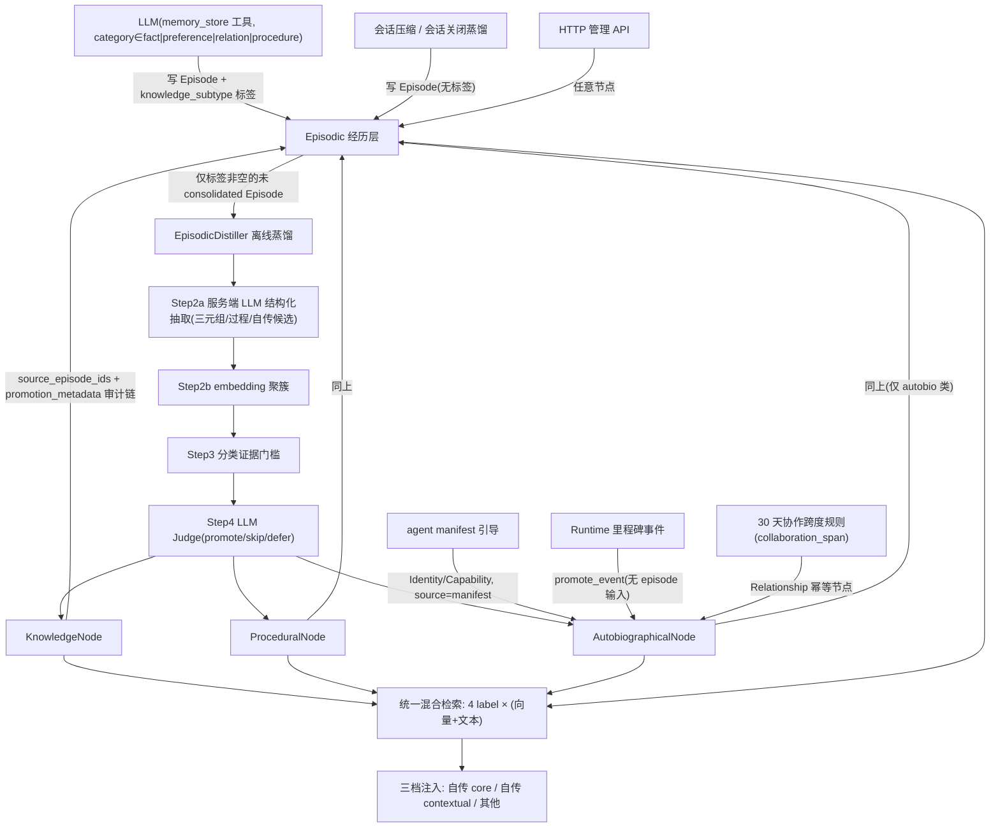
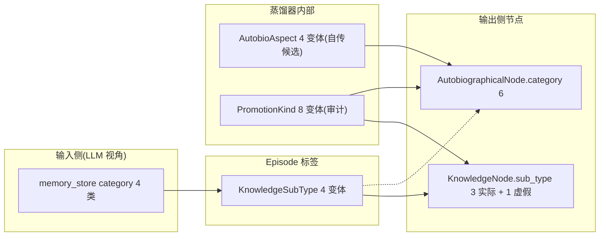

# 34. 沉淀层分类机制分析：数据流、冗余点与化繁为简空间

**日期**: 2026-09-09
**范围**: `acowork-grafeo` / `acowork-memory` 的沉淀（semantic）层机制 —— 节点分类、EpisodicDistiller 晋升、检索消费
**对照文档**: [05-memory.md](../../design/zh/05-memory.md)、[ADR-068](../../adr/zh/ADR-068-memory-layer-promotion-two-axis-orthogonal.md)、[ADR-071](../../adr/zh/ADR-071-distiller-runtime-config-and-trigger.md)
**方法**: 代码事实（文件:行号）为主，设计与 ADR 仅作意图对照；区分"事实"与"判断"。

---

## 0. 摘要

**事实**：经过 ADR-068/071 重构后，沉淀层的**产出机制是收敛且干净的** —— 单一生产者（EpisodicDistiller）、完整证据链（`source_episode_ids` + `promotion_metadata`）、LLM 写入端只碰 Episodic。这一点没有化繁为简的必要。

**判断**：琐碎感主要来自**分类的类型体系**，而非处理机制。当前把三个正交维度（认知类别 / 知识主体 / 生命周期优先级）投影进了同一批"节点类型 + 子类字段"，导致同一语义在多套枚举中重复出现：

- **输入分类** `KnowledgeSubType` 4 变体（含 Procedure）
- **输出节点子类** `KnowledgeNode.sub_type`（同一枚举，但 Procedure 实际永不产出）
- **自传体槽位** `AutobioCategory` 6 变体（其中 Preference/Relationship 与知识节点语义重叠）
- **蒸馏器内部镜像** `AutobioAspect`（4）与 `PromotionKind`（8）

而**运行时真正消费的分类只有两层**：label 层（4 个：检索、生命周期、注入分组、激活计数）与 autobio 内部两档（core/contextual）。`sub_type` / `category` 在检索与注入路径上几乎不被读取（仅管理面板筛选与审计使用）。分类深度超过运行时收益，是"过于琐碎"的直接来源。

存在明确的三档化繁为简空间：**A 类型诚实化（低风险小改动）→ B 主体轴显式化（中等，需一次 ADR 级决策）→ C 节点归一（激进重写，不建议现在做）**。详见 §4。

---

## 1. 节点类型与分类全景

### 1.1 五类存储节点（按 Grafeo Label）

| Label | Schema 形态 | 子分类字段 | 遗忘/生命周期 | 产出者 | 消费 |
|---|---|---|---|---|---|
| `Episodic` | `content` 自然语言 | `knowledge_subtype`（4 类，写入门控） | 时间衰减（默认 14 天半衰期，`apply_retrieval_decay` 仅作用于本层） | `memory_store` 工具 / compaction 蒸馏 / admin API | 统一混合检索；晋升候选池 |
| `Knowledge` | `(subject, predicate, object)` 三元组 | `sub_type`：Fact / Preference / Relation（**Procedure 实际不产出**，见 S1） | 不衰减 | EpisodicDistiller / admin API | 统一混合检索 |
| `Procedural` | `(trigger_condition, action_pattern)` | 无 | 不衰减；检索命中时 `activation_count+1` | EpisodicDistiller（`write_procedural_node`） | 统一混合检索 + 激活计数 |
| `Autobiographical` | `(category, key, value)` | `category`：Identity / Capability / Limitation / Preference / History / Relationship | 强制 Active（每次 store 覆盖为 Active，见 `semantic/autobiographical.rs`） | manifest bootstrap（Identity/Capability）；EpisodicDistiller（Limitation/Preference/Relationship/History + 30 天规则） | 统一混合检索；注入按 core/contextual 两档预算 |
| `SkillDraft/Iteration/...` | （Skill 体系，不属本文范围） | — | — | — | — |

> 关键事实：`Episode.knowledge_subtype` 是**输入侧路由标签**（ADR-068 R2），`KnowledgeNode.sub_type` / `AutobiographicalNode.category` 是**输出侧属性**。现状两者共用 `KnowledgeSubType` 同一枚举（输入即输出投影），是第 3 节冗余的根源之一。

### 1.2 分类枚举盘点（代码事实）

| 枚举/常量 | 变体数 | 定义位置 | 运行时消费 |
|---|---|---|---|
| `KnowledgeSubType` | 4（Fact/Preference/Relation/Procedure） | [types.rs:280](../../../core/acowork-memory/src/types.rs) | 蒸馏聚簇分桶、证据门槛、写节点路由 |
| `AutobioCategory` | 6 | 同上 :346 | 存储、注入分组（间接）、面板筛选 |
| `AutobioAspect` | 4（Limitation/Preference/Relationship/History） | consolidation.rs:470 | 仅蒸馏器内部（自传候选聚簇） |
| `PromotionKind` | 8（Fact/Preference/Relation/Procedure/Autobio×4） | consolidation.rs:555 | 审计计数（`apply_evaluation`） |
| `ContextSource` | 7 | types.rs:602 | **无生产读取方**（见 S7） |
| `ResultSource` | 2 | types.rs:593 | 无生产读取方（同上） |
| `KnowledgeSubType::Procedure` | — | — | 见 S1：写入端标签 ≠ 输出端节点子类 |

---

## 2. 数据流入 / 产出关系

### 2.1 全链路数据流

### 2.2 晋升路径 × 输入 → 输出 映射（Step 3/4/5 代码事实，[distiller.rs](../../../core/acowork-grafeo/src/consolidation/distiller.rs)）

| 输入 | 聚簇键 | 证据门槛 | 写函数 | 输出节点 |
|---|---|---|---|---|
| Episode 标签 Fact + 抽取三元组 | 三元组文本 | `fact_min_evidence=2` | `write_knowledge_node` | `KnowledgeNode{sub_type=Fact}` |
| Episode 标签 Preference + 三元组 | 同上 | `preference_min_evidence=3` | 同上 | `KnowledgeNode{sub_type=Preference}` |
| Episode 标签 Relation + 三元组 | 同上 | `relation_min_evidence=2` | 同上 | `KnowledgeNode{sub_type=Relation}` |
| Episode 标签 Procedure（或抽取为过程） | trigger/action | `procedure_min_evidence=5` | `write_procedural_node` | `ProceduralNode` |
| 服务端 LLM 识别 `autobio_candidate{aspect=Limitation/Preference/Relationship}`（与标签正交） | aspect+key_hint 相似度 | `autobio_min_evidence=3` + 跨度 ≥14 天 | `write_autobio_node` | `AutobiographicalNode{category=aspect}` |
| `HistoryMilestoneEvent`（运行时事件） | 无（幂等 key `milestone_<slug>`） | 无 | `promote_event` | `AutobiographicalNode{category=History}` |
| `collaboration_span` 统计 ≥30 天 | 无（幂等） | 规则 | `promote_autobio_relationship` | `AutobiographicalNode{category=Relationship, key=collaboration_span}` |
| agent manifest | 无 | 无 | bootstrap | `AutobiographicalNode{Identity/Capability}` |

**产出侧一句话概括**：沉淀层 = 三元组知识（F/P/R）+ 行为过程（Procedure）+ 自我画像（6 槽），外加"标签 → 输出子类"的一一对应。问题不在这些路径本身，而在 §3 的投影方式。

### 2.3 分类投影现状（冗余可视化）

---

## 3. 问题清单

### S1 —— `KnowledgeSubType::Procedure` 是"输入标签"却挂在"输出子类"枚举里（类型撒谎）

- **事实**：`KnowledgeNode` 结构文档自述"fact, preference, or relation"（types.rs:442）；蒸馏写路径在 [distiller.rs:804](../../../core/acowork-grafeo/src/consolidation/distiller.rs) 处显式分支：`cluster.subtype == Procedure` 走 `write_procedural_node`，否则走 `write_knowledge_node`。也就是说**没有任何生产路径产出 `KnowledgeNode{sub_type=Procedure}`**——Procedure 只作为 Episodic 输入标签与聚簇桶存在，落库节点是独立 `ProceduralNode`。
- **证据**：`write_knowledge_node`（distiller.rs:1103）的调用点只有 :807（非 Procedure 分支）；`KnowledgeSubType::Procedure` 在生产代码中全部用于输入侧路由/门槛/阈值（distiller.rs:657/742/751、memory_store.rs:129、instant.rs:191）。
- **影响**：枚举面上多了一个"可能存在的输出"，导致所有 `match KnowledgeSubType` 的代码（门槛、PromotionKind、阈值、admin 筛选、导出）都要为不可能出现的组合写分支；schema 文档（`sub_type` 4 值）与真实数据（3 值）不一致。纯成本，无收益。

### S2 —— "偏好 / 关系"语义在 5 处重复表达，靠手工同步

- **事实**：agent 自身偏好这一概念，在代码里需要同时维护 5 处投影：`KnowledgeSubType::Preference`（用户偏好标签）、`AutobioCategory::Preference`（自传体偏好槽）、`AutobioAspect::Preference`（蒸馏器候选）、`PromotionKind::AutobioPreference`（审计）、prompt 文本（extraction prompt 中 limitation/preference/relationship/history）。Relation(ship) 同理。
- **证据**：AutobioAspect 文档自承是"AutobioCategory 的子集"（consolidation.rs:470）；`write_autobio_node` 需要一段 `aspect → category` 的重复 match（distiller.rs:1198）；`PromotionKind` 把两类节点的变体**扁平枚举在一起**（8 变体），后续任何一方增删都要连带。
- **影响**：新增/调整一个分类需要 5~6 处 match 同步修改，漏改一处即静默错位（例如 S5 暴露的注入分组错位）。这类"镜像枚举"是维护成本与 bug 温床。

### S3 —— "知识主体轴"被编码进节点类型，而非数据属性

- **事实**：一条知识到底是"关于用户/外部世界"还是"关于 agent 自身"，现状由**落库节点类型**决定：前者进 `Knowledge`，后者进 `Autobiographical`。这迫使 Preference/Relation 在两个节点族里各有一份（S2），而 Fact/Procedure 又只有知识侧形态——"agent 能力事实"只能进 `AutobioCapability/Limitation`，没有 `Knowledge{subject=agent}` 的等价表达。
- **判断**：主体（subject/owner）本应是知识的一等维度（KnowledgeNode 已有 `subject` 字段），当前却与"生命周期/注入优先级"（label 层承担）耦合在一起，造成两套语义争用同一把"分类钥匙"。

### S4 —— 检索消费端几乎不读 `sub_type` / `category`，分类深度 > 运行时收益

- **事实**：
  - 检索：`MemoryManager::retrieve`（manager.rs:292）对全部 4 个 label 用同一查询做混合检索（G10 决策，`search_labels` 全量），不做子类路由；
  - 注入：`inject`（manager.rs:653）只按 label 分三档，Knowledge/Procedural/Episodic 完全同权，`[Knowledge]` 内容 = `subject predicate object`（**不含 sub_type**，types.rs:520）；
  - `MemoryFilters`（types.rs:173）没有子类过滤字段；`sub_type`/`category` 的生产读取方只有 admin 列表筛选（admin_impl.rs:180）与导出/统计。
- **影响**：一套 4+6 的分类枚举，运行时只服务于"面板二级筛选与离线统计"（design §8.1.1 自述）。不是说要删掉分类，而是**分类不该承担"决定节点 schema/生命周期"的职责**——那是它现在显得琐碎的主因。

### S5 —— autobio Preference/Relationship 被注入逻辑错误归入 "contextual" 档

- **事实**：`autobio_subcategory`（manager.rs:1020）按 **content 字符串前缀**解析分类：`Identity|Capability|Limitation → Core`（必注入档，100 token），`History|Relationship|Preference → contextual`（100 token 档）。即"agent 风格偏好"与"协作关系"这类**自我概念**被注入预算视为可裁剪的历史性上下文，与 design §3.3"Identity/Capability/Limitation 必注入"的意图相悖。
- **附加事实**：分组依赖 content 前缀 `"Preference: key: value"` 这种**字符串软编码**（provider_impl.rs:624 的 `get_node_content` 负责拼前缀），category 枚举若改序列化格式，此处分组会静默失效。
- **判断**：这是 S2/S3 分类投影不一致的直接症状——若 Preference 只存在一处且语义明确（"用户偏好"进 Knowledge、"agent 风格偏好"属自我概念），此错位不会发生。

### S6 —— 自传体判定依赖单次 LLM 抽取，边界模糊可能造成同一 Episode 双聚簇

- **事实**：Step 2a 服务端 LLM 对同一 episode 输出**两个独立字段**：`structure`（triple/procedure）与 `autobio_candidate`（aspect）。`cluster_candidates`（distiller.rs:581）允许同一 episode 同时进入 knowledge 聚簇（有 triple 时）**和** autobio 聚簇（有 candidate 时）。
- **风险**：`"you're too verbose"`（agent 风格）理论上可被抽取为 triple（subject=agent, predicate=prefers...）+ autobio candidate → 两边各聚一簇 → 同一证据被两条路径消费。抽取 prompt 靠语义描述（"about the agent → candidate; about the user → null"）约束，无结构性保证。
- **判断**：当前证据看更可能是低概率边界而非已现 bug（S5 的分档错误比它更实际），但它是"同一语义两个载体"的设计级缺口。

### S7 —— 半死类型与常量残留

- **事实**：
  - `ContextSource`（7 变体：Autobiographical/SemanticCore/Procedural/UserPreference/FailureLesson/GraphExpansion/Episodic）与 `MemoryContext{priority}` 定义于 types.rs:602/640，**全库无生产读取方**（仅 `SearchResult.source` 字段声明引用）；它们是旧"认知优先级注入"设计的遗留；
  - `conflict.rs` 的四类阈值（FACT/PREFERENCE/RELATION/PROCEDURE_THRESHOLD）与 `instant.rs` 的 `is_duplicate_knowledge` / `detect_knowledge_conflicts`：生产调用者已随 ADR-068 直写沉淀层管道删除而消失，仅剩测试引用（instant.rs:309/324/345/399）。ambiguous 确认流 `should_trigger_confirmation` 依赖的"pending 冲突"**已无生产者**，实际恒空。
- **影响**：这些残留让"沉淀层有多少分类"的账面数字虚高（7+2 个死变体），是"过于琐碎"感知的一部分。

### S8 —— 规则化特例路径与 episode 聚簇晋升并存

- **事实**：`Autobiographical{Relationship}` 有两条产出形态：episode 聚簇（aspect=Relationship，证据门槛 + LLM Judge）与 30 天规则幂等节点（`promote_autobio_relationship`，无 episode 输入、无 judge）；`History` 则完全走事件路径（`promote_event`）。规则路径产出的节点 `source_episode_ids` 为空，靠 `promotion_metadata` 记录统计来源（span、里程碑 key）。
- **判断**：这不是错误——ADR-068 revision 明确保留"事件/时间门槛"类规则用途（History milestone、30 天协作）。但要注意：**同一 category 两个生产者两种输入形态**意味着 category 不携带"证据形态"信息，审计/UI 需要额外区分。保留可接受，若追求极简可并入统一事件输入面（见方向 B）。

---

## 4. 化繁为简空间

### 4.1 必须保留的不变量（化繁为简的约束）

1. **单生产者**：沉淀层只由 EpisodicDistiller（+ manifest/event 两种特权源）产出，证据链完整；
2. **4-label 统一混合检索**（G10）与生命周期差异（episodic 衰减、semantic 不衰减、autobio 强制 Active）；
3. **注入三档预算**机制（core 必注入 / contextual / 其他）；
4. **LLM 工具界面 4 类 + 无 autobio 概念**（ADR-068 R5，零学习成本）；
5. `memory_store` 的 `category` 仍是**质量门控**（R2：无标签不晋升），不能简单删掉。

### 4.2 方向 A —— 类型诚实化（低风险，可立即做）

- 把"输入分类"与"输出子类"拆成两个枚举：`MemoryCategory {Fact, Preference, Relation, Procedure}`（Episode 标签/工具界面专用）与 `KnowledgeKind {Fact, Preference, Relation}`（KnowledgeNode 输出专用，删除 Procedure 变体与其全部不可能分支）；
- 删除死类型/常量：`ContextSource`、`MemoryContext`、`ResultSource`、`conflict.rs` 阈值与无生产调用者的 instant 辅助函数（先清理调用面）；
- 文档对齐：`sub_type` 枚举注释、ADR-068 §8.1.1 表述与代码一致化（design 说"sub_type 是蒸馏结论"，代码实际是"写入门控标签直通"，见 S1）。
- **成本/风险**：中低；涉及枚举改名的全仓匹配（12 处 Procedure 引用、53 处 category match 中一部分），无数据迁移（图内已无 Procedure 子类数据或仅需清洗 admin 写入的个例）。

### 4.3 方向 B —— 主体轴显式化（中等，推荐做一次 ADR 级设计）

核心思路：把"关于 agent 自身"从**节点类型投影**改为**数据属性**（`subject=self` 或独立 `self: bool` 标志），让 label 回归其本分——**生命周期/注入优先级的载体**。

- `AutobiographicalNode` 保留为自我画像槽：`Identity / Capability / Limitation / History`（+ 里程碑/协作这类"关系历史"槽，如需）；
- agent 风格偏好、agent-用户协作关系不再需要独立 `Autobio{Preference/Relationship}` 槽位，从 episode 蒸馏时落为 `KnowledgeNode{subject=self/agent, ...}`（或 Knowledge 子记录 + 指向自传画像的边），消除 S2/S3/S5/S6 的全部重复；
- 注入优先级改为按 `subject=self`（或 label+subject 组合）判定，而非解析 content 字符串前缀（S5 的软编码同时消失）；
- Relationship 30 天规则与 History milestone 统一进"事件面"（`promote_event`），去掉 `promote_autobio_relationship` 特例（S8）。
- **成本/风险**：高一些。涉及：分类 enum 收敛（6→4 自传槽）、蒸馏器 4 个 autobio 子函数改造、注入分组逻辑重写、检索/面板口径调整、存量 autobio Preference/Relationship 数据的迁移或兼容读取。**收益**：分类枚举从"3 套投影 + 2 套镜像"收敛到"1 套内容分类 + 1 套画像槽"，运行时决策口径与类型系统一致。

### 4.4 方向 C —— 节点归一（激进，不建议现在做）

所有沉淀知识归一为单一节点（triple schema + role 属性），Procedure 只是"谓词为行为规则"的记录，autobio 只是 `subject=self` 的视图。需要重写生命周期（4-label 差异目前靠 label 实现）、注入优先级、衰减机制，风险远大于收益，且当前机制刚经历 ADR-068/071 收敛、质量基线已建立——**不建议**。

### 4.5 推荐路径与开放问题

**推荐**：先做 A（纯收益、无风险、立即降低"琐碎感"的账面复杂度），同时把 B 作为下一个 ADR 议题评估；C 搁置。

落地 B 之前需要你拍板的开放问题：

| # | 问题 | 现状 | 备选 |
|---|---|---|---|
| Q1 | agent 风格偏好是否应"必注入"（Core 档）？ | contextual 档（S5） | 移入 Core 档 / 保持 contextual / 按 key 白名单 |
| Q2 | History 里程碑是否保留"无 episode 输入"的事件形态？ | 事件直写 | 改为"先写 Episode(标签 history) 再蒸馏"（丧失实时性）/ 保留现状 |
| Q3 | 30 天协作规则是否保留独立统计路径？ | `collaboration_span` 规则 | 并入 `promote_event` 事件面 / 保留 |
| Q4 | `sub_type`/`category` 二级筛选（面板）是否仍要保留？ | 仅 admin 消费 | 保留（枚举收敛后成本已低）/ 随方向 B 改为按 subject 过滤 |

---

## 5. 附录：证据索引

| 论断 | 证据 |
|---|---|
| 单一生产者 / 两轴正交 | [distiller.rs 头注](../../../core/acowork-grafeo/src/consolidation/distiller.rs)、ADR-068 R1–R5 |
| `KnowledgeNode` 自述 F/P/R | [types.rs:442](../../../core/acowork-memory/src/types.rs) |
| Procedure 路由到 ProceduralNode | [distiller.rs:804](../../../core/acowork-grafeo/src/consolidation/distiller.rs) |
| `write_knowledge_node` 不处理 Procedure | [distiller.rs:1103](../../../core/acowork-grafeo/src/consolidation/distiller.rs) |
| `AutobioAspect` 是 `AutobioCategory` 子集 | [consolidation.rs:470](../../../core/acowork-memory/src/consolidation.rs) |
| aspect→category 重复 match | [distiller.rs:1198](../../../core/acowork-grafeo/src/consolidation/distiller.rs) |
| 4-label 统一检索（G10） | [manager.rs:355](../../../core/acowork-memory/src/manager.rs) |
| 注入三档 / autobio 分组 | [manager.rs:653, 1020](../../../core/acowork-memory/src/manager.rs) |
| autobio content 前缀软编码 | [provider_impl.rs:624](../../../core/acowork-grafeo/src/provider_impl.rs) |
| episodic-only 时间衰减 | [manager.rs:934](../../../core/acowork-memory/src/manager.rs) |
| `ContextSource`/`MemoryContext` 无读取方 | [types.rs:602/640](../../../core/acowork-memory/src/types.rs) |
| conflict 阈值/instant 辅助仅测试引用 | [instant.rs:309..399](../../../core/acowork-grafeo/src/consolidation/instant.rs) |
| 30 天规则 + 事件路径 | [distiller.rs:83, 160](../../../core/acowork-grafeo/src/consolidation/distiller.rs) |
| 记忆写入入口收敛 | [memory-write-entrypoints.md](../../memory-write-entrypoints.md) |

> 注：本文为分析报告，未改动任何代码。方向 A/B 的实施需你确认后再立项（含测试与迁移方案）。
