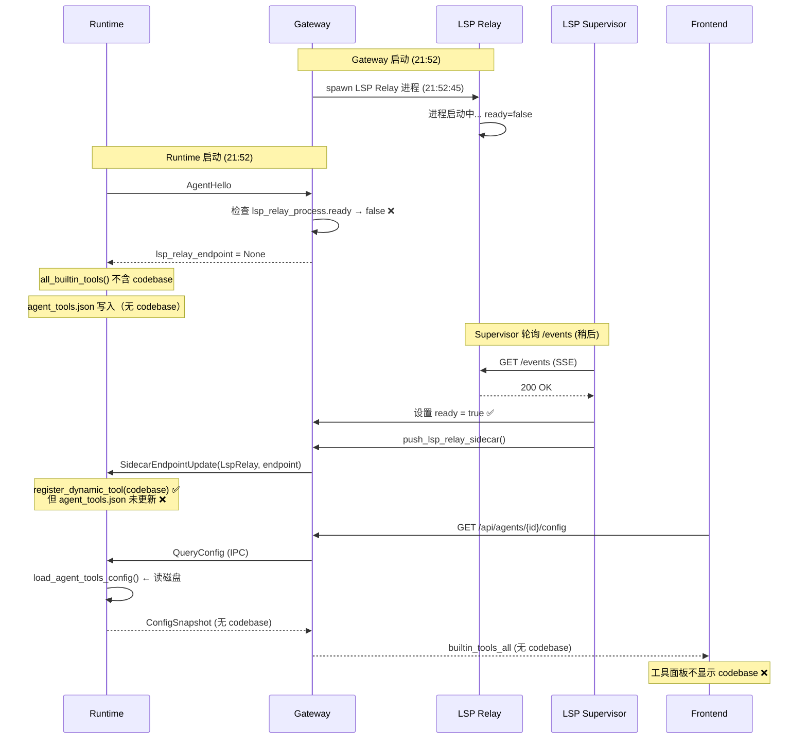

# 调查报告：工具面板不显示 codebase 工具

**日期**: 2026-07-09  
**调查人**: Senior Engineer Agent  
**状态**: 根因已确认

---

## 问题描述

右侧工具面板（ToolsTab）不显示 `codebase` 工具。用户怀疑 LSP 初始化状态影响了 codebase 工具注册。

## 结论

**是的，LSP 初始化状态确实影响了 codebase 工具注册。** 根因是 **LSP Relay ready 时序竞态 + 动态工具注册的持久化缺口** 的组合问题。

---

## 根因分析

### 1. 时序竞态：AgentHello 早于 LSP Relay ready



### 2. 关键代码路径

#### 2.1 Gateway: `lsp_relay_endpoint` 条件判断

**文件**: `core/acowork-gateway/src/ipc/server.rs:721-726`

```rust
// ── LSP Relay endpoint (from lsp_relay_process state) ──
let lsp_relay_endpoint = gw
    .lsp_relay_process
    .as_ref()
    .filter(|eps| eps.ready)    // ← 关键：ready=false 时返回 None
    .map(|eps| format!("http://127.0.0.1:{}", eps.port));
```

`ready` 标志仅在 Supervisor 成功连接 LSP Relay 的 `/events` SSE 端点后才设为 `true`（`lsp_relay_supervisor.rs:330-344`）。

#### 2.2 Runtime: 条件注册 codebase 工具

**文件**: `core/acowork-runtime/src/tools/builtin/mod.rs:140-145`

```rust
// Only register codebase when the LSP Relay is available.
if let Some(endpoint) = lsp_relay_endpoint {
    tools.push(Arc::new(codebase::CodebaseTool::new(endpoint)));
}
```

当 `lsp_relay_endpoint = None` 时，codebase 不在 `all_builtin_tools()` 返回列表中。

#### 2.3 Runtime: `agent_tools.json` 初始创建（无 codebase）

**文件**: `core/acowork-runtime/src/startup/agent_init.rs:349-383`

当 `agent_tools.json` 不存在时（首次创建），从 `code_tool_list` 生成初始配置：

```rust
Ok(None) => {
    let initial = if loaded.manifest.has_any_tool_declaration() {
        crate::agent_config::init_tools_config_from_manifest(
            &code_tool_list,  // ← 不含 codebase（LSP 未 ready）
            &manifest_tool_names,
        )
    } else {
        crate::agent_config::all_enabled_tools_config(
            &code_tool_list,  // ← 不含 codebase（LSP 未 ready）
        )
    };
    // Persist to disk ← 写入的文件不含 codebase
    save_agent_tools_config(work_path, ...);
}
```

#### 2.4 动态注册：仅内存，不持久化 ❌

**文件**: `core/acowork-runtime/src/cli.rs:2103-2127`

LSP Relay ready 后，Gateway 推送 `SidecarEndpointUpdate`，Runtime 动态注册 codebase：

```rust
SidecarKind::LspRelay => {
    if endpoint.is_empty() {
        session_manager.unregister_dynamic_tool("codebase");
    } else {
        let tool = Arc::new(CodebaseTool::new(endpoint.clone()));
        session_manager.register_dynamic_tool(
            tool, resolver.clone(), MAX_TOOL_CALLS_PER_MINUTE, true,
        );
        // ❌ 未调用 save_agent_tools_config() 更新磁盘文件
    }
}
```

`register_dynamic_tool`（`session_manager.rs:1265-1301`）仅：
- ✅ 存入 `dynamic_builtin_tools`（内存）
- ✅ 广播 `AddDynamicBuiltinTool` 给活跃 session
- ❌ **不写入 `agent_tools.json`**

#### 2.5 ConfigSnapshot: 从磁盘读取，非内存

**文件**: `core/acowork-runtime/src/cli.rs:702-707`

```rust
builtin_tools_all_json:
    crate::agent_config::load_agent_tools_config(
        std::path::Path::new(&work_dir),
    )
    .unwrap_or_default()
    .map(|cfg| serde_json::to_string(&cfg.tools).unwrap_or_default()),
// ← 从磁盘读取 agent_tools.json，不含动态注册的 codebase
```

#### 2.6 前端: 从 Gateway 获取工具列表

**文件**: `apps/acowork-desktop/src/components/results/ToolsTab.tsx:61-72`

```typescript
fetch(`${getGatewayUrl()}/api/agents/${selectedAgentId}/config`)
  .then((res) => res.json())
  .then((data) => {
    if (data.builtin_tools_all && Array.isArray(data.builtin_tools_all)) {
      setBuiltinToolsAll(data.builtin_tools_all as BuiltinToolEntry[]);
    }
  });
```

数据链路：`Frontend → Gateway (GET /api/agents/{id}/config) → Runtime (QueryConfig IPC) → ConfigSnapshot → load_agent_tools_config(磁盘)`

---

## 实证验证

### agent_tools.json 实际状态

| Agent | 修改时间 | 包含 codebase | enabled |
|-------|----------|:---:|:---:|
| com.acowork.document-manager | 2026-07-08 20:58:06 | ✅ | true |
| com.acowork.software-architect | 2026-07-08 20:57:59 | ✅ | true |
| com.acowork.quality-assurance | 2026-07-08 20:58:27 | ✅ | true |
| com.acowork.project-manager | 2026-07-08 20:58:12 | ✅ | true |
| com.acowork.product-manager | 2026-07-08 20:58:23 | ✅ | true |
| **com.acowork.senior-engineer** | **2026-07-08 21:53:16** | **❌** | - |
| **com.acowork.system** | **2026-07-07 22:49:15** | **❌** | - |

### 进程时序

| 事件 | 时间 |
|------|------|
| LSP Relay 进程启动 (PID 22204) | 21:52:45 |
| Gateway 启动 (PID 22185) | 21:52 |
| senior-engineer `agent_tools.json` 创建 | 21:53:16 |
| LSP Relay `/health` 响应 | ✅ ok (12 languages) |

**解释**：
- 5 个有 codebase 的 agent：其 `agent_tools.json` 在 **前一次** Gateway 会话（20:57-20:58）中创建，当时 LSP Relay 已 ready。当前会话中这些文件未被覆写（`Ok(Some)` 分支只 merge 不 save）。
- 2 个无 codebase 的 agent：
  - **senior-engineer**：文件在当前会话（21:53）首次创建，此时 LSP Relay 进程已启动但 **尚未 ready**（Supervisor 还没连上 `/events`）。
  - **system**：文件来自 7 月 7 日，早于 LSP Relay 功能上线。

### LSP Relay 当前状态

```
LSP Relay 进程: 运行中 (PID 22204)
/health 响应: {"status":"ok","version":"0.1.0","details":{"language_count":12}}
```

LSP Relay 完全正常，codebase 工具在 Runtime 内存中已动态注册（可用），但前端面板看不到。

---

## 问题总结

存在 **两个 Bug**：

### Bug 1: 动态工具注册不持久化

`SidecarEndpointUpdate` 处理器调用 `register_dynamic_tool()` 后，不更新 `agent_tools.json` 磁盘文件。导致动态注册的工具对 ConfigSnapshot 查询不可见。

**影响**：任何通过 `SidecarEndpointUpdate` 动态注册的工具（当前只有 codebase）都不会出现在前端工具面板。

### Bug 2: ConfigSnapshot 仅读磁盘，不合并内存

`cli.rs:702-707` 构建 `builtin_tools_all_json` 时只调用 `load_agent_tools_config()`（磁盘读取），不合并 `session_manager.dynamic_builtin_tools`（内存中的动态工具）。

**影响**：即使动态工具在内存中可用，ConfigSnapshot 也无法反映它们。

### 次要问题：`merge_tools_config` 会静默丢弃工具

当 `agent_tools.json` 存在但 codebase 不在 `code_tool_list` 中时（`agent_init.rs:356`），`merge_tools_config` 以 `code_tool_list` 为基准生成结果，codebase 会被静默丢弃。虽然此分支不覆写磁盘文件，但内存中的工具列表会丢失 codebase。

---

## 修复建议

### 方案 A（推荐）：动态注册时同步持久化 `agent_tools.json`

在 `cli.rs` 的 `SidecarEndpointUpdate::LspRelay` 处理器中，`register_dynamic_tool` / `unregister_dynamic_tool` 之后，同步更新磁盘文件：

```rust
SidecarKind::LspRelay => {
    if endpoint.is_empty() {
        session_manager.unregister_dynamic_tool("codebase");
        // 新增：从 agent_tools.json 移除 codebase
        remove_tool_from_agent_tools_json(&work_dir, "codebase");
    } else {
        let tool = Arc::new(CodebaseTool::new(endpoint.clone()));
        session_manager.register_dynamic_tool(
            tool, resolver.clone(), MAX_TOOL_CALLS_PER_MINUTE, true,
        );
        // 新增：将 codebase 加入 agent_tools.json
        add_tool_to_agent_tools_json(&work_dir, "codebase", true);
    }
}
```

**优点**：修复根因，确保磁盘与内存一致。  
**缺点**：需要在 `cli.rs` 中访问 `work_dir`（当前作用域已有）。

### 方案 B：ConfigSnapshot 合并内存动态工具

在 `cli.rs:702-707` 构建 `builtin_tools_all_json` 时，除了读磁盘，还合并 `session_manager.dynamic_builtin_tools`：

```rust
let mut all_tools = load_agent_tools_config(work_path)...;
// 合并动态注册的工具
for entry in session_manager.dynamic_builtin_tools {
    if !all_tools.iter().any(|t| t.name == entry.name()) {
        all_tools.push(AgentToolEntry::new(&entry.name(), entry.enabled));
    }
}
builtin_tools_all_json = serde_json::to_string(&all_tools);
```

**优点**：前端立即可见，不依赖磁盘 IO。  
**缺点**：ConfigSnapshot 构建器需要访问 `session_manager`（当前可能不在作用域内）。

### 方案 C（组合，最稳健）：A + B

同时实施方案 A 和 B，确保：
1. 动态注册时持久化到磁盘（一致性）
2. ConfigSnapshot 合并内存状态（即时性）

---

## 临时缓解措施

在修复部署前，重启 Runtime 进程即可让 codebase 出现在工具面板（前提是 LSP Relay 已 ready）：

```bash
# 重启 Runtime 后，AgentHello 时 LSP Relay 已 ready
# → lsp_relay_endpoint = Some(...)
# → all_builtin_tools() 包含 codebase
# → merge_tools_config() 将 codebase 加入 agent_tools.json (enabled=false)
# → 前端可见（但需手动 enable）
```

注意：重启后 codebase 会以 `enabled=false`（opt-in）出现，用户需在工具面板手动开启。

---

## 涉及文件清单

| 文件 | 行号 | 角色 |
|------|------|------|
| `core/acowork-gateway/src/ipc/server.rs` | 721-726 | Gateway: `lsp_relay_endpoint` 条件判断 |
| `core/acowork-gateway/src/lifecycle/lsp_relay_supervisor.rs` | 330-349 | Supervisor: ready 标志设置 + push |
| `core/acowork-gateway/src/lifecycle/lsp_relay_supervisor.rs` | 71-94 | `build_lsp_relay_sidecar_payload` + `push_lsp_relay_sidecar` |
| `core/acowork-gateway/src/ipc/global_push.rs` | 365-420 | `push_sidecar_endpoint` 实现 |
| `core/acowork-runtime/src/startup/agent_init.rs` | 301-303 | Runtime: 提取 `lsp_relay_endpoint` |
| `core/acowork-runtime/src/startup/agent_init.rs` | 311-323 | Runtime: 调用 `all_builtin_tools` |
| `core/acowork-runtime/src/startup/agent_init.rs` | 349-383 | Runtime: 创建 `agent_tools.json` |
| `core/acowork-runtime/src/tools/builtin/mod.rs` | 140-145 | 条件注册 codebase 工具 |
| `core/acowork-runtime/src/cli.rs` | 702-707 | ConfigSnapshot: 从磁盘读取 `builtin_tools_all` |
| `core/acowork-runtime/src/cli.rs` | 2090-2127 | SidecarEndpointUpdate 处理器 |
| `core/acowork-runtime/src/agent/session/session_manager.rs` | 1265-1301 | `register_dynamic_tool`（仅内存） |
| `core/acowork-runtime/src/agent/session/session_manager.rs` | 1304-1320 | `unregister_dynamic_tool`（仅内存） |
| `core/acowork-runtime/src/agent_config.rs` | 364-383 | `merge_tools_config`（以 code 为基准） |
| `apps/acowork-desktop/src/components/results/ToolsTab.tsx` | 61-72 | 前端: 获取 `builtin_tools_all` |
| `core/acowork-gateway/src/http/agents.rs` | 1870-1972 | Gateway: `GET /api/agents/{id}/config` 实现 |
