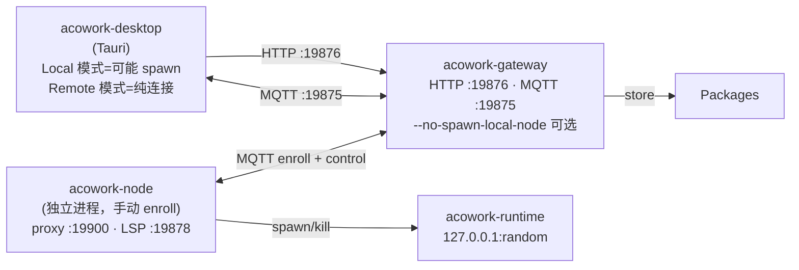

# 单机模拟 ACowork 远程部署 - Runbook

> 心智模型：**没有 local/remote 两套拓扑**。本机 = `127.0.0.1`，远程 = 局域网 IP，端口完全一样（HTTP :19876 / MQTT :19875 / Node 代理 :19900 / Node LSP :19878）。
> 区别仅在于 IP（loopback vs LAN）和 bind 地址（`127.0.0.1` vs `0.0.0.0`）。Gateway/Node/Runtime 一律用同一种方式启动（下文的命令即是）；「远程方式」三字仅指它们都**手动启动、不依赖 Desktop**。Desktop 的 Local 模式只是「在探测不到 Gateway 时替你 spawn」——见 §4.2。

---

## 0. 单一拓扑（本机和远程一样）



「三端各跑各的」原则（本模拟场景；Desktop Local 模式会自动 spawn，见 §4.2）：

| 端 | 谁启动 | bind | 默认端口 | 启动方式 |
|---|---|---|---|---|
| Gateway | 用户手启（前台或 daemon） | HTTP+MQTT 听 `0.0.0.0`（或本机 IP） | :19876 / :19875 | `--daemon` |
| Node | 用户手启（前台 daemon） | proxy 听 `0.0.0.0` | :19900 / :19878 | `start` |
| Desktop | `npm run tauri dev` | Tauri 内 | Local 或 Remote 模式 + URL（**Gateway 行为与配置一致**，见 §4.2） |

**模拟要点：Gateway 与 Node 都手动启动**。Gateway 默认会 spawn 一个以本机机器名命名的 Node Agent（如 `nytb`，ADR-055 §6.11），本模拟要单独起 Node，用 `--no-spawn-local-node` 关掉（见 §2）。Desktop 不 spawn（选 Remote）或 probe-then-spawn（选 Local，见 §4.2）——但不管哪种，**下面 Gateway/Node 的命令完全一样**。

---

## 1. 端口和 IP 全图（所有模式都一样）

```
┌───────────────────────────────────────────────────────────────┐
│ 服务           bind 默认    端口    谁能连                       │
├───────────────────────────────────────────────────────────────┤
│ Gateway HTTP   0.0.0.0      19876    Desktop, Node (拉包)       │
│ Gateway MQTT   0.0.0.0      19875    Desktop, Node, Runtime    │
│ Node  proxy    0.0.0.0      19900    Desktop → /agents/{id}/*   │
│ Node  LSP      127.0.0.1    19878    Runtime（同机 loopback）   │
└───────────────────────────────────────────────────────────────┘
```

> 唯一不同的是 IP：单机回环用 `127.0.0.1`，多机用 LAN IP（如 `192.168.1.20`）。**URL 模式完全一致**——只是 host 部分不同。

---

## 2. 控制 Gateway 是否自动 spawn local node

Gateway 默认 `--daemon` 启动会按 ADR-055 §6.11 自动 spawn 一个 Node Agent（名字 = 本机机器名 slug，如 `nytb`；占 `:19900`/`:19878`）。**单实例调试 / 容器 / 多节点验证等场景需要关掉**，三种方式等价：

| 层 | 写法 | 默认 |
|---|---|---|
| CLI flag | `--no-spawn-local-node` | 不设 = spawn |
| 环境变量 | `ACOWORK_GATEWAY_NO_SPAWN_LOCAL_NODE=1` | unset = spawn |
| TOML | `[local_node] enabled = false` | `enabled = true` |

优先级：CLI > env > TOML > default。

> 500ms reuse window（`gateway/node_manager.rs`）保留——如果外部已经启动了一个同名（机器名）Node，Gateway 会优先复用而不 spawn；该行为与 flag 无关，是分布式拓扑的逃生通道。Gateway spawn 的子进程带内部标记 `--gateway-managed`（仅用于孤儿清理识别自身子进程），因此即使名字一样，也绝不会误杀用户手动起的 Node。

> 旧版本「靠 binary 不存在来隐式 disable」已经被删除。如果 `acowork-node.exe` 不在同级目录，**会报错**而不是悄悄跳过——这是有意为之，build 问题不该被静默吞掉。

---

## 3. 完整启动流程

### 3.1 启动 Gateway

**方式 A：一条命令（推荐）**——HTTP/MQTT 的 `ip:port` 与工作目录全部走 CLI，不传即默认
（`127.0.0.1:19876` / `127.0.0.1:19875` / 默认工作目录）：

```bash
# PowerShell
# --addr / --mqtt-addr 为监听 ip:port（可选，默认 127.0.0.1:19876 / 127.0.0.1:19875）
# --advertise-host 对外广播 IP（跨机必需；单机回环可省）
# --work-dir = --home 别名（可选，缺省=默认工作目录）
.\core\target\release\acowork-gateway.exe `
    --addr              0.0.0.0:19876 `
    --mqtt-addr         0.0.0.0:19875 `
    --advertise-host    192.168.1.20 `
    --work-dir          D:\tmp\acowork-sim\gateway `
    --no-spawn-local-node   # 单机模拟：手动起 Node，禁止自动 spawn local
```

**方式 B：环境变量 + 默认 bind**（bind 只能靠 CLI/TOML；env 只改端口）：

```bash
# PowerShell
$env:ACOWORK_HOME = "D:\tmp\acowork-sim\gateway"     # 隔离数据目录
$env:ACOWORK_GATEWAY_ADVERTISE_HOST = "192.168.1.20" # 单机回环也填 127.0.0.1
$env:ACOWORK_NODE_HOME = "D:\tmp\acowork-sim\node-1" # packages_dir 默认 <ACOWORK_NODE_HOME>/packages
$env:ACOWORK_GATEWAY_NO_SPAWN_LOCAL_NODE = "1"       # 单机模拟：禁止自动 spawn local

.\core\target\release\acowork-gateway.exe --daemon
```

优先级：`--addr/--mqtt-addr`（CLI）> `ACOWORK_GATEWAY_HTTP_PORT/MQTT_PORT`（env）> TOML > 默认。

启动日志预期：

```
MQTT broker started     addr=0.0.0.0:19875
HTTP server listening   addr=0.0.0.0:19876
Local node agent disabled by [local_node] enabled=false
  (or --no-spawn-local-node); relying on externally-started nodes
advertise_host          192.168.1.20
packages_dir            D:\tmp\acowork-sim\node-1\packages
```

`packages_dir` 默认指向 `ACOWORK_NODE_HOME/packages`，所以 Gateway、local Node（spawn 模式）、standalone Node 三者看到的是同一个目录。

健康检查：

```bash
curl http://127.0.0.1:19876/health          # OK
curl http://192.168.1.20:19876/health        # LAN IP 也 OK（因为绑了 0.0.0.0）
```

### 3.2 bind 改 0.0.0.0（任选其一）

**A. CLI（最高优先级，一条命令搞定）**：`--addr 0.0.0.0:19876 --mqtt-addr 0.0.0.0:19875`（见 §3.1 方式 A）。

**B. 配置文件** `<ACOWORK_HOME>\config\gateway.toml`：

```toml
advertise_host = "192.168.1.20"   # 本机 IP；单机回环用 "127.0.0.1"

[http]
host = "0.0.0.0"
port    = 19876

[mqtt]
host = "0.0.0.0"
port    = 19875

# ── 可选：对端 IP 白名单（安全兜底，改动 6）──────────────────────
# 空 = 全部放行（默认）；非空 = 仅列表内 IP/CIDR 可连（HTTP 与 MQTT 都拦）。
# 127.0.0.1 / ::1 恒放行；仅启动时读取，Desktop 无法修改（安全兜底）。
# [security]
# allowed_node_ips = ["192.168.1.20", "192.168.1.0/24", "fd00::/64"]
```

**C. 环境变量**（覆盖 file，但 bind 需要 file/CLI 配，env 只能改端口）：

```powershell
$env:ACOWORK_GATEWAY_HTTP_PORT = "19876"
$env:ACOWORK_GATEWAY_MQTT_PORT = "19875"
$env:ACOWORK_GATEWAY_ADVERTISE_HOST = "192.168.1.20"
$env:ACOWORK_GATEWAY_ALLOWED_NODE_IPS = "192.168.1.20,192.168.1.0/24"   # 可选：白名单（逗号分隔）
```

> bind 地址可以走 CLI `--addr/--mqtt-addr`（含 host+port）或 TOML；env 只能覆盖端口。都不配则听 `127.0.0.1` 默认。
>
> **白名单行为**：配了非空 `allowed_node_ips` 后，HTTP（含 `/health`）对非白名单 IP 回
> `403 Forbidden`（JSON `{"error":"forbidden",...}`），MQTT 对非白名单 IP 直接断 TCP（rumqttd
> 0.20 的 auth handler 拿不到对端 IP，只能 TCP 层 pre-filter）。模拟「远程节点接入」时若
> Gateway 与 Node 不同机，记得把 Node 机器 IP 加进去——见 §7 排查表。

### 3.3 启动 Node（手动 enroll 到 Gateway）

```bash
# PowerShell
# --gateway 必填：Gateway MQTT 的 ip:port
# --addr 可选：本节点对外 ip:port（advertise+proxy），缺省=本机 IP:19900
# --work-dir = --home 别名（可选，缺省=$HOME/.acowork/acowork-node）
.\core\target\node\release\acowork-node.exe start `
    --gateway          192.168.1.20:19875 `
    --name             sim-node-1 `
    --addr             192.168.1.20:19900 `
    --work-dir         D:\tmp\acowork-sim\node-1 `
    --lsp-relay-port   19878
```

启动日志预期：

```
enrolling node 'sim-node-1' against gateway 192.168.1.20:19875
enrollment accepted, node_id = sim-node-1
node proxy listening on 0.0.0.0:19900
MQTT connected, subscribing acowork/nodes/sim-node-1/#
```

> **关键：这次没有端口冲突**。`19900` 和 `19878` 是默认 canonical 端口，可以直接用，不需要像 v1 那样改 `:19901`/`:19879`。

> **移动机器（笔记本 / 常换热点）**：把 `--addr 192.168.1.20:19900` 换成 `--addr auto`。Node 会在
> 每次 MQTT ConnAck 和 60s 心跳时重检本机当前 LAN IP，地址变化时自动重发 NodeInfo——控制面
> （fs_browse / 包管理 / install / LSP）与已运行 Runtime 的可达性都无需重启即自愈（ADR-055 §6.3.3）。
> 固定部署的服务器节点保持显式 `--addr HOST:PORT` 即可（地址稳定，不做无谓重检）。

验证：

```bash
.\core\target\gw\release\acowork-gateway.exe nodes list

# 期望：
# NODE ID       STATUS     ADVERTISE         PROXY         LSP
# sim-node-1    connected  192.168.1.20      :19900        :19878
#
# 注意：只有 sim-node-1，没有额外 spawn 的本机节点 ← 这是这次的核心成果
# （若未传 --no-spawn-local-node，会多一个以机器名命名的本机节点，如 nytb）
```

---

## 4. 启动 Desktop App（Remote 模式连本机/远程 Gateway）

### 4.1 构建+启动

```bash
cd D:\projects\tranxon\ACoworkDev\apps\acowork-desktop
npm install                    # 仅首次
npm run core:build:debug       # 把 gateway/runtime 等拷到 src-tauri/bin/
npm run tauri dev              # 启动 Tauri 窗口
```

> `core:build:debug` 会从 `core\target\debug\release\` 拷 binary 到 `apps\acowork-desktop\src-tauri\bin\`。如果你用的方法 A 分目录的，需要把 gateway 从 `gw/release/` 拷过去。

### 4.2 Desktop 模式语义：本地 vs 远程 = 同一套 Gateway 拓扑

**Gateway/Node/Runtime 没有 local/remote 之分**——两种模式下它们的命令行、配置、端口、bind
地址完全一致。`local/remote` 只是 Desktop App 内部的概念，唯一差别是：

| | 本地模式（Local） | 远程模式（Remote） |
|---|---|---|
| Desktop 启动时 | **probe-then-spawn**：先探测 `{url}/health`，没响应才 spawn Gateway 子进程（ownership = `owned`） | **不 spawn**：假定你已手动启动 Gateway（ownership = `foreign`） |
| URL | 默认 `http://127.0.0.1:19876`，可改成任何地址（含本机 LAN IP） | 手动填，本机 IP / 局域网 IP 均可 |
| Desktop spawn 的 Gateway | **loopback-only**：强制 `--addr 127.0.0.1:19876 --mqtt-addr 127.0.0.1:19875`（CLI > TOML），不随配置文件/环境变量变成 0.0.0.0；其 spawn 的 local node 也恒连 `127.0.0.1`（ADR-055 §6.3.3 #4）——local 链路免疫换网换 IP。**local 只服务本机**，外部 Node 连不上本机 spawn 的 Gateway（符合 local 语义）；要接远程 Node 请用远程模式 | 不 spawn，bind 由你的 `gateway.toml` / 启动参数决定（跨机需 `0.0.0.0`） |
| Gateway 配置文件 | 同一个 `gateway.toml` | 同一个 `gateway.toml` |
| Desktop 退出 | 弹出三选项（见 §4.2.2） | 直接退出，绝不 kill 远程 Gateway |

**单机模拟的三个场景**（同一台电脑、端口全一样、无端口竞争）：

```mermaid
flowchart TB
    subgraph S1["场景 1：本地模式 + 手动先启 Gateway（adopt-foreign）"]
        A1["手动启动 gateway.exe"] --> B1["Desktop 选 Local 模式<br/>URL=http://127.0.0.1:19876"]
        B1 --> C1["探测 /health 200 → 直接连上<br/>ownership='foreign'，不重复 spawn"]
        C1 --> D1["设置页显示：Running（无 Stop 按钮）<br/>+ 提示「非 Desktop 启动」"]
        D1 --> E1["Desktop 退出：无弹窗，Gateway 继续运行"]
    end
    subgraph S2["场景 2：本地模式 + Desktop spawn（owned）"]
        A2["不手动启动任何 Gateway"] --> B2["Desktop 选 Local 模式"]
        B2 --> C2["探测失败 → spawn gateway 子进程<br/>ownership='owned'"]
        C2 --> D2["设置页显示：Running + Stop/Restart 按钮"]
        D2 --> E2["Desktop 退出：弹三选项<br/>Yes=连 Gateway 一起退 / No=保 Gateway 运行 / Cancel=不退出"]
    end
    subgraph S3["场景 3：远程模式连本机 Gateway（原『远程模式』语义）"]
        A3["手动启动 gateway.exe（本机）"] --> B3["Desktop 选 Remote 模式<br/>URL=http://127.0.0.1:19876 或 LAN IP"]
        B3 --> C3["Desktop 只轮询 /health，不 spawn"]
    end
```



**关键：三个场景里 Gateway 命令与配置一模一样**——区别只在「Desktop 要不要 spawn 它、以及
退出时归谁管」。三个场景下，外部 Node 都能照 §3.3 连上来（配好 IP 白名单即可）。

### 4.2.1 连接步骤

**本地模式（场景 1 / 2）**：

`Settings → Gateway Tab` → RadioGroup 切到 **Local** → URL 默认
`http://127.0.0.1:19876`（也可手动改）→ 若状态是 `Stopped`，点 **Start Gateway**
（或重启 App 让 SplashScreen 走 probe-then-spawn）。

**远程模式（场景 3）**：

`Settings → Gateway Tab` → RadioGroup 切到 **Remote** → URL 填
`http://192.168.1.20:19876`（或单机 `http://127.0.0.1:19876`）→ **Apply** +
**Test Connection** → connected。

**首次启动（Onboarding）**：Step 2「Gateway 连接」选模式后，本地模式点 **Start Local
Gateway**（自动起）；远程模式填 URL → **Apply** → **Test Connection**。

### 4.2.2 Desktop 退出语义（改动 4）

本地模式且 Desktop **owned** 该 Gateway（自己 spawn 的）时，退出弹三选项：

- **Quit and Stop Gateway** → taskkill 整棵进程树后退出（Gateway + local node + Runtime）
- **Quit, Keep Gateway Running** → Desktop 直接退，Gateway 留在后台继续服务
- **Cancel** → 中止退出

本地模式但 Gateway 是 **foreign**（手动先启、Desktop 只是连上）→ **不弹窗直接退出**，Gateway
不受影响。远程模式同理。所以 Desktop 退出**永远不会静默 kill 你没让它启动的进程**。

底层机制：

```
localStorage["acowork-gateway-mode"] = "local" | "remote"
localStorage["acowork-gateway-url"]  = "http://<host>:19876"
        ↓
Tauri command set_gateway_config({mode, url})     # 两种模式都接受用户 URL（改动 1：不再强制覆盖 local URL）
        ↓
本地模式: init_local_gateway → probe /health → 通=foreign / 不通=spawn(owned)，等 bootstrap READY
        ↓  ownership 写入 gatewayStore.localOwnership（改动 3：新字段，不改旧 localState 状态机）
远程模式: 不 spawn，只轮询 /health + /api/bootstrap
```

关键代码：

- 前端持久化：[apps/acowork-desktop/src/stores/settingsStore.ts:367-380](../../apps/acowork-desktop/src/stores/settingsStore.ts)
- Tauri 命令（probe-then-spawn + ownership）：[apps/acowork-desktop/src-tauri/src/commands/gateway.rs:64-210](../../apps/acowork-desktop/src-tauri/src/commands/gateway.rs)
- SplashScreen boot：[apps/acowork-desktop/src/components/layout/SplashScreen.tsx:27-80](../../apps/acowork-desktop/src/components/layout/SplashScreen.tsx)
- 退出三选项对话框：[apps/acowork-desktop/src-tauri/src/tray/events.rs:8-72](../../apps/acowork-desktop/src-tauri/src/tray/events.rs)
- Onboarding 流程：[apps/acowork-desktop/src/components/onboarding/OnboardingFlow.tsx:206-345](../../apps/acowork-desktop/src/components/onboarding/OnboardingFlow.tsx)

### 4.3 MQTT 通道自动发现

Desktop MQTT client 通过 Gateway `/api/status` 拿到 broker host:port 自动连。**不用手填 MQTT**。Desktop 和 Gateway 同机 → `127.0.0.1`；Desktop 和 Gateway 跨机 → 走 `advertise_host` 构造的 IP。代码：[apps/acowork-desktop/src-tauri/src/mqtt_client.rs](../../apps/acowork-desktop/src-tauri/src/mqtt_client.rs)。

---

## 5. 跨机部署：把同样的命令搬到另一台机器

把上面所有命令原样复制到「另一台机器」，**只改 IP**：

| 机器 | 命令里的 IP |
|---|---|
| 机器 A（跑 Gateway） | `--addr 0.0.0.0:19876 --mqtt-addr 0.0.0.0:19875 --advertise-host 192.168.1.20`（A 的 LAN IP） |
| 机器 B（跑 Node） | `--gateway 192.168.1.20:19875`（指 A）+ `--addr 192.168.1.21:19900`（B 自己的） |
| 机器 C（跑 Desktop） | URL = `http://192.168.1.20:19876` |

**端口一模一样**。这就是「统一」的含义——协议层不区分本机/远程。


---

## 6. 一键验证清单

按顺序跑（应当全部绿）：

1. `curl http://<gateway-ip>:19876/health` → `{"status":"healthy"}`
2. `acowork-gateway nodes list` → 列出 `sim-node-1`，**没有** `local`
3. `acowork-node status` → `connected`
4. Desktop 设置页 → Test Connection → `connected`
5. Desktop 选 `sim-node-1` 作为目标节点，安装一个 example agent
6. 触发 Chat → Runtime 进程出现在 Node 上（用 `agents list` 在 Node 侧查）

---

## 7. 故障排查

| 现象 | 原因 | 解决 |
|---|---|---|
| Gateway 启动后 log 看不到 `Local node agent disabled` | 没传 `--no-spawn-local-node` / TOML 设了 `enabled=true` | 显式关掉：CLI flag 或 TOML `[local_node] enabled = false` |
| `nodes list` 出现 `local` 节点 | 同上 | 同上 |
| Gateway 启动失败：`acowork-node not found` | 启了 `--daemon` 但同级目录没 `acowork-node.exe` | 要么把 binary 放回去，要么传 `--no-spawn-local-node` |
| Node `connect refused 19875` | MQTT 还在绑 127.0.0.1 | `gateway.toml` 改 `mqtt.host = "0.0.0.0"`，或启动时 `--mqtt-addr 0.0.0.0:19875` |
| Desktop Remote 模式 `connection refused` | URL 用了 127.0.0.1 但 Gateway 在另一台机器 | URL 改成 Gateway 机器的实际 LAN IP |
| HTTP 对某机器回 `403 forbidden`（JSON `peer IP not allowed...`） | 配了非空 `[security].allowed_node_ips` 而对方 IP 不在列表 | 把该 IP / CIDR 加进白名单（TOML 或 env，**改后重启 Gateway**）；本地 Desktop 不受影响（127.0.0.1 恒放行） |
| Node 连 Gateway MQTT 秒断、日志无 CONNACK | MQTT TCP pre-filter 拦截（非白名单 IP） | 同上——Node 机器 IP 加入 `allowed_node_ips`；空列表 = 全放行 |
| Desktop 本地模式退出不弹三选项 | Gateway 是 foreign（手动先启 / 远程）——**符合预期** | 只有 Desktop 自己 spawn 的 Gateway（owned）才弹 |
| Desktop 本地模式设置页只有 Start 没有 Stop | Gateway foreign（手动先启），Desktop 不接管 | 不接管=不 kill；要管理就 Stop 手动进程后点 Start（此时 Desktop 才 spawn=owned） |
| Node 启动报 `address in use :19900` | Gateway 仍启了 local node | 检查 `[local_node] enabled` |
| `advertise_host` 没生效，Runtime 找不到 embed | 没设或 LAN IP 拼错 | `gateway.toml` 设 + Desktop 重启 |
| `packages_dir` 跑到了 `<gateway_home>/config/packages` 旧位置 | 升级前的数据（手动移走即可，不再写新代码兼容） | `mv <gateway_home>/config/packages <node_home>/packages` |
| Tunnel 场景（WSL↔宿主机） | 同上 | ssh -L 端口转发 19876 + 19875 |
| 笔记本换 Wi-Fi 热点后，Gateway 反代 Runtime 返回 503 | Node / Runtime 还抱着旧 IP（Node 未用 `--addr auto`） | Node 用 `--addr auto` 重启；之后换网 60s 内控制面 + Runtime 可达性自动恢复（ADR-055 §6.3.3），无需重启任何进程 |
| local 模式：Desktop spawn 的 Gateway / node 日志里地址是 127.0.0.1 | 设计如此（loopback-only 不变式） | 正常现象；local 只服务本机，跨机请用远程模式手动起 Gateway |

日志位置：

- Gateway: `%USERPROFILE%\.acowork\acowork-gateway\data\logs\`（或 `ACOWORK_HOME` 指向处）
- Node: `<node-home>/logs/`
- Desktop: `%USERPROFILE%\.acowork\desktop-app\logs\`

---

## 8. 一键清理

```powershell
# PowerShell
Get-Process acowork-gateway, acowork-node, acowork-runtime -ErrorAction SilentlyContinue | Stop-Process -Force
Remove-Item -Recurse -Force D:\tmp\acowork-sim
```

---

## 附录 A：相关代码定位

- `default_node_home()` 共享实现：`core/acowork-core/src/node.rs:266-305`
- Gateway `LocalNodeConfig` 结构 + 默认 `enabled=true`：`core/acowork-gateway/src/config.rs:160-195`
- Gateway `--no-spawn-local-node` CLI flag：`core/acowork-gateway/src/cli.rs:89-107`
- 三层合并（CLI > env > TOML）：`core/acowork-gateway/src/config.rs:696-704`
- `ensure_local_node` 调用 gate：`core/acowork-gateway/src/gateway/mod.rs:1127-1155`
- `packages_dir` 默认指向 `<node_home>/packages`：`core/acowork-gateway/src/config.rs:534-541`
- Node `resolve_home` 走 core 函数：`core/acowork-node/src/config.rs:127-135`
- Gateway 端口/host 配置：`core/acowork-gateway/src/config.rs:281-322`（MqttConfig）、`373-410`（HttpConfig）
- `advertise_host` 解析：`core/acowork-gateway/src/config.rs:805-825`
- 端口常量（共享）：`core/acowork-core/src/defaults.rs`（`GATEWAY_HTTP_PORT=19876`、`GATEWAY_MQTT_PORT=19875`、`NODE_PROXY_PORT=19900`）
- Node CLI：`core/acowork-node/src/cli.rs`
- Desktop 模式切换 + probe-then-spawn + ownership：`apps/acowork-desktop/src-tauri/src/commands/gateway.rs`（`set_gateway_config` §88-138、`GatewayBootResult` §64-71、`init_local_gateway` §178-209、`spawn_gateway` §603-722）
- Desktop 退出三选项 + keep-running：`apps/acowork-desktop/src-tauri/src/tray/events.rs:8-100`
- Desktop `localOwnership` 新字段（不改 localState 状态机）：`apps/acowork-desktop/src/stores/gatewayStore.ts`、`src/lib/types.ts`（`GatewayOwnership`）
- Gateway 白名单：`core/acowork-gateway/src/security.rs`（解析/匹配）、`src/http/routes.rs:123-171`（HTTP middleware，403）、`src/mqtt/tcp_filter.rs`（MQTT TCP pre-filter）、`src/config.rs`（`[security].allowed_node_ips`）
- Desktop 持久化：`apps/acowork-desktop/src/stores/settingsStore.ts:367-380`
- 设计：`docs/design/zh/04-gateway.md`
- 决策：`docs/adr/zh/ADR-055-remote-runtime-node-topology.md`（§6.8 安全模型 + 白名单、§6.11 local node spawn 设计）、`ADR-033`
