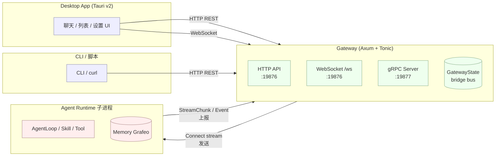
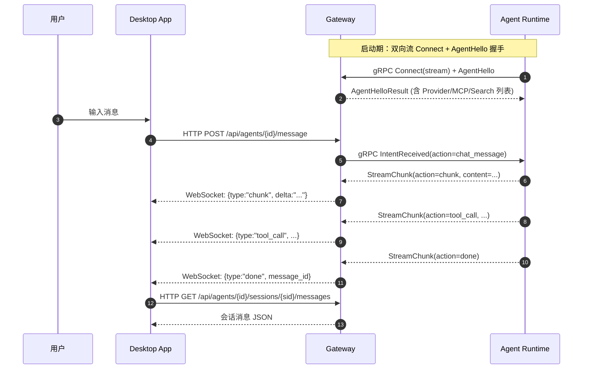

# ACowork.AI 协议文档（纲要）

> 本目录是 ACowork.AI Gateway 的 API 使用参考。按协议拆分为三份独立文档：
>
> - [HTTP](./http.md) — REST API + WebSocket 升级
> - [gRPC](./grpc.md) — Gateway ↔ Agent Runtime 的双向流式 IPC
> - [WebSocket](./websocket.md) — 聊天流式事件通道
>
> 适用读者：Desktop App 前端、CLI 工具、二方集成方、调试脚本。

---

## 1. 三种协议一览

| 协议 | 传输层 | 服务端框架 | 默认端口 | 主要调用方 | 主要用途 |
|------|--------|------------|----------|------------|----------|
| HTTP/1.1 | TCP | Axum (Rust) | `19876` | Desktop App、CLI、运维脚本 | 资源 CRUD、配置、会话列表、文件浏览等所有非流式场景 |
| gRPC | HTTP/2 | Tonic (Rust) | `19877` | Agent Runtime 子进程 | Gateway 与 Runtime 之间唯一的 IPC 通道（双向流式） |
| WebSocket | HTTP Upgrade | Axum ws | `19876`（与 HTTP 同端口） | Desktop App（流式 UI） | 聊天的实时事件推送（chunk、工具调用、停止信号等） |

> **端口与绑定**：默认全部绑定 `127.0.0.1`（localhost only）。可在 `gateway.toml` 的
> `[http]` 节调整端口与 CORS；gRPC 端口见 [`core/acowork-core/src/defaults.rs`](../../../core/acowork-core/src/defaults.rs)。

---

## 2. 总体架构



文字概括：

1. **Desktop App / CLI** → 通过 **HTTP REST** 调用 Gateway 完成资源 CRUD、配置与会话查询。
2. **Desktop App** → 通过 **WebSocket**（同 HTTP 端口的 `/api/agents/{id}/stream`）订阅流式事件（chunk / tool / done 等）。
3. **Agent Runtime** 子进程 → 通过 **gRPC 双向流** 与 Gateway 维持长连接，进行握手（AgentHello）、资源同步（Provider/MCP/Search 列表）、事件上报（StreamChunk、UsageReport）、接收 Gateway 下发的意图（IntentReceived）等。

---

## 3. 通信流程概览

### 3.1 一次典型对话的端到端流程



要点：

- HTTP 只用于**触发**和**查询**，所有流式内容走 WebSocket。
- WebSocket 内容由 Gateway 透传自 Runtime 的 `StreamChunk`，Gateway 仅在 `chunk` 事件将 `content` 重命名为 `delta`，其余字段原样转发。
- gRPC 同时承担**事件上报**（Runtime → Gateway）与**意图下发**（Gateway → Runtime）。

### 3.2 三种协议的职责边界

| 协议 | Gateway 做 | Runtime 做 |
|------|------------|-----------|
| HTTP | 鉴权、状态聚合、文件 IO、跨 Agent 资源 CRUD | 不直接参与；Runtime 数据通过 gRPC 拉取 |
| gRPC | 维护 session 表、能力广播、请求-响应路由（pending requests） | 真实业务执行：LLM 调用、Tool/Skill、Memory 存储 |
| WebSocket | 单向广播桥接事件（bridge_ctrl_tx → socket） | 不参与；Runtime 通过 gRPC 上报 StreamChunk |

---

## 4. 通用约定

### 4.1 内容类型与字符编码

- HTTP 请求/响应：`application/json; charset=utf-8`
- WebSocket 帧：文本帧（`Message::Text`），UTF-8 JSON
- gRPC：标准 protobuf

### 4.2 错误格式（HTTP）

```json
{ "error": "human readable message" }
```

HTTP 状态码语义：

| 码 | 含义 |
|----|------|
| 200 / 204 | 成功 |
| 400 | 请求参数错误 |
| 401 | 未授权（启用 auth 时） |
| 404 | Agent / 资源不存在 |
| 409 | 状态冲突（如 Agent 未运行） |
| 500 / 502 / 503 | 服务端错误、Runtime 未连接 |
| 504 | Gateway → Runtime 超时 |

### 4.3 认证

- `http.auth_enabled = true` 时，Gateway 启动时生成 256-bit 随机 token，写入 `<data_dir>/http_token`。
- HTTP 请求需带 `Authorization: Bearer <token>` 头。
- gRPC 与 WebSocket 当前绑定 `127.0.0.1`，依赖本地回路保护，**不在协议层做鉴权**。

### 4.4 数据发现文件

Gateway 启动后会在 `<data_dir>/` 下写入：

| 文件 | 用途 |
|------|------|
| `gateway.pid` | PID + HTTP 端口（供 Desktop App 发现） |
| `http_token` | Bearer token（仅当 auth 启用） |

---

## 5. 文档导航

| 想做的事 | 查阅 |
|----------|------|
| 列出/安装/启动 Agent | [http.md §Agent 管理](./http.md#二agent-管理) |
| 发起聊天（HTTP） | [http.md §Chat 与会话](./http.md#三chat-与会话) |
| 订阅流式事件 | [websocket.md](./websocket.md) |
| 理解 Gateway ↔ Runtime 通信 | [grpc.md](./grpc.md) |
| 管理 Provider/MCP/Search | [http.md §LLM Provider 与 Models](./http.md#五llm-provider-与-models) / [http.md §MCP 目录](./http.md#六mcp-目录) |
| 操作 Memory | [http.md §记忆](./http.md#七记忆) |
| 调试/重启 Agent / LSP | [http.md §调试与开发工具](./http.md#十三调试与开发工具) |

---

## 6. 相关源码索引

- 路由聚合：`core/acowork-gateway/src/http/routes.rs`
- 各域 handler：`core/acowork-gateway/src/http/*.rs`
- gRPC 服务：`core/acowork-gateway/src/grpc/server.rs`
- gRPC 分发：`core/acowork-gateway/src/grpc/dispatch.rs`
- Proto 定义：`core/acowork-core/proto/gateway_ipc.proto`
- 默认端口：`core/acowork-core/src/defaults.rs`
- WebSocket 实现：`core/acowork-gateway/src/http/chat.rs`（`agent_stream_ws` / `handle_ws`）