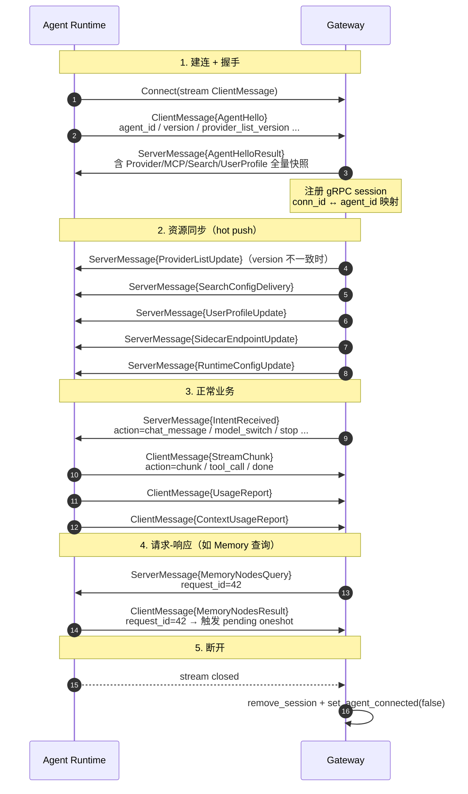

# gRPC 协议

> Gateway ↔ Agent Runtime 之间的**唯一** IPC 通道。基于 Tonic，单个双向流 RPC。
>
> - Proto 定义：[`core/acowork-core/proto/gateway_ipc.proto`](../../../core/acowork-core/proto/gateway_ipc.proto)
> - 服务实现：[`core/acowork-gateway/src/grpc/server.rs`](../../../core/acowork-gateway/src/grpc/server.rs)
> - 消息分发：[`core/acowork-gateway/src/grpc/dispatch.rs`](../../../core/acowork-gateway/src/grpc/dispatch.rs)

---

## 1. 基础约定

- **监听**：`127.0.0.1:19877`（常量 `DEFAULT_GRPC_PORT`）
- **传输**：HTTP/2 + protobuf
- **唯一 RPC**：`Connect(stream ClientMessage) returns (stream ServerMessage)`
- **包**：`acowork.gateway.v1`
- **service 名**：`gateway_service_server::GatewayService`
- **会话管理**：每个 gRPC 连接分配 `conn_id`，由 `AgentHello` 设置 `agent_id` 后即"已认证"
- **请求-响应关联**：所有非 0 的 `request_id` 必须回显对应 `ServerMessage.request_id`

---

## 2. 通信流程



文字概括：

1. Runtime 启动后向 Gateway 发起 `Connect` 流，第一帧是 `AgentHello`，Gateway 回送 `AgentHelloResult`（含资源快照）。
2. 之后是**双向通信**：Runtime 通过 `StreamChunk` 上报业务事件，通过 `UsageReport` 上报用量；Gateway 通过 `IntentReceived` 下发用户意图，通过 `ProviderListUpdate` 等热推送资源变更。
3. 需要请求-响应（Memory 查询、Session 状态查询、Config 查询）时，Gateway 用 `request_id` 注册 oneshot，Runtime 用同样的 `request_id` 回包即可解锁。

---

## 3. 消息分类

### 一、生命周期 / 握手

| 方向 | 消息 | 说明 |
|------|------|------|
| RT → GW | `AgentHello` | 握手首帧，必含 `agent_id`、`version`、`connection_role`（`main` / `chunk-relay`）、各 list 版本号。Gateway 据此认证 GrpcSession |
| GW → RT | `AgentHelloResult` | 回包，必含 `success`。当版本不一致时附带 `provider_list_json` / `mcp_list_json` / `search_list_json` / `user_identity_json` 全量增量 |
| RT → GW | `AgentReady` | 表明 Agent 已就绪可接受用户消息 |

### 二、Intent（意图传递机制）

Intent 是 Runtime ↔ Gateway 的通用消息抽象，所有跨边界的"指令"都封装为 `Intent*`。

| 方向 | 消息 | 说明 |
|------|------|------|
| GW → RT | `IntentReceived { from, action, params_json, command }` | Gateway 把 HTTP/WebSocket/CLI 触发的用户动作下发给 Runtime。常见 `action`：`chat_message`、`model_switch`、`reasoning_effort`、`interrupt`、`compact_context`、`approval_decision`、`question_answer`、`workspace_*`、`save_agent_model` … |
| RT → GW | `IntentSend { target, action, params_json, async }` | Runtime 上报 / 转发意图。`target="http-api"` 或 `http-ws` 时 Gateway 透传到 WebSocket 客户端；`target="gateway"` 时 Gateway 本地处理 |
| GW → RT | `IntentDelivered { message_id }` | Intent 已被 Gateway 接收的回执 |

### 三、配置与资源同步

| 方向 | 消息 | 说明 |
|------|------|------|
| GW → RT | `RuntimeConfigUpdate` | per-agent 配置：max_output_tokens / max_iterations / temperature / system_prompt_override / mcp_servers / search_config / model / avatar / context_window / builtin_tools 等；带 `*_set` flag 区分"未设置"和"清空" |
| GW → RT | `QueryConfig` | Gateway 主动查询 Runtime 当前配置 |
| RT → GW | `ConfigSnapshot` | `QueryConfig` 的响应，含 model / provider / 全套运行时参数 |
| GW → RT | `ProviderListUpdate` | 热推送 provider 列表（`provider_list_version` 变���时） |
| GW → RT | `SearchConfigDelivery` | 热推送搜索 provider + key vault |
| GW → RT | `UserProfileUpdate` | 热推送用户档案（`user_profile_version` 变化时） |
| GW → RT | `LogLevelUpdate` | 热改日志级别 |
| GW → RT | `LogFileCountUpdate` | 热改日志保留数 |
| GW → RT | `LogRotate` | 触发日志轮转 |
| GW → RT | `WorkspaceConfigUpdate` | 工作区配置变更 |
| RT → GW | `UpdateWorkspaceConfig` | Runtime 把工作区配置快照推回 Gateway 缓存 |
| GW → RT | `SetSessionWorkspace` | 设置会话当前工作区 |
| GW → RT | `UpdateSearchConfig` | 触发 Runtime 写入搜索配置 |
| GW → RT | `IterationLimitPaused` | 通知 Runtime 已达迭代上限并暂停 |

### 四、能力 / 配额 / 密钥

| 方向 | 消息 | 说明 |
|------|------|------|
| RT → GW | `CapabilityQuery { agent_id }` | 查询某 Agent 当前能力集 |
| GW → RT | `CapabilityOverview { capabilities: map<string, StringList> }` | 能力响应 |
| GW → RT | `CapabilityUpdate { agent_id, actions, removed }` | 能力变化广播（high-priority 分支推送） |
| RT → GW | `BudgetQuery { provider }` | 查询 provider 剩余预算 |
| GW → RT | `BudgetInfo { remaining_tokens, remaining_cost_usd }` | 预算响应 |
| RT → GW | `UsageReport { agent_id, provider, tokens_used, cost_usd, timestamp, error }` | 用量上报 |
| GW → RT | `UsageReportAck {}` | 用量已记账回执 |
| RT → GW | `RateAcquire { provider }` | 申请速率令牌 |
| GW → RT | `RateToken { granted, retry_after_ms }` | 令牌发放结果 |
| RT → GW | `KeyRelease { provider }` | 请求解密后的 provider API key |
| GW → RT | `KeyReleaseResult { api_key, error }` | 返回明文 key（仅 Gateway 持有解密能力） |

### 五、Cron 定时任务

| 方向 | 消息 | 说明 |
|------|------|------|
| RT → GW | `CronRegister { agent_id, schedule, action, params_json }` | 注册定时任务 |
| GW → RT | `CronRegisterResult { cron_id, error }` | 注册结果 |
| RT → GW | `CronUnregister { cron_id }` | 删除定时任务 |
| GW → RT | `CronUnregisterResult { removed }` | 删除结果 |
| RT → GW | `CronList {}` | 列出当前 conn agent 的定时任务 |
| GW → RT | `CronListResult { entries: CronEntryInfo[] }` | 任务列表 |

### 六、会话与消息

| 方向 | 消息 | 说明 |
|------|------|------|
| RT → GW | `ListSessions {}` | 列出会话（Gateway 当前回空，由 HTTP 层经 pending request 机制直发 Query） |
| GW → RT | `SessionList { sessions }` | 会话列表 |
| RT → GW | `GetSessionMessages { session_id, cursor, limit, direction }` | 拉取会话消息 |
| GW → RT | `SessionMessages { messages, cursor, has_more }` | 消息分页 |
| RT → GW | `CreateSession {}` | 创建会话（HTTP 层为主，gRPC 兜底返回空 id） |
| GW → RT | `SessionCreated { session_id }` | 会话 id |
| RT → GW | `DeleteSession { session_id }` | 删除会话（推荐改走 IntentReceived） |
| GW → RT | `SessionDeleted { success, error }` | 删除结果 |
| GW → RT | `GetSessionStateQuery { session_id, request_id }` | Gateway 主动拉取会话状态 |
| RT → GW | `SessionStateResult { request_id, found, status_json, model, provider, workspace_id, todos_json, context_usage_json ... }` | 会话状态快照 |
| GW → RT | `GetLatestSessionQuery { request_id }` | 启动时定位最新会话 |
| RT → GW | `LatestSessionResult { request_id, found, session_id, title, created_at }` | 最新会话 |
| RT → GW | `ContextUsageReport { agent_id, context, session_id }` | 上下文用量上报 |
| GW → RT | `ContextUsageAck {}` | 回执（同时 Gateway 通过 bridge 推到 WebSocket） |

### 七、记忆 (Memory)

> 全部走 **pending request** 模式：`Query` 由 Gateway 用非零 `request_id` 发送，
> `Result` 由 Runtime 用相同 `request_id` 回包，Gateway 通过 `is_memory_result`
> 匹配并 fulfill oneshot（HTTP handler 即被解锁）。

| 方向 | 消息 | 说明 |
|------|------|------|
| GW → RT | `MemoryNodesQuery { page, size, type, keyword, time_range }` | 节点列表查询 |
| RT → GW | `MemoryNodesResult { total, page, size, nodes: MemoryNodeEntry[] }` | 节点列表响应 |
| GW → RT | `MemoryStatsQuery {}` | 统计查询 |
| RT → GW | `MemoryStatsResult { total_nodes, storage_bytes, by_type, by_status, avg_decay_score, index_health, stored_dim, nodes_with_embedding, model_dim }` | 统计响应（含嵌入维度自检） |
| GW → RT | `MemoryConsolidateQuery { force, retention_days }` | 触发整合 |
| RT → GW | `MemoryConsolidateResult { started, duration_ms, episodes_consolidated, knowledge_nodes_generated, message }` | 整合结果 |
| GW → RT | `MemoryDeleteQuery { node_id }` | 删除节点 |
| RT → GW | `MemoryDeleteResult { node_id, deleted, message }` | 删除结果 |

### 八、流式事件

| 方向 | 消息 | 说明 |
|------|------|------|
| RT → GW | `StreamChunk { target, action, params_json }` | 业务流式事件。`target` 通常为 `http-ws` 或 `http-api`，Gateway 透传到 WebSocket 客户端（仅 `chunk` 事件把 `content` 改名 `delta`） |

`action` 取值见 [BridgeEventType](../../zh/protocols/README.md) 表格（共 ~22 种类型）。

### 九、嵌入模型 / Sidecar / 调试

| 方向 | 消息 | 说明 |
|------|------|------|
| GW → RT | `SidecarEndpointUpdate { sidecar, endpoint, spec_json }` | sidecar（`SIDECAR_KIND_LSP_RELAY` / `SIDECAR_KIND_EMBED`）状态变更；`endpoint=""` 表示下线 |
| GW → RT | `MigrationStart { request_id, embed_endpoint, embed_model_id, embed_dimension }` | 触发嵌入维度迁移 |
| GW → RT | `EnableDebugMode { debug_port }` | 让 Runtime 进入 Debug 模式并启动 Debug WebSocket |

---

## 4. 关键模式

### 4.1 request_id 关联

```text
非 0 request_id   → 请求-响应模式（Memory / SessionState / ConfigSnapshot）
0 request_id      → 单向推送（IntentReceived、StreamChunk、CapabilityUpdate …）
```

ServerMessage 必须回显同一个 `request_id`，Runtime 通过它把 `Result` 投递到正确的 pending receiver。

### 4.2 能力广播优先级

`Connect` 内 `tokio::select! { biased; ... }` 保证：

1. **高优先级**：`CapabilityUpdate` 广播（确保 Stop / Done / Error 不被高频 token 流饿死）
2. **低优先级**：入站 `ClientMessage`（含 StreamChunk）

### 4.3 Pending Request 匹配表

位于 `GrpcSessionManager`：

- `pending_requests: HashMap<request_id, oneshot::Sender<ClientMessage>>`
- `session_requests: HashMap<conn_id, Vec<request_id>>` —— conn 断开时反向清理

`is_memory_result()` 必须覆盖所有 `XxxQuery` 对应的 `XxxResult`，否则 HTTP handler 会因 oneshot 永远不 fulfill 而 504。

### 4.4 Connection 角色

`AgentHello.connection_role` 取值：

| 取值 | 含义 |
|------|------|
| `main` | 主连接，承载所有 RPC；`find_by_agent_id` 只匹配该角色 |
| `chunk-relay` | 仅用于流式分片转发（保留扩展位） |

---

## 5. 流生命周期与清理

```text
Connect
  ├─ inbound: ClientMessage（业务、握手、上报）
  ├─ outbound a: ServerMessage（响应 / 推送）
  └─ outbound b: CapabilityUpdate broadcast（highest priority）
```

断开时：

1. `inbound.message()` 返回 `Ok(None)` 或 `Err(_)` → 跳出 select 循环
2. `remove_session(conn_id)`：清空 pending requests，反向索引一并回收
3. 若 session 已认证，`set_agent_connected(agent_id, false)`：让 `/api/agents` 列表正确反映离线

---

## 6. 常见错误响应

`tonic::Status` 编码，Gateway 在 dispatch 失败时返回：

| 码 | 触发场景 |
|----|----------|
| `INVALID_ARGUMENT` | 缺字段、JSON 解析失败 |
| `FAILED_PRECONDITION` | Agent 未运行、Session 不存在 |
| `INTERNAL` | Gateway 内部错误 |

Runtime 侧的 Status 直接透传；不再做二次封装。

---

## 7. 调试建议

- **抓包**：`grpcurl -plaintext 127.0.0.1:19877 list` 需先在 Gateway 配置启用 reflection（默认未启用）
- **追踪日志**：所有 dispatch 路径有 `tracing::debug!`；StreamChunk 触发频次高，生产可调至 `info` 级屏蔽
- **健康检查**：通过 `/health`（HTTP）观察 gRPC session 数量与状态