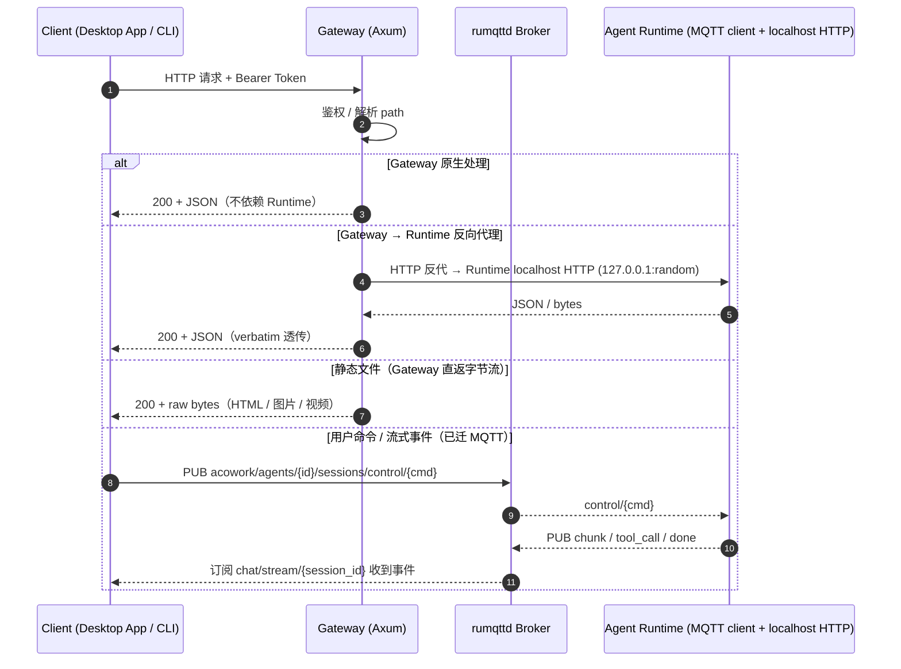

# HTTP 协议

> Gateway 暴露在 `127.0.0.1:19876`（默认）的 REST API。底层为 Axum。
> 详细路由聚合见源码：[`core/acowork-gateway/src/http/routes.rs`](../../../core/acowork-gateway/src/http/routes.rs)
>
> **ADR-033 + ADR-034 之后**：Gateway 是所有 HTTP 请求的**单点入口**；Runtime 不再直连客户端。
> 数据请求由 Gateway 通过 localhost HTTP **反向代理**到 Runtime；事件触发、命令推送、
> 实时流全部走 [MQTT](./mqtt.md)。

---

## 目录

- [1. 基础约定](#1-基础约定)
- [2. 通信流程](#2-通信流程)
- [3. 接口分类总览](#3-接口分类总览)
- [4. Gateway 原生端点（不依赖 Runtime 在线）](#4-gateway-原生端点不依赖-runtime-在线)
  - [4.1 系统与健康](#41-系统与健康)
  - [4.2 Agent 包管理](#42-agent-包管理)
  - [4.3 Agent 生命周期控制](#43-agent-生命周期控制)
  - [4.4 Avatar / Manifest 资源](#44-avatar--manifest-资源)
  - [4.5 LLM Provider 与 Models](#45-llm-provider-与-models)
  - [4.6 MCP 目录](#46-mcp-目录)
  - [4.7 嵌入模型](#47-嵌入模型)
  - [4.8 用户与用户级 Avatar](#48-用户与用户级-avatar)
  - [4.9 Cron 定时任务](#49-cron-定时任务)
  - [4.10 技能](#410-技能)
  - [4.11 调试与开发工具](#411-调试与开发工具)
  - [4.12 远程文件系统浏览](#412-远程文件系统浏览)
- [5. Gateway → Runtime 反向代理（需 Runtime 在线）](#5-gateway--runtime-反向代理需-runtime-在线)
  - [5.1 Agent 运行时配置](#51-agent-运行时配置)
  - [5.2 会话只读查询](#52-会话只读查询)
  - [5.3 附件（Attachment）](#53-附件attachment)
    - [5.3.1 `POST /sessions/{sid}/files`](#531-post-sessionssidfiles)
    - [5.3.2 `GET /files/{document_id}`](#532-get-filesdocument_id)
    - [5.3.3 消息条目中的 `attached_items`](#533-消息条目中的-attached_items)
  - [5.4 记忆 (Memory)](#54-记忆-memory)
  - [5.5 工作区 (Workspace)](#55-工作区-workspace)
- [6. 静态文件服务（直接流式返回原始字节）](#6-静态文件服务直接流式返回原始字节)
- [7. 已迁移到 MQTT 的交互（HTTP 端点已删除）](#7-已迁移到-mqtt-的交互http-端点已删除)
- [8. 通用错误码](#8-通用错误码)
- [9. 典型请求示例](#9-典型请求示例)
- [10. 注意事项](#10-注意事项)

---

## 1. 基础约定

- **Base URL**：`http://127.0.0.1:19876`（可在 `gateway.toml` 的 `[http]` 节调整）
- **内容类型**：`application/json; charset=utf-8`
- **认证**：当 `[http].auth_enabled = true` 时，所有 `/api/*` 请求需带
  `Authorization: Bearer <token>`，token 文件位于 `<data_dir>/http_token`。
- **错误格式**：`{ "error": "..." }` + 对应 HTTP 状态码
- **流式事件通道（MQTT）**：聊天事件流不再走 WebSocket，而是客户端订阅 [MQTT](./mqtt.md)
  topic `chat/stream/{session_id}`（Desktop App 通过其 Tauri 后端的 MQTT 客户端订阅）。
- **命令 / 写入通道（MQTT）**：用户发起的会话控制（发消息、激活、重命名、删除、关闭、
  继续）以及审批 / 问答的人机交互，也都改走 MQTT 主题
  `acowork/agents/{id}/sessions/control/{cmd}`，不再走 HTTP（详见 [§7](#7-已迁移到-mqtt-的交互http-端点已删除)）。

---

## 2. 通信流程



**架构要点**：

| 类别 | 处理方 | Runtime 是否必须在线 |
|---|---|---|
| Gateway 原生 | Gateway 单点处理 | **否** |
| Gateway → Runtime 反代 | Gateway 透传到 Runtime localhost HTTP | **是**（503 if offline） |
| 静态文件 | Gateway 直接读盘返回字节流 | **否**（仅要求文件存在） |
| MQTT 命令 / 流 | rumqttd Broker 中转 | 是（Runtime 通过 MQTT 订阅响应） |

Gateway **不持久化业务数据**：Memory、Skill、Agent 运行时配置、Session 状态等真实数据存于
Runtime 本地文件 / Grafeo；Gateway 通过 HTTP 反向代理拉取快照或透传请求，
命令 / 写入则通过 MQTT 控制主题。

---

## 3. 接口分类总览

| 大类 | 数量级 | 处理方 | Runtime 依赖 |
|---|---|---|---|
| **A. Gateway 原生** | ~50 个 | Gateway 本地存储 / Vault / 进程管理 | 否 |
| **B. Gateway → Runtime 反向代理** | ~25 个 | 透传到 Runtime localhost HTTP | **是** |
| **C. 静态文件** | 2 个路径模式 | Gateway 直接 `fs::read` 流式返回 | 否 |
| **D. MQTT 命令 / 流**（HTTP 端点已删除）| — | rumqttd Broker | 是 |

源码映射：

| 大类 | Gateway 实现模块 |
|---|---|
| A | [`agents.rs`](../../../core/acowork-gateway/src/http/agents.rs), [`provider_api.rs`](../../../core/acowork-gateway/src/http/provider_api.rs), [`models_api.rs`](../../../core/acowork-gateway/src/http/models_api.rs), [`mcp_catalog_api.rs`](../../../core/acowork-gateway/src/http/mcp_catalog_api.rs), [`embedding_api.rs`](../../../core/acowork-gateway/src/http/embedding_api.rs), [`users_api.rs`](../../../core/acowork-gateway/src/http/users_api.rs), [`cron_api.rs`](../../../core/acowork-gateway/src/http/cron_api.rs), [`skills_api.rs`](../../../core/acowork-gateway/src/http/skills_api.rs), [`config_api.rs`](../../../core/acowork-gateway/src/http/config_api.rs), [`fs_browse.rs`](../../../core/acowork-gateway/src/http/fs_browse.rs), [`debug_mqtt.rs`](../../../core/acowork-gateway/src/http/debug_mqtt.rs), [`publish_api.rs`](../../../core/acowork-gateway/src/http/publish_api.rs) |
| B | [`proxy.rs`](../../../core/acowork-gateway/src/http/proxy.rs)（ADR-033 Phase 2 + ADR-034 Phase 3） |
| C | [`workspaces.rs`](../../../core/acowork-gateway/src/http/workspaces.rs)（仅静态资源部分） |

---

## 4. Gateway 原生端点（不依赖 Runtime 在线）

Gateway 直接处理、不需要 Runtime 子进程在线的端点。涵盖：系统健康、Agent 包管理、
LLM Provider / Models 全局资源、MCP 目录、嵌入模型、用户档案、Cron、Skill、调试工具。

### 4.1 系统与健康

| 方法 | 路径 | 用途 |
|---|---|---|
| GET | `/health` | 健康检查（无鉴权），含 IPC（MQTT）/ CronStore / 磁盘空间 |
| GET | `/api/status` | 系统状态：版本、运行中 Agent 数、内存占用；`mqtt.auth_enabled` 开启时额外返回 `mqtt_username` / `mqtt_password`（Desktop MQTT 凭据下发，ADR-055 Phase 5a） |
| GET | `/api/config` | 读取 Gateway 配置 |
| PUT | `/api/config` | 更新日志级别、日志切分、idle_timeout、默认 provider/model、HF mirror 等 |
| DELETE | `/api/logs` | 清空日志 |
| GET | `/api/agents/{id}/lsp-endpoint` | LSP Relay 端点（node-local，ADR-055 §6.7）：按 agent 解析宿主 Node 的 relay base URL（`endpoint`/`ready` 字段），供 Desktop / Runtime 直连 |

### 4.2 Agent 包管理

包级 CRUD 与发布。包安装到 `<packages_dir>`，Gateway 在 `installed_agents` 中维护清单。

| 方法 | 路径 | 用途 |
|---|---|---|
| GET | `/api/agents` | 列出全部已安装 Agent（含 status、avatar、mqtt_online 等） |
| GET | `/api/agents/{id}` | Agent 详情（manifest、installed/connected/dev_mode 等） |
| DELETE | `/api/agents/{id}` | 卸载 Agent |
| POST | `/api/agents/install` | 安装 `.agent` 包（multipart） |
| POST | `/api/agents/{id}/clone` | 克隆 Agent（skeleton 或 full） |
| POST | `/api/agents/{id}/publish/prepare` | 准备打包（校验、清理） |
| POST | `/api/agents/{id}/publish/build` | 构建 `.agent` 包 |
| POST | `/api/agents/{id}/publish/export` | 导出包到目标路径 |
| POST | `/api/agents/{id}/publish/install-locally` | 本地安装构建产物 |
| GET | `/api/packages/{agent_id}/download` | 下载 `.agent` 包（Node install 拉取路径）；开启鉴权时校验 `X-ACowork-Node-Token`（ADR-055 Phase 5a）：缺失/不匹配 → 401/403 |

### 4.3 Agent 生命周期控制

子进程级控制：start / stop / restart-debug / 模型与搜索 provider 探测。
**模型与 provider 的切换**通过 MQTT `sessions/control/model_switch` 推送，而非 HTTP。

| 方法 | 路径 | 用途 |
|---|---|---|
| POST | `/api/agents/{id}/start` | 启动 Agent Runtime 子进程 |
| POST | `/api/agents/{id}/stop` | 停止 Agent |
| POST | `/api/agents/{id}/restart-debug` | 重启为 debug 模式（开启 Debug 通道） |
| GET | `/api/agents/{id}/model` | 当前使用的模型 / provider（Gateway 从 manifest 推导） |
| GET | `/api/agents/{id}/search-providers` | 列出 Agent 可用的搜索 provider |

### 4.4 Avatar / Manifest 资源

Gateway 缓存了 avatar 资源（即便 Agent 停止也能读取）；通过 MQTT `AgentHello` 同步。

| 方法 | 路径 | 用途 |
|---|---|---|
| GET | `/api/agents/{id}/avatar` | 取 Agent 包内置头像图片 |
| POST | `/api/agents/{id}/manifest/avatar` | 上传/更新 manifest 头像 |
| POST | `/api/agents/{id}/manifest/file` | 上传 manifest 资源文件 |
| GET | `/api/agents/{id}/manifest/avatar-assets` | 列出 manifest 头像资源 |
| GET | `/api/agents/{id}/avatar-file` | 取 avatar 资源文件 |
| DELETE | `/api/agents/{id}/avatar-file` | 删除 avatar 资源 |
| GET | `/api/agents/{id}/avatar-config` | 取 avatar 运行时配置（Gateway 缓存） |
| PUT | `/api/agents/{id}/avatar-config` | 更新 avatar 配置（仅当 Agent 停止时生效） |

### 4.5 LLM Provider 与 Models

全局 LLM 资源。API Key 加密存于 Gateway Vault，配置（base_url / models / compact_model）
存于 `provider_list.json`。

| 方法 | 路径 | 用途 |
|---|---|---|
| GET | `/api/providers` | Provider 列表（API Key 掩码） |
| POST | `/api/providers` | 新增 Provider（key + config） |
| DELETE | `/api/providers/{provider}` | 删除 Provider |
| PUT | `/api/providers/{provider}` | 更新 Provider（key / config） |
| GET | `/api/models` | 所有 Provider 的模型（含本地 ollama / lmstudio） |
| GET | `/api/models/{provider}` | 单一 Provider 的模型 |
| POST | `/api/models/discover` | 自定义 base URL 发现模型（OpenAI-compatible） |
| GET | `/api/search/keys` | 搜索 provider 密钥列表 |
| POST | `/api/search/keys` | 新增搜索 provider 密钥 |
| PUT | `/api/search/keys/{provider}` | 更新搜索 provider 密钥 |
| DELETE | `/api/search/keys/{provider}` | 删除搜索 provider 密钥 |

### 4.6 MCP 目录

全局 MCP server 目录（与 Provider 类似的共享注册表，含凭据）。

| 方法 | 路径 | 用途 |
|---|---|---|
| GET | `/api/mcp-catalog` | 列出全部 MCP 目录项（env 字段掩码） |
| PUT | `/api/mcp-catalog` | 整体替换目录 |
| POST | `/api/mcp-catalog` | 新增一条目 |
| DELETE | `/api/mcp-catalog/{name}` | 删除条目 |
| POST | `/api/mcp-catalog/probe` | 健康探测（探测新配置） |
| POST | `/api/mcp-catalog/{name}/probe` | 健康探测（探测已有条目） |

### 4.7 嵌入模型

由 Gateway 管理的嵌入侧车（ONNX Runtime）。

| 方法 | 路径 | 用途 |
|---|---|---|
| GET | `/api/embedding-models` | 列出可用嵌入模型与状态 |
| POST | `/api/embedding-models/test` | 探测模型连通性 |
| POST | `/api/embedding-models/{id}/download` | 触发模型下载 |
| POST | `/api/embedding-models/{id}/select` | 切换当前模型 |
| GET | `/api/embedding-models/{id}/status` | 下载 / 加载状态 |
| DELETE | `/api/embedding-models/{id}` | 删除已下载模型 |
| GET | `/api/embedding-models/migration-progress` | 嵌入维度迁移整体进度 |
| POST | `/api/embedding-models/{id}/start-migration` | 启动迁移 |

### 4.8 用户与用户级 Avatar

全局用户档案（独立于 Agent）。

| 方法 | 路径 | 用途 |
|---|---|---|
| GET | `/api/users` | 用户档案列表 |
| POST | `/api/users` | 创建用户档案 |
| PUT | `/api/users/{user_id}` | 更新用户档案 |
| POST | `/api/users/{user_id}/activate` | 激活用户 |
| GET | `/api/user/avatar-config` | 当前激活用户的 avatar 配置 |
| PUT | `/api/user/avatar-config` | 更新 avatar 配置 |
| GET | `/api/user/avatar-assets` | 列出可用的 avatar 资源 |
| GET | `/api/user/avatar-file` | 取 avatar 文件 |
| POST | `/api/user/avatar-file` | 上传 avatar 文件 |
| DELETE | `/api/user/avatar-file` | 删除 avatar 文件 |

### 4.9 Cron 定时任务

Cron 由 Gateway 自管（持久化于 SQLite）。

| 方法 | 路径 | 用途 |
|---|---|---|
| GET | `/api/agents/{id}/cron` | 列出 Agent 的定时任务 |
| POST | `/api/agents/{id}/cron` | 注册新定时任务（schedule + action + params） |
| DELETE | `/api/agents/{id}/cron/{cron_id}` | 删除定时任务 |

### 4.10 技能

技能从已安装包的 `skills/` 目录读取。

| 方法 | 路径 | 用途 |
|---|---|---|
| GET | `/api/agents/{id}/skills` | 技能列表 |
| GET | `/api/agents/{id}/skills/{name}` | 技能详情（SKILL.md 解析） |
| GET | `/api/agents/{id}/skills/{name}/history` | 技能执行历史 |
| POST | `/api/agents/{id}/skills/import` | 导入技能 ZIP（multipart） |

### 4.11 调试与开发工具

仅在 localhost 暴露；不应暴露到网络。

| 方法 | 路径 | 用途 |
|---|---|---|
| POST | `/api/debug/mqtt/shutdown` | 请求 broker 线程退出（仅手动调试用） |
| POST | `/api/debug/mqtt/start` | 重新拉起 broker 线程 |

### 4.12 远程文件系统浏览

仅当远程 Desktop 连接到远端 Gateway 时使用（Tauri 本地场景无需此端点）。

| 方法 | 路径 | 用途 |
|---|---|---|
| GET | `/api/fs/browse` | 远程浏览服务器文件系统（仅目录列表，禁止内容读取） |

---

## 5. Gateway → Runtime 反向代理（需 Runtime 在线）

> **实现**：`core/acowork-gateway/src/http/proxy.rs`
> **协议**：Gateway 从 `RuntimeHttpRegistry`（由 MQTT retained payload
> `acowork/agents/{id}/http_port` 填充）查到 Runtime 的随机端口，
> 然后 HTTP 反代。Runtime 未注册 / 已退出时 Gateway 返回 **503**。
>
> **Runtime 侧**真实接口见 [`core/acowork-runtime/src/http/server.rs`](../../../core/acowork-runtime/src/http/server.rs)
> 的 25 路由清单（ADR-034 §11.2）。
>
> **节点反代鉴权（ADR-055 Phase 5a）**：`mqtt.auth_enabled` 开启时，Gateway
> 出站反代按 agent_id → `installed_agents.node_id` → node registry 解析宿主
> Node，自动注入 `X-ACowork-Node-Token: <node_token>` header；Node 入站校验
> 该 header（已 enroll 的 Node 必须匹配 identity.node_token，不匹配 → 403 + `X-Error-Origin: node`）。
> 未开启鉴权时无 header，行为与 Phase 4 之前完全一致。

Gateway 不解析 Runtime 响应的 body，所有读写都 verbatim 透传。这意味着 Runtime 是
**workspace config / memory / session state 的权威所有者**，Gateway 仅充当反代。

### 5.1 Agent 运行时配置

| 方法 | 路径 | 用途 | Runtime 路径 |
|---|---|---|---|
| GET | `/api/agents/{id}/config` | 读取 Agent 合并后配置 | `/agents/{id}/config` |
| PUT | `/api/agents/{id}/config` | 更新 Agent 配置（max_output_tokens、temperature、prompt、avatar…） | `/agents/{id}/config` |
| GET | `/api/agents/{id}/tools` | 读取内置工具启用列表 | `/agents/{id}/tools` |
| GET | `/api/agents/{id}/builtin-tools` | 读取 builtin-tools 启用列表 | `/agents/{id}/builtin-tools` |
| PUT | `/api/agents/{id}/builtin-tools` | 写入 builtin-tools 启用列表 | `/agents/{id}/builtin-tools` |
| GET | `/api/agents/{id}/status` | Runtime 视角的状态（累计 token、loop 状态等） | `/agents/{id}/status` |
| GET | `/api/agents/{id}/mcp-servers` | 读取 Agent 的 MCP 服务配置 | `/agents/{id}/mcp-servers` |
| PUT | `/api/agents/{id}/mcp-servers` | 写入 MCP 服务配置 | `/agents/{id}/mcp-servers` |
| GET | `/api/agents/{id}/search-config` | 读取搜索配置 | `/agents/{id}/search-config` |
| PUT | `/api/agents/{id}/search-config` | 写入搜索配置 | `/agents/{id}/search-config` |
| GET | `/api/agents/{id}/providers` | 读取 Runtime 端的 Provider 列表（MQTT 同步后的实际数据） | `/agents/{id}/providers` |

> **ADR-040 Win11-MCP-ToolsBugFix (2026-07)**：上述 `mcp-servers` / `search-config` / `providers` 
> 早期由 Gateway stub 返回 200 但不持久化，导致用户在 Tools Tab 切换 MCP server 选择后丢失。
> 已统一改为反代到 Runtime 端 `get_agent_mcp_servers` / `put_agent_mcp_servers` 等。

### 5.2 会话只读查询

> **会话的写操作（创建 / 激活 / 重命名 / 删除 / 关闭 / 继续）已全部迁到 MQTT**
> `acowork/agents/{id}/sessions/control/{cmd}`，详见 [§7](#7-已迁移到-mqtt-的交互http-端点已删除)。
> 此处仅保留**只读**反代。

| 方法 | 路径 | 用途 | Runtime 路径 |
|---|---|---|---|
| GET | `/api/agents/{id}/sessions` | 会话列表（运行时视角，token 统计合并） | `/sessions` |
| GET | `/api/agents/{id}/latest-session` | 最新会话（启动时快速定位） | `/sessions/latest` |
| GET | `/api/agents/{id}/conversations/latest` | 最新会话消息（ADR-034 唯一保留的 conversations 端点） | `/sessions/latest` |
| GET | `/api/agents/{id}/sessions/{sid}` | 单会话完整状态（合并 meta + state） | `/sessions/{sid}` |
| GET | `/api/agents/{id}/sessions/{sid}/state` | **legacy 别名**：转发到 `/sessions/{sid}`（保留以兼容旧调用方） | `/sessions/{sid}` |
| GET | `/api/agents/{id}/sessions/{sid}/messages` | 拉取消息历史（支持 cursor 分页） | `/sessions/{sid}/messages` |

### 5.3 附件（Attachment）

附件 blob 落盘到 Runtime `<work_dir>/files/<document_id>`（无扩展名）；元数据经
MQTT PUB `acowork/agents/{id}/sessions/control/chat_message` 的 `attached_items`
字段传给 Runtime 写 JSONL 消息条目（详见 [mqtt.md §会话写操作](./mqtt.md) 与
[ADR-046](../../adr/zh/ADR-046-unified-attachment-entries.md)）。

| 方法 | 路径 | 用途 | Runtime 路径 |
|---|---|---|---|
| POST | `/api/agents/{id}/sessions/{sid}/files` | 上传文件（multipart） | `/sessions/{sid}/files` |
| GET | `/api/agents/{id}/files/{doc_id}` | 读取 blob 原始字节 | `/files/{document_id}` |

#### 5.3.1 `POST /sessions/{sid}/files`

接受 `multipart/form-data`，字段：

| 字段 | 必填 | 说明 |
|---|---|---|
| `file` | ✅ | 二进制文件内容；从 part header `filename` 派生 `name` 字段 |
| `format` | ⬜ | 小写扩展名（无点号，如 `pdf` / `png`）；缺省时从 `filename` 扩展名推断 |
| `width` | ⬜ | 图片像素宽（仅图片上传）；客户端通过 `new Image()` 测量 |
| `height` | ⬜ | 图片像素高（仅图片上传） |

未知字段会被忽略（向前兼容未来客户端字段扩展）。

**响应** `200 OK`：

```json
{
  "documentId": "a1b2c3d4…_8f7e",
  "filename": "Q3-report.pdf",
  "format": "pdf",
  "sizeBytes": 482301,
  "width": null,
  "height": null
}
```

`documentId` 是内容哈希 + 随机后缀（沿用旧算法），用于在 `<work_dir>/files/`
定位 blob。磁盘上 blob 的实际文件名为 `<documentId>.<safe_ext>`（见上文）。
**同一内容二次上传返回同一 `documentId`**（去重语义，磁盘只有一份
blob，消息 JSONL 中的引用也指向同一 ID）。

错误码：

- `400`：multipart 解析失败 / 缺 `file` 字段
- `503`：AttachmentService 未注入（启动期或 service 不可用）

#### 5.3.2 `GET /files/{document_id}`

返回 blob 原始字节。`Content-Type` 派生规则：客户端通过查询参数 `format` 提供小写
扩展名（缺省时服务端从响应头 `X-Format` 取，**最低保障为 `application/octet-stream`**）。

#### 5.3.3 消息条目中的 `attached_items`

运行时通过 MQTT `attached_items` 字段接收前端推上来的**已类型化**的附件条目数组。
**wire 形状**对应 Rust 端的 [`AttachedItem`](../../../core/acowork-core/src/protocol.rs)：
serde tag `type` 用 snake_case（`file_upload` / `attached_selection` 等），**变体内字段
用 camelCase**（`documentId` / `sizeBytes` / `absPath` / `startLine` / `endLine`）。
runtime 在 `loop_memory.rs::write_attached_items` 把它映射到 JSONL 持久化的
[`AttachmentMeta`](../../../core/acowork-runtime/src/conversation.rs)（变体内字段转回
snake_case：`document_id` / `size_bytes` / `abs_path` / `start_line` / `end_line`）。

| wire `type` | wire 字段（camelCase） | JSONL 字段（snake_case） | 场景 |
|---|---|---|---|
| `file_upload` | `documentId`、`filename`、`format`、`sizeBytes` | `document_id`、`filename`、`format`、`size_bytes` | 用户上传的文档（PDF/DOCX/PPTX/XLSX），blob 已落盘 |
| `image_upload` | 同上 + 可选 `width` / `height` | 同上 + 可选 `width` / `height` | 用户上传的图片（PNG/JPG），blob 已落盘 |
| `attached_file` | `absPath`、`name` | `abs_path`、`name` | "Add to Chat" 选择的 workspace 文件（**不复制**，引用路径） |
| `attached_selection` | `absPath`、`name`、`startLine`、`endLine` | `abs_path`、`name`、`start_line`、`end_line` | "Add to Chat" 带行号选区 |
| `attached_folder` | `absPath`、`name` | `abs_path`、`name` | "Add to Chat" 整个文件夹（**不复制**，LLM 用自己的工具按需遍历） |

> **契约锁定**：
> - Desktop 端发出者：`apps/acowork-desktop/src/lib/types.ts::toWireAttachedItems`
> - Rust 端 fixture 回归测试：`core/acowork-core/tests/attached_items_wire.rs`
>   （读 `tests/fixtures/desktop_attached_items.json`，逐项断言反序列化成功 + 字段名 camelCase）
> - Desktop 端 fixture 生成脚本：`apps/acowork-desktop/scripts/dump-attached-wire.mts`
>   （任何字段名变更后必须重跑此脚本并更新 fixture）
>
> **重要**：wire 用 camelCase 是 Rust deserializer 的硬约束。snake_case 字段名
> 不会触发任何错误——runtime 在 `gateway_loop.rs:813-820` 用
> `serde_json::from_value::<AttachedItem>(...).ok()` 静默丢弃——结果就是用户看到
> "附件消失了" 但日志里没有错误。fixture 测试就是为了让这种回归**无法上线**。

> 后三种（`attached_*`）由前端直接构造，不需要先经 HTTP 上传；只有前两种（`*_upload`）
> 才需要先调用 `POST /sessions/{sid}/files` 拿到 `documentId`。

### 5.4 记忆 (Memory)

> **Runtime 真实持有 Grafeo 存储**。HTTP 反代在 [mqtt.md §7.5](./mqtt.md) 详述。
> Gateway `memory_api.rs` 本身**为空路由器**（ADR-033）：注册路径会与
> `proxy_routes` 冲突，`Router::merge()` 启动时直接 panic。

| 方法 | 路径 | 用途 | Runtime 路径 |
|---|---|---|---|
| GET | `/api/agents/{id}/memory/nodes` | 节点列表（分页 + 过滤：`type` / `keyword` / `time_range`） | `/memory/nodes` |
| GET | `/api/agents/{id}/memory/nodes/{nid}` | 读取单个节点 | `/memory/nodes/{nid}` |
| POST | `/api/agents/{id}/memory/nodes` | 创建节点 | `/memory/nodes` |
| PUT | `/api/agents/{id}/memory/nodes/{nid}` | 更新节点 | `/memory/nodes/{nid}` |
| DELETE | `/api/agents/{id}/memory/nodes/{nid}` | 删除节点 | `/memory/nodes/{nid}` |
| GET | `/api/agents/{id}/memory/stats` | 统计：总数、存储字节、按 type/status 分布、embedding 维度等 | `/memory/stats` |
| POST | `/api/agents/{id}/memory/consolidate` | 触发记忆整合（`force`、`retention_days`） | `/memory/consolidate` |
| GET | `/api/agents/{id}/memory/graph` | 整图拉取（前端图谱视图） | `/memory/graph` |
| GET | `/api/agents/{id}/memory/consolidation/status` | 整合定时器状态（idle 时长、pending 数、调度配置） | `/memory/consolidation/status` |
| GET | `/api/agents/{id}/rag/status` | RAG 配置状态（是否已配置、provider name） | `/agents/{id}/rag/status` |
| POST | `/api/agents/{id}/rag/query` | 直接查询 RAG（绕过 LLM，用于调试/连通性验证） | `/agents/{id}/rag/query` |

### 5.5 工作区 (Workspace)

> **Workspace config 由 Runtime 拥有**（`<work_dir>/config/agent_workspaces.json`）。
> Gateway 仅作为薄反代，把 `workspace_id` 解析与 path-traversal 守卫都收敛到 Runtime
> 一处（ADR-040）。**只有静态文件服务（见 §6）仍由 Gateway 直返**，因为 HTML 预览
> iframe 需要 raw bytes，Runtime 的 JSON 信封不可替代。

| 方法 | 路径 | 用途 | Runtime 路径 |
|---|---|---|---|
| GET | `/api/agents/{id}/workspaces` | 工作区列表 | `/workspaces` |
| POST | `/api/agents/{id}/workspaces` | 添加工作区目录 | `/workspaces` |
| GET | `/api/agents/{id}/workspaces/tree` | 目录树 | `/workspaces/tree` |
| GET | `/api/agents/{id}/workspaces/find` | 按名查找文件 | `/workspaces/find` |
| GET | `/api/agents/{id}/workspaces/search` | 按内容搜索（`include`、`max_results`、`case_sensitive`、`whole_word`） | `/workspaces/search` |
| PUT | `/api/agents/{id}/workspaces/{ws_id}` | 更新工作区（别名、access 等） | `/workspaces/{ws_id}` |
| DELETE | `/api/agents/{id}/workspaces/{ws_id}` | 删除工作区 | `/workspaces/{ws_id}` |
| PUT | `/api/agents/{id}/workspaces/{ws_id}/prompt-file` | 设置注入 prompt 文件 | `/workspaces/{ws_id}/prompt-file` |
| GET | `/api/agents/{id}/workspaces/file` | 读取文件（带元数据） | `/workspaces/file` |
| POST | `/api/agents/{id}/workspaces/file` | 创建文件 | `/workspaces/file` |
| PUT | `/api/agents/{id}/workspaces/file` | 写入文件 | `/workspaces/file` |
| DELETE | `/api/agents/{id}/workspaces/file` | 删除文件 | `/workspaces/file` |
| POST | `/api/agents/{id}/workspaces/dir` | 创建目录 | `/workspaces/dir` |
| DELETE | `/api/agents/{id}/workspaces/dir` | 删除目录 | `/workspaces/dir` |
| POST | `/api/agents/{id}/workspaces/copy` | 复制文件/目录 | `/workspaces/copy` |
| POST | `/api/agents/{id}/workspaces/rename` | 原子重命名 file/dir | `/workspaces/rename` |

---

## 6. 静态文件服务（直接流式返回原始字节）

> **实现**：`core/acowork-gateway/src/http/workspaces.rs::resolve_tree_path`
> **保留在 Gateway 的原因**：HTML 预览 iframe 需要 raw bytes（HTML / CSS / 图像二进制），
> Runtime 的 JSON 信封（base64 content + metadata）会让 `` / `<link>` / `<script>`
> 全部失效。路径遍历守卫（canonicalize + `..` 检查）在 Gateway 本地完成。

| 方法 | 路径 | 用途 |
|---|---|---|
| GET | `/workspace-files/{agent_id}/{workspace_id}/{*path}` | workspace 任意文件直链，按 `workspace_id` 解析绝对路径 |
| GET | `/ws-files/{agent_id}/{*path}` | Agent home 直链（无 workspace_id） |

> 两个路径名是历史命名，保留不变。

---

## 7. 已迁移到 MQTT 的交互（HTTP 端点已删除）

> **ADR-033 + ADR-034**：以下交互改走 MQTT，**HTTP 不再提供对应端点**。
> Gateway HTTP 层注册这些路径会与 `proxy_routes` / `chat_routes` 冲突，启动时 panic。
> 调用方应订阅 / 发布到对应 MQTT topic。完整协议见 [mqtt.md](./mqtt.md)。

| 已删除的 HTTP 端点 | 替代 MQTT 通道 | 备注 |
|---|---|---|
| `POST /api/agents/{id}/message` | `PUB acowork/agents/{id}/sessions/control/chat_message` | 发消息（含 message_id、content、session_id、command、attached_items、content_parts）— ADR-046 删除了 `document_ids` / `attached_context`，统一通过 `attached_items` 表达（wire 字段 camelCase，见 §5.3.3） |
| `GET /api/agents/{id}/stream` | `SUB acowork/agents/{id}/sessions/{sid}/messages/#`（或 chat/stream/{session_id}） | 流式聊天事件：chunk / tool_call / done / approval_needed / question_pending |
| `POST /api/agents/{id}/sessions/{sid}/activate` | `PUB sessions/control/open_session` | ADR-038：Closed / NotFound → Active |
| `PUT /api/agents/{id}/sessions/{sid}/title` | `PUB sessions/control/update_title` | |
| `DELETE /api/agents/{id}/sessions/{sid}` | `PUB sessions/control/delete_session` | |
| `POST /api/agents/{id}/sessions/{sid}/close` | `PUB sessions/control/close_session` | 触发蒸馏，保留 JSONL |
| `POST /api/agents/{id}/continue` | `PUB sessions/control/continue_execution` | 暂停后恢复（如 iteration_limit） |
| `POST /api/agents/{id}/approval` | `PUB inbound` ApprovalDecision | 用户对工具调用的允许/拒绝 |
| `POST /api/agents/{id}/question` | `PUB inbound` QuestionAnswer | 用户回答 `ask_user_question` 提示 |
| `POST /api/agents/{id}/model-switch`（如有） | `PUB sessions/control/model_switch` | 切换模型 + 可选 provider |

**Runtime 侧处理入口**：所有上述命令都通过
[`core/acowork-runtime/src/mqtt/control_handler.rs`](../../../core/acowork-runtime/src/mqtt/control_handler.rs)
的 `ControlAction` enum 反序列化与分发。

---

## 8. 通用错误码

| 状态码 | 场景 |
|---|---|
| 400 | 参数校验失败、content 过长、id 格式不合法 |
| 401 | Bearer token 缺失或错误 |
| 404 | Agent / 资源不存在 |
| 409 | 状态冲突：Agent 未运行、未安装 |
| 500 | Gateway 内部错误 |
| 502 / 503 | MQTT / 反向代理通道不可用，Runtime 未连接（**反代端点专属**） |
| 504 | Gateway → Runtime 请求超时 |

---

## 9. 典型请求示例

### 9.1 安装 Agent（Gateway 原生）

```http
POST /api/agents/install HTTP/1.1
Authorization: Bearer <token>
Content-Type: multipart/form-data; boundary=----abc

------abc
Content-Disposition: form-data; name="package"; filename="hello.agent"
Content-Type: application/octet-stream

<binary>
------abc--
```

### 9.2 启动 Agent 并发送消息（MQTT）

```http
POST /api/agents/{id}/start HTTP/1.1
Authorization: Bearer <token>
```

```text
# 旧版 HTTP POST /api/agents/{id}/message 已删除，改用 MQTT：
PUB acowork/agents/{id}/sessions/control/chat_message
{
  "session_id": "sess-active",
  "message_id": "msg-11111111",
  "content": "你好",
  "params_json": "{\"document_ids\":[]}"
}
```

响应（在 SUB 端 `chat/stream/{session_id}`）：

```json
{ "message_id": "msg-11111111", "type": "chunk", "text": "..." }
{ "type": "done" }
```

### 9.3 上传附件 + 在消息中引用（HTTP → MQTT）

```http
POST /api/agents/com.acowork.senior-engineer/sessions/sess-active/files HTTP/1.1
Authorization: Bearer <token>
Content-Type: multipart/form-data; boundary=----abc

------abc
Content-Disposition: form-data; name="file"; filename="Q3-report.pdf"
Content-Type: application/pdf

<binary>
------abc
Content-Disposition: form-data; name="format"

pdf
------abc--
```

响应：

```json
{
  "documentId": "a1b2c3d4…_8f7e",
  "filename": "Q3-report.pdf",
  "format": "pdf",
  "sizeBytes": 482301
}
```

随后 MQTT 发消息时通过 `params_json.attached_items`（**5 种 type 见 §5.3.3**）引用：

```text
PUB acowork/agents/com.acowork.senior-engineer/sessions/control/chat_message
{
  "session_id": "sess-active",
  "message_id": "msg-22222222",
  "content": "总结这份 Q3 报告",
  "params_json": "{\"attached_items\":[{\"type\":\"file_upload\",\"documentId\":\"a1b2c3d4…_8f7e\",\"filename\":\"Q3-report.pdf\",\"format\":\"pdf\",\"sizeBytes\":482301}]}"
}
```

> `attached_items` 数组的 wire 字段名是 **camelCase**（`documentId` / `sizeBytes` / `absPath` / `startLine` / `endLine`），与 Rust `AttachedItem` deserializer 一致。完整字段说明见 [§5.3.3](#533-消息条目中的-attached_items)。

### 9.4 查询 Memory（反向代理）

```http
GET /api/agents/{id}/memory/nodes?page=1&size=20&type=Episodic&time_range=7d HTTP/1.1
Authorization: Bearer <token>
```

Gateway 收到后 → 查 `RuntimeHttpRegistry` 取 Runtime HTTP 端口 →
反代 `127.0.0.1:{port}/memory/nodes?...` → verbatim 返回。

### 9.5 查询整合状态（反向代理）

```http
GET /api/agents/{id}/memory/consolidation/status HTTP/1.1
Authorization: Bearer <token>
```

响应：

```json
{
  "idle_secs": 42,
  "pending_count": 3,
  "idle_timeout_secs": 1800,
  "accumulation_threshold": 50,
  "bg_task_running": true
}
```

Runtime 未启动整合管线时返回 `503 Service Unavailable`。

### 9.5.1 触发记忆整合（反向代理）

```http
POST /api/agents/{id}/memory/consolidate HTTP/1.1
Authorization: Bearer <token>
Content-Type: application/json

{
  "force": false,
  "retention_days": 7
}
```

响应：

```json
{
  "started": true,
  "duration_ms": 142,
  "episodes_consolidated": 12,
  "knowledge_nodes_generated": 3,
  "message": "Consolidated 12 episodes (8 upgraded, 2 dormant), generated 3 knowledge nodes, cleaned 1 episodic"
}
```

字段说明：

| 字段 | 类型 | 说明 |
|------|------|------|
| `started` | `bool` | 整合是否实际执行（store 不可用时为 `false`） |
| `duration_ms` | `u64` | 整合耗时（毫秒） |
| `episodes_consolidated` | `u64` | 处理的 pending 节点总数（upgraded + kept_pending + marked_dormant） |
| `knowledge_nodes_generated` | `u64` | 新生成的知识节点数（triples_extracted + procedural_created） |
| `message` | `string` | 人类可读的摘要信息 |

> **注意**：HTTP 手动触发仅执行 Phase 2 基础策略（基于置信度的升级/降级），
> 不包含 LLM triple extraction / conflict resolution / generalization。
> 完整 Phase 3 pipeline 由后台 `ConsolidationTimer` 自动调度（idle 30min 或
> pending ≥ 50 时触发）。

### 9.6 查询 RAG 状态（反向代理）

```http
GET /api/agents/{id}/rag/status HTTP/1.1
Authorization: Bearer <token>
```

响应（已配置 RAG）：

```json
{
  "configured": true,
  "provider_name": "enterprise_knowledge",
  "agent_id": "com.example.sales"
}
```

响应（未配置 RAG）：

```json
{
  "configured": false,
  "provider_name": null,
  "agent_id": "com.example.sales"
}
```

### 9.7 直接查询 RAG（反向代理）

绕过 LLM tool-call 路径，直接向 RAG 服务发起查询。用于调试 RAG
连通性和查询质量。

```http
POST /api/agents/{id}/rag/query HTTP/1.1
Authorization: Bearer <token>
Content-Type: application/json

{
  "query": "产品 Q3 路线图",
  "top_k": 5,
  "score_threshold": 0.7
}
```

响应：

```json
{
  "query": "产品 Q3 路线图",
  "results": [
    {
      "content": "Q3 路线图包含三个里程碑...",
      "source_url": "https://wiki.corp.example.com/q3-roadmap",
      "chunk_id": "chunk-abc123",
      "score": 0.92,
      "source_label": "[RAG:enterprise_knowledge]"
    }
  ],
  "result_count": 1,
  "provider_name": "enterprise_knowledge"
}
```

未配置 RAG 时返回 `503`；空 query 返回 `400`。

### 9.8 拉取消息历史（反向代理）

```http
GET /api/agents/{id}/sessions/sess-active/messages?cursor=...&limit=50 HTTP/1.1
Authorization: Bearer <token>
```

### 9.9 静态文件直链（iframe / img）

```html
<!-- 工作区任意文件，按 workspace_id 解析 -->


<!-- Agent home 直链 -->

```

---

## 10. 注意事项

1. **Gateway 不持久化业务数据**：Memory、Skill、Agent 运行时配置、Session 状态等真实数据
   存于 Runtime 本地文件 / Grafeo；Gateway 通过 HTTP 反向代理拉取快照或透传请求。
2. **反代端点要求 Runtime 在线**：Runtime 未注册 / 已退出时返回 503；MQTT 通道
   `acowork/agents/{id}/http_port` 是 Gateway 反代发现 Runtime 端口的唯一来源，
   **retained publish** 是关键（Gateway 重启后 broker 会重放上一次的端口）。
3. **多数写操作会触发热推送**：例如修改 Provider / MCP / Search 配置后，Gateway 通过
   MQTT **retained publish** 向所有已连接的 Runtime 同步最新可用列表，
   详见 [mqtt.md §全局资源可用性广播](./mqtt.md)。
4. **CORS**：默认仅允许本地（Tauri、localhost:3000/5173）；远程 Desktop 场景需设置
   `cors_enabled = true`。
5. **静态文件服务**：`/workspace-files`、`/ws-files` 路径由 Axum router 直接返回文件流，
   供前端 `` / 视频等直接引用（命名保留历史，不变更）。
6. **会话的写操作均已迁移到 MQTT**（见 §7）：不要尝试通过 HTTP POST `/message` /
   `/activate` / `/continue` 等 — 这些路径在 Gateway HTTP 层**不存在**，调用将返回 404。，通过 HTTP POST `/message` /
   `/activate` / `/continue` 等 — 这些路径在 Gateway HTTP 层**不存在**，调用将返回 404。