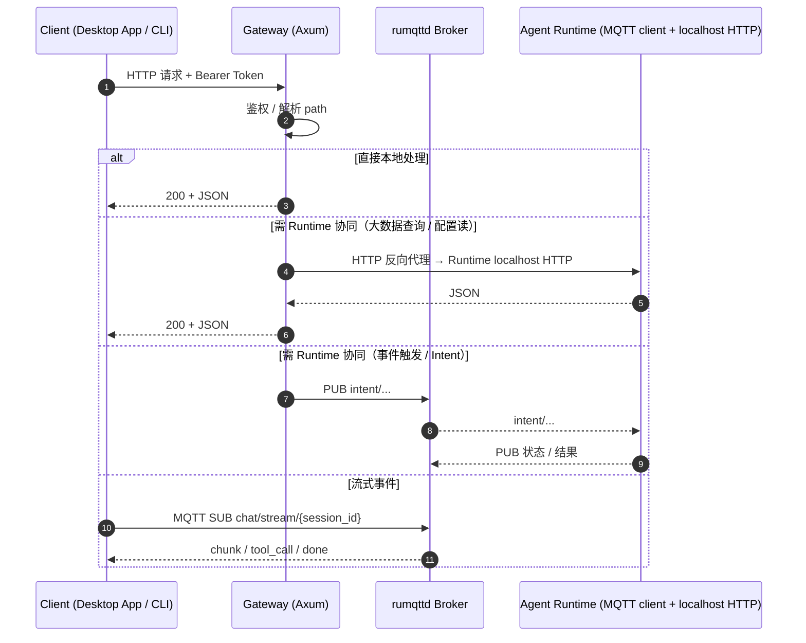

# HTTP 协议

> Gateway 暴露在 `127.0.0.1:19876`（默认）的 REST API。底层为 Axum。
> 详细路由聚合见源码：[`core/acowork-gateway/src/http/routes.rs`](../../../core/acowork-gateway/src/http/routes.rs)

---

## 1. 基础约定

- **Base URL**：`http://127.0.0.1:19876`（可在 `gateway.toml` 的 `[http]` 节调整）
- **内容类型**：`application/json; charset=utf-8`
- **认证**：当 `[http].auth_enabled = true` 时，所有 `/api/*` 请求需带
  `Authorization: Bearer <token>`，token 文件位于 `<data_dir>/http_token`。
- **错误格式**：`{ "error": "..." }` + 对应 HTTP 状态码
- **流式事件通道（MQTT）**：聊天事件流不再走 WebSocket，而是客户端订阅 [MQTT](./mqtt.md) topic `chat/stream/{session_id}`（Desktop App 通过其 Tauri 后端的 MQTT 客户端订阅）。

---

## 2. 通信流程



文字概括：

- 所有 HTTP 请求由 Gateway 单点处理。
- 仅少部分 endpoint（如 Memory、Skill 详情、大数据消息历史）需要向 Runtime 协同，结果通过 **Gateway → Runtime localhost HTTP 的反向代理**返回（不经公网）。
- 流式聊天事件走 **MQTT pub/sub**（topic `chat/stream/{session_id}`）而非 WebSocket。

---

## 3. 接口分类

### 一、系统与健康

| 方法 | 路径 | 用途 |
|------|------|------|
| GET  | `/health` | 健康检查（无鉴权），含 IPC / CronStore / 磁盘空间 |
| GET  | `/api/status` | 系统状态：版本、运行中 Agent 数、内存占用 |
| GET  | `/api/config` | 读取 Gateway 配置 |
| PUT  | `/api/config` | 更新日志级别、日志切分、idle_timeout、默认 provider/model、HF mirror 等 |
| DELETE | `/api/logs` | 清空日志 |

### 二、Agent 管理

| 方法 | 路径 | 用途 |
|------|------|------|
| GET  | `/api/agents` | 列出全部已安装 Agent（含 status、avatar） |
| GET  | `/api/agents/{id}` | Agent 详情（manifest、installed/connected 状态） |
| DELETE | `/api/agents/{id}` | 卸载 Agent |
| GET  | `/api/agents/{id}/avatar` | 取 Agent 包内置头像图片 |
| POST | `/api/agents/{id}/manifest/avatar` | 上传/更新 manifest 头像 |
| POST | `/api/agents/{id}/manifest/file` | 上传 manifest 资源文件 |
| GET  | `/api/agents/{id}/manifest/avatar-assets` | 列出 manifest 头像资源 |
| GET  | `/api/agents/{id}/avatar-file` | 取 avatar 资源文件 |
| DELETE | `/api/agents/{id}/avatar-file` | 删除 avatar 资源 |
| GET  | `/api/agents/{id}/avatar-config` | 取 avatar 运行时配置 |
| PUT  | `/api/agents/{id}/avatar-config` | 更新 avatar 配置 |
| POST | `/api/agents/install` | 安装 `.agent` 包（multipart） |
| POST | `/api/agents/{id}/clone` | 克隆 Agent（skeleton 或 full） |
| POST | `/api/agents/{id}/start` | 启动 Agent Runtime 子进程 |
| POST | `/api/agents/{id}/stop` | 停止 Agent |
| POST | `/api/agents/{id}/restart-debug` | 重启为 debug 模式（开启 Debug 通道） |
| GET  | `/api/agents/{id}/model` | 当前使用的模型 / provider |
| GET  | `/api/agents/{id}/config` | 读取 Agent 运行时配置（合并后） |
| PUT  | `/api/agents/{id}/config` | 更新 Agent 配置（max_output_tokens、temperature、prompt、avatar…） |
| GET  | `/api/agents/{id}/mcp-servers` | 读取 Agent 的 MCP 服务配置 |
| PUT  | `/api/agents/{id}/mcp-servers` | 写入 MCP 服务配置 |
| GET  | `/api/agents/{id}/search-providers` | 列出 Agent 可用的搜索 provider |
| GET  | `/api/agents/{id}/search-config` | 读取搜索配置 |
| PUT  | `/api/agents/{id}/search-config` | 写入搜索配置 |
| GET  | `/api/agents/{id}/sessions/{session_id}/state` | 会话状态快照（转发自 Runtime） |
| GET  | `/api/agents/{id}/latest-session` | 最新会话（启动时快速定位） |

### 三、Chat 与会话

| 方法 | 路径 | 用途 |
|------|------|------|
| POST | `/api/agents/{id}/message` | 发送消息（fire-and-forget；Gateway 通过 MQTT PUB Intent 推送给 Runtime） |
| GET  | `/api/agents/{id}/stream` | **已弃用**。聊天事件改为通过 [MQTT](./mqtt.md) topic `chat/stream/{session_id}` 订阅获取 |
| GET  | `/api/agents/{id}/conversations` | 会话列表 |
| GET  | `/api/agents/{id}/conversations/latest` | 最新会话消息 |
| GET  | `/api/agents/{id}/sessions` | 会话列表（运行时视角） |
| POST | `/api/agents/{id}/sessions` | 创建新会话 |
| POST | `/api/agents/{id}/sessions/{session_id}/activate` | 激活会话 |
| POST | `/api/agents/{id}/sessions/{session_id}/deactivate` | 停用会话 |
| PUT  | `/api/agents/{id}/sessions/{session_id}/title` | 重命名会话 |
| GET  | `/api/agents/{id}/sessions/{session_id}/messages` | 拉取消息历史（支持 cursor 分页） |
| DELETE | `/api/agents/{id}/sessions/{session_id}` | 删除会话 |
| POST | `/api/agents/{id}/sessions/{session_id}/close` | 关闭会话（Runtime 侧） |
| POST | `/api/agents/{id}/continue` | 继续执行（人工决策后恢复 Agent 循环） |

> 发送消息请求体示例：
> ```json
> {
>   "content": "帮我写一个 Hello World",
>   "message_id": "msg-uuid",        // 可选，前端生成的乐观 ID
>   "session_id": "sess-xxx",        // 可选，指定多会话
>   "command": "/commit",            // 可选，技能命令
>   "document_ids": ["doc-1"],       // 可选，附加文档
>   "content_parts": [...],          // 可选，多模态
>   "attached_context": [...]        // 可选，附加文件/选区
> }
> ```
> 单条 content 上限 32 KB。

### 四、工作区与文件

| 方法 | 路径 | 用途 |
|------|------|------|
| GET  | `/api/agents/{agent_id}/workspaces` | 工作区列表 |
| POST | `/api/agents/{agent_id}/workspaces` | 添加工作区目录 |
| PUT  | `/api/agents/{agent_id}/workspaces/current` | 设置当前工作区（可按 session） |
| PUT  | `/api/agents/{agent_id}/workspaces/{ws_id}` | 更新工作区（别名、access 等） |
| DELETE | `/api/agents/{agent_id}/workspaces/{ws_id}` | 删除工作区 |
| PUT  | `/api/agents/{agent_id}/workspaces/{ws_id}/prompt-file` | 设置注入 prompt 文件 |
| GET  | `/api/agents/{agent_id}/workspaces/tree` | 目录树 |
| GET  | `/api/agents/{agent_id}/workspaces/find` | 按名查找文件 |
| GET  | `/api/agents/{agent_id}/workspaces/file` | 读取文件（带元数据） |
| PUT  | `/api/agents/{agent_id}/workspaces/file` | 写入文件 |
| POST | `/api/agents/{agent_id}/workspaces/file` | 创建文件 |
| DELETE | `/api/agents/{agent_id}/workspaces/file` | 删除文件 |
| GET  | `/api/agents/{agent_id}/workspaces/file-raw` | 读取原始文件（二进制） |
| POST | `/api/agents/{agent_id}/workspaces/dir` | 创建目录 |
| DELETE | `/api/agents/{agent_id}/workspaces/dir` | 删除目录 |
| POST | `/api/agents/{agent_id}/workspaces/copy` | 复制文件/目录（Runtime 反代） |
| POST | `/api/agents/{agent_id}/workspaces/rename` | 原子重命名 file/dir（Runtime 反代） |
| GET  | `/api/agents/{agent_id}/workspaces/search` | 按内容搜索 |
| GET  | `/workspace-files/{agent_id}/{workspace_id}/{*path}` | 静态文件服务（前端直链） |
| GET  | `/ws-files/{agent_id}/{*path}` | 静态文件服务（运行时输出） |
| GET  | `/api/fs/browse` | 远程浏览服务器文件系统（仅目录列表，禁止内容读取） |

### 五、LLM Provider 与 Models

| 方法 | 路径 | 用途 |
|------|------|------|
| GET  | `/api/providers` | Provider 列表（API Key 掩码） |
| POST | `/api/providers` | 新增 Provider（key + config） |
| DELETE | `/api/providers/{provider}` | 删除 Provider |
| PUT  | `/api/providers/{provider}` | 更新 Provider（key / config） |
| GET  | `/api/models` | 所有 Provider 的模型 |
| GET  | `/api/models/{provider}` | 单一 Provider 的模型 |
| POST | `/api/models/discover` | 自定义 base URL 发现模型 |
| GET  | `/api/search/keys` | 搜索 provider 密钥列表 |
| PUT  | `/api/search/keys/{provider}` | 更新搜索 provider 密钥 |

### 六、MCP 目录

| 方法 | 路径 | 用途 |
|------|------|------|
| GET  | `/api/mcp-catalog` | 列出全部 MCP 目录项（env 字段掩码） |
| PUT  | `/api/mcp-catalog` | 整体替换目录 |
| POST | `/api/mcp-catalog` | 新增一条目 |
| DELETE | `/api/mcp-catalog/{name}` | 删除条目 |
| POST | `/api/mcp-catalog/probe` | 健康探测（探测新配置） |
| POST | `/api/mcp-catalog/{name}/probe` | 健康探测（探测已有条目） |

### 七、记忆 (Memory)

| 方法 | 路径 | 用途 |
|------|------|------|
| GET  | `/api/agents/{id}/memory/nodes` | 节点列表（分页 + 过滤：`type` / `keyword` / `time_range`） |
| GET  | `/api/agents/{id}/memory/stats` | 统计：总数、存储字节、按 type/status 分布、embedding 维度等 |
| DELETE | `/api/agents/{id}/memory/nodes/{node_id}` | 删除节点 |
| POST | `/api/agents/{id}/memory/consolidate` | 触发记忆整合（`force`、`retention_days`） |

> 上述 4 个 endpoint 均经 Gateway → Runtime localhost HTTP 的反向代理发起；Runtime 真实持有 Grafeo 存储，HTTP 反代在 [mqtt.md §Runtime HTTP Server](./mqtt.md) 详述。

### 八、技能 (Skills)

| 方法 | 路径 | 用途 |
|------|------|------|
| GET  | `/api/agents/{id}/skills` | 技能列表 |
| GET  | `/api/agents/{id}/skills/{name}` | 技能详情（SKILL.md 解析） |
| GET  | `/api/agents/{id}/skills/{name}/history` | 技能执行历史 |
| POST | `/api/agents/{id}/skills/import` | 导入技能 ZIP（multipart） |

### 九、Cron 定时任务

| 方法 | 路径 | 用途 |
|------|------|------|
| GET  | `/api/agents/{id}/cron` | 列出 Agent 的定时任务 |
| POST | `/api/agents/{id}/cron` | 注册新定时任务（schedule + action + params） |
| DELETE | `/api/agents/{id}/cron/{cron_id}` | 删除定时任务 |

### 十、嵌入模型 (Embedding)

| 方法 | 路径 | 用途 |
|------|------|------|
| GET  | `/api/embedding-models` | 列出可用嵌入模型与状态 |
| POST | `/api/embedding-models/test` | 探测模型连通性 |
| POST | `/api/embedding-models/{id}/download` | 触发模型下载 |
| POST | `/api/embedding-models/{id}/select` | 切换当前模型 |
| GET  | `/api/embedding-models/{id}/status` | 下载 / 加载状态 |
| DELETE | `/api/embedding-models/{id}` | 删除已下载模型 |
| GET  | `/api/embedding-models/migration-progress` | 嵌入维度迁移整体进度 |
| POST | `/api/embedding-models/{id}/start-migration` | 启动迁移 |

### 十一、用户与头像

| 方法 | 路径 | 用途 |
|------|------|------|
| GET  | `/api/users` | 用户档案列表 |
| POST | `/api/users` | 创建用户档案 |
| PUT  | `/api/users/{user_id}` | 更新用户档案 |
| POST | `/api/users/{user_id}/activate` | 激活用户 |
| GET  | `/api/user/avatar-config` | 当前激活用户的 avatar 配置 |
| PUT  | `/api/user/avatar-config` | 更新 avatar 配置 |
| GET  | `/api/user/avatar-assets` | 列出可用的 avatar 资源 |
| GET  | `/api/user/avatar-file` | 取 avatar 文件 |
| POST | `/api/user/avatar-file` | 上传 avatar 文件 |
| DELETE | `/api/user/avatar-file` | 删除 avatar 文件 |

### 十二、文档管理（会话级附件）

| 方法 | 路径 | 用途 |
|------|------|------|
| POST | `/api/sessions/{session_id}/documents` | 上传附件（multipart） |
| GET  | `/api/sessions/{session_id}/documents` | 列出附件 |
| DELETE | `/api/sessions/{session_id}/documents/{doc_id}` | 删除附件 |

> 附件元数据持久化到 `<data_dir>/sessions/{session_id}/documents/`，引用通过 `document_ids` 字段在 `send_message` 中传给 Runtime（Runtime 经 MQTT PUB Intent 与 Gateway 同步）。

### 十三、调试与开发工具

| 方法 | 路径 | 用途 |
|------|------|------|
| GET  | `/api/lsp/endpoint` | 取 LSP Relay 端点 |
| POST | `/api/agents/{id}/restart-debug` | 重启 Agent 为 debug 模式（开启 Debug 通道，开发者工具） |

### 十四、交互（审批 / 问答）

| 方法 | 路径 | 用途 |
|------|------|------|
| POST | `/api/agents/{agent_id}/approval` | 用户对工具调用的允许/拒绝决策（push 为 `approval_decision` Intent） |
| POST | `/api/agents/{agent_id}/question` | 用户回答 `ask_user_question` 提示（push 为 `question_answer` Intent） |

### 十五、打包发布

| 方法 | 路径 | 用途 |
|------|------|------|
| POST | `/api/agents/{id}/publish/prepare` | 准备打包（校验、清理） |
| POST | `/api/agents/{id}/publish/build` | 构建 `.agent` 包 |
| POST | `/api/agents/{id}/publish/export` | 导出包到目标路径 |
| POST | `/api/agents/{id}/publish/install-locally` | 本地安装构建产物 |

---

## 4. 通用错误码

| 状态码 | 场景 |
|--------|------|
| 400 | 参数校验失败、content 过长、id 格式不合法 |
| 401 | Bearer token 缺失或错误 |
| 404 | Agent / 资源不存在 |
| 409 | 状态冲突：Agent 未运行、未安装 |
| 500 | Gateway 内部错误 |
| 502 / 503 | MQTT / 反向代理通道不可用，Runtime 未连接 |
| 504 | Gateway → Runtime 请求超时 |

---

## 5. 典型请求示例

### 5.1 安装 Agent

```http
POST /api/agents/install HTTP/1.1
Authorization: Bearer <token>
Content-Type: multipart/form-data; boundary=----abc

------abc
Content-Disposition: form-data; name="package"; filename="hello.agent"
Content-Type: application/octet-stream

<binary>
------abc--
```

### 5.2 启动 Agent 并发送消息

```http
POST /api/agents/{id}/start HTTP/1.1
Authorization: Bearer <token>
```

```http
POST /api/agents/{id}/message HTTP/1.1
Authorization: Bearer <token>
Content-Type: application/json

{
  "content": "你好",
  "message_id": "msg-11111111",
  "session_id": "sess-active"
}
```

响应 `200`：

```json
{ "message_id": "msg-11111111", "status": "sent" }
```

随后客户端通过订阅 [MQTT](./mqtt.md) topic `chat/stream/{session_id}` 接收 `chunk` / `done` 事件流。`GET /api/agents/{id}/stream`（旧 WebSocket 端点）已弃用。

### 5.3 查询 Memory

```http
GET /api/agents/{id}/memory/nodes?page=1&size=20&type=Episodic&time_range=7d HTTP/1.1
Authorization: Bearer <token>
```

---

## 6. 注意事项

1. **Gateway 不持久化业务数据**：Memory、Skill、Agent 配置等真实数据存于 Runtime 本地文件 / Grafeo；Gateway 通过 **HTTP 反向代理** Runtime localhost HTTP 拉取快照或透传请求，事件触发则通过 **MQTT PUB Intent**。
2. **多数写操作会触发热推送**：例如修改 Provider / MCP / Search 配置后，Gateway 通过 MQTT **retained publish** 向所有已连接的 Runtime（订阅对应资源的 topic）同步最新可用列表，详见 [mqtt.md §全局资源可用性广播](./mqtt.md)。
3. **CORS**：默认仅允许本地（Tauri、localhost:3000/5173）；远程 Desktop 场景需设置 `cors_enabled = true`。
4. **静态文件服务**：`/workspace-files`、`/ws-files` 路径由 Axum router 直接返回文件流，供前端  / 视频等直接引用（命名保留历史，不变更）。
