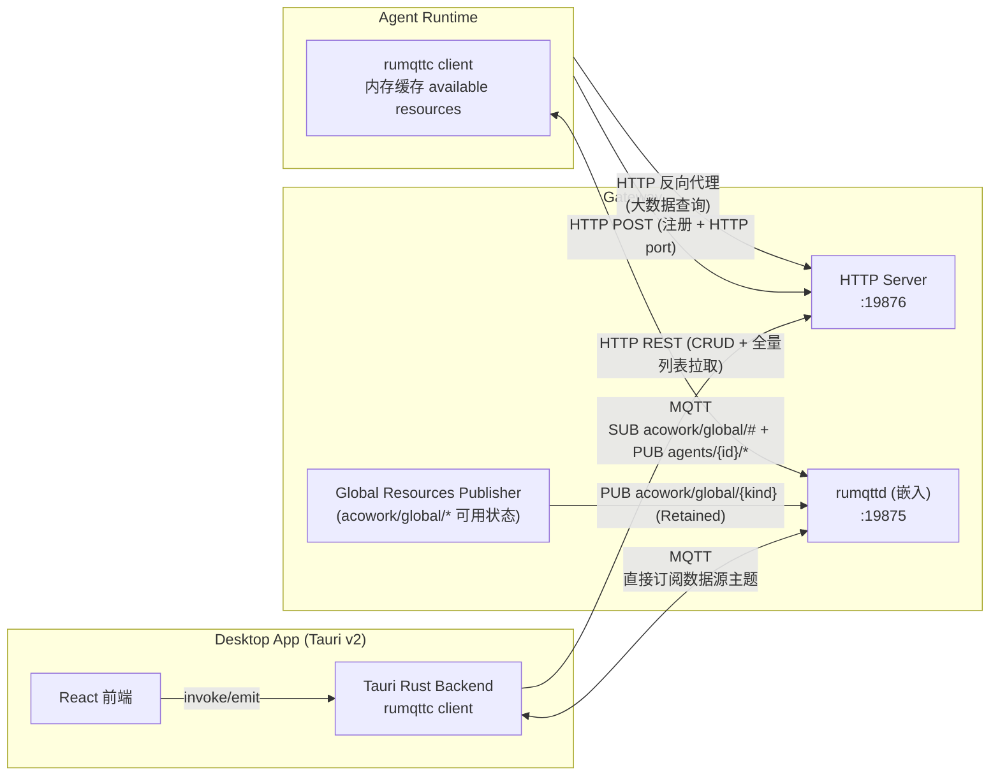
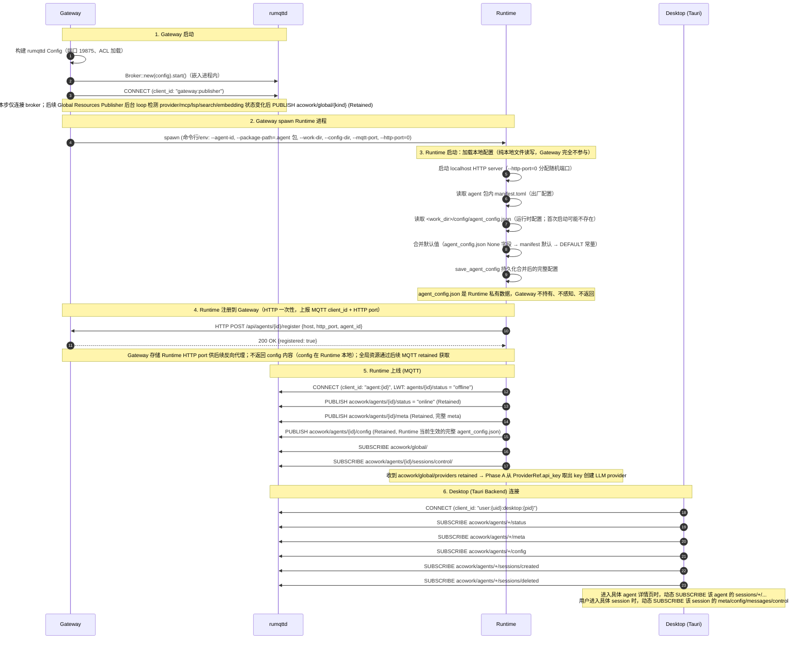
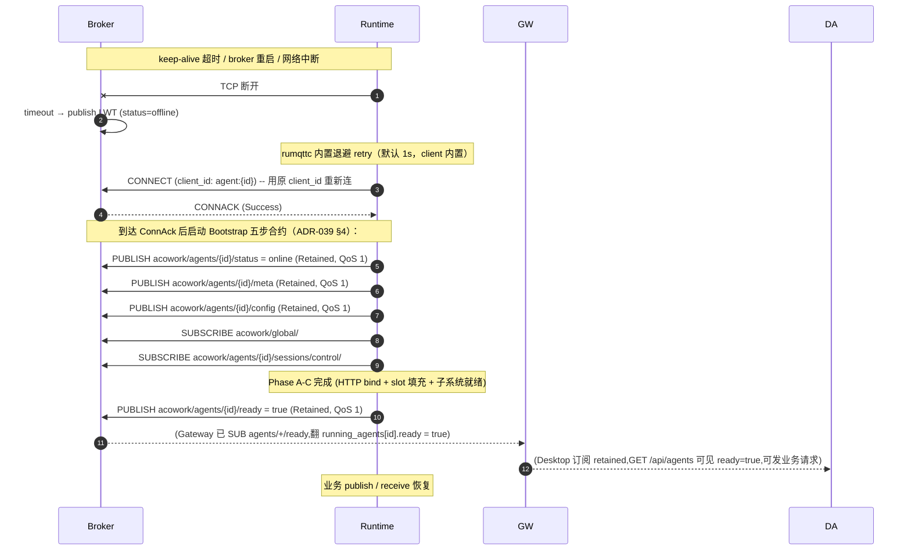
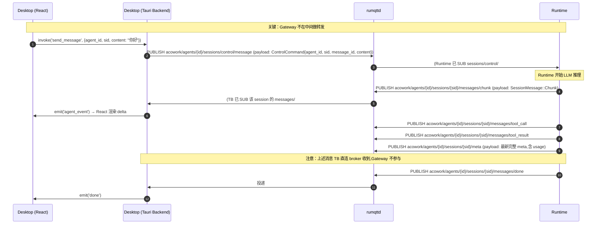
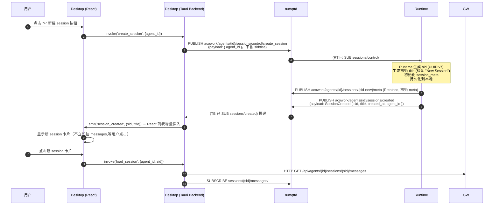
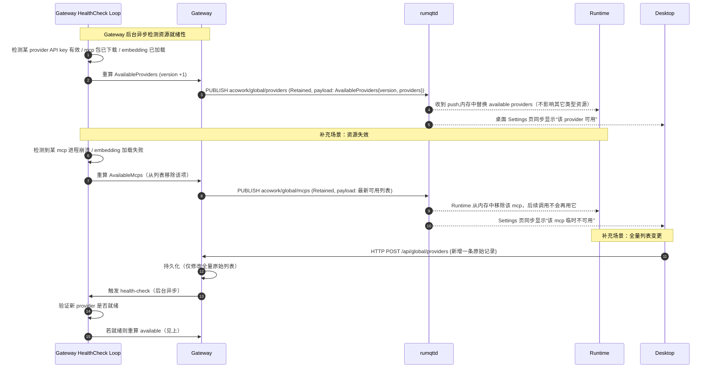
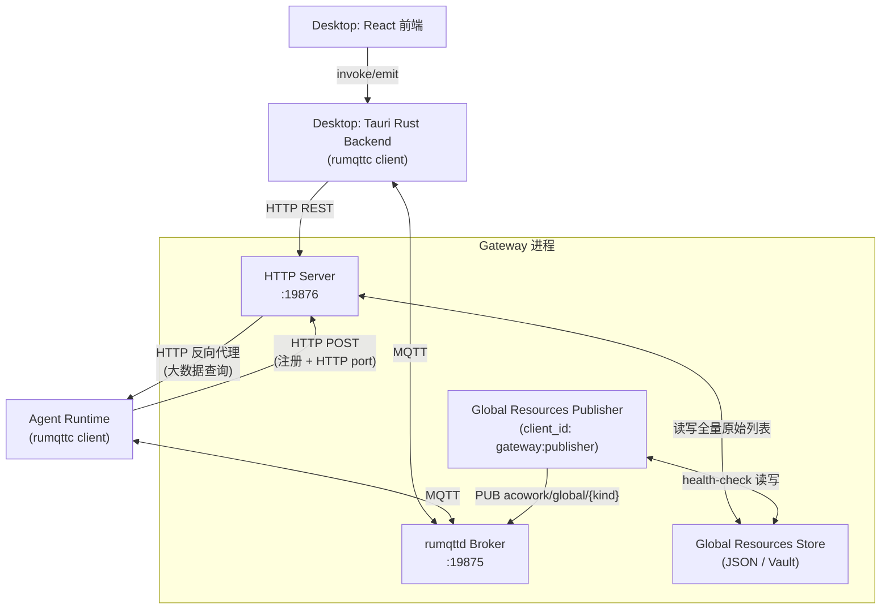

# MQTT 协议

> Gateway 内嵌 MQTT Broker（[`rumqttd`](https://github.com/bytebeamio/rumqtt)），承担 **实时事件总线 + 轻量级状态同步** 职责。Topic 树遵循 **"按数据源 pub/sub"** 原则：每个主题代表一份数据资源，发布者 = 数据源权威，订阅者按需订阅。

---

## 1. 基础约定

- **Broker 端口**：`127.0.0.1:19875`（TCP，MQTT 3.1.1）
- **连接上限**：`100`（实际连接数 ≤ 100：N 个 Runtime + 1 个 Gateway publisher + M 个 Desktop client）
- **单包上限**：`10 MB`
- **Payload 编码**：Protobuf 二进制（独立文件 `mqtt_payload.proto`，独立命名空间，不与其他任何 proto 共享定义）
- **协议版本**：MQTT 3.1.1（**不使用 MQTT 5.0**）
- **角色库**：`rumqttd`（broker，仅 Gateway）+ `rumqttc`（client，Runtime / Desktop / Gateway publisher 统一使用），`Cargo.toml` 各一行
- **认证**：单用户阶段依赖 localhost-only 绑定；多用户阶段启用 rumqttd 内置 ACL

> **MQTT 不承载 req/res 模式**：任何"等待对方回复"的场景都走 HTTP。Runtime 是 MQTT pub/sub 客户端 + localhost HTTP server（供 Gateway 反向代理大数据查询）。Gateway 是 broker 宿主 + 全局资源权威 + HTTP server + 反向代理，不做业务事件转发。

---

## 2. 总体架构



**文字概括**：

1. **Gateway 嵌入 rumqttd**，与 HTTP server 共生。Gateway 承担三件事：
   - **broker 宿主**：管理 MQTT 连接、ACL、retained 存储。
   - **HTTP server**：CRUD、Desktop 全量列表拉取（Settings）、Runtime 启动期注册。
   - **Global Resources Publisher**：发布 `acowork/global/{kind}`(单主题,Retained)——Gateway 后台 health-check 后重新计算出的“已就绪”资源列表（**不区分 agent**，所有 Runtime 共享同一份）。
2. **Runtime 是 MQTT 客户端 + localhost HTTP server**：`rumqttc` 直连 Broker，只 PUBLISH 自己拥有的数据源（`agents/{id}/*` 下所有主题），SUBSCRIBE 自己关心的资源（`acowork/global/#` + `agents/{id}/sessions/control/#`）。同时启动 localhost-only HTTP server，供 Gateway 反向代理大数据查询（全量 session 列表、message 列表、memory graph、文件内容）。
3. **Desktop 是纯 MQTT 客户端**：通过 Tauri Rust backend 用 `rumqttc` 直连 Broker，SUBSCRIBE 数据源主题（`agents/{id}/*`）。**不经过 Gateway 转发**。
4. **全局资源三层分离**（详见 §3.1）：
   - **全量原始列表**：HTTP only（`GET/POST/PUT/DELETE /api/global/{kind}`），Desktop Settings 用。
   - **已就绪可用状态**：MQTT pub/sub（`acowork/global/{kind}` 单主题,Retained），所有 Runtime 共享。Gateway 是唯一权威。
   - **Runtime per-agent 运行时数据**（agent_config.json / agent_mcp.json / agent_search.json）：Runtime 本地文件，通过 `agents/{id}/config` MQTT retained 同步给 Desktop（无需 HTTP GET）。
5. **Gateway 不再转发业务事件**。Runtime 发布的 session 事件由 Desktop **直接订阅** `agents/{id}/sessions/{sid}/messages/...`；Desktop 发布的 control 指令**直接 PUB** `agents/{id}/sessions/control/...`（sid 在 payload 中），Runtime 自己 SUBSCRIBE `agents/{id}/sessions/control/#` 即可。

---

## 3. Topic 树（按数据源）

### 3.1 全局资源全量列表(只读静态数据,HTTP only)

**全局资源全量列表(provider list、mcp list、lsp list、search list、embedding model list)走 HTTP,不走 MQTT。**

这些列表是用户在 Desktop Settings 里管理的原始数据(已配置但未必"就绪")——比如用户添加了一个 provider 但还没填 API key,或者一个 mcp 包还在下载。Desktop 一次性 HTTP 拉取整张表渲染表单,提交修改时 HTTP POST 回去,**不需要任何订阅/通知机制**。

```
# ⚠️ 没有 MQTT 主题

HTTP 端点:
  GET    /api/global/providers           # 全量 provider 列表
  GET    /api/global/mcps               # 全量 MCP 列表
  GET    /api/global/lsps               # 全量 LSP 列表
  GET    /api/global/searches           # 全量 search provider 列表
  GET    /api/global/embedding_models   # 全量 embedding model 列表
  POST   /api/global/{kind}             # 新增一条(Desktop Settings 提交)
  PUT    /api/global/{kind}/{id}        # 更新一条
  DELETE /api/global/{kind}/{id}        # 删除一条
```

- **Owner**:Gateway(JSON 文件 / Vault 加密键值存储持久化)。
- **订阅者**:**无 MQTT 订阅者**。Desktop App 在 Settings 页加载时一次性 HTTP 拉取,用户手动刷新页面重新拉取;Runtime 完全不关心这个表(见 §3.1.2)。
- **修改入口**:用户通过 Desktop Settings 调 `POST/PUT/DELETE /api/global/{kind}`,Gateway 持久化后返回新列表,前端刷新页面。

> **为什么不走 MQTT?**
>
> 1. 全量列表数据基本静态(几 KB~几十 KB),没有"增量订阅"的强需求。
> 2. Desktop 已经有 Settings 页面,点击即拉,无需订阅通知。
> 3. Runtime 用不到全量列表——它只需要 Gateway 已经验证"就绪"的那一份(见 §3.1.2)。
> 4. 引入 MQTT 主题会带来 retained 同步、一致性维护、ACL 等额外复杂度,对静态数据不划算。

### 3.1.1 全局资源可用状态(Gateway 权威,所有 Runtime 共享)

§3.1 的"全量列表"是用户配置的原始数据。**Gateway 在后台会对这些资源做就绪性检查**——provider 是否已绑定 API key、mcp 包是否已下载完成、embedding model 是否已加载到 onnx runtime——只有"就绪"的资源才会出现在这里。这是 Runtime **真正需要订阅**的数据,因为 Runtime 只能使用已就绪的资源去调用。

**为什么只需单一主题?** MQTT Retained Message 已经原生实现"新订阅者拿到当前状态 + 后续变化推"两个语义——publisher 每次 PUBLISH 时带 retain=true,Broker 仅为该主题保存最后一条消息;新订阅者连接后立即收到该 retained(快照),后续 publisher 变化时收到 push(增量)。**不**需要额外拆出 `available` / `change` 两个子主题。

```
acowork/global/
├── providers                  # [Retained] 当前已就绪的 provider 列表
│                              # payload = AvailableProviders {
│                              #   version: u64,
│                              #   providers: [ProviderRef],   # 仅包含 Gateway 验证过的
│                              #   default_compact_model:   # [ADR-056] 跨 provider 备选项
│                              #     Option<CompactModelRef>,# 全局默认精简模型(Runtime 蒸馏 fallback 链 Level 1)
│                              # }
│                              # 注：ProviderRef 内嵌 `api_key` 字段
│                              # （Gateway 在 PUBLISH 前从 Vault 解密后填入）
├── mcps                       # [Retained] 当前已就绪的 MCP 列表
│                              # 注：McpRef 内嵌 `auth_token` 字段
│                              # （提取自 catalog 中 env/headers 的 token 类键值）
├── lsps                       # [Retained] 当前已就绪的 LSP 列表
├── searches                   # [Retained] 当前已就绪的 search provider 列表
│                              # 注：SearchRef 内嵌 `api_key` 字段
│                              # （Gateway 从 Vault 解密后填入）
├── embedding_models           # [Retained] 当前已就绪的 embedding model 列表
└── user_profile               # [Retained, ADR-042] 当前 active user 的 profile 快照
                               # payload = AvailableUsers {
                               #   version: u64,                 # 镜像 user_profile_list.version
                               #   active_user: UserProfileRef { # 空 user_id = 无 active user
                               #     user_id, display_name, language, timezone,
                               #     city?, country?, occupation?, communication_style?,
                               #     custom_json,
                               #   },
                               # }
                               # 注：Runtime 启动后用此快照构造 identity_context，
                               # 供 compaction system prompt 注入语言偏好。
                               # 用户在 Desktop Settings 切换 active profile 时
                               # Gateway 重 publish 此主题，Runtime 立即收到。
```

**为什么密钥在 `acowork/global/*` 主题里一起发布？** 这是 Runtime **唯一**的密钥获取路径——Runtime 启动时只 SUB `acowork/global/#`，所有密钥随 retained payload 一次性下发：

1. **Gateway 是 broker 的同进程宿主**（见 §11），broker 只绑定 localhost（`127.0.0.1`），不出主机。PUBLISH 的 payload（含解密的密钥）不会进入网络。
2. **Runtime 与 Gateway 同用户**——Runtime 是 Gateway 拉起的子进程，不存在"跨租户"密钥泄露场景。
3. **运行期变更推送**——用户从 Desktop 改了某个 provider 的 API key、添加了新 MCP token、改了 search key 后，Gateway health-check 触发 publisher 重算并重发 `acowork/global/{kind}`（retain=true）。所有已订阅的 Runtime **立即**收到带新密钥的 push，无需重新启动或额外的 request/response 往返。

密钥是 **acowork/global/* retained push 通道** 的合法载荷，**不是**违反 §28 “MQTT 不承载 req/res 模式”（这里没 req/res 语义，就是单向 PUBLISH 推快照 + 后续变更）。


- **Owner**:**Gateway**(数据源权威)。Gateway 后台 health-check loop 检测到 provider/mcp/lsp/search/embedding 状态变化(就绪/失效/卸载)时,重算该主题 payload 并 PUBLISH(retain=true)。
- **订阅者**:
  - **所有 Runtime**(`SUB acowork/global/#`)——Runtime 启动后立即收到 retained 当前快照,在内存中缓存(不需要持久化)。后续变化直接收到 push。
  - **Desktop**(可选,SUB `acowork/global/#`)——用于 Settings 页实时显示"某 provider 暂时不可用"等状态。
- **关键性质**:**不区分 agent**。所有 Runtime 看到的是同一份可用清单——因为"provider 已就绪"是全局事实,不是某个 agent 的属性。
- **触发场景**:
  - 用户在 Settings 新增 provider 并填好 API key → Gateway health-check 通过 → PUBLISH `acowork/global/providers`(retain=true)
  - 一个 mcp 包下载失败 / 进程崩溃 → Gateway 检测 → 重算 payload 后 PUBLISH `acowork/global/mcps`(retain=true)
  - embedding model 加载完成 / 卸载 → PUBLISH `acowork/global/embedding_models`(retain=true)
  - Runtime 启动时立即收到 retained 当前快照;后续状态变化收到 push
  - **ADR-042**:用户在 Settings 增/改/删 user profile 或切换 active user → Gateway 重 publish `acowork/global/user_profile`(retain=true)。Runtime 收到后通过 `SessionManager::update_user_identity` broadcast 到所有 session 的 `ContextBuilder.identity_context`。
  - **ADR-056**:用户在 Harness 的"全局默认精简模型"卡片里选了一个跨 provider 的 `(provider_id, model_id)` 引用并保存(走 `PUT /api/settings/default-compact-model`)→ Gateway 写盘 + 自触发 publisher → `AvailableProviders.default_compact_model` 字段更新 → 重 publish `acowork/global/providers`(retain=true)。Runtime 收到后用此字段刷新 `AgentCore.default_compact_model`,成为蒸馏 fallback 链 Level 1 候选。
- **无 HTTP 兜底**：Runtime 启动后 `SUB acowork/global/#` 立即收到所有 retained 快照；断线重连后再次 SUB 同样立即收到最新 retained。MQTT Retained Message 原生语义已覆盖"快照 + 增量"两种需求，**不**提供 `GET /api/global/{kind}/available` 这类 HTTP 兜底接口。
- **冲突解决**:Runtime 收到 push 时比较 `version`,新版本覆盖本地缓存,旧版本忽略(防止乱序)。
- **QoS**:1(状态变更不能丢)。

> **为什么 Runtime 必须订阅这一层?**
>
> Runtime 不能每次调用前都 HTTP 拉一次(频繁/慢),也不能用"全量列表"(可能包含未就绪的资源)。Retained + push 模式让 Runtime 在启动后就能拿到一份"现在能用什么"的实时视图,后续增量同步变化。
>
> 此外,所有 Runtime 看到的是同一份数据——这是它**不放在 `agents/{id}/` 下的根本原因**:没有 per-agent 差异。
>
> 这一层同时**携带每个 provider/MCP/search 的解密后密钥**——Runtime 启动后 Phase A 解析 retained payload，从 `ProviderRef.api_key` 取得 OpenAI/Anthropic 等 LLM provider 的 API key、从 `McpRef.auth_token` 取得 MCP bearer token、从 `SearchRef.api_key` 取得 search provider key，填入 provider factory 与 MCP 客户端。这就是 §5.1 启动流程中 Runtime 一行 SUB `acowork/global/#` 就拿到全部启动期所需状态的根因。
>
> **为什么不用 `current` / `update` 两个子主题?**
>
> - `current` Retained + `update` 普通 两阶段的设计目的是区分"快照语义 vs 增量语义"。
> - 但 MQTT Retained **本身就是快照**，而普通 PUBLISH **本身就是增量**——一个主题 + retain=true 同时实现了这两个语义。
> - 本文档统一采用单主题 + Retained：`acowork/global/{kind}`、`acowork/agents/{id}/meta`、`acowork/agents/{id}/config`、`acowork/agents/{id}/sessions/{sid}/meta`、`acowork/agents/{id}/sessions/{sid}/config` 都不拆双主题。

### 3.1.2 Runtime 端真正维护的 per-agent 状态（本地文件，通过 MQTT retained 同步）

Runtime 拿到 §3.1.1 的可用资源后，**用户从这些可用资源里选了哪几个、怎么激活的**，是 Runtime 自己持久化的 per-agent 状态——**不进 MQTT 事件总线**，但通过 `agents/{id}/config` retained 主题同步给 Desktop：

1. 它是 Runtime 工作区的本地文件（`agent_config.json`、`agent_mcp.json`、`agent_search.json` 等），不是"广播数据"
2. Runtime 启动时加载并合并 manifest 默认值后，**PUBLISH `agents/{id}/config` retained**（包含 agent_config 全部字段 + MCP 选择 + Search 选择），Desktop 订阅该主题即可获得最新完整配置
3. Desktop 不需要 HTTP GET 拉取这些数据——MQTT retained 保证了订阅后立即收到最新快照
4. Gateway 不需要知道 Runtime 内部如何筛选资源——它只关心"哪些资源已就绪"

| 文件 | 位置 | 内容 | Desktop 获取方式 |
|------|------|------|-----------------|
| `agent_config.json` | `<workspace>/agents/{id}/config/` | per-agent 运行时参数（temperature、context_window、max_output_tokens、system_prompt_override、avatar 等），初始化自 manifest.toml 默认值 | SUB `agents/{id}/config` retained（Runtime 启动时 PUBLISH，变更时重新 PUBLISH） |
| `agent_mcp.json` | `<workspace>/agents/{id}/` | 用户从 available mcps 中激活的子集（per-agent） | 已包含在 `agents/{id}/config` retained 内（`active_mcp_servers` 字段） |
| `agent_search.json` | `<workspace>/agents/{id}/` | 用户从 available searches 中激活的子集（per-agent） | 已包含在 `agents/{id}/config` retained 内（`search_config` 字段） |
| `session_meta` | `<workspace>/agents/{id}/sessions/{sid}/` | 当前 session 选择的 provider/model/embedding model（per-session，不是 per-agent 持久状态） | SUB `agents/{id}/sessions/{sid}/meta` retained（动态订阅） |

**资源使用分层总结**:

```
┌─────────────────────────────────────────────────────────────────┐
│  第 1 层:全量原始列表(用户管理,HTTP only,不走 MQTT)            │
│  Gateway / Vault → Desktop Settings(CRUD)                       │
│  provider list、mcp list、lsp list、search list、embedding list │
└─────────────────────────────────────────────────────────────────┘
                              │ Gateway 后台 health-check
                              ▼
┌─────────────────────────────────────────────────────────────────┐
│  第 2 层:已就绪可用状态(Gateway 权威,MQTT pub/sub 单主题)       │
│  Gateway → acowork/global/{kind} (Retained)                      │
│  不区分 agent,所有 Runtime 共享同一份                          │
│  Runtime 内存缓存,启动后 retained 快照 + 后续 push 增量同步      │
└─────────────────────────────────────────────────────────────────┘
                              │ Runtime 从 available 中选择激活
                              ▼
┌─────────────────────────────────────────────────────────────────┐
│  第 3 层：Runtime 端 per-agent 运行时数据（本地文件，MQTT retained 同步）│
│  agent_config.json（运行时参数）+ agent_mcp.json + agent_search.json │
│  session_meta 中的 provider/model（per-session）                  │
│  Desktop 通过 MQTT retained 获取：                                │
│  SUB  agents/{id}/config（含全部 config + MCP + Search）          │
│  SUB  agents/{id}/sessions/{sid}/meta（进入 session 时动态订阅）   │
│  写入通过：PUT /api/agents/{id}/config → Gateway MQTT control →   │
│           Runtime 应用 + 保存 + 重新 PUBLISH retained              │
└─────────────────────────────────────────────────────────────────┘
```

### 3.2 Agent 数据源（Runtime 权威）

```
acowork/agents/{agent_id}/
├── status                            # [Retained + LWT] "online" | "offline"
│                                     #   LWT payload: "offline"（异常断开时 Broker 自动发布）
│                                     #   正常上线时 PUBLISH "online" (retained)
├── ready                             # [Retained] "true" | "false"
│                                     #   Runtime 启动完成 Phase A–C 后 PUBLISH "true"：
│                                     #     Phase A: HTTP server bind + listen
│                                     #     Phase B: session_metadata / session_config / memory_query / workspace_query slot 填充
│                                     #     Phase C: chunk_relay / DevMode / MCP subsystem spawn
│                                     #   Gateway 据此翻转 `running_agents[id].ready`，
│                                     #   `/api/agents` 立刻可见；Desktop 由此知道
│                                     #   `/sessions/{sid}/messages` 等请求可发，不再 503。
│                                     #   Runtime 在 idle auto-sleep / 退出前 PUBLISH "false"。
│                                     #   与 `status` 不同：`status` 只表示 MQTT broker 上
│                                     #   进程可达；`ready` 才表示 HTTP 服务可响应业务请求。
├── meta                              # [Retained] agent 元数据：ID、地址、status 状态信息
│                                     #   （payload 始终是最新完整 AgentMeta，包含 status 变化）
├── config                            # [Retained] Runtime 当前生效的完整 agent_config.json
│                                     #   内容 = 运行时配置文件，存于 Runtime 工作区
│                                     #   （<work_dir>/config/agent_config.json）
│                                     #   由 Runtime 自己加载/保存，Gateway 完全不持有
│                                     #   payload 始终是最新完整内容（合并 manifest 默认值
│                                     #   + 用户修改后的 agent_config.json 完整值）
│                                     #   Owner：Runtime
│                                     #   用途：Desktop 订阅同步 UI 显示；
│                                     #         Desktop 通过 HTTP PUT 修改
│                                     #   不存在“Runtime 向 Gateway 拉 config”这种流程
├── sessions/
    ├── created                       # 【增量事件】agent 下发生了 session 创建
    │                                 #   Runtime PUBLISH，Desktop SUB
    │                                 #   payload = SessionCreated { sid, title, created_at, agent_id }
    │                                 #   sid 由 Runtime 分配后放入 payload，不出现在 topic 路径中
    ├── deleted                       # 【增量事件】agent 下发生了 session 删除
    │                                 #   Runtime PUBLISH，Desktop SUB
    │                                 #   payload = SessionDeleted { sid, deleted_at, agent_id }
    │                                 #   sid 在 payload 中，不出现在 topic 路径中
    ├── control/                      # 【控制指令】Desktop PUB → Runtime SUB
    │                                 #   Runtime 接收后处理，控制某个具体 session 的生命周期或行为
    │                                 #   create_session / delete_session 不需带 sid（sid 在 payload 中）
    │   ├── create_session            # Desktop PUB：发起创建动作
    │   │                             #   payload = CreateSessionCommand { agent_id }
    │   │                             #   （sid 由 Runtime 分配后写入 created 事件的 payload）
    │   ├── delete_session            # Desktop PUB：发起删除动作
    │   │                             #   payload = DeleteSessionCommand { agent_id, sid }
    │   ├── message                   # payload = { agent_id, sid, message_id, content }
    │   ├── stop                      # payload = { agent_id, sid }
│   ├── cancel_tool               # ADR-045 payload = { agent_id, sid, tool_call_id }
│   │                             #   取消单工具（区别于 stop 整轮），到达即终止对应工具进程
    │   ├── model_switch              # payload = { agent_id, sid, model_id }
    │   ├── reasoning_effort          # payload = { agent_id, sid, effort }
    │   └── compact_context           # payload = { agent_id, sid }
    └── {sid}/                        # session 内部状态（sid 在路径中定位具体 session）
        ├── meta                      # [Retained] session meta：usage、state、title、...
        │                             #   （payload 始终是最新完整 meta）
        ├── config                    # [Retained] session config
        │                             #   （payload 始终是最新完整 config）
        └── messages/                 # 【增量事件】该 session 的消息事件（全量走 HTTP）
            ├── chunk                 # LLM 输出片段
            ├── tool_call             # LLM 调用工具
            ├── tool_result           # 工具返回
            ├── done                  # 本轮完成
            ├── error                 # 错误
            ├── stopped               # 已停止
            ├── tool_progress          # ADR-045 工具进度心跳（5s 间隔）
            ├── ask_question          # LLM 询问用户
            ├── todo_updated          # todo 列表更新
            ├── reasoning_started     # 推理阶段开始
            ├── reasoning_ended       # 推理阶段结束
            ├── compacting_started    # 上下文压缩开始
            ├── compacting_ended      # 上下文压缩结束
            ├── context_usage         # 上下文用量
            ├── memory_updated        # session 内 Memory 发生变更（通知性事件）
            └── skill_executed        # 技能执行完毕
└── memory/                           # Agent 记忆图（Grafeo）数据源
    └── nodes/                        # node 级别增量事件
        └── {nid}/update              # 【增量事件】Memory node 增删/整合
                                      #   payload = 最新完整 node
                                      #   全量走 HTTP GET /api/agents/{id}/memory/graph
```

- **Owner**：Runtime。
- **Session list**：**不走 MQTT**。客户端通过 HTTP `GET /api/agents/{id}/sessions` 拉取全量；列表变化通过订阅 `agents/{id}/sessions/created` 与 `agents/{id}/sessions/deleted` 收到事件通知后增量更新（sid 在 payload 中）。所有 session 生命周期（创建/删除）由 Desktop 通过 `sessions/control/create_session` / `sessions/control/delete_session` 触发 Runtime 执行；sid、title 由 Runtime 分配/生成后写入 `created` 事件的 payload 供 Desktop 识别（详见 §5.3）。Runtime 不主动创建 session。
- **Session 内状态**：按 sid 定位 `sessions/{sid}/meta` / `sessions/{sid}/config`（单主题 + Retained，参见下文）。sid 由 Runtime 分配后写入事件 payload，订阅者拿到 created 事件后可用 sid 订阅这些状态主题。
- **Control 指令**：`sessions/control/{cmd}` 是 Desktop → Runtime 单向控制流（Runtime 不需要回 ack）。`create_session` 不带 sid（Runtime 创建后自行分配并通过 created 事件告知）；`delete_session` / `message` 等带 sid（Runtime 需要知道操作哪个 session）。
- **Session messages 全量 vs 增量**：
  - 全量：`GET /api/agents/{id}/sessions/{sid}/messages`（HTTP 拉）
  - 增量：订阅 `agents/{id}/sessions/{sid}/messages/#`，收到 `chunk` / `tool_call` / `done` 等事件
- **Session meta / config**：单主题 + Retained。`meta` / `config` 的 payload **总是最新完整内容**（包括 usage、state），订阅者无需再回 HTTP 拉。新订阅者连接后立即收到 retained（快照），后续变化收到 push（增量）——Retained 原生提供快照 + 增量两种语义，无需拆双主题。
- **HTTP 备份**：`GET /api/agents/{id}/sessions`（list）、`GET /api/agents/{id}/sessions/{sid}/messages`（messages 全量）、`GET /api/agents/{id}/sessions/{sid}/state`（meta 全量）等。

### 3.3 Sidecar 状态（边车进程权威）

```
acowork/sidecar/
└── {kind}/                           # lsp_relay | embed | ...
    └── status                        # [Retained] 端点地址 + 健康状态
```

- **Owner**：Sidecar 进程本身（或代理它的 Gateway 内部组件）。
- **HTTP 备份**：`GET /api/sidecar/{kind}`。

### 3.4 用户级（预留，多用户阶段启用）

```
acowork/users/{user_id}/
└── notifications/                    # 个人级通知（用户偏好触达、特定 agent 提醒等）
    └── inbox/                        # 收件箱式通知
        └── {notification_id}/update
```

- 当前阶段不启用；多用户阶段配合 ACL 限制仅本人可订阅。

### 3.5 设计原则（精炼）

1. **按数据源分类**：主题路径表达“是哪份数据”（`agents/{id}/sessions/{sid}/messages` 是某个 session 的消息流；`acowork/global/{kind}` 是某类全局资源的可用状态）。**不按业务流分类**（没有 `stream/control/usage` 这类按动作命名的主题）。
2. **Owner 单一**:每份数据由唯一的发布者(Gateway 拥有 `acowork/global/*`——所有 Runtime 共享的可用资源;Runtime 拥有 `agents/{id}/*` 下所有主题)。订阅者不修改数据本身。
3. **Retained 本身就是快照，推送本身就是增量**：publisher 每次 PUBLISH retain=true 覆盖上条 retained，新订阅者连接后立即收到 retained（快照语义），后续变化时收到 push（增量语义）。全文档统一采用单主题 + retained（`acowork/global/{kind}`、`agents/{id}/meta`、`agents/{id}/config`、`agents/{id}/sessions/{sid}/meta`、`agents/{id}/sessions/{sid}/config` 均不拆 `current/update` 双主题）。
4. **list 走 HTTP、变化走 MQTT**：session list 这类**频繁变化且仅在操作时点查询**的资源，全部走 HTTP；只有"列表中具体某条目的变化"才用 MQTT 通知（`created` / `deleted`），避免 retained list 频繁失效。
5. **snapshot 走 HTTP、增量走 MQTT**：session messages / memory nodes 这类**会被大量读且会持续增长**的资源，全量走 HTTP，**增量事件**走 MQTT（payload 本身就是最新数据，无需订阅者回拉）。
6. **Gateway 只透传不转发**:Gateway 是 broker 宿主 + `acowork/global/*`(可用状态)数据源权威 + HTTP server。**不**作为 session 事件的"中转站",**不**维护 session 状态视图——session 权威在 Runtime,Desktop 直连即可。
7. **变化 payload 总是包含最新值**：订阅 `meta` / `agents/{id}/config` / `acowork/global/{kind}` / `sessions/{sid}/meta` / `sessions/{sid}/config` 时，payload 总是完整最新数据，订阅者无需回 HTTP 拉快照。其中 `agents/{id}/config` 是 Runtime 当前生效的完整 agent_config.json（合并 manifest 默认值后的有效配置）—— Gateway 完全不参与 config 同步，Runtime 启动时从本地 `<work_dir>/config/agent_config.json` 加载，Desktop 改 config 通过 `PUT /api/agents/{id}/config` → Gateway 透传 → Runtime 内部 IPC 写入本地文件 + PUBLISH 新值。
8. **Gateway 不在 Runtime 与 Desktop 之间做转发**：Runtime 发布的 session 事件由 Desktop **直接订阅** `agents/{id}/sessions/{sid}/messages/...`；Desktop 发布的 control 指令**直接 PUB** `agents/{id}/sessions/control/...`。Runtime 是 session 权威，Gateway 不维护 session 状态视图。
9. **全局资源三层分离**:
   - **第 1 层 - 全量原始列表**(用户在 Desktop Settings 里管理的原始配置):HTTP only,不走 MQTT。Desktop Settings 拉取后表单渲染,提交修改走 HTTP POST。
   - **第 2 层 - 已就绪可用状态**(Gateway health-check 后的可用资源):MQTT pub/sub,主题为 `acowork/global/{kind}`(单主题,Retained)。**不区分 agent**,所有 Runtime 共享同一份,因为"资源是否就绪"是全局事实。
   - **第 3 层 - Runtime per-agent 持久化选择**(`agent_mcp.json` / `agent_search.json`):本地文件,Desktop 通过 HTTP 拉 agent config 查看,不走 MQTT。
   - **为什么不能把第 2 层放到 `agents/{id}/` 下**:所有 agent 看到的可用资源完全相同,放在 per-agent 主题下会造成冗余数据;所有 Runtime 都 SUB `acowork/global/#` 即可。
10. **全局资源原始列表 vs 可用状态 vs agent 选择不可混淆**:
    - 全量原始列表 = 用户管理,HTTP only
    - 可用状态 = Gateway 验证后的运行时真相,MQTT pub/sub(全局共享)
    - agent 选择 = Runtime 本地持久化,HTTP 拉 config 即可
    之前误把"Gateway 计算的 per-agent 子集"放进 `agents/{id}/resource_cache` 是错误的——Gateway 不应该感知 agent 维度,资源可用性是全局维度。

---

## 4. Payload 格式（Protobuf）

MQTT payload 为任意 binary，**继续使用 Protobuf 编码**以保持类型安全：

```rust
use acowork_core::proto;

// Runtime 上报 session chunk
let msg = proto::DataEnvelope {
    version: 1,
    payload: Some(proto::data_envelope::Payload::SessionMessage(
        proto::SessionMessage {
            session_id: "sess-001".into(),
            event: Some(proto::session_message::Event::Chunk(
                proto::ChunkPayload {
                    message_id: "msg-001".into(),
                    delta: "你好".into(),
                },
            )),
        },
    )),
};

mqtt_client.publish(
    "acowork/agents/com.example.agent/sessions/sess-001/messages/chunk",
    msg.encode_to_vec(),
    QoS::AtMostOnce,
);
```

**选择 Protobuf 而非 JSON** 的理由：

- 编译期类型检查（改 proto → 编译不过 → 立即发现不兼容）
- 向后兼容保证（field number 永不重用，新增字段不影响旧版）
- 二进制编码效率高于 JSON
- 独立定义 `mqtt_payload.proto`，独立命名空间，不与其他任何 proto 共享 `service` 声明、不共享 `message` 定义。新增数据资源只需在该文件内扩展 `DataEnvelope.payload` oneof，不影响其他文件。

> **新增的 envelope 设计**：本设计引入一个**统一的 `DataEnvelope`** 包装：
> - `version`：协议版本（便于未来升级）
> - `payload`：oneof 各种数据资源（`GlobalProviderList`、`AgentMeta`、`SessionMeta`、`SessionConfig`、`ControlCommand`、`SessionMessage` 等）
>
> 这样新主题新增的数据资源只需要扩展 oneof，不破坏已有消息。注：这里不出现 `ProviderUpdate` / `SessionMetaUpdate` 等 "增量+快照"双消息——全链路统一采用"单主题 + Retained"，payload 总是最新完整值（详见 §3.5 原则 3）。

---

## 5. 通信流程

### 5.1 Broker 启动 + Runtime 上线



**说明**：全局资源全量列表（provider/mcp/lsp/search/embedding）**不在此启动序列中**——它们是静态全量数据，Desktop 在 Settings 页加载时通过 `GET /api/global/{kind}` HTTP 一次性拉取，不需要 MQTT 启动同步。全局资源**可用状态**则在 Runtime 启动后由 Retained 快照推送，无需额外 HTTP 初始化。

#### 5.1.1 Bootstrap 五步合约（ADR-039）

Runtime 与 Desktop 两个 MQTT client 在到达 `ConnAck`（含 reconnect）后，必须按以下顺序重做这五步，作为"在线宣告"的标准契约：

| # | 步骤 | Runtime 实体 | Desktop 实体 |
|---|------|--------------|--------------|
| 1 | PUBLISH `status = online` (Retained, QoS 1) | `acowork/agents/{id}/status` | `acowork/users/{uid}/status` |
| 2 | PUBLISH `meta` (Retained, QoS 1) | `acowork/agents/{id}/meta` (AgentMeta) | `acowork/users/{uid}/meta` (ClientSession) |
| 3 | PUBLISH `config` (Retained, QoS 1) | `acowork/agents/{id}/config` (AgentConfig) | `acowork/users/{uid}/config` (ClientConfig) |
| 4 | SUBSCRIBE `acowork/global/#` (QoS 1) | 同左 | 同左 + `acowork/agents/+/status` |
| 5 | SUBSCRIBE 业务控制树 (QoS 1) | `acowork/agents/{id}/sessions/control/#` | `acowork/agents/+/sessions/{sid}/messages/#` + 当前 session 的 `meta` / `config` |

**关键约束**：

- 五步必须按序执行；步骤 1 取消 Last Will 让对面看到"在线"，步骤 2-3 复盘 retained 元信息，步骤 4-5 打开接收通道。
- 五步**幂等**：status / meta / config 是 retained 同值覆盖，subscribe 重复订阅是 broker 端集合操作，重复执行不影响语义。
- Broker 配置 `max_payload_size = GATEWAY_MQTT_MAX_PACKET_SIZE`（10 MB），**Client 端必须调用 `options.set_max_packet_size(... , ...)` 对齐**，否则 rumqttc 默认 10 KB 限制会让长 `thought` 内容（≥ 10 KB）触发 `OutgoingPacketTooLarge`，broker 会主动 close。
- Broker 主动 close 后，rumqttc 内置 retry 自动重连，到达 `ConnAck` 后必须**重做**这五步——`clean_start = true` 意味着 broker 不持久化任何订阅。漏做会让 Runtime 看起来"在线"但收不到任何消息。

#### 5.1.2 Runtime 重连 Bootstrap 必须重做



⚠️ **常见误区**：只判断客户端"是否连接"是不够的——重连后必须**重做 Bootstrap**（§5.1.1）才能恢复 retained 状态和持久订阅。漏做时客户端对外表现为"在线"但收不到任何业务消息，且日志看不到错误（broker 不会替你找出"我应该重订哪些 topic"）。本工作发生在 `core/acowork-runtime/src/mqtt/client.rs::Self::run_bootstrap`，由事件循环匹配 `Incoming::ConnAck(_)` 自动触发。

#### 5.1.3 `status` vs `ready`：两个信号不要混用

| 主题 | 信号源 | 语义 | 翻转时机 |
|------|--------|------|----------|
| `agents/{id}/status` | Runtime（Broker 据 LWT 翻转） | **进程可达性**："MQTT 客户端已 CONNACK" | Bootstrap 完成 `PUBLISH online`；TCP 异常断开时 Broker 据 LWT `PUBLISH offline` |
| `agents/{id}/ready` | Runtime | **业务可达性**："HTTP server 已 bind、Phase A–C 已完成、可响应业务请求" | Bootstrap + Phase A（HTTP bind）+ Phase B（slot 填充）+ Phase C（子系统就绪）完成后 `PUBLISH true`；idle auto-sleep / 退出前 `PUBLISH false` |

**为什么需要拆成两个**：
- `status` 只回答"Runtime 进程在不在"。但 Runtime 在 `status=online` 到 HTTP server 可用之间存在窗口期（Phase A 期间）；如果 Gateway 在 `status=online` 那一刻就把 `running_agents[id].ready=true` 写入注册表，Desktop `GET /api/agents` 立即可见 → Desktop 立刻发起 `/api/agents/{id}/sessions/...` HTTP 请求 → Gateway 反代到未就绪 Runtime → **503 Service Unavailable**。
- `ready` 由 Runtime **主动**在 Phase A–C 完成后发布，Gateway 据此翻转 `running_agents[id].ready`，从而保证 Desktop 看到的 `ready=true` 与 Runtime 实际可响应业务请求之间不存在窗口期。
- Desktop ChatPanel 在 `running=true && ready=false` 期间显示转圈占位（"startingAgent"），不发任何 `/api/agents/{id}/sessions/...` 业务请求，避免误中 503。

### 5.2 正常通信：用户发消息（直连，无 gateway 转发）



### 5.3 新建 session（Desktop 触发动作 → Runtime 分配 sid/title → 事件通知）

**关键约束**：

- **sid 与 title 都是 Runtime 内部状态**，不属于前端输入。Desktop 只发起"创建动作"，**不**提供 sid/title。
- **生命周期事件主题路径中不含 sid**（`sessions/created` / `sessions/deleted`），sid 出现在 payload 里。
- **状态主题按 sid 定位**（`sessions/{sid}/meta` / `sessions/{sid}/config`），这类主题因为需要按 sid 路由到具体 session 的状态，所以 sid 在路径中是必要的。

**流程**：

1. 用户在 Desktop 列表点 `+` 按钮 → 调用 `invoke('create_session', { agent_id })`。
2. Tauri Backend 通过 control 指令发起创建动作（不带 sid/title）：
   ```text
   PUBLISH acowork/agents/{id}/sessions/control/create_session
   payload: CreateSessionCommand { agent_id }
   ```
3. Runtime 收到 control 指令：
   - **Runtime 内部生成 sid**（UUID v7）作为该 session 的唯一标识
   - **Runtime 内部生成初始 title**（默认占位 "New Session"，后续可在首轮交互后由 LLM 优化）
   - 初始化 session_meta（usage、state、title、created_at 等）
   - 持久化到本地（session storage）
   - **PUBLISH `sessions/{sid-new}/meta`** Retained 初始 meta（快照）
   - **PUBLISH `sessions/created`** 通知 Desktop，**sid 和 title 都在 payload 中**（list 增量）
4. Desktop 收到 `created` 事件：
   - 从 payload 读到 `sid` 与 `title`
   - 列表增量插入新 session 卡片
   - **不**立即拉 messages（等用户点击）
5. 用户点击新 session 卡片 → Desktop 用 payload 中的 `sid` 发 HTTP `GET /api/agents/{id}/sessions/{sid}/messages` 拉全量 → TB 动态 SUBSCRIBE 该 sid 的 `sessions/{sid}/messages/#` + `sessions/{sid}/meta`。



### 5.4 全局资源可用状态变更（Gateway 后台 health-check）

**场景**：Gateway 后台 loop 检测到某个 provider/mcp/lsp/search/embedding 状态变化（刚装完 / 临时不可用 / 卸载）。



**关键点**：

- **全量原始列表变更**走 HTTP `POST/PUT/DELETE /api/global/{kind}`（仅 Gateway 内部使用，Desktop Settings 调用）。
- **可用状态变更**走 MQTT `acowork/global/{kind}`(Retained)，由 Gateway 后台 health-check loop 触发。这是 Gateway **唯一主动**发布的业务主题。
- **不区分 agent**：所有 Runtime 看到同一份。Runtime 只在内存中替换自己的缓存，不持久化。
- **Retained 实现快照+增量**：Broker 为每个全局主题保留最新一条消息，新订阅者立即收到当前快照，后续变化直接收到 push。无需 `available`/`change` 两个子主题。

### 5.5 异常断开（Will Message）

Runtime CONNECT 时设置 **Last Will and Testament (LWT)**：

```text
LWT topic:    acowork/agents/{id}/status
LWT payload:  "offline"
LWT retain:   true
LWT QoS:      AtLeastOnce
```

Runtime 异常断开时（包括 `kill -9`、崩溃、网络断开），Broker 在 keep-alive 超时后自动以 retained flag 发布 `offline`。Desktop 通过 `acowork/agents/+/status` topic 立即感知离线，**不存在 "幽灵在线" 状态**。

---

## 6. 客户端订阅清单

| 客户端 | client_id 模式 | SUBSCRIBE |
|--------|---------------|-----------|
| **Gateway Publisher** | `gateway:publisher` | （仅 PUBLISH `acowork/global/#` Retained，不 SUBSCRIBE 业务主题） |
| **Gateway Subscriber** | `gateway:subscriber` | `acowork/agents/+/status`<br/>`acowork/agents/+/ready` |
| **Runtime** | `agent:{agent_id}` | `acowork/global/#`<br/>`acowork/agents/{id}/sessions/control/#` |
| **Desktop (Tauri Rust) — 始终订阅** | `user:{user_id}:desktop:{pid}` | `acowork/agents/+/status`<br/>`acowork/agents/+/ready`<br/>`acowork/agents/+/meta`<br/>`acowork/agents/+/config`<br/>`acowork/agents/+/sessions/created`<br/>`acowork/agents/+/sessions/deleted`<br/>`acowork/global/#`（可选，Settings 页用） |
| **Desktop (Tauri Rust) — 进入具体 session 时动态订阅** | 同上 | `acowork/agents/{id}/sessions/{sid}/meta`<br/>`acowork/agents/{id}/sessions/{sid}/config`<br/>`acowork/agents/{id}/sessions/{sid}/messages/#` |
| **Desktop (Tauri Rust) — PUBLISH（控制指令）** | 同上 | `acowork/agents/{id}/sessions/control/#`（payload 带 sid） |

> **Desktop 不应在前端直接连 MQTT Broker**：
> 1. 浏览器 JS 不能连原生 TCP MQTT
> 2. Tauri Rust backend 已经有完整系统权限，用 `rumqttc` 直连 TCP broker 更简单可靠
> 3. 安全：MQTT 连接在 Rust 层管理，前端通过 Tauri `invoke()` / `emit()` 间接收发
>
> - **前端 → MQTT**：用户操作（发消息、停止生成等）→ Tauri `invoke()` → Rust backend 通过 `rumqttc` PUBLISH
> - **MQTT → 前端**：Rust backend `rumqttc` 收到消息 → Tauri `emit()` → React 前端渲染

**整个项目 MQTT 依赖仅两个 Rust crate**：`rumqttd`（broker，Gateway 嵌入）+ `rumqttc`（client，Runtime / Desktop / Gateway publisher 统一使用），`Cargo.toml` 各一行，npm 零新增。

---

## 7. MQTT 与 HTTP 职责边界

### 7.1 核心原则：按数据源属性选通道

每份数据资源按其属性选择通道，**不按业务流分类**：

| 数据资源类型 | 走 MQTT | 走 HTTP |
|------------|--------|---------|
| **全局资源全量列表**（providers/mcps/lsps/searches/embedding_models） | ❌ 不走（静态全量，仅 Desktop Settings 用） | ✅ `GET/POST/PUT/DELETE /api/global/{kind}`（Settings 页面交互） |
| **全局资源可用状态**（Gateway health-check 后的就绪列表） | `acowork/global/{kind}` (Retained,QoS 1) | — |
| **Runtime per-agent 资源激活选择**（agent_mcp.json / agent_search.json） | ❌ 不走（本地文件，不是广播数据） | `GET /api/agents/{id}` → config 字段 |
| **Session 内 provider/model/embedding 选择**（per-session） | 已包含在 `sessions/{sid}/meta` 中 | `GET /api/agents/{id}/sessions/{sid}/state` |
| **Agent 状态**（status + meta） | `status` Retained+LWT（在线/离线） + `meta` Retained（单主题） | `GET /api/agents/{id}` 详情 |
| **Agent config**（Runtime 当前生效的 agent_config.json，合并 manifest 默认值） | `config` Retained（单主题，Runtime 自己 PUBLISH） | —（Runtime 启动时本地加载，Desktop 改走 `PUT /api/agents/{id}/config`） |
| **Session 列表** | ❌ 不走（变化频繁，仅操作时点查询） | ✅ `GET /api/agents/{id}/sessions`（全量唯一通道） |
| **Session 列表增量通知** | `sessions/created` + `sessions/deleted`（sid 在 payload 中；由 `sessions/control/create_session` / `sessions/control/delete_session` 触发，Runtime 执行后 PUBLISH） | — |
| **Session meta**（usage/state） | `meta` Retained（单主题,payload 始终含最新值） | `GET /api/agents/{id}/sessions/{sid}/state`（兜底） |
| **Session config** | `config` Retained（单主题） | `GET /api/agents/{id}/sessions/{sid}/config`（全量兜底） |
| **Session messages 增量** | `messages/chunk` `tool_call` `done` `error` ... | — |
| **Session messages 全量** | ❌ 不走（大数据） | ✅ `GET /api/agents/{id}/sessions/{sid}/messages` |
| **Control 指令** | `sessions/control/{cmd}`（Desktop → Runtime 直发，sid 在 payload 中），`cmd` ∈ {`create_session`, `delete_session`, `message`, `stop`, `cancel_tool`, `model_switch`, `reasoning_effort`, `compact_context`} | `POST /api/agents/{id}/control`（需明确 ack 时用） |
| **Memory 单 node 变更** | `agents/{id}/memory/nodes/{nid}/update`（payload = 最新 node） | `GET /api/agents/{id}/memory/nodes/{nid}`（兜底） |
| **Memory graph 全量** | ❌ 不走（MB+） | ✅ `GET /api/agents/{id}/memory/graph` |
| **Sidecar 端点** | `sidecar/{kind}/status` Retained | `GET /api/sidecar/{kind}` |
| **文件内容** | ❌ | ✅ `GET /api/files/{id}` |
| **跨 agent 聚合查询** | ❌（单点推送无法聚合） | ✅ `GET /api/agents?status=active` 等 |

### 7.2 决策流程图

```text
这份数据是"频繁读、且需要被多次拉取的全量数据"吗？
  └─ 是 → HTTP（CRUD/列表/历史/文件）
这份数据是"需要被多个订阅者实时观察的增量"吗？
  └─ 是 → MQTT（payload 即最新数据）
这份数据是"启动时就要知道、且总量 < 100KB"吗？
  └─ 是 → MQTT Retained
这份数据是"事件流、丢一帧可接受"吗？
  └─ 是 → MQTT QoS 0
这份数据是"状态变更、不能丢"吗？
  └─ 是 → MQTT QoS 1
需要等待对方明确成功/失败？
  └─ 是 → HTTP req/res
```

### 7.3 Gateway 不做事件转发

> **设计铁律**：Gateway 是 broker 宿主 + `acowork/global/*`（可用状态）数据源权威 + HTTP server + 反向代理，**不**作为业务事件的中转站。

- **链路**：Runtime PUB `agents/{id}/sessions/{sid}/messages/chunk` → Broker 路由 → Desktop 直连收到。链路短、Gateway 零参与、消息延迟 ×1、Gateway 崩溃不影响 session 通信。
- **Gateway 仅承担**：
  1. 维护 broker 进程（连接管理、ACL、retained 存储）
  2. 维护 `acowork/global/*` 主题（这是 Gateway 真正拥有的 MQTT 数据资源——所有 Runtime 共享的全局资源可用状态，**不区分 agent**）
  3. HTTP API 给 Desktop 和 Runtime 调用（CRUD、Runtime 注册、全局资源全量列表 CRUD、Desktop config 修改透传至 Runtime）；**不**提供任何"初始拉取"/"启动期拉取"接口——Runtime config 从本地 `<work_dir>/config/agent_config.json` 加载并通过 `agents/{id}/config` retained 同步，全局资源通过 MQTT retained 获取
  4. **HTTP 反向代理**到 Runtime localhost HTTP server（全量 session 列表、message 列表、memory graph、文件内容等大数据——Gateway 不直接读 Runtime 本地文件）
  5. **不**转发任何 session/agent 业务事件

### 7.4 数据归属与传输通道矩阵

| 数据资源 | Owner | 数据量 | MQTT 通道 | HTTP 端点（兜底/启动） |
|---------|-------|-------|----------|---------------------|
| Provider list（全量） | Gateway | KB | ❌（静态全量，不走 MQTT） | `GET /api/global/providers` |
| MCP list（全量） | Gateway | KB | ❌ | `GET /api/global/mcps` |
| LSP list（全量） | Gateway | B | ❌ | `GET /api/global/lsps` |
| Search list（全量） | Gateway | KB | ❌ | `GET /api/global/searches` |
| Embedding model list（全量） | Gateway | B-KB | ❌ | `GET /api/global/embedding_models` |
| Provider available（Gateway health-check 后） | Gateway | KB | `acowork/global/providers` (R, QoS 1) | — |
| MCP available | Gateway | KB | `acowork/global/mcps` (R, QoS 1) | — |
| LSP available | Gateway | B | `acowork/global/lsps` (R, QoS 1) | — |
| Search available | Gateway | KB | `acowork/global/searches` (R, QoS 1) | — |
| Embedding model available | Gateway | B-KB | `acowork/global/embedding_models` (R, QoS 1) | — |
| Active user profile（ADR-042） | Gateway | B | `acowork/global/user_profile` (R, QoS 1) | —（Runtime 启动等 retained 快照，5s timeout fallback 到 None） |
| Agent MCP 选择（`agent_mcp.json`） | Runtime（本地） | B-KB | 含在 `agents/{id}/config` retained 内（`active_mcp_servers`） | —（Desktop SUB retained 获取） |
| Agent Search 选择（`agent_search.json`） | Runtime（本地） | B-KB | 含在 `agents/{id}/config` retained 内（`search_config`） | —（同上） |
| Session provider/model 选择（`session_meta`） | Runtime（本地） | B | `agents/{id}/sessions/{sid}/meta` (R) | —（Desktop 进入 session 时 SUB retained） |
| Agent status (在线) | Runtime | B | `agents/{id}/status` (LWT+Retained) | `GET /api/agents/{id}/status` |
| Agent ready（HTTP server 已 bind、Phase A–C 完成） | Runtime | B | `agents/{id}/ready` (R, QoS 1) | `GET /api/agents/{id}/ready` |
| Agent meta | Runtime | KB | `agents/{id}/meta` (R, 单主题) | `GET /api/agents/{id}` |
| Agent config（Runtime 工作区 agent_config.json 合并默认值，含 MCP + Search） | Runtime（本地） | KB | `agents/{id}/config` (R, 单主题，Runtime 自己 PUBLISH) | —（Desktop SUB retained；写入走 `PUT /api/agents/{id}/config` → Gateway MQTT control） |
| Session list | Runtime | 任意 | ❌ 仅 `created` / `deleted` 增量通知 | ✅ `GET /api/agents/{id}/sessions`（Gateway 反向代理到 Runtime HTTP） |
| Session messages 增量 | Runtime | KB | `agents/{id}/sessions/{sid}/messages/*` (QoS 0) | — |
| Session messages 全量 | Runtime | MB+ | ❌ | ✅ `GET /api/agents/{id}/sessions/{sid}/messages`（Gateway 反向代理） |
| Session meta | Runtime | KB | `agents/{id}/sessions/{sid}/meta` (R, 单主题) | —（Desktop 进入 session 时 SUB retained） |
| Session config | Runtime | KB | `agents/{id}/sessions/{sid}/config` (R, 单主题) | `GET /api/agents/{id}/sessions/{sid}/config` |
| Control 指令 | Desktop | B | `agents/{id}/sessions/control/{cmd}` (QoS 1,sid 在 payload) | `POST /api/agents/{id}/control` (需 ack) |
| Sidecar 端点 | Sidecar | B | `sidecar/{kind}/status` (R) | `GET /api/sidecar/{kind}` |
| Memory node 变更 | Runtime | KB | `agents/{id}/memory/nodes/{nid}/update` | `GET /api/agents/{id}/memory/nodes/{nid}` |
| Memory graph 全量 | Runtime | MB+ | ❌ | ✅ `GET /api/agents/{id}/memory/graph`（Gateway 反向代理） |
| 文件内容 | Runtime | 任意 | ❌ | ✅ `GET /api/files/{id}`（Gateway 反向代理） |

> **(R)** = Retained 标志位。

### 7.5 Gateway HTTP 反向代理——大数据查询

**原则**：Gateway 不直接访问 Runtime 的本地文件系统。需要查询 Runtime 本地大数据时，Gateway 作为 HTTP 反向代理，将请求转发到 Runtime 的 localhost HTTP server。

**架构**：

```
Desktop ──HTTP──▶ Gateway (:19876) ──HTTP 反向代理──▶ Runtime localhost HTTP (:随机端口)
  ↑                      ↑                                    ↑
  │                      │ 查注册表获取 http_port               │ 读本地文件
  │                      │ 转发请求 + 返回响应                  │ 返回数据
```

**Runtime localhost HTTP server**：

- 启动：Runtime 启动时 `--http-port=0` 分配随机端口，仅绑定 `127.0.0.1`
- 注册：Runtime 注册到 Gateway 时上报 `http_port`（见 §5.1 步骤 4）
- 端点：仅暴露内部查询端点（session 列表、message 全量、memory graph、文件内容），**不**暴露任何配置修改端点（配置修改走 MQTT control）
- 生命周期：与 Runtime 进程同生命周期，进程退出时自动销毁

**Gateway 反向代理**：

- Gateway HTTP server 对特定路径（`/api/agents/{id}/sessions`、`/api/agents/{id}/sessions/{sid}/messages`、`/api/agents/{id}/memory/graph`、`/api/files/{id}`）不自行处理，而是查注册表获取对应 Runtime 的 `http_port`，将请求反向代理到 `http://127.0.0.1:{http_port}/...`
- 如果 Runtime 未注册或已退出，Gateway 返回 `503 Service Unavailable`

**端点映射**：

| Gateway HTTP 端点 | 反向代理到 Runtime 端点 | 说明 |
|-------------------|----------------------|------|
| `GET /api/agents/{id}/sessions` | `GET /sessions` | 全量 session 列表 |
| `GET /api/agents/{id}/sessions/{sid}/messages` | `GET /sessions/{sid}/messages` | 全量 message 列表 |
| `GET /api/agents/{id}/memory/graph` | `GET /memory/graph` | 全量 memory graph |
| `GET /api/agents/{id}/memory/consolidation/status` | `GET /memory/consolidation/status` | 整合定时器状态 |
| `GET /api/agents/{id}/rag/status` | `GET /agents/{id}/rag/status` | RAG 配置状态 |
| `POST /api/agents/{id}/rag/query` | `POST /agents/{id}/rag/query` | 直接查询 RAG |
| `GET /api/files/{id}` | `GET /files/{id}` | 文件内容 |

**与 MQTT retained 的边界**：

| 场景 | 走 MQTT retained | 走 HTTP 反向代理 |
|------|-----------------|----------------|
| Agent config（含 MCP/Search） | ✅ `agents/{id}/config` | ❌（不需要 HTTP GET） |
| Session meta | ✅ `agents/{id}/sessions/{sid}/meta` | ❌ |
| Session 列表（全量） | ❌（仅 `created`/`deleted` 增量） | ✅ `GET .../sessions` |
| Message 列表（全量） | ❌（数据量 MB+） | ✅ `GET .../messages` |
| Memory graph（全量） | ❌（数据量 MB+） | ✅ `GET .../memory/graph` |
| 文件内容 | ❌ | ✅ `GET /api/files/{id}` |

> **为什么不把所有查询都走 MQTT？**
>
> MQTT 是为**实时事件和状态同步**设计的，全量数据（MB 级 message 列表、memory graph）不适合走 MQTT：
> - 单包大小限制（100KB 推荐，10MB 硬上限）
> - Broker 内存压力（retained 消息存储在 Broker 内存中）
> - 语义不匹配（全量拉取是一次性请求-响应，不是 pub/sub）
>
> HTTP 反向代理是这些场景的自然选择——Gateway 不访问 Runtime 文件，只做 HTTP 转发。

---

## 8. 关键模式

### 8.1 Will Message（遗嘱消息）

```rust
// Runtime 启动时连接 MQTT Broker
let will = mqttbytes::LastWill {
    topic: format!("acowork/agents/{}/status", agent_id),
    message: b"offline".to_vec(),
    qos: QoS::AtLeastOnce,
    retain: true,
};
let conn_opts = ConnectOptions::new()
    .with_client_id(format!("agent:{}", agent_id))
    .with_last_will(will);
client.connect(conn_opts).await?;
```

**作用**：Runtime 进程被 `kill -9` / 崩溃 / 网络断开时，Broker 在 keep-alive 超时后自动以 retained flag 发布 `offline`。Desktop 订阅 `acowork/agents/+/status` 立即获知 Agent 离线，**不存在 "幽灵在线" 状态**。

### 8.2 Retained Message（保留消息）

```rust
// Runtime 上线后发布 retained status + meta + config
client.publish(
    format!("acowork/agents/{}/status", agent_id),
    QoS::AtLeastOnce,
    true,  // retain = true
    b"online".to_vec(),
).await?;

client.publish(
    format!("acowork/agents/{}/meta", agent_id),
    QoS::AtLeastOnce,
    true,
    agent_meta.encode_to_vec(),
).await?;
```

**作用**：任何新订阅者一连上 Broker，立即收到该 topic 的最近一次 retained 消息，无需等待 owner 重新发布。

**适用场景**：
- `agents/{id}/status`（online/offline，配合 LWT）
- `agents/{id}/meta`（完整 agent meta）
- `agents/{id}/config`（完整 config）
- `acowork/global/{kind}`（Gateway health-check 后的全局资源可用状态，同时承担快照与增量语义）
- `agents/{id}/sessions/{sid}/meta`（完整 session meta）
- `agents/{id}/sessions/{sid}/config`（完整 session config）
- `sidecar/{kind}/status`（sidecar 端点）

> 全局资源全量列表（provider/mcp/lsp/search/embedding）**不**走 MQTT retained——它们是静态全量数据，仅通过 HTTP `GET /api/global/{kind}` 拉取，不在 MQTT 场景中。
> 全局资源**可用状态**走 MQTT retained（单主题 `acowork/global/{kind}`），同时承担快照与增量语义，是 Gateway 主动发布的唯一业务主题。

### 8.3 QoS 选择

| QoS | 含义 | 适用 |
|-----|------|------|
| QoS 0 | 至多一次（fire-and-forget） | 流式事件（`messages/chunk`、`messages/tool_call` 等）— 丢一帧无所谓，下一帧会覆盖 |
| QoS 1 | 至少一次 | 状态变更（`meta`、`config`）、控制指令（`control/*`）、握手、全局资源更新 — 消息丢失会导致状态不一致 |
| QoS 2 | 恰好一次 | **不使用**（开销大，MQTT 5.0 的 Session Expiry 可替代） |

### 8.4 Topic 通配符

- `+`：匹配单层（如 `agents/+/status` 匹配 `agents/A/status` 和 `agents/B/status`，但不匹配 `agents/A/sessions/s1/meta`）
- `#`：匹配多层（**仅能放在末尾**，如 `agents/+/sessions/+/messages/#` 匹配该 session 下所有 messages 子主题）

### 8.5 Client ID 约定

| 客户端 | Client ID | 用途 |
|--------|-----------|------|
| Gateway Publisher | `gateway:publisher` | 唯一标识 Gateway 的 MQTT 客户端（仅发 `acowork/global/#` Retained） |
| Runtime | `agent:{agent_id}` | 业务主体，每个 Runtime 一个 |
| Desktop | `user:{user_id}:desktop:{pid}` | 多用户场景区分（`{pid}` = 进程 PID，用于同 user 多 desktop 实例） |

### 8.6 Session Expiry & Clean Start

| 参数 | Runtime / Desktop | Gateway |
|------|-------------------|---------|
| `clean_start` | `true` | `true` |
| `session_expiry_interval` | 不使用（MQTT 3.1.1） | 不使用（MQTT 3.1.1） |

> MQTT 3.1.1 不支持 Session Expiry。会话状态完全依赖 retained message + LWT；不建议通过 MQTT 持久化事件。

⚠️ **clean_start = true 的副作用**：broker **不持久化任何订阅或 in-flight 消息**。一次网络抖动或 broker 重启，客户端的 `control/#`、`global/#` 订阅会被全数丢弃。Runtime 和 Desktop 必须在 `ConnAck` 到达后**重做 §5.1.1 的 Bootstrap 五步**，把 retained 状态与持久订阅一并恢复。这条规则在 [ADR-039](../adr/zh/ADR-039-mqtt-client-lifecycle.md) §3.1 + §4 沉淀为强制合约。

---

## 9. Control 指令路径

控制指令按需 ack 走不同通道：

### 9.1 无 ack 需求（fire-and-forget）—— 直发 MQTT

```text
Desktop PUB acowork/agents/{id}/sessions/control/{cmd} (payload 带 sid)
  → Broker 路由
  → Runtime SUB acowork/agents/{id}/sessions/control/# 收到
  → Runtime 处理（从 payload 读 sid 路由到具体 session,停止当前执行等）
```

**无 gateway 转发环节**。Desktop 与 Runtime 通过 broker 直连。

### 9.2 有 ack 需求（明确成功/失败）——HTTP POST

```text
Desktop POST /api/agents/{id}/control {agent_id, sid, cmd: "switch_model", model: "..."}
  → Gateway 转发到 Runtime（HTTP，内部端点）
  → Runtime 处理
  → 返回 200 OK {ok: true, model: "..."}
```

### 9.3 常见控制指令分类

| 指令 | 通道 | 备注 |
|------|------|------|
| 发送消息 | MQTT `control/message` | 无需 ack（chunk/done 自带反馈） |
| 取消执行 / 中断生成 | MQTT `control/stop` | 无需 ack（后续 `messages/stopped` 事件反馈） |
| 取消单工具（ADR-045） | MQTT `control/cancel_tool` | 无需 ack（tool_result 在 ~ms 内到达，error=`Cancelled by user`） |
| 切换模型 | HTTP | 需 ack（要确认切换结果） |
| 推理强度调整 | HTTP | 需 ack |
| 上下文压缩 | HTTP | 需 ack |
| 启用 debug 模式 | HTTP | 需 ack |
| 工具审批 / 问答回答 | HTTP | 需 ack |

### 9.4 单工具取消（ADR-045）

`cancel_tool` 是 `stop` 的**细粒度版本**——只中止当前正在执行的某一个工具，而不影响 iteration 整体：

| 维度 | `stop`（整轮） | `cancel_tool`（单工具） |
|------|---------------|------------------------|
| 中止范围 | 整个 iteration（含后续 tool_call） | 仅当前正在执行的 tool |
| LLM 后续行为 | 收到 `stopped` 事件 → 等用户新指令 | 收到 `tool_result { error: "Cancelled by user" }` → 继续推理 |
| 典型场景 | 用户突然不想继续 / 输入了新指令 | 长命令卡住，用户只想换工具或换参数 |
| 协议载荷 | `{ agent_id, sid }` | `{ agent_id, sid, tool_call_id }` |

**Runtime 取消路径**：

```text
Desktop PUBLISH acowork/agents/{id}/sessions/control/cancel_tool
  payload = { agent_id, sid, tool_call_id }
        ↓
Broker 路由
        ↓
Runtime gateway_loop.rs:parse_control_payload → ControlAction::CancelTool
        ↓ control_action_to_inbound
InboundMessage::UserOperation(UserOp::CancelTool { tool_call_id })
        ↓ session_task inbox
AgentLoop.apply_user_op → pending_tool_cancels[tool_call_id].send(true)
        ↓
loop_tools.rs 的 tokio::select! 命中 cancel_rx 分支
        ↓ outer future 被 Drop
shell.rs 的 ProcessGuard::Drop → child.kill() + child.wait()
        ↓
tool_result { success: false, error: "Cancelled by user after Ys", stdout: <已读到的输出> }
```

**心跳事件 `tool_progress`（同主题 `messages/`）**：

Runtime 在工具运行 ≥5s 后开始每 5s 发一次心跳，**不带任何 stdout/stderr**，仅供前端刷新计时器/进度条：

| 字段 | 类型 | 含义 |
|------|------|------|
| `tool_call_id` | string | 与 `messages/tool_call` 同 id |
| `elapsed_ms` | u64 | 自工具 spawn 起的总耗时 |
| `timeout_ms` | u64 | = `tool_timeout_ms`（前端用来算进度百分比） |

> **设计意图**：5s 阈值让短命令（`ls`/`grep`/`cat`）保持原 UX（仅呼吸灰点），长命令（`cargo build` / `npm install`）从第 5s 起获得完整计时器+进度条+取消按钮——见 [ADR-045 §3.2](../../adr/zh/ADR-045-tool-progress-and-cancel.md)。

## 10. 多用户扩展（基于 ACL）

主题树**不**按 user_id 分前缀（避免主题数量爆炸、ACL 复杂）。多用户隔离完全依赖 **rumqttd 内置 ACL**，按 `client_id` 限制每个客户端的 publish / subscribe 权限。

### 10.1 ACL 设计原则

1. **主题不带 user_id**：`agents/{id}/sessions/{sid}/messages/...` 对所有授权 desktop 客户端可见
2. **client_id 表达 user**：`user:{uid}:desktop:{pid}` 格式
3. **ACL 限制**：`user:{uid}:*` 的 desktop 只能 SUBSCRIBE 该 user 有权访问的 agent/session
4. **Gateway 维护 user → agent 授权关系**（来自 HTTP `GET /api/auth/acl`），动态生成 ACL 规则并写入 rumqttd

### 10.2 rumqttd ACL 配置示例

```toml
# core/acowork-gateway/configs/rumqttd.toml

# 单用户阶段：所有 desktop 可订阅所有 agent
[[acl]]
client_id = "user:*:desktop:*"
permissions = ["subscribe"]
topics = [
    "acowork/agents/+/status",
    "acowork/agents/+/meta",
    "acowork/agents/+/config",
    "acowork/global/#",
    "acowork/agents/+/sessions/created",
    "acowork/agents/+/sessions/deleted",
    "acowork/agents/+/sessions/+/meta",
    "acowork/agents/+/sessions/+/config",
    "acowork/agents/+/sessions/+/messages/#",
    "acowork/sidecar/+/status",
]
publish_topics = [
    "acowork/agents/+/sessions/control/#",
]

# Runtime：可发布自身 agent 数据，可订阅 global 可用状态与 control/#
[[acl]]
client_id = "agent:*"
permissions = ["publish", "subscribe"]
publish_topics = [
    "acowork/agents/+/status",
    "acowork/agents/+/meta",
    "acowork/agents/+/config",
    "acowork/agents/+/sessions/created",
    "acowork/agents/+/sessions/deleted",
    "acowork/agents/+/sessions/+/meta",
    "acowork/agents/+/sessions/+/config",
    "acowork/agents/+/sessions/+/messages/#",
    "acowork/agents/+/memory/#",
]
subscribe_topics = [
    "acowork/global/#",
    "acowork/agents/+/sessions/control/#",
]

# Gateway Publisher：仅可发布全局资源可用状态
[[acl]]
client_id = "gateway:publisher"
permissions = ["publish"]
publish_topics = [
    "acowork/global/#",
]
```

### 10.3 多用户阶段的动态 ACL

当 Gateway 接入多用户系统后：

1. 用户登录时，Gateway 查询 `user_acl` 表（user → 可访问的 agent_id 列表）
2. Gateway 动态生成该 user 的 ACL 规则并写入 rumqttd
3. Desktop 使用 `user:{uid}:desktop:{pid}` 连接，rumqttd 按 ACL 校验其订阅/发布权限
4. 用户登出或权限变更时，Gateway 移除/更新 ACL

**优势**：主题树保持不变，权限由 ACL 集中管理。

---

## 11. Gateway 架构组件

Gateway 进程由 **4 个核心组件 + 1 个发布器** 构成：

| 组件 | 职责 |
|------|------|
| **HTTP Server** (`:19876`) | 提供 CRUD、Runtime 注册、全局资源全量 CRUD 接口；**HTTP 反向代理**到 Runtime localhost HTTP server（大数据查询）；**不**转发业务事件，**不**维护 session 状态 |
| **Runtime Registry** (内存) | 维护 Runtime 注册信息（agent_id → `{http_port, mqtt_client_id, online}`），供 HTTP 反向代理查询目标 Runtime |
| **rumqttd Broker** (`:19875`) | 嵌入进程内的 MQTT broker，负责连接管理、ACL、retained 存储；接收并路由所有 MQTT 消息 |
| **Global Resources Publisher** (`client_id: gateway:publisher`) | 后台 health-check loop 检测 provider/mcp/lsp/search/embedding 状态变化，重算 payload 后 PUBLISH `acowork/global/{kind}` Retained。Gateway 是唯一权威，**不**区分 agent |
| **Global Resources Store** (JSON / Vault) | 持久化全局资源全量原始列表（Desktop Settings CRUD） + 可用状态缓存（Publisher health-check 计算） |

**进程组件关系图**：



**核心简化**：

- **Gateway 不转发业务事件**：Runtime ↔ Desktop 直连 broker，session / agent 业务事件不经 Gateway
- **Gateway 不维护 session 状态**：Runtime 才是 session 数据源权威
- **Gateway 不直接读 Runtime 文件**：大数据查询通过 HTTP 反向代理到 Runtime localhost HTTP server，Gateway 只做转发

---

## 12. 注意事项

1. **Desktop 不应在前端直接连 MQTT Broker**：浏览器 JS 无法走原生 TCP，统一由 Tauri Rust backend 用 `rumqttc` 直连更可靠安全。
2. **MQTT payload ≤ 100KB 阈值**：单条消息超过此阈值必须改走 HTTP（通过 Gateway 反向代理到 Runtime HTTP）；超过 `max_packet_size`（10MB）Broker 直接断开连接。Retained 消息占用 Broker 内存，全量大数据（message 列表、memory graph）不应走 MQTT retained。
3. **顺序保证**：MQTT 协议保证同一 topic 内消息有序（RFC）。Session messages 全部走 `agents/{id}/sessions/{sid}/messages/*` 下各子主题，同一子主题内顺序天然保证；不同子主题之间不保证顺序（chunk / tool_call 间无需严格有序）。
4. **多用户 ACL**：单用户阶段用最宽松 ACL（所有 desktop 订阅所有 agent）；多用户阶段按 user → agent 授权关系动态生成 ACL 规则。
5. **Gateway 单点**：当前架构 Gateway 已是单点（Agent 子进程管理、本地文件系统访问）；MQTT 不改变这一点。
6. **消息丢失检测**：QoS 0 的流式事件丢一帧由下一帧覆盖；QoS 1 的状态变更由 retained message + HTTP `GET` 拉取快照修正。
7. **LWT 与 retained status 共用同一 topic**：`agents/{id}/status` 既作为 retained message 传递当前状态，也作为 Will Message 的目标 topic。Broker 在 TCP 断开后用 retained flag 重新发布 LWT payload。
8. **envelope 模式扩展**：新增数据资源时，扩展 `DataEnvelope.payload` oneof 即可，不破坏已有消息。主题路径与 oneof 字段一一对应。
9. **`status` vs `ready` 双信号**：`status` 只回答"进程可达"，`ready` 回答"业务可达"（Phase A–C 完成）。Runtime 必须**主动**在 Phase A–C 完成后发布 `ready=true`；Gateway 不再做"status 翻转即 ready 翻转"的乐观写入，避免 Desktop 在 Runtime HTTP server 尚未 bind 的窗口期内发起业务请求产生 503。详见 §5.1.3。
10. **session list 不放 retained**：避免每次 list 变化都更新 retained（性能差、并发写），改为 `created` / `deleted` 增量事件 + HTTP 全量兜底。
11. **session 进入时动态订阅**：Desktop 不要一次性 SUBSCRIBE 所有 session 的所有主题（主题数量爆炸）。仅在用户进入具体 session 时动态 SUBSCRIBE 该 sid 的 `meta/...` / `config/...` / `messages/...` / `control/...`，离开时 UNSUBSCRIBE。
12. **max_packet_size 必须对齐**：rumqttc 客户端的 `MqttOptions::max_outgoing_packet_size` 默认是 `10 * 1024 = 10 KB`。Runtime 发 stream_delta 或大型 meta/config 时（含 LLM 长 thought 内容，protobuf 编码后常 ≥ 21 KB），**必须**显式调用 `options.set_max_packet_size(GATEWAY_MQTT_MAX_PACKET_SIZE, GATEWAY_MQTT_MAX_PACKET_SIZE)`（10 MB，对齐 broker 端 `max_payload_size`），否则 broker 会主动 close 并触发 `OutgoingPacketTooLarge` 错误。详见 [ADR-039](../adr/zh/ADR-039-mqtt-client-lifecycle.md) §6。
13. **重连后必须重做 Bootstrap**：Runtime 在 keep-alive 超时或 broker 重启后，**不能**只判断"已 connected"就认为业务可用。每次到达 `ConnAck` 必须按 §5.1.1 重做 status + meta + config + global/# + control/# 五步；漏做会让"在线但永远收不到消息"的故障静默出现。详见 [ADR-039](../adr/zh/ADR-039-mqtt-client-lifecycle.md) §4 与 §5.1.2。

---

## 13. 相关源码索引

- Broker 嵌入：`core/acowork-gateway/src/mqtt/broker.rs`
- Gateway 全局资源 health-check + Publisher：`core/acowork-gateway/src/mqtt/global_resources_publisher.rs`
- Runtime 全局资源可用状态内存缓存：`core/acowork-runtime/src/mqtt/available_cache.rs`
- Runtime localhost HTTP server：`core/acowork-runtime/src/http/server.rs`
- Gateway HTTP 反向代理：`core/acowork-gateway/src/http/proxy.rs`
- ACL 加载与动态更新：`core/acowork-gateway/src/mqtt/acl.rs`
- Runtime MQTT 客户端：`core/acowork-runtime/src/mqtt/client.rs`
- Desktop Tauri MQTT 客户端：`apps/acowork-desktop/src-tauri/src/mqtt_client.rs`
- Protobuf 消息定义（独立文件 `mqtt_payload.proto`）：[`core/acowork-core/proto/mqtt_payload.proto`](../../../../core/acowork-core/proto/mqtt_payload.proto)
- 默认端口（MQTT 端口 19875，broker / 客户端单一来源）：`core/acowork-core/src/defaults.rs`

> MQTT Client 状态机、异常分类、Bootstrap 五步合约详见 [ADR-039](../adr/zh/ADR-039-mqtt-client-lifecycle.md)。
