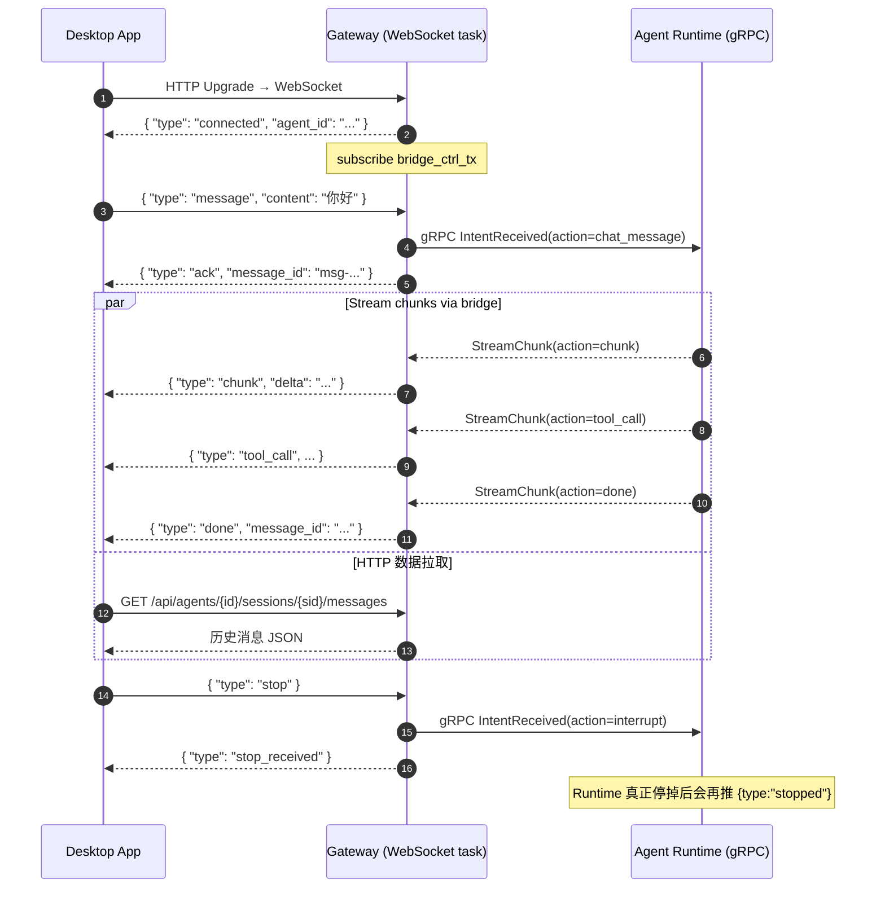

# WebSocket 协议

> 聊天实时事件通道。基于 Axum `WebSocketUpgrade`，与 HTTP 共享端口（默认 `19876`）。
>
> - 端点：`GET /api/agents/{id}/stream`
> - 实现：[`core/acowork-gateway/src/http/chat.rs`](../../../core/acowork-gateway/src/http/chat.rs)（`agent_stream_ws` / `handle_ws` / `handle_ws_text`）
> - 事件类型定义：[`core/acowork-gateway/src/http/routes.rs`](../../../core/acowork-gateway/src/http/routes.rs)（`BridgeEventType`）

---

## 1. 基础约定

- **URL**：`ws://127.0.0.1:19876/api/agents/{agent_id}/stream`
- **帧类型**：仅文本帧（`Message::Text`），UTF-8 JSON
- **协议**：自定义 JSON 命令协议（`type` 字段分派）
- **数据通道（ADR-021 Phase 2）**：所有事件都走**单控制通道**（`bridge_ctrl_tx`）。运行时数据（消息正文、历史）通过 HTTP 轮询，不再经 WebSocket 推送
- **消息大小上限**：单条 content ≤ **32 KB**（与 HTTP `send_message` 一致）
- **认证**：依赖 localhost-only 绑定；如启用 `[http].auth_enabled`，Bearer token 应在 `Upgrade` 头中携带（Axum 默认会带上 `Authorization` 头）

---

## 2. 通信流程



文字概括：

1. HTTP `Upgrade` 即升级为 WebSocket，Gateway 立即推送 `connected` 帧并订阅桥接事件总线。
2. 客户端发起的指令（`message` / `stop` / `model_switch` 等）由 Gateway 转 gRPC `IntentReceived`，并立即回 `ack` / `*_confirmed` / `stop_received`。
3. 业务事件（chunk / tool_call / done …）由 Runtime → gRPC `StreamChunk` → Gateway 桥接总线 → WebSocket 推送。
4. 运行时数据（消息正文、历史）由前端通过 HTTP 拉取，避免 WebSocket 通道被高频 token 流阻塞。

---

## 3. 客户端 → 服务端（请求）

所有客户端命令均为 JSON 对象，公共字段：

```json
{
  "type": "message",
  "message_id": "msg-uuid",        // 可选；不填则 Gateway 生成
  "session_id": "sess-xxx"         // 可选；多会话路由
}
```

| `type` | 必填字段 | 用途 | Gateway 行为 | 服务端回包 |
|--------|----------|------|-------------|------------|
| `message` | `content` 或 `content_parts` | 发送聊天消息 | 转 gRPC `IntentReceived{action=chat_message}` | `ack` |
| `model_switch` | `model`, `provider?` | 切换模型（运行中即时生效） | 转 gRPC `IntentReceived{action=model_switch}` | `ack` + `model_confirmed` |
| `reasoning_effort` | `effort` (`Off/Low/Medium/High/Max`) | 设置推理强度 | 转 gRPC `IntentReceived{action=reasoning_effort}` | `ack` + `reasoning_effort_confirmed` |
| `stop` | — | 中断当前生成 | 转 gRPC `IntentReceived{action=interrupt,reason=user_requested}` | `stop_received`（Runtime 真正停掉后会推 `stopped`） |
| `compact_context` | — | 触发上下文压缩 | 转 gRPC `IntentReceived{action=compact_context}` | `ack` |
| 其它 | — | — | — | `error` |

### 3.1 `message` 完整字段

```json
{
  "type": "message",
  "content": "解释这段代码",
  "message_id": "msg-frontend-001",
  "session_id": "sess-active",
  "command": "/explain",                         // 可选，技能命令
  "document_ids": ["doc-001"],                  // 可选，附加文档
  "content_parts": [                             // 可选，多模态
    { "type": "text", "text": "看这张图" },
    { "type": "image_url", "image_url": { "url": "data:image/png;base64,..." } }
  ],
  "attached_context": [                          // 可选，工作区文件/选区
    { "path": "src/main.rs", "selection": { "start": 10, "end": 20 } }
  ]
}
```

### 3.2 校验

- `content` 与 `content_parts` 至少有一项非空
- `content` 字节数 ≤ 32768
- `session_id` 透传给 Runtime；不校验是否存在（由 Runtime 决定）

---

## 4. 服务端 → 客户端（事件 / 应答）

### 4.1 应答类（短小、对称）

| `type` | 触发时机 | 关键字段 |
|--------|----------|----------|
| `connected` | WebSocket 握手成功 | `agent_id` |
| `ack` | Gateway 成功把指令 push 到 Runtime | `message_id` 或 `agentId` |
| `model_confirmed` | Runtime 确认切换模型 | `model`, `agentId`, `provider?`, `session_id?` |
| `reasoning_effort_confirmed` | Runtime 确认设置推理强度 | `effort`, `agentId`, `session_id?` |
| `stop_received` | Gateway 已把 `stop` push 到 Runtime | `agentId` |
| `error` | 校验失败、Runtime 未连接、`type` 未知 | `message`, `message_id?`, `agentId?` |

### 4.2 业务事件类（来自 Runtime `StreamChunk`）

> 字段由 Gateway 透传 Runtime `params_json`；`chunk` 事件的 `content` 会被改名为 `delta`，其余事件原样转发。

| `type` | 含义 | 关键字段 |
|--------|------|----------|
| `chunk` | LLM 输出片段 | `delta`, `message_id` |
| `tool_call` | LLM 调用工具 | `name`, `params`, `message_id` |
| `tool_result` | 工具返回结果 | `name`, `result`, `message_id` |
| `tool_approval_needed` | 工具调用需用户审批 | `request_id`, `tool`, `params`, `message_id` |
| `done` | LLM 完成本轮 | `message_id`, `usage` |
| `error` | LLM / 工具出错 | `message`, `message_id` |
| `stopped` | Runtime 已停止当前生成 | `message_id`, `agentId` |
| `memory_updated` | Memory 增删/整合 | `change` |
| `skill_executed` | 技能执行完毕 | `skill`, `result` |
| `iteration_limit_paused` | 达到迭代上限，Agent 暂停 | `iteration`, `max_iterations`, `message` |
| `context_usage` | 上下文用量上报 | `usage_percent`, `input_tokens`, `output_tokens`, `context_window`, … |
| `compacting_started` | 上下文压缩开始 | （空 payload 或 label） |
| `compacting_ended` | 上下文压缩结束 | （空 payload 或 label） |
| `reasoning_started` | LLM 推理阶段开始 | （触发前端 pulse 动效） |
| `session_state_changed` | 会话生命周期变化（ADR-014） | `state`, `session_id` |
| `ask_question` | LLM 询问用户选项 | `question_id`, `question`, `options[]`, `header`, `multi_select` |
| `todo_list_updated` | todo 列表更新 | `todos[]` |
| `embedding_migration_progress` | 嵌入模型迁移进度 | `processed`, `total`, `errors`, `phase`, `label` |
| `new_data_available` | 通知前端 HTTP 拉取增量（ADR-021） | `session_id`, `reason` |
| `unknown` | 未识别 action（fallback，避免把流误判为 done） | 原 payload |

### 4.3 消息示例

```json
// 握手
{ "type": "connected", "agent_id": "com.acowork.weather" }

// 流式片段
{ "type": "chunk", "message_id": "msg-001", "delta": "今天上海" }

// 工具调用
{ "type": "tool_call", "message_id": "msg-001",
  "name": "get_weather", "params": { "city": "上海" } }

// 完成
{ "type": "done", "message_id": "msg-001",
  "usage": { "input_tokens": 120, "output_tokens": 86 } }

// 询问用户（带选项）
{ "type": "ask_question", "message_id": "msg-002",
  "question_id": "q-001",
  "question": "需要我创建 PR 还是直接 commit？",
  "header": "Git 操作",
  "options": [
    { "label": "创建 PR", "description": "推到远端并打开 PR" },
    { "label": "本地 commit", "description": "只生成本地提交" }
  ],
  "multi_select": false }

// 上下文用量
{ "type": "context_usage", "message_id": "msg-001",
  "usage_percent": 64, "context_window": 200000,
  "input_tokens": 98000, "output_tokens": 30100,
  "total_tokens": 128100, "usable_context": 196000 }
```

---

## 5. 配套 HTTP 端点（流式上下文使用）

WebSocket 只推事件，运行时数据通过以下 HTTP 拉取（与 ADR-021 一致）：

| 用途 | 端点 |
|------|------|
| 拉取会话消息历史 | `GET /api/agents/{id}/sessions/{session_id}/messages` |
| 会话状态快照 | `GET /api/agents/{id}/sessions/{session_id}/state` |
| 最新会话 | `GET /api/agents/{id}/latest-session` |
| 工具审批（与 `tool_approval_needed` 配对） | `POST /api/agents/{id}/approval` |
| 问答回答（与 `ask_question` 配对） | `POST /api/agents/{id}/question` |
| 文档附件上传（与 `document_ids` 配对） | `POST /api/sessions/{session_id}/documents` |

---

## 6. 重连与生命周期

- **单连接单 agent**：`/api/agents/{id}/stream` 严格按 agent 维度隔离；
  若需同时观察多个 agent，开多个连接
- **断线检测**：客户端未收到 Ping/Pong（默认 60 s）即视为断开
- **重连策略**：建议客户端在收到 `stopped` 或 `error` 后短暂 backoff 重连；
  Runtime 侧的状态由 HTTP `/api/agents/{id}/sessions/{sid}/state` 拉取快照恢复
- **bridge 通道滞后**：Gateway 使用 `tokio::sync::broadcast`，缓冲滞后时会收到 `Lagged(n)`；
  前端应通过 HTTP 拉取补齐，而不是依赖漏掉的事件

---

## 7. 错误与异常处理

| 场景 | 服务端帧 |
|------|----------|
| 客户端发未知 `type` | `{ "type": "error", "message": "Unknown message type: ..." }` |
| 客户端 `content` 缺失 | `{ "type": "error", "message": "content must not be empty" }` |
| `content > 32 KB` | `{ "type": "error", "message": "content too long (max 32768 bytes)" }` |
| Agent 未运行 | `{ "type": "error", "message": "Agent ... is not running, ..." }` |
| Runtime 未连接 gRPC | `{ "type": "error", "message": "Agent ... is not connected via gRPC" }` |
| `bridge_ctrl_tx` 已关闭 | 连接主动 break，前端关闭 socket 重连 |

> 错误帧不会主动断开 WebSocket；客户端可继续发送下一条指令。

---

## 8. 与 gRPC `StreamChunk` 的字段映射

WebSocket 事件本质上是 gRPC `StreamChunk { target, action, params_json }` 的投影：

```text
gRPC target="http-ws" | "http-api"
  ↓
BridgeEventType::from_action(action) → BridgeEventType
  ↓
事件 payload = params_json 原样合并
  ↓
forward_bridge_event() → WebSocket Text 帧
```

例外：`chunk` 事件把 `content` 重命名为 `delta`（与历史前端协议保持一致）。